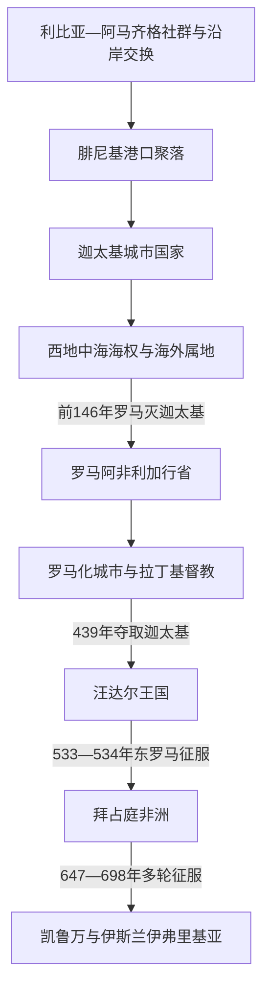

# 突尼斯的迦太基、罗马与拜占庭非洲

## 时间

约前1千纪初—8世纪初

## 概括

今突尼斯处在马格里布东缘、西西里海峡和北非内陆交通的交点。腓尼基移民并非进入无人之地，而是在利比亚—阿马齐格社群、旧石器时代以来的地方人口和既有沿岸交换网络之间建立乌提卡、迦太基等港口。迦太基后来把舰队、贸易据点、盟邦、属民和海外殖民地连成西地中海强权，但其国家并不是一条连续的“国王世系”，成熟期核心是寡头共和国。

前146年罗马摧毁迦太基国家，随后又在原址附近重建城市。以今突尼斯北部和中部为核心的罗马阿非利加成为粮食、橄榄油、城市文化和拉丁基督教的重要区域。5世纪汪达尔人夺取迦太基，6世纪东罗马恢复帝国统治；7—8世纪的阿拉伯征服则经过多轮远征、撤退、建城和地方结盟，才使政治中心逐渐由迦太基转向凯鲁万。

迦太基的完整跨区域主线见[迦太基通史](/%E4%BA%BA%E6%96%87%E7%A7%91%E5%AD%A6/%E5%8E%86%E5%8F%B2/%E5%8C%97%E9%9D%9E/_%E9%80%9A%E5%8F%B2/%E8%BF%A6%E5%A4%AA%E5%9F%BA/README.md)；可辨认的政治领袖和汪达尔国王见[突尼斯君主与主要统治者世系表](/%E4%BA%BA%E6%96%87%E7%A7%91%E5%AD%A6/%E5%8E%86%E5%8F%B2/%E5%8C%97%E9%9D%9E/%E7%AA%81%E5%B0%BC%E6%96%AF/%E7%AA%81%E5%B0%BC%E6%96%AF%E5%90%9B%E4%B8%BB%E4%B8%8E%E4%B8%BB%E8%A6%81%E7%BB%9F%E6%B2%BB%E8%80%85%E4%B8%96%E7%B3%BB%E8%A1%A8.md)。

## 演进图

## 建立背景与迦太基崛起

### 地方社会与腓尼基据点

- 今突尼斯北部适合谷物、葡萄和橄榄种植，西西里海峡又把北非与意大利、撒丁岛、西西里连接起来。沿海港湾和内陆平原共同支撑人口、税粮与海贸。
- 腓尼基商人从黎凡特沿海向西建立港口，乌提卡传统上早于迦太基。传统建城纪年把迦太基定在前814年，但考古层位、文学传说与后世纪年并不完全一致，宜写作“约前9—前8世纪形成”。
- 新来者与地方利比亚—阿马齐格社群既贸易、通婚和结盟，也征收贡赋、争夺土地。迦太基文化因而兼具腓尼基语言宗教传统和北非地方因素。

### 从城邦到海上强权

迦太基崛起不是单靠海军。首先，黎凡特腓尼基母城先后受亚述、巴比伦和波斯控制，西部据点需要更强的本地协调中心；其次，迦太基拥有优良港口和富饶腹地，可用农业剩余支持舰队和城市人口；再次，它以条约、盟邦、属地、贡赋、移民城市和驻军构成层次不同的网络，而非把整个西地中海变成均质领土国家。

前6—前3世纪，迦太基先后介入撒丁、科西嘉、西西里、伊比利亚和北非腹地。舰队保护海路，陆军则混合本城公民、利比亚步兵、努米底亚骑兵、伊比利亚和高卢部队等。多元军队提高远征能力，却也使按时支付军饷、维系属地忠诚和协调将领成为制度弱点。

## 分阶段发展

### 迦太基共和国及布匿战争

成熟的迦太基由每年选出的两名苏费特主持政务，元老院、精英委员会和公民大会共同参与决策，将军可长期连任但并非国王。马戈家族和巴卡家族曾凭军事声望取得巨大影响，却始终面对其他寡头家族和监督机构。现存文献不足以恢复逐年苏费特名单，也不应把所有著名将领排成王朝。

- 前480年希墨拉战败限制了迦太基在西西里的扩张，但国家依靠北非腹地、海贸和后续战争恢复。
- 前264—前241年第一次布匿战争以西西里争端开始。罗马建立海军后夺得西西里，迦太基又因欠饷陷入“佣兵战争”；利比亚属民的税负和不满使危机扩大。
- 巴卡家族在伊比利亚建立新的矿产、兵源和税收基地。前218年汉尼拔进攻罗马盟友萨贡托后越过阿尔卑斯，第二次布匿战争全面爆发。
- 汉尼拔在意大利多次获胜，却未能瓦解罗马联盟体系；罗马把战场转至伊比利亚和北非，并与努米底亚的马西尼萨合作。前202年扎马会战后，迦太基失去海外军事自主。
- 战后迦太基经济一度恢复，但罗马与马西尼萨持续挤压其行动空间。前149—前146年第三次布匿战争中，罗马围城并摧毁迦太基，居民被杀、俘或驱散，城邦国家直接灭亡。

### 罗马行省与城市农业体系

罗马先建立“旧阿非利加”行省，凯撒和奥古斯都时期又在旧城附近创建殖民城市，使迦太基重新成为行省首府。罗马统治逐渐把原迦太基腹地、努米底亚边缘和更南部地区分入不同省区，现代突尼斯并不等同于任何单一罗马行省。

道路、港口、城市议会、罗马法身份和税制把内陆庄园与地中海市场连在一起。大型庄园、皇帝土地、城镇中小业主和佃农同时存在；北非向帝国输出谷物、橄榄油、陶器及其他产品。2—3世纪许多城市拥有浴场、剧场、神庙和公共建筑，但繁荣依赖土地、劳役、税收和不平等的乡村关系，不能只理解为“罗马化”的单向文化替代。

### 基督教传播与晚期罗马危机

迦太基是拉丁基督教思想中心之一，德尔图良和居普良在此活动。3世纪迫害、殉道和教会组织扩展并存。4世纪以后，多纳徒派争论把宗教纯洁观、主教合法性、地方社会冲突和帝国强制联系起来；希波的奥古斯丁虽主要活动于今阿尔及利亚境内，其思想和教会行动属于整个罗马北非网络。

晚期帝国并非突然全面崩溃。城市、主教区和农业生产在许多地方延续，但帝国内战、税负、地方武装、边疆阿马齐格集团与西罗马财政军事衰退削弱了沿海政府。429年汪达尔和阿兰集团在盖萨里克领导下从伊比利亚渡海，利用帝国派系冲突进入北非；439年趁和约间隙夺取迦太基。

### 汪达尔海上王国

盖萨里克掌握迦太基舰队、税粮区和地中海岛屿，455年远征罗马。汪达尔王国的统治核心是王族及军事追随者，但罗马市政、地产、税收和商业并未全部消失。王室奉阿里乌派基督教，多数罗马化臣民和主教则遵奉尼西亚信经；没收教产、放逐主教与后来的缓和政策随君主更替而变化。

王国的衰落来自多重因素：精锐军事集团人数有限，内陆和西部边缘逐渐脱离控制；继承规则和宫廷政变损害稳定；舰队优势下降；希尔德里克亲东罗马并放宽宗教政策，引发盖利默政变。查士丁尼以恢复希尔德里克为名派贝利撒留远征。533年汪达尔在阿德底姆和特里卡马鲁姆战败，534年盖利默投降，王国直接灭亡。

### 拜占庭非洲与阿拉伯征服

东罗马建立阿非利加禁卫大区，由文官总督和最高军事长官分掌行政、税收与军队，并修复堡垒。6世纪末又形成迦太基总督区，使总督兼具更集中的军政权力。帝国恢复了沿海城市和部分内陆交通，却长期面对汪达尔残部、军队哗变、阿马齐格政权、瘟疫、重税和远距离补给。

7世纪东罗马与萨珊长期战争后国力受损，埃及又被阿拉伯军队夺取，迦太基与帝国核心的海陆联系变得脆弱。征服过程至少经历以下阶段：

1. 647年阿拉伯军进攻伊弗里基亚，在苏费图拉附近击败已反叛君士坦丁堡的格列高利；获得贡物后撤退，未立即建立常设统治。
2. 670年乌克白·本·纳菲建立凯鲁万，作为远离拜占庭海军的驻军、行政和传播基地。
3. 阿拉伯军、拜占庭据点和阿马齐格联盟反复争夺。乌克白在683年前后战死，征服一度倒退。
4. 698年哈桑·本·努曼攻陷迦太基，拜占庭海军虽短暂反攻，最终未能恢复城市；旧行省首府的帝国统治终结。
5. 阿马齐格领袖卡希娜继续抵抗，约在7世纪末至8世纪初败亡。其身份、战场和确切年代存在争议；其后阿马齐格群体通过抵抗、结盟、参军和改宗等多种方式进入新秩序，并非一次战役后整体“消失”。

## 统治结构比较

| 阶段 | 名义最高权力 | 地方治理 | 军事与财政基础 | 实际权力边界 |
|---|---|---|---|---|
| 迦太基共和国 | 苏费特、元老院等城邦机构 | 属城、盟邦、贡赋社群与地方精英各有不同地位 | 港税、土地贡赋、矿产、舰队和多族群军队 | 海外网络强，但直接行政密度不均 |
| 罗马阿非利加 | 罗马皇帝与元老院体系 | 行省总督、城市议会、税吏、皇帝及私人庄园 | 税粮、道路、港口、军队与法律身份 | 城市化核心控制强，南部和山地依赖边疆协商 |
| 汪达尔王国 | 汪达尔国王 | 王室官员与延续的罗马地方结构 | 军事地产、税收、舰队和迦太基港口 | 沿海核心强，内陆阿马齐格政权扩张 |
| 拜占庭非洲 | 东罗马皇帝 | 文官总督、军政长官、后期总督区及主教网络 | 帝国税收、驻军、堡垒和海运 | 迦太基及沿海较稳，内陆控制受战争与补给限制 |

## 重要事件

| 时间 | 事件 | 过程与影响 |
|---|---|---|
| 约前9—前8世纪 | 迦太基聚落形成 | 腓尼基移民与北非地方社会互动，传统前814年纪年仅可作建城传统 |
| 前6世纪 | 迦太基成为西部腓尼基网络中心 | 借港口、腹地、舰队和条约体系扩大影响 |
| 前480年 | 希墨拉战役 | 迦太基军败于西西里希腊势力，扩张受挫但国家未崩溃 |
| 前264—前241年 | 第一次布匿战争 | 罗马夺取西西里；战后欠饷引发佣兵战争和属民起义 |
| 前218—前201年 | 第二次布匿战争 | 汉尼拔入侵意大利，最终在扎马战败；迦太基失去海外与军事自主 |
| 前149—前146年 | 第三次布匿战争 | 罗马围城、毁城并建立行省秩序，迦太基国家灭亡 |
| 前1世纪后期 | 罗马重建迦太基 | 新殖民城市成为阿非利加行省政治、经济和文化中心 |
| 2—3世纪 | 罗马阿非利加繁荣 | 城市网络、谷物和橄榄油生产扩大，社会分化亦加深 |
| 3—4世纪 | 基督教扩展与教会争论 | 迦太基教会、多纳徒派和帝国宗教政策塑造区域政治 |
| 429—439年 | 汪达尔进入北非并夺取迦太基 | 借西罗马内战建立以迦太基为都的海上王国 |
| 455年 | 汪达尔军攻入罗马 | 显示北非舰队对西地中海的投射能力 |
| 533—534年 | 东罗马征服汪达尔王国 | 贝利撒留击败盖利默，帝国恢复阿非利加 |
| 647年 | 苏费图拉战役 | 第一轮大规模阿拉伯远征击败格列高利，但军队随后撤退 |
| 670年 | 凯鲁万建立 | 常设军政基地出现，政治重心开始内移 |
| 698年 | 迦太基失守 | 拜占庭在旧阿非利加核心区的统治直接终结 |
| 约7世纪末—8世纪初 | 卡希娜抵抗失败 | 阿马齐格社会在长期冲突、结盟和改宗中进入伊斯兰伊弗里基亚 |

## 兴盛、衰落与直接终结

| 政权 | 兴盛条件 | 结构性衰落 | 外部压力 | 直接触发 |
|---|---|---|---|---|
| 迦太基 | 港口与富饶腹地、舰队、海外网络、多元兵源 | 属地负担、军饷依赖、精英派系及长程战争成本 | 罗马联盟与努米底亚扩张 | 第三次布匿战争中迦太基被围困摧毁 |
| 西罗马阿非利加 | 城市税制、庄园农业、帝国海运与法律框架 | 帝国内战、财政军力下降、地方冲突 | 汪达尔迁徙集团和边疆势力 | 439年盖萨里克突袭并占领迦太基 |
| 汪达尔王国 | 迦太基舰队、税粮区、军事王权 | 宗教裂痕、边疆收缩、继承与政变、军力下降 | 东罗马恢复帝国的战略 | 盖利默废黜希尔德里克后，查士丁尼于533年出兵 |
| 拜占庭非洲 | 帝国海军、堡垒、行政与教会网络 | 重税、瘟疫、军变、内陆控制有限、与核心距离遥远 | 阿拉伯军队持续远征，阿马齐格联盟反复变化 | 698年迦太基被攻陷，帝国未能再恢复行省首府 |

## 演变关系

- 上级：[突尼斯历史](/%E4%BA%BA%E6%96%87%E7%A7%91%E5%AD%A6/%E5%8E%86%E5%8F%B2/%E5%8C%97%E9%9D%9E/%E7%AA%81%E5%B0%BC%E6%96%AF/README.md)
- 统治者专表：[突尼斯君主与主要统治者世系表](/%E4%BA%BA%E6%96%87%E7%A7%91%E5%AD%A6/%E5%8E%86%E5%8F%B2/%E5%8C%97%E9%9D%9E/%E7%AA%81%E5%B0%BC%E6%96%AF/%E7%AA%81%E5%B0%BC%E6%96%AF%E5%90%9B%E4%B8%BB%E4%B8%8E%E4%B8%BB%E8%A6%81%E7%BB%9F%E6%B2%BB%E8%80%85%E4%B8%96%E7%B3%BB%E8%A1%A8.md)
- 完整古代专题：[迦太基通史](/%E4%BA%BA%E6%96%87%E7%A7%91%E5%AD%A6/%E5%8E%86%E5%8F%B2/%E5%8C%97%E9%9D%9E/_%E9%80%9A%E5%8F%B2/%E8%BF%A6%E5%A4%AA%E5%9F%BA/README.md)
- 罗马对照：[古罗马](/%E4%BA%BA%E6%96%87%E7%A7%91%E5%AD%A6/%E5%8E%86%E5%8F%B2/%E6%AC%A7%E6%B4%B2/_%E9%80%9A%E5%8F%B2/%E5%8F%A4%E7%BD%97%E9%A9%AC/README.md)
- 后一阶段：[伊弗里基亚王朝与奥斯曼突尼斯](/%E4%BA%BA%E6%96%87%E7%A7%91%E5%AD%A6/%E5%8E%86%E5%8F%B2/%E5%8C%97%E9%9D%9E/%E7%AA%81%E5%B0%BC%E6%96%AF/%E4%BC%8A%E5%BC%97%E9%87%8C%E5%9F%BA%E4%BA%9A%E7%8E%8B%E6%9C%9D%E4%B8%8E%E5%A5%A5%E6%96%AF%E6%9B%BC%E7%AA%81%E5%B0%BC%E6%96%AF.md)
