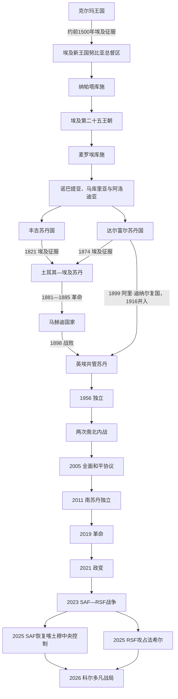

# 苏丹历史

## 概括

苏丹位于尼罗河中游、撒哈拉—萨赫勒、红海与非洲之角的交界。克尔玛和库施说明尼罗河国家传统不只来自埃及；诺巴提亚、马库里亚和阿洛迪亚又把基督教王国延续到中世纪。16世纪以后，丰吉和达尔富尔分别整合尼罗河中部与西部商路。19世纪土耳其—埃及征服、马赫迪革命和英埃共管建立了现代疆域与中央行政，同时加深地区治理差异。

1956年独立国家继承了不均衡的行政、教育和军事体系。两次南北内战在2005年协议后结束主要战事，2011年南苏丹独立；达尔富尔、南科尔多凡和青尼罗河等矛盾却延续。2019年革命开启军民过渡，2021年政变使之中断，2023年苏丹武装部队与快速支援部队开战。到2026年7月14日，SAF已恢复喀土穆中央区控制，RSF控制达尔富尔大部并于2025年10月攻占法希尔，科尔多凡成为主要争夺带；战线仍在变化。

本目录维护今苏丹共和国及2011年分离前共同国家的主线。[南苏丹](/%E4%BA%BA%E6%96%87%E7%A7%91%E5%AD%A6/%E5%8E%86%E5%8F%B2/%E9%9D%9E%E6%B4%B2/%E4%B8%9C%E9%9D%9E/%E5%8D%97%E8%8B%8F%E4%B8%B9/README.md)独立后的国家史放在东非目录，并在分离节点互链。

## 演进图

## 历史主线

1. **尼罗河本地国家传统**：克尔玛从农业、畜牧和长距离贸易中形成王权；埃及征服没有消除本地社会，后来的库施反而一度统治埃及。
2. **中心南移与制度创新**：库施从纳帕塔转向麦罗埃，发展本地文字和女王政治；4世纪解体后出现基督教努比亚诸国。
3. **复合苏丹国**：丰吉依靠森纳尔苏丹、阿卜达拉布和地方首领组成多层政体；达尔富尔凯拉王朝通过商路和土地制度整合西部。
4. **征服、革命与殖民国家**：土埃及行政扩大税收、军队和奴隶—象牙经济，马赫迪革命以反外来统治和宗教动员取代它；英埃共管再以铁路、灌溉、官僚和差异化地方行政重建国家。
5. **独立后的中央—边缘危机**：议会、军政府和威权体制反复更替，南部、达尔富尔、科尔多凡和青尼罗河的自治、土地与安全问题长期军事化。
6. **双重军队导致国家战争**：巴希尔时代把RSF制度化；2019年后SAF、RSF和各和平协议武装没有置于统一文官控制，最终在2023年爆发战争并形成平行权力中心。

## 阶段导航

| 顺序 | 阶段 | 时间 | 入口 | 阅读重点 |
|---:|---|---|---|---|
| 1 | 克尔玛、库施与基督教努比亚 | 约前2500年—16世纪 | [克尔玛、库施与基督教努比亚](/%E4%BA%BA%E6%96%87%E7%A7%91%E5%AD%A6/%E5%8E%86%E5%8F%B2/%E5%8C%97%E9%9D%9E/%E8%8B%8F%E4%B8%B9/%E5%85%8B%E5%B0%94%E7%8E%9B%E3%80%81%E5%BA%93%E6%96%BD%E4%B8%8E%E5%9F%BA%E7%9D%A3%E6%95%99%E5%8A%AA%E6%AF%94%E4%BA%9A.md) | 克尔玛过程、第二十五王朝、麦罗埃兴衰、《巴克特》与中世纪努比亚 |
| 2 | 丰吉、达尔富尔、马赫迪与英埃共管 | 约1504—1956年 | [丰吉、达尔富尔、马赫迪与英埃共管](/%E4%BA%BA%E6%96%87%E7%A7%91%E5%AD%A6/%E5%8E%86%E5%8F%B2/%E5%8C%97%E9%9D%9E/%E8%8B%8F%E4%B8%B9/%E4%B8%B0%E5%90%89%E3%80%81%E8%BE%BE%E5%B0%94%E5%AF%8C%E5%B0%94%E3%80%81%E9%A9%AC%E8%B5%AB%E8%BF%AA%E4%B8%8E%E8%8B%B1%E5%9F%83%E5%85%B1%E7%AE%A1.md) | 两个苏丹国并存、土埃及征服、马赫迪国家与共管权力移交 |
| 3 | 独立、内战、分离与国家危机 | 1956年至今 | [独立、南北内战、分离与国家危机](/%E4%BA%BA%E6%96%87%E7%A7%91%E5%AD%A6/%E5%8E%86%E5%8F%B2/%E5%8C%97%E9%9D%9E/%E8%8B%8F%E4%B8%B9/%E7%8B%AC%E7%AB%8B%E3%80%81%E5%8D%97%E5%8C%97%E5%86%85%E6%88%98%E3%80%81%E5%88%86%E7%A6%BB%E4%B8%8E%E5%9B%BD%E5%AE%B6%E5%8D%B1%E6%9C%BA.md) | 两次内战、达尔富尔、2011分离、革命、政变和2023—2026战争 |

## 统治者与行政专表

| 专表 | 覆盖范围 | 使用说明 |
|---|---|---|
| [努比亚与库施统治者世系表](/%E4%BA%BA%E6%96%87%E7%A7%91%E5%AD%A6/%E5%8E%86%E5%8F%B2/%E5%8C%97%E9%9D%9E/%E8%8B%8F%E4%B8%B9/%E5%8A%AA%E6%AF%94%E4%BA%9A%E4%B8%8E%E5%BA%93%E6%96%BD%E7%BB%9F%E6%B2%BB%E8%80%85%E4%B8%96%E7%B3%BB%E8%A1%A8.md) | 克尔玛证据边界、早期库施、第二十五王朝、纳帕塔、麦罗埃、诺巴提亚、马库里亚／多塔沃、阿洛迪亚 | 保存残名、无名统治者和不确定次序；不把“Nedjeh”误列为克尔玛国王 |
| [丰吉、达尔富尔与马赫迪统治者表](/%E4%BA%BA%E6%96%87%E7%A7%91%E5%AD%A6/%E5%8E%86%E5%8F%B2/%E5%8C%97%E9%9D%9E/%E8%8B%8F%E4%B8%B9/%E4%B8%B0%E5%90%89%E3%80%81%E8%BE%BE%E5%B0%94%E5%AF%8C%E5%B0%94%E4%B8%8E%E9%A9%AC%E8%B5%AB%E8%BF%AA%E7%BB%9F%E6%B2%BB%E8%80%85%E8%A1%A8.md) | 丰吉苏丹、哈马季摄政、凯拉王朝、达尔富尔中断期、马赫迪与哈里发 | 名义君主、摄政和殖民省长分表 |
| [土埃及与英埃苏丹行政首脑表](/%E4%BA%BA%E6%96%87%E7%A7%91%E5%AD%A6/%E5%8E%86%E5%8F%B2/%E5%8C%97%E9%9D%9E/%E8%8B%8F%E4%B8%B9/%E5%9C%9F%E5%9F%83%E5%8F%8A%E4%B8%8E%E8%8B%B1%E5%9F%83%E8%8B%8F%E4%B8%B9%E8%A1%8C%E6%94%BF%E9%A6%96%E8%84%91%E8%A1%A8.md) | 1820—1885年远征军司令／哈基姆达尔，1898—1956年军事总督、总督和代理总督 | 说明“共管”法律形式与英国实际权力 |
| [苏丹独立后国家领导人表](/%E4%BA%BA%E6%96%87%E7%A7%91%E5%AD%A6/%E5%8E%86%E5%8F%B2/%E5%8C%97%E9%9D%9E/%E8%8B%8F%E4%B8%B9/%E8%8B%8F%E4%B8%B9%E7%8B%AC%E7%AB%8B%E5%90%8E%E5%9B%BD%E5%AE%B6%E9%A2%86%E5%AF%BC%E4%BA%BA%E8%A1%A8.md) | 国家元首、三届主权委员会全体成员、总理、实际军政领导、2025平行机构 | 任期核验至2026年7月14日，法定序列与实际武装权力分开 |

## 重要转折与时间节点

| 时间 | 事件 | 意义 |
|---|---|---|
| 约前2450年 | 克尔玛城市与王权形成 | 尼罗河中游出现早期国家中心 |
| 约前1500年 | 埃及新王国征服克尔玛 | 努比亚进入总督、要塞和神庙统治阶段 |
| 前8世纪后期 | 皮耶北征 | 库施建立统治埃及的第二十五王朝 |
| 前591年后 | 王室活动逐步向麦罗埃集中 | 库施政治经济中心南移 |
| 4世纪 | 麦罗埃中央王权消失 | 后麦罗埃与基督教王国时代开始 |
| 651—652年 | 栋戈拉防御战与《巴克特》 | 马库里亚保持独立并制度化对埃及关系 |
| 约1504年 | 丰吉—阿卜达拉布政权形成 | 森纳尔成为中部苏丹中心 |
| 1762年 | 哈马季政变 | 丰吉苏丹转为名义君主，摄政掌实权 |
| 1821年 | 森纳尔向埃及军投降 | 土耳其—埃及统治展开 |
| 1885年 | 马赫迪军攻占喀土穆 | 土埃及中央统治终结 |
| 1898—1899年 | 恩图曼战役与共管协定 | 马赫迪国家战败，英国实际主导殖民国家 |
| 1916年 | 阿里·迪纳尔战死 | 达尔富尔正式并入共管苏丹 |
| 1956年1月1日 | 苏丹独立 | 共管制度终结 |
| 1972年 | 《亚的斯亚贝巴协议》 | 第一次南北内战结束 |
| 1983年 | 南部自治拆分、九月法令与博尔兵变 | 第二次南北内战开始 |
| 2003年 | 达尔富尔战争升级 | 国家—民兵暴力和大规模流离失所国际化 |
| 2005年 | 《全面和平协议》 | 第二次南北内战结束并安排南部公投 |
| 2011年7月9日 | 南苏丹独立 | 原共同国家分为两个主权国家 |
| 2019年 | 群众革命推翻巴希尔 | 军民过渡开始 |
| 2021年10月25日 | 军事政变 | 文官过渡中断 |
| 2023年4月15日 | SAF与RSF全面开战 | 双重军队冲突演变为全国战争 |
| 2025年3月 | SAF恢复喀土穆中央区控制 | 首都战局逆转，但全国战争未结束 |
| 2025年10月 | RSF攻占法希尔 | 达尔富尔力量格局改变并发生大规模暴行 |
| 2026年6—7月 | 欧拜伊德及科尔多凡战线升级 | 主要战场东移，城市和援助走廊受威胁 |

## 关键辨析

- “努比亚”是跨今埃及南部和苏丹北部的历史地区，不等同现代苏丹国界。
- “丰吉灭阿洛迪亚”是后世传统的简化；索巴和阿洛迪亚在1504年前已长期衰退。
- “英埃共管”不表示英埃平等执政；总督和高级行政长期由英国掌控。
- 第一次南北内战始于1955年，早于独立。
- 2025年SAF恢复喀土穆中央控制与RSF攻占法希尔都只是战局节点，不能据此宣布任何一方统一全国。
- 截至2026年7月，RSF主导平行机构不获联合国安理会和非盟承认。

## 相关笔记

- 上级：[北非历史](/%E4%BA%BA%E6%96%87%E7%A7%91%E5%AD%A6/%E5%8E%86%E5%8F%B2/%E5%8C%97%E9%9D%9E/README.md)
- 下游尼罗河：[埃及](/%E4%BA%BA%E6%96%87%E7%A7%91%E5%AD%A6/%E5%8E%86%E5%8F%B2/%E5%8C%97%E9%9D%9E/%E5%9F%83%E5%8F%8A/README.md)
- 分离后的国家：[南苏丹](/%E4%BA%BA%E6%96%87%E7%A7%91%E5%AD%A6/%E5%8E%86%E5%8F%B2/%E9%9D%9E%E6%B4%B2/%E4%B8%9C%E9%9D%9E/%E5%8D%97%E8%8B%8F%E4%B8%B9/README.md)
- 区域网络：[撒哈拉商路、游牧网络与萨赫勒联系](/%E4%BA%BA%E6%96%87%E7%A7%91%E5%AD%A6/%E5%8E%86%E5%8F%B2/%E5%8C%97%E9%9D%9E/_%E9%80%9A%E5%8F%B2/%E6%92%92%E5%93%88%E6%8B%89%E5%95%86%E8%B7%AF%E3%80%81%E6%B8%B8%E7%89%A7%E7%BD%91%E7%BB%9C%E4%B8%8E%E8%90%A8%E8%B5%AB%E5%8B%92%E8%81%94%E7%B3%BB.md)
- 历史总览：[历史](/%E4%BA%BA%E6%96%87%E7%A7%91%E5%AD%A6/%E5%8E%86%E5%8F%B2/README.md)
