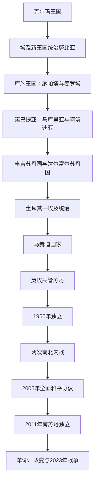

# 苏丹历史

## 概括

苏丹位于尼罗河中游、撒哈拉、萨赫勒、红海与非洲之角交界。克尔玛、库施和基督教努比亚王国显示尼罗河文明不只存在于埃及；丰吉和达尔富尔苏丹国则把伊斯兰化、非洲内陆政治与商路结合起来。19世纪土耳其—埃及征服、马赫迪革命和英埃共管塑造现代疆界与国家机构。

本目录维护今苏丹共和国以及2011年分离前共同苏丹国家的主线。[南苏丹](/%E4%BA%BA%E6%96%87%E7%A7%91%E5%AD%A6/%E5%8E%86%E5%8F%B2/%E9%9D%9E%E6%B4%B2/%E4%B8%9C%E9%9D%9E/%E5%8D%97%E8%8B%8F%E4%B8%B9/README.md)独立后的国家史和当地社会主线继续放在东非目录，并在南北内战与分离节点互相链接。

## 演进图

## 历史主线

尼罗河河谷、红海港口、达尔富尔和南部湿地长期具有不同社会与贸易方向。中央政权对这些区域的控制并不均衡。殖民共管时期的行政差异、资源分配和政治代表问题被独立国家继承，南北战争最终导致2011年分离；与此同时，达尔富尔、科尔多凡、青尼罗河和首都军政集团之间的矛盾继续影响国家。

## 阶段导航

| 顺序 | 阶段 | 时间 | 入口 | 简要概括 |
|---:|---|---|---|---|
| 1 | 克尔玛、库施与基督教努比亚 | 约前2500年—16世纪 | [克尔玛、库施与基督教努比亚](/%E4%BA%BA%E6%96%87%E7%A7%91%E5%AD%A6/%E5%8E%86%E5%8F%B2/%E5%8C%97%E9%9D%9E/%E8%8B%8F%E4%B8%B9/%E5%85%8B%E5%B0%94%E7%8E%9B%E3%80%81%E5%BA%93%E6%96%BD%E4%B8%8E%E5%9F%BA%E7%9D%A3%E6%95%99%E5%8A%AA%E6%AF%94%E4%BA%9A.md) | 尼罗河古代王国、第二十五王朝、麦罗埃和基督教国家 |
| 2 | 丰吉、达尔富尔、马赫迪与英埃共管 | 约1504—1956年 | [丰吉、达尔富尔、马赫迪与英埃共管](/%E4%BA%BA%E6%96%87%E7%A7%91%E5%AD%A6/%E5%8E%86%E5%8F%B2/%E5%8C%97%E9%9D%9E/%E8%8B%8F%E4%B8%B9/%E4%B8%B0%E5%90%89%E3%80%81%E8%BE%BE%E5%B0%94%E5%AF%8C%E5%B0%94%E3%80%81%E9%A9%AC%E8%B5%AB%E8%BF%AA%E4%B8%8E%E8%8B%B1%E5%9F%83%E5%85%B1%E7%AE%A1.md) | 伊斯兰苏丹国、埃及征服、马赫迪革命与殖民共管 |
| 3 | 独立、南北内战、分离与国家危机 | 1956年至今 | [独立、南北内战、分离与国家危机](/%E4%BA%BA%E6%96%87%E7%A7%91%E5%AD%A6/%E5%8E%86%E5%8F%B2/%E5%8C%97%E9%9D%9E/%E8%8B%8F%E4%B8%B9/%E7%8B%AC%E7%AB%8B%E3%80%81%E5%8D%97%E5%8C%97%E5%86%85%E6%88%98%E3%80%81%E5%88%86%E7%A6%BB%E4%B8%8E%E5%9B%BD%E5%AE%B6%E5%8D%B1%E6%9C%BA.md) | 军事政变、地区战争、南苏丹独立和国家权力冲突 |

## 重要转折与时间节点

| 时间 | 事件 | 意义 |
|---|---|---|
| 约前2500年 | 克尔玛国家形成 | 尼罗河中游早期复杂国家兴起 |
| 前8世纪 | 库施王权在纳帕塔扩张 | 后建立统治埃及的第二十五王朝 |
| 约4世纪 | 麦罗埃王国衰亡 | 努比亚政治重组，为基督教王国形成创造条件 |
| 652年 | 马库里亚与阿拉伯埃及达成《巴克特》安排 | 长期边境和平、贸易和贡赋关系形成 |
| 1504年前后 | 丰吉苏丹国建立 | 青尼罗河—尼罗河交汇区进入新政治阶段 |
| 1821年 | 穆罕默德·阿里军队征服森纳尔 | 土耳其—埃及统治和现代行政扩张开始 |
| 1885年 | 马赫迪军占领喀土穆 | 马赫迪国家取代埃及统治 |
| 1898—1899年 | 马赫迪国家战败，英埃共管建立 | 殖民国家框架形成 |
| 1956年 | 苏丹独立 | 英埃共管结束 |
| 1972年 | 《亚的斯亚贝巴协议》 | 第一次南北内战结束，南部取得自治 |
| 2005年 | 《全面和平协议》 | 第二次内战结束并安排南部自决 |
| 2011年 | 南苏丹独立 | 原苏丹国家分为两个主权国家 |
| 2019年 | 巴希尔政权被推翻 | 大众革命开启军民过渡 |
| 2021—2023年 | 军事政变后爆发武装战争 | 过渡中断，国家机构与社会遭受严重破坏 |

## 相关笔记

- 上级：[北非历史](/%E4%BA%BA%E6%96%87%E7%A7%91%E5%AD%A6/%E5%8E%86%E5%8F%B2/%E5%8C%97%E9%9D%9E/README.md)
- 下游尼罗河：[埃及](/%E4%BA%BA%E6%96%87%E7%A7%91%E5%AD%A6/%E5%8E%86%E5%8F%B2/%E5%8C%97%E9%9D%9E/%E5%9F%83%E5%8F%8A/README.md)
- 分离后的国家：[南苏丹](/%E4%BA%BA%E6%96%87%E7%A7%91%E5%AD%A6/%E5%8E%86%E5%8F%B2/%E9%9D%9E%E6%B4%B2/%E4%B8%9C%E9%9D%9E/%E5%8D%97%E8%8B%8F%E4%B8%B9/README.md)
- 区域网络：[撒哈拉商路、游牧网络与萨赫勒联系](/%E4%BA%BA%E6%96%87%E7%A7%91%E5%AD%A6/%E5%8E%86%E5%8F%B2/%E5%8C%97%E9%9D%9E/_%E9%80%9A%E5%8F%B2/%E6%92%92%E5%93%88%E6%8B%89%E5%95%86%E8%B7%AF%E3%80%81%E6%B8%B8%E7%89%A7%E7%BD%91%E7%BB%9C%E4%B8%8E%E8%90%A8%E8%B5%AB%E5%8B%92%E8%81%94%E7%B3%BB.md)

## 目录层级

- 直接上级：[北非](/%E4%BA%BA%E6%96%87%E7%A7%91%E5%AD%A6/%E5%8E%86%E5%8F%B2/%E5%8C%97%E9%9D%9E/README.md)
- 历史总览：[历史](/%E4%BA%BA%E6%96%87%E7%A7%91%E5%AD%A6/%E5%8E%86%E5%8F%B2/README.md)
