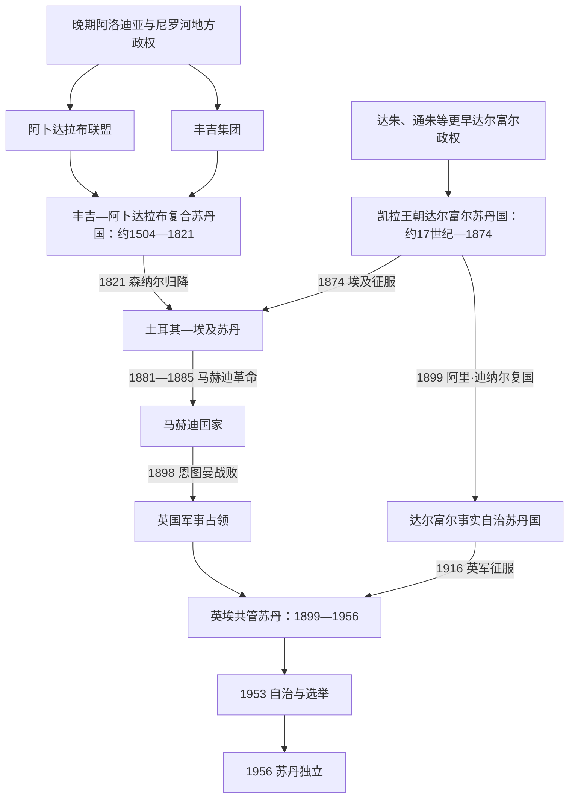

# 苏丹的丰吉、达尔富尔、马赫迪与英埃共管

## 时间

约1504—1956年

## 概括

16世纪至20世纪中叶的苏丹并不是一个政权平稳接替另一个政权的单线国家。以森纳尔为中心的丰吉苏丹国控制青尼罗河、杰济拉和部分尼罗河走廊；西部达尔富尔凯拉王朝则经营连接埃及、乍得湖、瓦达伊和西非的商路。二者长期并存，并通过科尔多凡竞争。阿拉伯语、伊斯兰法学和苏菲网络继续扩散，却没有消除努比亚语、贝扎语、富尔语和众多南部语言，也没有让地方首领失去自治。

1820—1824年穆罕默德·阿里治下的埃及军队征服森纳尔、科尔多凡和尼罗河上游，建立“土耳其—埃及苏丹”。沉重税收、强制征兵、象牙与奴隶贸易和地方官腐败积累反抗。穆罕默德·艾哈迈德1881年宣布为马赫迪，以宗教改革和反外来统治动员，1885年攻占喀土穆；继任哈里发阿卜杜拉把起义联盟改造成中央国家。1898—1899年英埃军队击败马赫迪国家，建立名义由英国与埃及共同统治、实际由英国总督主导的共管体制。铁路、灌溉和官僚国家扩张与区域隔离政策同时塑造了1956年独立时的制度和矛盾。

完整统治者见[丰吉、达尔富尔与马赫迪统治者表](/%E4%BA%BA%E6%96%87%E7%A7%91%E5%AD%A6/%E5%8E%86%E5%8F%B2/%E5%8C%97%E9%9D%9E/%E8%8B%8F%E4%B8%B9/%E4%B8%B0%E5%90%89%E3%80%81%E8%BE%BE%E5%B0%94%E5%AF%8C%E5%B0%94%E4%B8%8E%E9%A9%AC%E8%B5%AB%E8%BF%AA%E7%BB%9F%E6%B2%BB%E8%80%85%E8%A1%A8.md)；土埃及和共管行政首脑见[土埃及与英埃苏丹行政首脑表](/%E4%BA%BA%E6%96%87%E7%A7%91%E5%AD%A6/%E5%8E%86%E5%8F%B2/%E5%8C%97%E9%9D%9E/%E8%8B%8F%E4%B8%B9/%E5%9C%9F%E5%9F%83%E5%8F%8A%E4%B8%8E%E8%8B%B1%E5%9F%83%E8%8B%8F%E4%B8%B9%E8%A1%8C%E6%94%BF%E9%A6%96%E8%84%91%E8%A1%A8.md)。

## 演进图

## 丰吉苏丹国

### 建立背景与联盟结构

传统叙事称阿卜达拉·贾马率阿拉伯部落联盟摧毁索巴，随后阿马拉·敦卡斯率丰吉在1504年前后与之结盟、建立森纳尔。考古和文本显示，索巴此前已衰退，阿洛迪亚解体是长期过程；丰吉族源也没有定论，可能是多种人口与军政集团重组形成，不能把后世王朝传说当作精确事件记录。

丰吉苏丹（常称“麦克”）在森纳尔居最高地位，大议事会从王族中确认继承人；阿卜达拉布首领以卡里为中心，控制白、青尼罗河汇流点以北，名义臣属于森纳尔。各地的“麦克”或“曼吉尔”以贡赋、军役和婚姻连接中央，边缘控制时强时弱。

### 扩张与鼎盛

- 1585年，丰吉在哈尼克击败沿尼罗河南下的奥斯曼军，第三瀑布附近成为北界。
- 1603—1612年阿卜达拉布首领阿吉布坐大并干预王位；阿德兰一世杀死阿吉布后，巴迪一世与其后人妥协，复合国家结构定型。
- 拉巴特一世、巴迪二世和温萨二世时期，森纳尔成为固定都城和商贸中心。巴迪二世控制法祖格利金区，迫使塔卡利臣服，并扩张至白尼罗河和科尔多凡方向。
- 王室控制土地、贡赋、商队和黄金，苏菲圣裔、法学家与商人建立城镇网络。阿拉伯语逐渐成为行政和贸易通语，但本地语言长期并存。
- 巴迪四世1744年击退埃塞俄比亚伊亚苏二世的大军，成为王权声望高点。

### 衰落与灭亡

王室依赖奴隶军、宫廷客户和贸易垄断，损害旧贵族利益；货币和商人市场扩大又削弱苏丹对流通的控制。1762年哈马季将领穆罕默德·阿布·利凯利克废黜巴迪四世，之后苏丹多为名义君主，摄政家族掌实权。达尔富尔夺取科尔多凡、沙伊基亚等地方势力独立、阿卜达拉布衰落以及连年内战使中央到1800年前后只稳控杰济拉。1821年6月14日，末代苏丹巴迪七世向伊斯马仪·卡米勒帕夏投降；内部碎片化是结构原因，穆罕默德·阿里军队的火器、组织和多路推进是直接灭亡力量。

## 达尔富尔苏丹国

### 凯拉王朝的形成

达尔富尔在凯拉王朝前已有达朱、通朱等政权，早期序列主要来自口述传统。苏莱曼·索隆常被列为第一位历史较可证的凯拉苏丹，但“1603年建国”仍是近似年代。苏丹通过王室土地、贡赋、军事家臣和地方首领统合富尔核心区及多族群边缘，以库贝、后来的法希尔为中心。

### 扩张、商路与国家结构

艾哈迈德·巴克尔时期制度化伊斯兰王权并扩大对商队的控制；穆罕默德·泰拉布向东夺取科尔多凡，阿卜杜勒·拉赫曼·拉希德把法希尔建设为首都。达尔富尔连接“达尔卜四十”通往埃及的商路，输出牲畜、羽毛、象牙、树胶与被奴役人口，输入布匹、金属和宗教书籍。中央通过省长、王族与承认地方土地权的首领间接治理，边界随季节、贡赋和军事能力变化。

### 两次覆亡

- **1874年**：商人兼军阀祖拜尔·拉赫马的势力与埃及军队进攻，苏丹易卜拉欣战死，凯拉王朝被废。埃及的财政与帝国扩张需求是外部压力，王位和边缘控制问题削弱抵抗。
- **1899—1916年复国**：马赫迪国家崩溃后，阿里·迪纳尔在法希尔恢复苏丹国，向共管政府纳贡但保持事实自治。第一次世界大战中他与奥斯曼帝国往来并停止服从；英国以此为由于1916年出兵，阿里·迪纳尔战死，达尔富尔被正式并入共管苏丹。战争联盟是直接触发因素，共管政权把西部纳入统一殖民疆域的目标是深层原因。

## 土耳其—埃及统治

### 征服与扩张

穆罕默德·阿里需要黄金、士兵、税源和上尼罗河控制。1820年伊斯马仪·卡米勒沿尼罗河南下，穆罕默德·贝伊·德夫特达尔向科尔多凡推进；沙伊基亚抵抗被击败，森纳尔于1821年归降。1824年前后喀土穆被建为行政与军队集结点。19世纪中后期，政府名义上把赤道省、加扎勒河流域、红海港口和达尔富尔纳入体系，但实际控制常依赖军事承包人、商人和地方盟友。

### 统治机制

哈基姆达尔／总督由开罗任命，下设省长、军官、税吏和不规则部队。国家以货币或实物征税，强制征集苏丹士兵，垄断或承包象牙、树胶和奴隶贸易。行政扩大了喀土穆、道路、轮船和电报，也造成村庄逃亡、地方起义和暴力人口掠夺。“土耳其统治”是苏丹人的历史称呼，官僚实际来自奥斯曼帝国、埃及、切尔克斯、阿尔巴尼亚、欧洲及本地多种背景。

### 改革困境与危机

赫迪夫伊斯马仪时期任用欧洲官员打击奴隶贸易并扩张行政，戈登任总督时试图限制贸易网络；但财政破产、官员更替、军饷拖欠和对地方经济的强制汲取使改革自相矛盾。1879年伊斯马仪被废、1882年英国占领埃及后，喀土穆政府失去稳定财政和军援，为马赫迪革命提供机会。

## 马赫迪革命与国家

### 起义过程

- 1881年6月29日，苏菲宗教人士穆罕默德·艾哈迈德宣布自己为“马赫迪”，谴责外来官员、苛税和宗教腐化。
- 阿巴岛冲突后，他转入科尔多凡；早期胜利吸引巴加拉骑兵、宗教追随者、受压农民和不满地方首领。参加者动机并不完全相同。
- 1883年，马赫迪军在谢坎歼灭希克斯帕夏远征军，夺取大量枪炮；东部奥斯曼·迪格纳部也切断红海方向。
- 1884—1885年围攻喀土穆，1885年1月26日破城，戈登身亡。马赫迪于同年6月去世，没能长期亲自统治新国家。

### 哈里发国家

阿卜杜拉·伊本·穆罕默德击败王室亲属和其他哈里发竞争者，以恩图曼为首都，建立税收、司法、总督和常备军。他用本族塔阿伊沙核心军控制国家，引发尼罗河旧精英和部分部族反抗。1888年击败埃塞俄比亚军，1889年又在托什基入侵埃及失败。战争、旱灾、饥荒、人口迁移、严厉征收和政治清洗削弱生产与联盟。

英国为保护埃及和尼罗河、回应欧洲在非洲的殖民竞争，于1896年支持基奇纳沿铁路与尼罗河南进。1898年9月2日恩图曼战役中，机枪、炮兵与补给优势摧毁马赫迪主力；阿卜杜拉逃亡，1899年11月24日在乌姆·迪韦卡拉特战死。军事技术和后勤差距是直接原因，长期战争与国家财政人口危机则是结构性弱点。

## 英埃共管苏丹

### 名义共管与实际权力

1899年协定宣布苏丹由英国、埃及共同统治；总督由埃及名义任命、须经英国同意，历任常任总督直至1955年均为英国人。总督兼任早期埃及军队总司令，英国文官任民政秘书和省长，埃及与苏丹官员居次级职位。这个安排不是平等双主权：英国控制军事、外交和高级行政，埃及的法律地位与民族主义诉求持续造成冲突。

### 建设与不均衡治理

铁路、电报、港口、学校和公共卫生扩展，1925年杰济拉灌溉计划把棉花出口与国家财政连接起来。北部逐步以“本土行政”依靠部落首领和宗教家族；南部“封闭区”和南方政策限制北方商人、阿拉伯语及伊斯兰机构进入，更多使用英语和传教学校。两套政策都服务低成本治理，却加深地区行政、教育和政治经验差异。

### 民族主义与权力移交

- 1924年白旗联盟和苏丹军人起义把反殖民、尼罗河谷统一和苏丹身份问题公开化。埃及民族主义者刺杀总督李·斯塔克后，英国驱逐埃及军队并加强单独控制。
- 1936年英埃条约允许埃及军队有限回归；1938年毕业生大会成为受教育精英组织。民族联合党倾向与埃及联合，乌玛党和安萨尔运动主张苏丹独立。
- 二战后，1948年立法议会、1951年埃及单方面废除共管条约、1952年埃及革命，使旧制度失去基础。1953年英埃自决协定规定过渡、选举和“苏丹化”官职。
- 1954年伊斯梅尔·阿扎哈里组阁，最初主张尼罗河谷统一，后在国内政治压力下接受完全独立。议会于1955年12月19日一致宣布独立；英国和埃及在1956年1月1日承认。

## 统治结构对照

| 阶段 | 名义最高权力 | 实际权力链 | 地方治理 |
|---|---|---|---|
| 丰吉 | 森纳尔苏丹 | 苏丹—大议事会—宫廷／军队；1762年后多由哈马季摄政掌权 | 阿卜达拉布、地方麦克和曼吉尔纳贡服役 |
| 达尔富尔 | 凯拉王朝苏丹 | 王室、军事家臣、宫廷官员 | 省长与承认土地、族群权利的地方首领 |
| 土埃及苏丹 | 埃及帕夏／赫迪夫 | 开罗—哈基姆达尔—省长、军队和税吏 | 军事行政、承包商、商人和地方盟友 |
| 马赫迪国家 | 马赫迪；后为哈里发 | 宗教效忠—中央国库、军队、法官与总督 | 安萨尔军政首领、部族与地方征收网络 |
| 英埃共管 | 英国与埃及的共管协定 | 英国政府／驻埃高级专员—总督—民政秘书和省长 | 北部本土行政；南部差异化行政 |
| 1953—1956自治 | 总督与苏丹化委员会 | 民选内阁逐步接管；议会决定国家地位 | 殖民省制延续并移交苏丹官员 |

## 重要事件

| 时间 | 事件 | 影响 |
|---|---|---|
| 约1504年 | 丰吉—阿卜达拉布复合政权形成 | 森纳尔成为中部苏丹新中心 |
| 1585年 | 哈尼克战役 | 丰吉阻止奥斯曼沿尼罗河南扩 |
| 1611／1612年 | 阿吉布被击败及随后妥协 | 阿卜达拉布以藩属身份统治北部 |
| 1665年 | 丰吉取得法祖格利 | 控制重要金区并达扩张高峰 |
| 1744年 | 巴迪四世击退埃塞俄比亚军 | 王权声望达到高点 |
| 1762年 | 哈马季政变 | 苏丹成为名义君主，摄政掌实权 |
| 1821年 | 森纳尔归降埃及军 | 丰吉国家灭亡，土埃及统治展开 |
| 1874年 | 埃及征服达尔富尔 | 凯拉王朝第一次中断 |
| 1881年 | 穆罕默德·艾哈迈德宣布为马赫迪 | 反土埃及革命开始 |
| 1883年 | 谢坎歼灭希克斯军 | 马赫迪军取得武器和全国性声望 |
| 1885年 | 喀土穆陷落 | 土埃及中央统治终结 |
| 1898年 | 恩图曼战役 | 马赫迪国家主力覆灭 |
| 1899年 | 共管协定 | 英国实际主导的殖民国家建立 |
| 1916年 | 英军征服阿里·迪纳尔 | 达尔富尔正式并入共管苏丹 |
| 1924年 | 白旗联盟与军人起义 | 民族主义、苏丹身份和埃及关系成为核心议题 |
| 1925年 | 杰济拉计划运行 | 出口棉花、灌溉国家与区域不均衡相互强化 |
| 1953年 | 自决协定和选举 | 内政权力移交给苏丹内阁 |
| 1955年12月19日 | 议会宣布独立 | 选择完全主权而非与埃及联合 |
| 1956年1月1日 | 独立生效 | 共管制度终结 |

## 兴衰原因归纳

| 政权 | 崛起条件 | 衰落结构因素 | 直接终结 |
|---|---|---|---|
| 丰吉 | 阿洛迪亚解体、尼罗河贸易、丰吉—阿卜达拉布联盟 | 宫廷内争、商人削弱垄断、地方独立、哈马季摄政冲突 | 1821年埃及军迫使巴迪七世投降 |
| 达尔富尔 | 萨赫勒商路、凯拉王室与地方首领整合 | 东向扩张成本、王位与边缘控制、外部商业军阀 | 1874年埃及征服；复国后1916年英军征服 |
| 土埃及 | 火器军队、开罗财政与尼罗河扩张 | 苛税、奴隶贸易、财政破产、军饷与合法性危机 | 1885年马赫迪军攻占喀土穆 |
| 马赫迪国家 | 宗教动员、反税反外来统治、土埃及崩溃 | 饥荒、征敛、内斗、长期战争和人口损失 | 1898年恩图曼战败；1899年哈里发战死 |
| 英埃共管 | 英埃军力、铁路与殖民分割 | 埃及与苏丹民族主义、二战后去殖民化、行政本土化 | 1953年自决协议与1956年独立 |

## 演变关系

- 前一阶段：[克尔玛、库施与基督教努比亚](/%E4%BA%BA%E6%96%87%E7%A7%91%E5%AD%A6/%E5%8E%86%E5%8F%B2/%E5%8C%97%E9%9D%9E/%E8%8B%8F%E4%B8%B9/%E5%85%8B%E5%B0%94%E7%8E%9B%E3%80%81%E5%BA%93%E6%96%BD%E4%B8%8E%E5%9F%BA%E7%9D%A3%E6%95%99%E5%8A%AA%E6%AF%94%E4%BA%9A.md)
- 后一阶段：[独立、南北内战、分离与国家危机](/%E4%BA%BA%E6%96%87%E7%A7%91%E5%AD%A6/%E5%8E%86%E5%8F%B2/%E5%8C%97%E9%9D%9E/%E8%8B%8F%E4%B8%B9/%E7%8B%AC%E7%AB%8B%E3%80%81%E5%8D%97%E5%8C%97%E5%86%85%E6%88%98%E3%80%81%E5%88%86%E7%A6%BB%E4%B8%8E%E5%9B%BD%E5%AE%B6%E5%8D%B1%E6%9C%BA.md)
- 上级：[苏丹历史](/%E4%BA%BA%E6%96%87%E7%A7%91%E5%AD%A6/%E5%8E%86%E5%8F%B2/%E5%8C%97%E9%9D%9E/%E8%8B%8F%E4%B8%B9/README.md)
- 统治者专表：[丰吉、达尔富尔与马赫迪统治者表](/%E4%BA%BA%E6%96%87%E7%A7%91%E5%AD%A6/%E5%8E%86%E5%8F%B2/%E5%8C%97%E9%9D%9E/%E8%8B%8F%E4%B8%B9/%E4%B8%B0%E5%90%89%E3%80%81%E8%BE%BE%E5%B0%94%E5%AF%8C%E5%B0%94%E4%B8%8E%E9%A9%AC%E8%B5%AB%E8%BF%AA%E7%BB%9F%E6%B2%BB%E8%80%85%E8%A1%A8.md)
- 殖民行政专表：[土埃及与英埃苏丹行政首脑表](/%E4%BA%BA%E6%96%87%E7%A7%91%E5%AD%A6/%E5%8E%86%E5%8F%B2/%E5%8C%97%E9%9D%9E/%E8%8B%8F%E4%B8%B9/%E5%9C%9F%E5%9F%83%E5%8F%8A%E4%B8%8E%E8%8B%B1%E5%9F%83%E8%8B%8F%E4%B8%B9%E8%A1%8C%E6%94%BF%E9%A6%96%E8%84%91%E8%A1%A8.md)
- 埃及联系：[穆罕默德·阿里王朝](/%E4%BA%BA%E6%96%87%E7%A7%91%E5%AD%A6/%E5%8E%86%E5%8F%B2/%E5%8C%97%E9%9D%9E/%E5%9F%83%E5%8F%8A/%E7%A9%86%E7%BD%95%E9%BB%98%E5%BE%B7%C2%B7%E9%98%BF%E9%87%8C%E7%8E%8B%E6%9C%9D.md)、[英国占领与埃及王国](/%E4%BA%BA%E6%96%87%E7%A7%91%E5%AD%A6/%E5%8E%86%E5%8F%B2/%E5%8C%97%E9%9D%9E/%E5%9F%83%E5%8F%8A/%E8%8B%B1%E5%9B%BD%E5%8D%A0%E9%A2%86%E4%B8%8E%E5%9F%83%E5%8F%8A%E7%8E%8B%E5%9B%BD.md)
