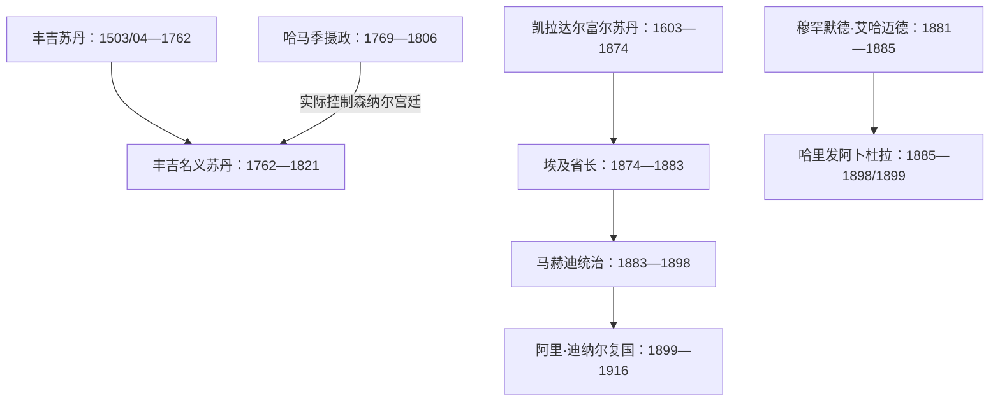

# 丰吉、达尔富尔与马赫迪统治者表

## 范围

本表把三个不同的权力序列分开：森纳尔丰吉苏丹及1762年后掌实权的哈马季摄政；达尔富尔凯拉苏丹及两次中断；马赫迪和继任哈里发。斜线年代代表史料换算差异，重叠任期通常反映并立、废立或名义君主与实际摄政，不强行抹平。

历史过程见[丰吉、达尔富尔、马赫迪与英埃共管](/%E4%BA%BA%E6%96%87%E7%A7%91%E5%AD%A6/%E5%8E%86%E5%8F%B2/%E5%8C%97%E9%9D%9E/%E8%8B%8F%E4%B8%B9/%E4%B8%B0%E5%90%89%E3%80%81%E8%BE%BE%E5%B0%94%E5%AF%8C%E5%B0%94%E3%80%81%E9%A9%AC%E8%B5%AB%E8%BF%AA%E4%B8%8E%E8%8B%B1%E5%9F%83%E5%85%B1%E7%AE%A1.md)。

## 统治链图

## 丰吉苏丹

丰吉君主称“麦克”或苏丹。王号编号在不同编年传统中并不完全一致，本表保留最常用编号。

| 顺序 | 统治者 | 在位 | 继承与关键事件 |
|---:|---|---|---|
| 1 | **阿马拉·敦卡斯（Amara Dunqas）** | 1503／1504—1533／1534 | 开国者；与阿卜达拉布形成复合政权，以森纳尔为中心 |
| 2 | 纳伊勒（Nayil） | 1533／1534—1550／1551 | 继承关系细节不详 |
| 3 | 阿卜杜勒·卡迪尔一世 | 1550／1551—1557／1558 | 早期王权巩固 |
| 4 | 阿布·萨基金（Abu Sakikin） | 1557／1558—1568 | 在位跨十年；细节有限 |
| 5 | 达金（Dakin） | 1568—1585／1586 | 阿卜达拉布首领阿吉布势力上升；哈尼克抗奥时期 |
| 6 | 道拉（Dawra） | 1585／1586—1587／1588 | 短期统治 |
| 7 | 塔伊布一世（Tayyib） | 1587／1588—1591 | 受阿吉布婚姻与政治控制 |
| 8 | 温萨一世（Unsa I） | 1591—1603／1604 | 阿吉布进一步干预森纳尔 |
| 9 | 阿卜杜勒·卡迪尔二世 | 1603／1604—1606 | 被阿吉布逼迫，后逃往埃塞俄比亚 |
| 10 | 阿德兰一世（Adlan I） | 1606—1611／1612 | 反击并杀死阿吉布 |
| 11 | 巴迪一世（Badi I） | 1611／1612—1616／1617 | 与阿吉布后人和解，确认北部藩属结构 |
| 12 | 拉巴特一世（Rabat I） | 1616／1617—1644／1645 | 森纳尔稳定与对外战争时期 |
| 13 | **巴迪二世（Badi II）** | 1644／1645—1681 | 扩张至法祖格利、塔卡利及白尼罗河方向 |
| 14 | 温萨二世（Unsa II） | 1681—1692 | 延续鼎盛期 |
| 15 | 巴迪三世（Badi III） | 1692—1716 | 商业繁荣、奴隶军与贵族矛盾发展 |
| 16 | 温萨三世（Unsa III） | 1719—1720 | 被贵族政变推翻；1716—1719衔接不明 |
| 17 | 努勒（Nul） | 1720—1724 | 开启新的继承分支 |
| 18 | **巴迪四世（Badi IV）** | 1724—1762 | 1744年击退埃塞俄比亚；1762年被哈马季政变废黜 |
| 19 | 纳西尔（Nasir） | 1762—1769 | 阿布·利凯利克扶立，名义苏丹 |
| 20 | 伊斯马仪（Isma'il） | 1768—1776 | 与纳西尔任期重叠，反映废立和并立 |
| 21 | 阿德兰二世（Adlan II） | 1776—1789 | 一度试图摆脱哈马季控制 |
| 22 | 奥卡勒（Awkal） | 1787—1788 | 并立或短期扶立 |
| 23 | 塔伊布二世 | 1788—1790 | 政局混乱期 |
| 24 | 巴迪五世 | 1790 | 极短统治 |
| 25 | 纳瓦尔（Nawwar） | 1790—1791 | 短期统治 |
| 26 | 巴迪六世 | 1791—1798 | 名义王权继续衰弱 |
| 27 | 兰菲（Ranfi） | 1798—1804 | 地方战争与宫廷更替 |
| 28 | 阿格班（Agban） | 1804—1805 | 短期统治 |
| 29 | **巴迪七世（Badi VII）** | 1805—1821 | 末代苏丹；1821年6月14日向埃及军投降 |

## 哈马季摄政与实际掌权者

1762年政变后，名义苏丹仍存在；下表列森纳尔宫廷中可辨认的哈马季摄政。1806年后权力更加碎片化，穆罕默德·阿德兰等军政强人实际稳定局势，但现有摄政表并不完全连续。

| 顺序 | 摄政／实际掌权者 | 掌权时间 | 与苏丹关系及事件 |
|---:|---|---|---|
| 1 | **穆罕默德·阿布·利凯利克** | 1769—1775／1776 | 1762年政变主导者；扶立纳西尔并掌军政 |
| 2 | 巴迪·瓦拉德·拉贾卜 | 1775／1776—1780 | 哈马季摄政继承 |
| 3 | 拉贾卜（Rajab） | 1780—1786／1787 | 与名义苏丹并行 |
| 4 | 纳西尔（Nasir） | 1786／1787—1798 | 非同名苏丹条目；摄政身份 |
| 5 | 伊德里斯·瓦德·阿布·利凯利克 | 1798—1803 | 继承摄政集团 |
| 6 | 阿德兰·瓦德·阿布·利凯利克 | 1803 | 掌权短暂 |
| 7 | 瓦德·拉贾卜 | 1804—1806 | 末期可辨摄政之一 |

## 达尔富尔凯拉苏丹与行政中断

凯拉王朝早期世系混有口述传统；以下从苏莱曼·索隆起列通常认可的历史序列。

| 顺序 | 统治者／行政首脑 | 在位 | 王室、继承与关键事件 |
|---:|---|---|---|
| 1 | **苏莱曼·索隆（Sulayman Solong）** | 1603—1637 | 常列首位历史可证凯拉苏丹；开国年代为约数 |
| 2 | 穆萨·伊本·苏莱曼 | 1637—1682 | 苏莱曼之子，长期统治 |
| 3 | **艾哈迈德·巴克尔·伊本·穆萨** | 1682—1722 | 加强伊斯兰制度和商路控制 |
| 4 | 穆罕默德一世·道拉 | 1722—1732 | 继承关系属凯拉王室 |
| 5 | 欧麦尔·莱莱（Umar Lele） | 1732—1739 | 在位短期 |
| 6 | 阿布·卡西姆 | 1739—1756 | 王权延续 |
| 7 | **穆罕默德二世·泰拉布** | 1756—1787 | 向东扩张并争夺科尔多凡 |
| 8 | **阿卜杜勒·拉赫曼·拉希德** | 1787—1801 | 建设法希尔为首都 |
| 9 | 穆罕默德三世·法德勒 | 1801—1839 | 面对土埃及扩张，维持独立 |
| 10 | 穆罕默德四世·侯赛因 | 1839—1873 | 长期在位，国家受东部商业军阀压力 |
| 11 | **易卜拉欣** | 1873—1874年10月24日 | 末代苏丹；抵抗祖拜尔与埃及军时战死 |
| — | 哈桑·贝伊·希勒米 | 1874年10月24日—1881 | 埃及任命的达尔富尔省长，不是苏丹 |
| — | 鲁道夫·斯拉廷 | 1881—1883年12月 | 埃及省长；向马赫迪军投降 |
| 12 | **阿里·迪纳尔** | 1899年3月21日—1916年11月6日 | 凯拉王朝复国；事实自治，1916年英军征服中战死 |

## 马赫迪国家最高统治者

| 顺序 | 统治者 | 统治时间 | 继承与关键事件 |
|---:|---|---|---|
| 1 | **穆罕默德·艾哈迈德·马赫迪** | 1881年6月29日—1885年6月22日 | 自称马赫迪；谢坎胜利、攻占喀土穆；病逝 |
| 2 | **阿卜杜拉·伊本·穆罕默德（哈里发阿卜杜拉）** | 1885年6月22日—1898年9月2日实际国家统治；至1899年11月24日继续抵抗 | 马赫迪指定的四位哈里发之一并成为实际继承者；恩图曼败退后在乌姆·迪韦卡拉特战死 |

## 马赫迪国家的其他高级哈里发

| 人物 | 角色 | 说明 |
|---|---|---|
| 阿里·瓦德·希卢 | 高级哈里发 | 代表重要支持集团，地位高但未成为国家元首 |
| 穆罕默德·谢里夫 | 高级哈里发、马赫迪亲属 | 与哈里发阿卜杜拉发生权力冲突；不能与最高统治者并列计算 |
| 预留的“欧斯曼”哈里发席位 | 象征职位 | 设计对应早期哈里发传统，未形成另一位实际国家统治者 |

## 连续性与争议

- 丰吉王号编号与伊斯兰历换算不统一，表中斜线保留这种差异。
- 1762年后应同时阅读“苏丹表”和“摄政表”；二者重叠不是错误。
- 达尔富尔1874—1899年间不存在凯拉苏丹连续统治；马赫迪势力与埃及省长阶段必须区分。
- 阿卜杜拉在1898年失去首都和中央国家后仍领导武装抵抗至1899年，因此表中并列两个终点。

## 关联笔记

- 主笔记：[丰吉、达尔富尔、马赫迪与英埃共管](/%E4%BA%BA%E6%96%87%E7%A7%91%E5%AD%A6/%E5%8E%86%E5%8F%B2/%E5%8C%97%E9%9D%9E/%E8%8B%8F%E4%B8%B9/%E4%B8%B0%E5%90%89%E3%80%81%E8%BE%BE%E5%B0%94%E5%AF%8C%E5%B0%94%E3%80%81%E9%A9%AC%E8%B5%AB%E8%BF%AA%E4%B8%8E%E8%8B%B1%E5%9F%83%E5%85%B1%E7%AE%A1.md)
- 殖民行政：[土埃及与英埃苏丹行政首脑表](/%E4%BA%BA%E6%96%87%E7%A7%91%E5%AD%A6/%E5%8E%86%E5%8F%B2/%E5%8C%97%E9%9D%9E/%E8%8B%8F%E4%B8%B9/%E5%9C%9F%E5%9F%83%E5%8F%8A%E4%B8%8E%E8%8B%B1%E5%9F%83%E8%8B%8F%E4%B8%B9%E8%A1%8C%E6%94%BF%E9%A6%96%E8%84%91%E8%A1%A8.md)
- 总览：[苏丹历史](/%E4%BA%BA%E6%96%87%E7%A7%91%E5%AD%A6/%E5%8E%86%E5%8F%B2/%E5%8C%97%E9%9D%9E/%E8%8B%8F%E4%B8%B9/README.md)
