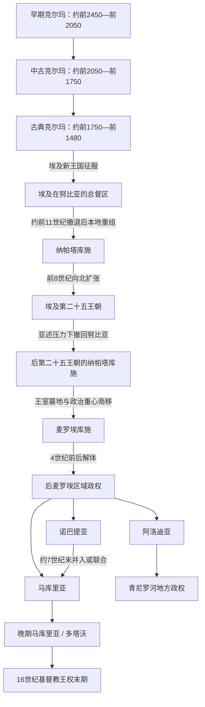

# 苏丹的克尔玛、库施与基督教努比亚

## 时间

约前2500年—16世纪

## 概括

尼罗河中游不是古埃及文明的被动边缘，而是拥有独立农业基础、城市、王权和远程贸易网络的历史区域。克尔玛先在第三瀑布附近形成国家，利用尼罗河、草原和撒哈拉通道连接埃及、红海与非洲内陆；埃及新王国征服后又建立军事—神庙行政。约前1千纪初，本地王权以纳帕塔为中心重建为库施，前8世纪一度统一埃及；其后的麦罗埃阶段发展出本地文字、王室墓葬和更偏南的政治经济中心。6世纪以后，诺巴提亚、马库里亚和阿洛迪亚完成基督教化，在伊斯兰征服埃及后仍延续数百年。

这里的“努比亚”是地区和文化概念，不等同于一个持续不变的国家。王国边界、首都、宗教语言与统治精英不断变化；现代史家只能从考古、埃及文献、希腊罗马作者、阿拉伯史料和古努比亚语文书拼合断裂的统治序列。具名统治者详见[努比亚与库施统治者世系表](/%E4%BA%BA%E6%96%87%E7%A7%91%E5%AD%A6/%E5%8E%86%E5%8F%B2/%E5%8C%97%E9%9D%9E/%E8%8B%8F%E4%B8%B9/%E5%8A%AA%E6%AF%94%E4%BA%9A%E4%B8%8E%E5%BA%93%E6%96%BD%E7%BB%9F%E6%B2%BB%E8%80%85%E4%B8%96%E7%B3%BB%E8%A1%A8.md)。

## 演进图

## 分阶段过程

### 克尔玛的形成、扩张与覆亡

- **早期克尔玛（约前2450—前2050年）**：第三瀑布附近的大型聚落、宗教区和东部墓地逐渐制度化。宽阔冲积平原支持谷物、畜牧和人口集中，尼罗河航道与陆路则带来黄金、象牙、牲畜及手工业品。
- **中古克尔玛（约前2050—前1750年）**：城墙、宫殿、仓储和大型墓葬显示王权与社会分层增强。埃及中王国在第二瀑布一线修筑要塞，既防范上游势力，也控制贸易和人员流动。
- **古典克尔玛（约前1750—前1480年）**：埃及中王国撤出部分南部据点后，克尔玛向下努比亚扩张，吸收原要塞区的埃及书吏和地方精英。埃及第二中间期，喜克索斯曾寻求与库施夹击底比斯，说明克尔玛已是能改变尼罗河政治平衡的大国。
- **直接覆亡过程**：埃及第十八王朝先统一下游，再由雅赫摩斯、阿蒙霍特普一世和图特摩斯一世等持续南征。约前1500年前后，克尔玛都城与王权体系遭摧毁或被吸收。军事失败是直接原因；埃及重新统一后的兵力、要塞与航运能力是外部结构压力，区域环境和贸易条件变化可能加剧脆弱性，但不能把覆亡简化为单一生态灾难。
- **统治者证据**：王墓和纪念建筑证明存在强大君主制，却没有可可靠复原的个人王名。旧说把“奈杰赫（Nedjeh）”当作国王，铭文学重释表明它更可能意为“强大的统治者”一类称号。

### 埃及新王国统治与库施再兴

埃及把努比亚纳入“库施王子”或“库施王子总督”体系，由法老任命的总督、要塞长、神庙和地方首领共同征收黄金、牲畜和劳役。杰贝勒·巴尔卡勒的阿蒙神庙成为王权圣地，本地精英采用埃及文字、宗教与宫廷形式，但社会并未完全埃及化。约前11世纪新王国收缩后，行政链断裂，本地政治中心经过数百年重组，最终出现纳帕塔库施。

### 纳帕塔库施与第二十五王朝

- **崛起机制**：纳帕塔王权控制尼罗河交通、金矿与畜牧区，并以阿蒙神谕和王室墓葬整合精英。阿拉拉、卡什塔奠定扩张基础；皮耶利用埃及第三中间期诸政权分裂，于前8世纪后期北征。
- **统治埃及**：皮耶、沙巴卡、沙比特库、塔哈尔卡和坦塔马尼构成通常所称埃及第二十五王朝。其统治者修建神庙、复兴旧式王权表达，并在黎凡特—埃及—努比亚体系中与亚述竞争。
- **退出埃及**：亚述军队于前671年攻入埃及，前667/666年再度打击塔哈尔卡，坦塔马尼反攻失败后退回努比亚。库施没有因此灭亡，而是继续以纳帕塔为重要宗教中心。
- **南移**：前591年埃及第二十六王朝普萨美提克二世远征并破坏纳帕塔一带。王室墓地与政治活动逐步向麦罗埃集中，过程跨越数代，并非某一年简单“迁都”。

### 麦罗埃库施

麦罗埃附近更接近降雨农业、铁矿、木材和通往红海及内陆的路线。王权保留阿蒙传统，同时形成麦罗埃文字和独特金字塔墓葬；“坎达克”是王后或王太后称号，其中一些女性以独立统治者身份出现。前1世纪阿马尼雷纳斯与罗马埃及交战，约前20年的和约稳定了边境。纳塔卡马尼与阿马尼托雷时期建筑活动兴盛。

3—4世纪以后，王室铭文和纪念建筑减少，区域权力碎片化。红海贸易路线改变、地方政治重组、资源压力及北部诺巴人与南部力量共同作用；阿克苏姆王埃扎纳的铭文证明4世纪发生过远征，却不足以把麦罗埃覆亡解释为一次明确的“阿克苏姆征服”。

### 基督教努比亚三王国

- **形成与皈依**：后麦罗埃时期，下努比亚形成诺巴提亚，中努比亚形成马库里亚，青白尼罗河汇流区以南形成阿洛迪亚。6世纪来自拜占庭—埃及教会网络的传教使三国基督教化，但教派关系和具体年份仍有争议。
- **诺巴提亚—马库里亚联合**：7世纪末至8世纪初，诺巴提亚逐渐纳入马库里亚王权，地方“总督／山主”仍管理下努比亚。古栋戈拉成为宫廷、主教区和书写文化中心，希腊语、科普特语、古努比亚语与阿拉伯语并用。
- **652年《巴克特》**：阿拉伯军第二次进攻栋戈拉未能征服马库里亚，双方建立停战、边贸和人员交付安排。它随时代变化，不应被理解为五百年完全不变的单向“奴隶贡赋”。
- **繁荣机制**：河谷灌溉、教会地产、城镇工艺、跨境贸易和相对稳定的埃及关系支撑王国。8世纪基里亚科斯干预埃及以保护科普特牧首，显示马库里亚并非孤立小国。
- **衰落与转型**：12—14世纪埃及政权更迭、阿尤布和马穆鲁克军事压力、贝都因与巴努·坎兹网络扩张、王位内争及贸易重心变化叠加。1317年前后首位穆斯林国王被外力扶立，但基督教政权和古努比亚语文书在下努比亚仍延续。
- **多塔沃与阿洛迪亚末期**：晚期文献中的多塔沃与马库里亚、诺巴提亚乃至阿洛迪亚的关系仍有争议。约1484年乔尔和约1520—1526年的高娅女王说明基督教王权比传统“1504年突然终结”叙事更晚。阿洛迪亚首都索巴在丰吉兴起前已明显衰退；阿卜达拉布联盟、丰吉形成和伊斯兰化是长期重组，不宜写成一场证据确凿的单次征服。

## 统治结构

| 政体 | 最高权力 | 中层结构 | 权力与资源基础 |
|---|---|---|---|
| 克尔玛 | 具名不可考的国王 | 宫殿、宗教中心、地方精英 | 冲积农业、牲畜、贸易、战争与王室再分配 |
| 埃及新王国努比亚 | 埃及法老 | 库施总督、要塞长、神庙、地方首领 | 黄金、贡赋、驻军、航运和神庙经济 |
| 纳帕塔—麦罗埃库施 | 国王或女王；王太后可掌实权 | 王族、祭司、地方行政与军队 | 阿蒙宗教、尼罗河交通、金矿、农业和商路 |
| 诺巴提亚—马库里亚 | 国王，晚期继承争议频繁 | 下努比亚总督、主教、地方官、军队 | 灌溉农业、教会与王室地产、贸易和边境协定 |
| 阿洛迪亚 | 国王 | 索巴宫廷、主教区、地方统治者 | 青白尼罗河农业、内陆与红海方向贸易 |

## 重要事件

| 时间 | 事件 | 结果与长期影响 |
|---|---|---|
| 约前2450年 | 克尔玛城市和王权形成 | 尼罗河中游出现长期独立国家中心 |
| 约前1750年后 | 古典克尔玛扩张 | 控制部分埃及旧要塞并进入埃及内战外交 |
| 约前1500年 | 埃及新王国摧毁克尔玛王权 | 努比亚进入约四百年的埃及总督统治 |
| 前8世纪后期 | 皮耶北征 | 库施建立统治埃及的第二十五王朝 |
| 前671—前663年 | 亚述多次进攻埃及 | 库施退出埃及，但努比亚王国延续 |
| 前591年 | 普萨美提克二世远征纳帕塔 | 加速王室活动向麦罗埃地区转移 |
| 约前24—前20年 | 阿马尼雷纳斯对罗马战争及和约 | 确立罗马埃及与库施边界秩序 |
| 1世纪 | 纳塔卡马尼与阿马尼托雷大规模营建 | 麦罗埃王权进入可见的繁盛期 |
| 4世纪 | 麦罗埃中央王权消失 | 后麦罗埃地方政权兴起，原因多元且有争议 |
| 约543—580年 | 三个努比亚王国相继基督教化 | 教会、主教区和书写文化成为国家制度 |
| 651—652年 | 栋戈拉防御战与《巴克特》 | 马库里亚保持独立并与穆斯林埃及建立长期关系 |
| 约7世纪末—8世纪初 | 诺巴提亚并入马库里亚 | 形成覆盖下、中努比亚的复合王国 |
| 1270年代—1320年代 | 马穆鲁克干预与反复废立 | 王位竞争、附庸化和宗教转型加速 |
| 约1484—1526年 | 乔尔与高娅仍见于文献 | 证明晚期基督教努比亚没有在1504年整齐终结 |

## 兴衰原因归纳

| 阶段 | 崛起条件 | 结构性压力 | 直接转折 |
|---|---|---|---|
| 克尔玛 | 农业平原、交通节点、埃及分裂期机会 | 埃及要塞与统一王朝的长期军压 | 第十八王朝连续南征 |
| 纳帕塔库施 | 新王国撤退、阿蒙王权、埃及政治分裂 | 亚述扩张和北方战线成本 | 亚述入侵迫使退出埃及 |
| 麦罗埃库施 | 南部资源、贸易改道、本地文字与王权 | 商路变化、地方分化、资源与边境压力 | 4世纪中央纪念体系消失；具体过程不明 |
| 基督教努比亚 | 教会网络、河谷农业、与埃及的制度化边贸 | 王位争夺、北方军事压力、贝都因迁徙、贸易变化 | 13—14世纪马穆鲁克反复干预；15—16世纪地方政权转型 |

## 年代与争议说明

- 早期年代多为考古分期，可能随新测年调整。
- 库施没有保存一份本国王表；前5世纪以后很多顺序依赖墓葬编号和零散铭文。
- 麦罗埃文字能够转写，但语言尚未完全释读，人物关系和事件解释有限。
- 中世纪努比亚同名君主很多，外部史料又常把国名、首都名和王名混用；世系表中的“约”、斜线年代和空档均是证据限制，不代表该时段必然没有统治者。

## 演变关系

- 上级：[苏丹历史](/%E4%BA%BA%E6%96%87%E7%A7%91%E5%AD%A6/%E5%8E%86%E5%8F%B2/%E5%8C%97%E9%9D%9E/%E8%8B%8F%E4%B8%B9/README.md)
- 统治者专表：[努比亚与库施统治者世系表](/%E4%BA%BA%E6%96%87%E7%A7%91%E5%AD%A6/%E5%8E%86%E5%8F%B2/%E5%8C%97%E9%9D%9E/%E8%8B%8F%E4%B8%B9/%E5%8A%AA%E6%AF%94%E4%BA%9A%E4%B8%8E%E5%BA%93%E6%96%BD%E7%BB%9F%E6%B2%BB%E8%80%85%E4%B8%96%E7%B3%BB%E8%A1%A8.md)
- 后一阶段：[丰吉、达尔富尔、马赫迪与英埃共管](/%E4%BA%BA%E6%96%87%E7%A7%91%E5%AD%A6/%E5%8E%86%E5%8F%B2/%E5%8C%97%E9%9D%9E/%E8%8B%8F%E4%B8%B9/%E4%B8%B0%E5%90%89%E3%80%81%E8%BE%BE%E5%B0%94%E5%AF%8C%E5%B0%94%E3%80%81%E9%A9%AC%E8%B5%AB%E8%BF%AA%E4%B8%8E%E8%8B%B1%E5%9F%83%E5%85%B1%E7%AE%A1.md)
- 埃及对照：[古埃及](/%E4%BA%BA%E6%96%87%E7%A7%91%E5%AD%A6/%E5%8E%86%E5%8F%B2/%E5%8C%97%E9%9D%9E/%E5%9F%83%E5%8F%8A/%E5%8F%A4%E5%9F%83%E5%8F%8A/README.md)、[伊斯兰征服与早期穆斯林埃及](/%E4%BA%BA%E6%96%87%E7%A7%91%E5%AD%A6/%E5%8E%86%E5%8F%B2/%E5%8C%97%E9%9D%9E/%E5%9F%83%E5%8F%8A/%E4%BC%8A%E6%96%AF%E5%85%B0%E5%BE%81%E6%9C%8D%E4%B8%8E%E6%97%A9%E6%9C%9F%E7%A9%86%E6%96%AF%E6%9E%97%E5%9F%83%E5%8F%8A.md)
