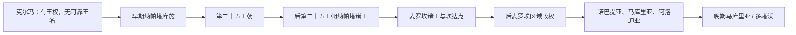

# 努比亚与库施统治者世系表

## 范围与使用说明

本表汇总克尔玛、库施和基督教努比亚现有材料中**可证或可辨认**的统治者。它不是一份无缺口的现代王表：克尔玛没有保存可靠人名；纳帕塔与麦罗埃次序主要由铭文和墓葬重建；马库里亚后期多次复位、外力扶立和同名现象尤其严重。表内“约”“不详”“顺序未定”是证据结论，而不是待随意补齐的空白。

详细过程见[克尔玛、库施与基督教努比亚](/%E4%BA%BA%E6%96%87%E7%A7%91%E5%AD%A6/%E5%8E%86%E5%8F%B2/%E5%8C%97%E9%9D%9E/%E8%8B%8F%E4%B8%B9/%E5%85%8B%E5%B0%94%E7%8E%9B%E3%80%81%E5%BA%93%E6%96%BD%E4%B8%8E%E5%9F%BA%E7%9D%A3%E6%95%99%E5%8A%AA%E6%AF%94%E4%BA%9A.md)。

## 世系演进图

## 克尔玛

| 证据阶段 | 可列统治者 | 说明 |
|---|---|---|
| 约前2450—前1480年 | 无可可靠复原的个人王名 | 大型王墓、宫殿和纪念建筑证明君主制存在，但本地未留下可读王表 |
| 第二中间期 | “Nedjeh”不列为人名 | 过去曾译作克尔玛国王“奈杰赫”；铭文学重释认为是“强大统治者”一类头衔 |

## 早期库施与埃及第二十五王朝

| 顺序 | 统治者 | 约在位 | 继承与可证事件 |
|---:|---|---|---|
| 1 | **阿拉拉（Alara）** | 前9世纪中后期 | 后世铭文追认的早期王朝奠基者；具体亲属关系仍有争议 |
| 2 | 卡什塔（Kashta） | 约前760—前747年 | 王权扩展至上埃及；以王室女性进入底比斯阿蒙体系 |
| 3 | **皮耶（Piye／Piankhy）** | 约前747—前716年 | 北征埃及并以胜利碑记录诸侯臣服；第二十五王朝奠基者 |
| 4 | **沙巴卡（Shabaka）** | 约前716—前702年 | 巩固埃及统治；与皮耶的准确关系和年代次序有学术争论 |
| 5 | 沙比特库（Shebitku） | 约前702—前690年 | 延续库施—埃及复合王权；与沙巴卡先后顺序曾有争议 |
| 6 | **塔哈尔卡（Taharqa）** | 前690—前664年 | 大规模营建；前671年后与亚述反复战争并失去埃及 |
| 7 | **坦塔马尼（Tantamani）** | 前664—约前653年 | 反攻埃及失败后撤回努比亚；第二十五王朝在埃及的最后统治者 |

## 后第二十五王朝的纳帕塔统治者

下列前四位的顺序较稳；前6—5世纪及更晚序列多依墓葬和小型铭文排列，绝对年代与局部次序不确定。

| 顺序 | 统治者 | 约年代 | 备注 |
|---:|---|---|---|
| 1 | 阿特拉内尔萨（Atlanersa） | 前7世纪中期 | 坦塔马尼之后，继续纳帕塔营建 |
| 2 | 森卡马尼斯肯（Senkamanisken） | 前7世纪中后期 | 雕像与神庙铭文可证 |
| 3 | 阿纳拉马尼（Analamani） | 前7世纪末 | 卡瓦铭文记录军事与宗教活动 |
| 4 | **阿斯佩尔塔（Aspelta）** | 约前593—前568年 | 前591年埃及远征时期的库施国王；继承与神谕文书丰富 |
| 5 | 阿拉马特勒科（Aramatle-qo） | 前6世纪 | 次序大致推定 |
| 6 | 马洛纳肯（Malonaqen） | 前6世纪 | 墓葬和小型纪念物可证 |
| 7 | 阿纳尔马耶（Analmaaje） | 前6—5世纪 | 年代不详 |
| 8 | 阿马尼纳塔基莱布特（Amaninatakilebte） | 前6—5世纪 | 年代不详 |
| 9 | 卡拉卡马尼（Karakamani） | 前6—5世纪 | 年代不详 |
| 10 | 阿马尼斯塔巴拉科（Amanistabara-qo） | 前6—5世纪 | 年代不详 |
| 11 | 西阿斯皮科（Siaspi-qo） | 前6—5世纪 | 年代不详 |
| 12 | 纳萨赫马（Nasakhma） | 前6—5世纪 | 年代不详 |
| 13 | 马洛维耶巴马尼（Malowijebamani） | 前6—5世纪 | 年代不详 |
| 14 | 塔拉卡马尼（Talakhamani） | 前5世纪 | 年代不详 |
| 15 | 阿里卡马尼诺特（Arikamaninote） | 前5—4世纪 | 有较长铭文，身份较明确 |
| 16 | 巴斯卡克伦（Baskakeren） | 前5—4世纪 | 次序与年代不确定 |
| 17 | 哈尔西约特夫（Harsijotef） | 前4世纪 | 胜利铭文记录多次军事行动 |
| 18 | 阿卡里滕（Akhariten） | 前4世纪 | 墓葬与铭文可证 |
| 19 | 阿马尼巴希（Amanibakhi） | 前4世纪 | 次序不确定 |
| 20 | **纳斯塔森（Nastasen）** | 前4世纪后期 | 胜利碑为晚期纳帕塔重要史料 |
| 21 | 阿克蒂萨内斯（Aktisanes） | 前4世纪 | 与希腊文献人物对应关系有争议 |
| 22 | 阿里亚马尼（Aryamani） | 前4—3世纪 | 铭文语言与年代判断有争议 |
| 23 | 卡什……（Kash…） | 年代不详 | 王名残缺，仅能保留片段 |
| 24 | 伊里—皮耶科（Iry-Piye-qo） | 年代不详 | 墓葬与残铭可证 |
| 25 | 萨布拉卡马尼（Sabrakamani） | 年代不详 | 位于纳帕塔—麦罗埃过渡序列，位置未定 |

## 麦罗埃统治者

本段不存在公认的逐年连续年表。表按常用重建次序列出所有可辨认名称，并保留残名和无名统治者；同一时期可能共治，女性“坎达克”既可能是王太后，也可能是独立女王。

| 顺序 | 统治者 | 约年代 | 继承、事件或证据说明 |
|---:|---|---|---|
| 1 | **阿尔卡马尼科／埃尔加梅内斯一世（Arkamaniqo）** | 前3世纪中期 | 与托勒密二世同时；常视为首位葬于麦罗埃的国王 |
| 2 | 阿马尼斯洛（Amanislo） | 前3世纪 | 金字塔与雕像再利用可证 |
| 3 | 阿马尼特哈（Amanitekha） | 前3世纪 | 年代和次序不确定 |
| 4 | 舍塞潘赫纳门·塞特彭雷（Shesepankhenamen Setepenre） | 前3世纪 | 埃及式王名可证 |
| 5 | 阿尔内哈马尼（Arnekhamani） | 前3世纪后期 | 穆萨瓦拉特神庙铭文 |
| 6 | 阿尔卡马尼（Arqamani） | 前3—2世纪 | 与托勒密埃及关系密切 |
| 7 | 阿迪哈拉马尼（Adikhalamani） | 前2世纪 | 菲莱、达卡等地营建 |
| 8 | ……梅尔……特（…mer…t） | 年代不详 | 王名残缺 |
| 9 | **沙纳克达赫特女王（Shanakdakheto）** | 前2世纪 | 最早明确可见的独立女统治者之一 |
| 10 | 坦伊达马尼（Tanyidamani） | 前2世纪 | 麦罗埃文长铭可证 |
| 11 | 恩基尔金桑……（Nqyrjinsan…） | 年代不详 | 名称残缺 |
| 12 | 阿克拉卡马尼（Aqrakamani） | 前1世纪 | 次序不确定 |
| 13 | 特里特卡斯（Teriteqas） | 前1世纪后期 | 可能与阿马尼雷纳斯共治或先后相接 |
| 14 | **阿马尼雷纳斯女王（Amanirenas）** | 约前40—前10年 | 对罗马战争及和约时期的坎达克 |
| 15 | **阿马尼沙赫托女王（Amanishakheto）** | 前1世纪末—1世纪初 | 丰富王室墓葬和首饰可证 |
| 16 | 纳维德马克女王（Nawidemak） | 1世纪初 | 浮雕显示独立王权；与前后女王次序有争议 |
| 17 | 阿马尼哈巴莱（Amanikhabale） | 1世纪 | 年代不确定 |
| 18 | **纳塔卡马尼（Natakamani）** | 约1世纪前半 | 与阿马尼托雷共同营建，可能共治 |
| 19 | **阿马尼托雷女王（Amanitore）** | 约1世纪前半 | 与纳塔卡马尼并见；大规模神庙建设 |
| 20 | 舍拉卡罗尔（Shorakaror） | 1世纪 | 可能为王子、共治者或继承者，身份有争议 |
| 21 | 阿马尼塔拉基德（Amanitaraqide） | 1世纪 | 年代不确定 |
| 22 | 阿里耶塞博赫（Aryesebokhe） | 1—2世纪 | 年代不确定 |
| 23 | 无名统治者 | 1—2世纪 | 存在王墓或王权证据，姓名亡佚 |
| 24 | 无名女王 | 1—2世纪 | 性别推定，姓名亡佚 |
| 25 | 阿马尼滕莫米德（Amanitenmomide） | 2世纪 | 年代不确定 |
| 26 | 阿马尼哈塔尚女王（Amanikhatashan） | 2世纪 | 女王身份较可能 |
| 27 | 塔雷肯尼瓦尔（Tarekeniwal） | 2世纪 | 年代不确定 |
| 28 | 阿马尼哈雷凯雷姆（Amanikhareqerem） | 2世纪 | 铭文与神庙遗迹可证 |
| 29 | 阿里滕耶塞博赫（Aritenyesebokhe） | 2世纪 | 年代不确定 |
| 30 | 阿马尼赫多洛（Amanikhedolo） | 2世纪 | 年代不确定 |
| 31 | 塔基德阿马尼（Takideamani） | 2—3世纪 | 年代不确定 |
| 32 | 马沙德阿赫尔（Mashadeakhel） | 3世纪 | 年代不确定 |
| 33 | 特科里德阿马尼（Teqorideamani） | 3世纪 | 菲莱希腊文、世系资料可证 |
| 34 | 马洛科雷巴尔（Maloqorebar？） | 3世纪 | 读名有疑问 |
| 35 | 塔梅洛尔德阿马尼（Tamelordeamani） | 3世纪 | 年代不确定 |
| 36 | 耶塞博赫阿马尼（Yesebokheamani） | 3世纪 | 年代不确定 |
| 37 | ……克……（…k…） | 3—4世纪 | 名称残缺 |
| 38 | ……普……宁（[.]p[…]nin） | 3—4世纪 | 名称残缺 |
| 39 | 帕特拉佩阿马尼女王？（Patrapeamani） | 4世纪 | 性别和次序均不确定 |
| 40 | **阿马尼皮拉德女王？（Amanipilade）** | 4世纪中期 | 常列为最后可辨名的麦罗埃统治者之一 |

## 诺巴提亚与阿洛迪亚可证君主

| 政体 | 统治者 | 约在位／见证时间 | 说明 |
|---|---|---|---|
| 诺巴提亚 | 西尔科（Silko） | 5世纪中期 | 塔尔米斯铭文记录战胜布莱米人；其是否已是基督徒存在争议 |
| 诺巴提亚 | 阿布尔尼（Aburni） | 约450年 | 由布莱米统治者书信可证 |
| 诺巴提亚 | 未知名基督教国王 | 约543／545年 | 朱利安传教团时期皈依，史料未可靠保存姓名 |
| 阿洛迪亚 | 未知名国王 | 约580年 | 隆吉努斯传教时期皈依；没有可连续复原的王表 |
| 阿洛迪亚 | 后世零散王名与地方君主 | 7—15世纪 | 证据不足以构造完整顺序，故不把传说性名单伪装成世系 |

## 马库里亚与晚期多塔沃统治者

| 顺序 | 统治者 | 在位／见证时间 | 继承关系与备注 |
|---:|---|---|---|
| 1 | **卡利杜鲁特（Qalidurut）** | 约651／652年 | 栋戈拉抗战和《巴克特》时期国王 |
| 2 | 扎卡里亚斯（Zacharias） | 651或653—696年 | 与卡利杜鲁特关系表述不一；重建栋戈拉大教堂 |
| 3 | **梅尔库里奥斯（Merkourios）** | 696—710年 | 常与诺巴提亚—马库里亚统一相联系 |
| 4 | 扎卡里亚斯一世 | 8世纪初 | 曾退位；准确年代不详 |
| 5 | 西缅（Simeon） | 8世纪 | 次序可推，年代不详 |
| 6 | 亚伯拉罕（Abraham） | 8世纪 | 年代不详 |
| 7 | 马尔科斯（Markos） | 8世纪 | 年代不详 |
| 8 | **基里亚科斯（Kyriakos）** | 约747—768年 | 曾干预埃及以保护科普特牧首 |
| 9 | 米哈埃尔（Mikhael／Khael） | 约785／794—804／813年 | 年代有多种重建 |
| 10 | 约安尼斯（Ioannes） | 822年前？或约850年？ | 所处位置存在争议 |
| 11 | 扎卡里亚斯三世 | 约835？—856／859／866年 | 约安尼斯之子 |
| 12 | 格奥尔基奥斯一世 | 约856—约887年 | 扎卡里亚斯三世之子 |
| 13 | 扎卡里亚斯四世 | 916／917—930年 | 格奥尔基奥斯一世之子；中间空档不代表无王 |
| 14 | 卡比尔（Kabil） | 约943年 | 零散文献可证 |
| 15 | 格奥尔基奥斯二世 | 969—约1002年 | 10世纪末重要君主 |
| 16 | 拉斐尔（Raphael） | 1000—约1006年 | 与前任年代可能重叠 |
| 17 | 斯特法诺斯（Stephanos） | 约1027年 | 零散见证 |
| 18 | 所罗门（Solomon） | 1077—1079／1080年 | 后世称其恢复母系继承，解释有争议 |
| 19 | 格奥尔基奥斯三世 | 约1079／1080年 | 在位很短或与前后重叠 |
| 20 | 巴西莱奥斯（Basileios） | 约1089年 | 零散见证 |
| 21 | 格奥尔基奥斯五世 | 1130—1158年 | 巴西莱奥斯之子 |
| 22 | 摩西（Moses） | 1155—1199年 | 前任外甥；可能有共治 |
| 23 | 格奥尔基奥斯六世 | 12—13世纪 | 摩西外甥；绝对年代不详 |
| 24 | 巴西尔二世 | 12—13世纪 | 格奥尔基奥斯六世之弟 |
| 25 | 穆尔塔什卡拉（Murtashkara） | 约1268／1269年 | 后期王位斗争中的统治者 |
| 26 | **大卫（David）** | 1268／1269—1276年6月4日 | 对埃及边境行动招致马穆鲁克干预 |
| 27 | 马什库达（Mashkouda） | 1276—约1279年 | 马穆鲁克扶立背景 |
| 28 | 巴拉克（Barak） | 约1279年 | 在位短暂 |
| 29 | **塞马蒙（Semamun／Simamon）** | 约1286—1287／1288年 | 首次在位 |
| 30 | 塞马蒙的外甥（姓名不详） | 1287／1288年 | 外力扶立，短期在位 |
| 31 | 塞马蒙（复位） | 约1288—1289年 | 第二次在位 |
| 32 | 大卫的外甥布达马（Budamma） | 约1289—1290年 | 继承身份来自外部史料 |
| 33 | 塞马蒙（再复位） | 约1290—1295年 | 第三次在位；结束年份不确定 |
| 34 | 阿亚伊／阿迈（Ayay／Amai） | 约1304／1305—1311年 | 晚期基督教国王 |
| 35 | 库丹贝斯（Kudanbes） | 1311—1316年 | 大卫之弟；向马穆鲁克苏丹交涉 |
| 36 | **阿卜杜拉·巴尔尚布（Abdallah Barshanbu）** | 1316—1317年 | 马穆鲁克扶立的首位穆斯林国王 |
| 37 | 阿布拉姆（Abram） | 1317末或1318初 | 仅统治约三日 |
| 38 | 坎兹·道拉·穆罕默德 | 1318—1323年 | 巴努·坎兹首领；穆斯林统治者 |
| 39 | 库丹贝斯（复位） | 1323—1324年 | 短暂复位 |
| 40 | 坎兹·道拉·穆罕默德（复位） | 1324—约1328年 | 再次掌权 |
| 41 | 西蒂（Siti） | 约1331—1333年 | 身份与统治范围不完全确定 |
| 42 | 帕珀（Paper） | 14世纪 | “通古尔之王”；具体年代不详 |
| 43 | 纳西尔（Nasir） | 约1397年 | 马穆鲁克附庸；传统上列为马库里亚末期国王 |
| 44 | **乔尔（Joel of Dotawo）** | 至少1463—约1484年 | 多塔沃国王；古努比亚语文书与铭文可证 |
| 45 | **高娅／贾韦女王（Gaua／Jawe）** | 约1520—1526年 | 葡萄牙记载中的努比亚女王；是否直接统治多塔沃仍有争议 |

## 连续性判断

- 表中的空档不能自动补成某个家族连续统治，也不能据此断言国家已灭亡。
- 诺巴提亚在并入马库里亚后仍保有地方行政身份；“山主”不等同于独立国王。
- 马库里亚、栋戈拉、多塔沃在晚期文献中的对应关系尚未完全解决，因此保留文献原称。
- 高娅是目前可证最晚的一位基督教努比亚统治者候选，但她的疆域和与乔尔王朝的关系不明。

## 关联笔记

- 主笔记：[克尔玛、库施与基督教努比亚](/%E4%BA%BA%E6%96%87%E7%A7%91%E5%AD%A6/%E5%8E%86%E5%8F%B2/%E5%8C%97%E9%9D%9E/%E8%8B%8F%E4%B8%B9/%E5%85%8B%E5%B0%94%E7%8E%9B%E3%80%81%E5%BA%93%E6%96%BD%E4%B8%8E%E5%9F%BA%E7%9D%A3%E6%95%99%E5%8A%AA%E6%AF%94%E4%BA%9A.md)
- 总览：[苏丹历史](/%E4%BA%BA%E6%96%87%E7%A7%91%E5%AD%A6/%E5%8E%86%E5%8F%B2/%E5%8C%97%E9%9D%9E/%E8%8B%8F%E4%B8%B9/README.md)
- 后一阶段：[丰吉、达尔富尔、马赫迪与英埃共管](/%E4%BA%BA%E6%96%87%E7%A7%91%E5%AD%A6/%E5%8E%86%E5%8F%B2/%E5%8C%97%E9%9D%9E/%E8%8B%8F%E4%B8%B9/%E4%B8%B0%E5%90%89%E3%80%81%E8%BE%BE%E5%B0%94%E5%AF%8C%E5%B0%94%E3%80%81%E9%A9%AC%E8%B5%AB%E8%BF%AA%E4%B8%8E%E8%8B%B1%E5%9F%83%E5%85%B1%E7%AE%A1.md)
