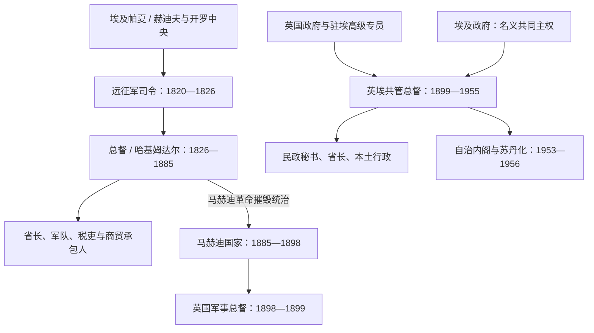

# 土埃及与英埃苏丹行政首脑表

## 范围与口径

本表列1820年征服开始至1956年独立前的中央行政首脑。土耳其—埃及时期的职称在“远征军司令”“总督”“哈基姆达尔”之间变化，开罗档案、后世官表和实际到任日期有时不同；故以年或月表示，不制造日级精度。英埃共管时期另列军事占领首脑、总督和代理总督。

历史过程见[丰吉、达尔富尔、马赫迪与英埃共管](/%E4%BA%BA%E6%96%87%E7%A7%91%E5%AD%A6/%E5%8E%86%E5%8F%B2/%E5%8C%97%E9%9D%9E/%E8%8B%8F%E4%B8%B9/%E4%B8%B0%E5%90%89%E3%80%81%E8%BE%BE%E5%B0%94%E5%AF%8C%E5%B0%94%E3%80%81%E9%A9%AC%E8%B5%AB%E8%BF%AA%E4%B8%8E%E8%8B%B1%E5%9F%83%E5%85%B1%E7%AE%A1.md)。

## 行政权力图

## 土耳其—埃及苏丹中央首脑

| 顺序 | 行政首脑 | 任期 | 职务与说明 |
|---:|---|---|---|
| 1 | **伊斯马仪·卡米勒帕夏** | 1820年11月—1821年 | 穆罕默德·阿里之子、北路征服军司令；1822年在申迪被杀 |
| 2 | **穆罕默德·贝伊·德夫特达尔** | 1821年4月—1824年9月 | 西路／科尔多凡军司令，后主导血腥报复和早期统治 |
| 3 | 奥斯曼·贝伊·贾尔卡斯 | 1824年9月—1825年5月 | 军事行政首脑；喀土穆逐步成为中心 |
| 4 | 马胡·贝伊·乌尔法利 | 1825年5月—1826年3月 | 司令；部分官表视为代理或地方长官 |
| 5 | **阿里·胡尔希德阿迦／帕夏** | 1826年3月—1838年6月 | 先称总督，约1835年后称哈基姆达尔；任期较稳、整顿税制 |
| 6 | 艾哈迈德·帕夏·阿布·维丹 | 1838年6月—1843年10月6日 | 哈基姆达尔；扩张上尼罗河军政网络 |
| 7 | 艾哈迈德·帕夏·曼利克利 | 1843—1845年 | 哈基姆达尔；档案起止日有差异 |
| 8 | 哈立德·胡斯鲁帕夏 | 1845—1850年 | 哈基姆达尔 |
| 9 | 阿卜杜勒·拉蒂夫帕夏 | 1850—1851年1月 | 哈基姆达尔；部分档案把任期延至1852初 |
| 10 | 鲁斯图姆·帕夏·贾尔卡斯 | 1851年1月—1852年5月 | 哈基姆达尔 |
| 11 | 伊斯马仪·哈基帕夏·阿布·贾巴勒 | 1852年5月—1853年 | 哈基姆达尔 |
| 12 | 萨利姆·帕夏·贾扎伊尔利 | 1853—1854年 | 哈基姆达尔 |
| 13 | 阿里·帕夏·西里·阿尔瑙特 | 1854年7月—11月 | 哈基姆达尔，任期短 |
| 14 | 阿里·帕夏·贾尔卡斯 | 1854—1855年 | 总督；与前任月份衔接在资料中不一 |
| 15 | 阿拉基勒·贝伊·阿尔马尼 | 1856—1858年 | 总督；1855—1856衔接资料不全 |
| 16 | 哈桑·贝伊·萨拉马·贾尔卡斯 | 1859—1861年 | 总督；1858—1859衔接资料不全 |
| 17 | 穆罕默德·拉西克贝伊 | 1861—1862年 | 总督 |
| 18 | 穆萨·帕夏·哈姆迪 | 1862—1865年 | 哈基姆达尔 |
| 19 | 欧麦尔·贝伊·法赫里 | 1865年—同年11月 | 代理哈基姆达尔 |
| 20 | 贾法尔·帕夏·萨迪克 | 1865年11月—1866年 | 哈基姆达尔 |
| 21 | 贾法尔·帕夏·马兹哈尔 | 1866—1871年2月5日 | 哈基姆达尔；行政扩张期 |
| 22 | 艾哈迈德·穆姆塔兹帕夏 | 1871年2月5日—1872年10月 | 哈基姆达尔 |
| 23 | 埃德赫姆·帕夏·阿里菲 | 1872年10月 | 代理哈基姆达尔 |
| 24 | **伊斯马仪·阿尤布帕夏** | 1873—1876年 | 哈基姆达尔；达尔富尔征服和省制扩张时期 |
| 25 | **查尔斯·戈登** | 1877年5月—1879年12月 | 首次任哈基姆达尔；反奴隶贸易与扩张行政并存 |
| 26 | 穆罕默德·拉乌夫帕夏 | 1879年12月—1882年2月 | 哈基姆达尔；马赫迪起义初期 |
| 27 | 卡尔·吉格勒 | 1882年3月4日—5月11日 | 代理哈基姆达尔 |
| 28 | 阿卜杜勒·卡迪尔·希勒米帕夏 | 1882年5月—1883年3月 | 哈基姆达尔；曾有效组织防御 |
| 29 | 阿拉丁·西迪克帕夏 | 1883年3月—11月5日 | 哈基姆达尔；随希克斯军覆灭 |
| 30 | 亨利·德·科特洛贡 | 1884年2月—2月18日 | 极短期代理哈基姆达尔 |
| 31 | **查尔斯·戈登** | 1884年2月18日—1885年1月26日 | 第二次任职；被派撤离驻军，后困守喀土穆并战死 |

## 1885—1899年的权力断裂

| 时间 | 中央权力 | 说明 |
|---|---|---|
| 1885年1月26日—1898年9月2日 | 马赫迪国家控制原土埃及苏丹的大部分核心区 | 埃及不再拥有有效中央行政；部分红海港口和边缘地区例外 |
| 1898年9月2日—1899年1月19日 | **赫伯特·基奇纳**任英国军事总督 | 恩图曼战役后军事占领；同时为埃及军队总司令 |
| 1899年1月19日 | 英埃共管协定生效 | 法律上共同统治，实际由英国官僚链主导 |

## 英埃共管苏丹总督

| 顺序 | 总督／代理总督 | 任期 | 任命与关键事件 |
|---:|---|---|---|
| 1 | **赫伯特·基奇纳** | 1899年1月19日—12月22日 | 首任总督，兼埃及军队总司令；奠定军政框架 |
| 2 | **雷金纳德·温盖特** | 1899年12月22日—1916年12月31日 | 长期总督；重建行政、1916年兼并达尔富尔 |
| 3 | **李·斯塔克** | 1917年1月1日—1924年11月20日 | 兼埃及军队总司令；在开罗遇刺，引发驱逐埃及军队 |
| 4 | 瓦西·斯特里 | 1924年11月21日—1925年1月5日 | 代理总督，原任首席法官 |
| 5 | 杰弗里·阿彻 | 1925年1月5日—1926年7月6日 | 首位文官出身总督；杰济拉计划启动 |
| — | 代理衔接，姓名在常用总督表未统一列明 | 1926年7月—10月31日 | 保留行政空档，不臆造任职者 |
| 6 | 约翰·马菲 | 1926年10月31日—1934年1月10日 | 本土行政和南方政策发展期 |
| 7 | 乔治·斯图尔特·赛姆斯 | 1934年1月10日—1940年10月19日 | 1936年英埃条约和毕业生大会时期 |
| 8 | 休伯特·赫德尔斯顿 | 1940年10月19日—1947年4月8日 | 二战与战后政治开放初期 |
| 9 | 罗伯特·乔治·豪 | 1947年4月8日—1954年3月29日 | 立法议会、1953年自决协定与首届选举时期 |
| 10 | 亚历山大·诺克斯·赫尔姆 | 1954年3月29日—1955年12月12日 | 自治内阁、“苏丹化”和撤军时期 |
| 11 | **穆罕默德·艾哈迈德·阿布·兰纳特** | 1955年12月12日—1956年1月1日 | 苏丹首席法官兼代理总督；监督独立前最后交接 |

## 共管行政的实际权力结构

| 角色 | 法定位置 | 实际作用 |
|---|---|---|
| 英国与埃及两国政府 | 名义共同主权者 | 英国掌握否决和高级任命，埃及保留主权主张与部分人员 |
| 总督 | 由埃及名义任命、须经英国同意 | 最高行政、立法和军事权力；早期兼埃及军队总司令 |
| 民政秘书与各部主管 | 总督以下英国文官核心 | 预算、司法、教育、农业、治安和省制政策 |
| 省长、区专员 | 地方殖民行政 | 监督税收、治安和地方首领；不同区域政策差异大 |
| 本土行政首领 | 殖民政府承认的酋长、纳齐尔、奥姆达等 | 低成本征税、司法和治安，也重塑“部落”边界与权力 |
| 埃及军政人员 | 共管伙伴人员 | 1924年后被大幅排除，1936年后有限回归 |
| 1954年后苏丹内阁 | 民选自治政府 | 逐步接管内部行政；外交、军务和“苏丹化”仍需协商 |

## 日期与职称说明

- 1820—1826年是征服军司令到常设总督制的过渡，不能把所有人都称为同一种“总督”。
- 土埃及官表存在到任、免职、代理和伊斯兰历换算差异；本表优先保留差异，不用精确日掩盖不确定性。
- 1899年协定虽然称“共管”，总督和高级文官序列显示英国掌握实权。
- 1955年最后一位代理总督是苏丹人，但并不意味着殖民统治此前已完全移交；独立于1956年1月1日生效。

## 关联笔记

- 主笔记：[丰吉、达尔富尔、马赫迪与英埃共管](/%E4%BA%BA%E6%96%87%E7%A7%91%E5%AD%A6/%E5%8E%86%E5%8F%B2/%E5%8C%97%E9%9D%9E/%E8%8B%8F%E4%B8%B9/%E4%B8%B0%E5%90%89%E3%80%81%E8%BE%BE%E5%B0%94%E5%AF%8C%E5%B0%94%E3%80%81%E9%A9%AC%E8%B5%AB%E8%BF%AA%E4%B8%8E%E8%8B%B1%E5%9F%83%E5%85%B1%E7%AE%A1.md)
- 君主与马赫迪：[丰吉、达尔富尔与马赫迪统治者表](/%E4%BA%BA%E6%96%87%E7%A7%91%E5%AD%A6/%E5%8E%86%E5%8F%B2/%E5%8C%97%E9%9D%9E/%E8%8B%8F%E4%B8%B9/%E4%B8%B0%E5%90%89%E3%80%81%E8%BE%BE%E5%B0%94%E5%AF%8C%E5%B0%94%E4%B8%8E%E9%A9%AC%E8%B5%AB%E8%BF%AA%E7%BB%9F%E6%B2%BB%E8%80%85%E8%A1%A8.md)
- 总览：[苏丹历史](/%E4%BA%BA%E6%96%87%E7%A7%91%E5%AD%A6/%E5%8E%86%E5%8F%B2/%E5%8C%97%E9%9D%9E/%E8%8B%8F%E4%B8%B9/README.md)
- 后一阶段：[独立、南北内战、分离与国家危机](/%E4%BA%BA%E6%96%87%E7%A7%91%E5%AD%A6/%E5%8E%86%E5%8F%B2/%E5%8C%97%E9%9D%9E/%E8%8B%8F%E4%B8%B9/%E7%8B%AC%E7%AB%8B%E3%80%81%E5%8D%97%E5%8C%97%E5%86%85%E6%88%98%E3%80%81%E5%88%86%E7%A6%BB%E4%B8%8E%E5%9B%BD%E5%AE%B6%E5%8D%B1%E6%9C%BA.md)
