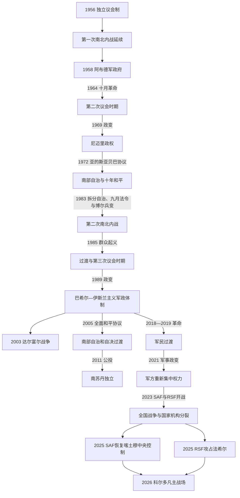

# 苏丹独立、南北内战、分离与国家危机

## 时间

1956年至今（现状核验至2026年7月14日）

## 概括

苏丹独立时继承了疆域庞大、交通方向多元、地区教育与行政经验不均的殖民国家。中央精英迟迟没有就联邦制、宗教与国家关系、土地、军队和资源分配形成稳定契约；军队多次以“恢复秩序”为名接管政治，又依赖安全机构、民兵和地方武装治理边缘。第一次南北内战在独立前的1955年已爆发，1972年自治协议带来约十年和平；1983年南部自治被拆分、伊斯兰化和军队兵变叠加，第二次内战开始。2005年《全面和平协议》结束主要南北战争并安排自决，[南苏丹](/%E4%BA%BA%E6%96%87%E7%A7%91%E5%AD%A6/%E5%8E%86%E5%8F%B2/%E9%9D%9E%E6%B4%B2/%E4%B8%9C%E9%9D%9E/%E5%8D%97%E8%8B%8F%E4%B8%B9/README.md)于2011年7月9日独立。

南部分离没有解决达尔富尔、南科尔多凡、青尼罗河、东部和首都之间的权力失衡。2019年群众革命推翻奥马尔·巴希尔，却产生军民共享、军队与快速支援部队并存的脆弱过渡；2021年10月政变中断转型。2023年4月15日，苏丹武装部队（SAF）与快速支援部队（RSF）爆发全面战争。至2026年7月，SAF控制喀土穆中央区和东、北部主要国家机构，RSF及盟友控制达尔富尔大部并建立不获联合国和非盟承认的平行机构，科尔多凡成为主要争夺带；疆域、联盟和地方控制仍快速变化，不能以静态“东西分治”替代具体核验。

国家元首、总理、军政实权和战争双方领导链见[苏丹独立后国家领导人表](/%E4%BA%BA%E6%96%87%E7%A7%91%E5%AD%A6/%E5%8E%86%E5%8F%B2/%E5%8C%97%E9%9D%9E/%E8%8B%8F%E4%B8%B9/%E8%8B%8F%E4%B8%B9%E7%8B%AC%E7%AB%8B%E5%90%8E%E5%9B%BD%E5%AE%B6%E9%A2%86%E5%AF%BC%E4%BA%BA%E8%A1%A8.md)。

## 演进图

## 独立、第一次内战与议会危机（1955—1969）

### 建国矛盾

1955年8月，南部苏丹部队在托里特等地兵变。兵变被镇压，但逃散军人和地方武装逐渐构成“阿尼亚尼亚”叛乱；因此第一次内战早于1956年独立。南部政治人物要求联邦保障，北部主导的制宪过程没有落实，行政“苏丹化”又多由受教育程度较高的北方人接替英国官员。问题不只是宗教差异，还包括殖民时期南北隔离、代表不足、土地与地方自治以及军队暴力。

独立后国家元首是五人主权委员会，伊斯梅尔·阿扎哈里、阿卜杜拉·哈利勒先后组阁。乌玛党、民族联合党及宗教家族联盟更替频繁，宪法和南部安排迟迟未定。1958年11月哈利勒把权力交给易卜拉欣·阿布德领导的军队，议会制中断。

### 阿布德统治与十月革命

阿布德政权以军事委员会、行政集权和经济发展计划维持统治，对南部加强阿拉伯化、伊斯兰化和军事镇压，并于1964年驱逐外国传教士。战争没有终结，反而扩大难民和武装组织。同年10月，喀土穆大学学生抗议、专业团体罢工和群众示威迫使阿布德辞职，形成“十月革命”。

文官过渡召开1965年圆桌会议，却未能就联邦、统一或自决达成可执行方案。第二次议会时期受党派分裂、经济困难和内战牵制；1969年5月25日，贾法尔·尼迈里与自由军官发动政变。

## 尼迈里、1972年和平与第二次内战（1969—1985）

### 从“五月革命”到亚的斯亚贝巴协议

尼迈里初期依靠左翼军官和苏丹共产党，推行国有化；1971年哈希姆·阿塔短暂政变失败后，共产党被镇压，政权逐渐个人化。南部方面，约瑟夫·拉古整合阿尼亚尼亚为南苏丹解放运动。1972年《亚的斯亚贝巴协议》建立南部地区自治政府，把阿尼亚尼亚部分人员纳入国家军队，第一次内战结束。

和平能够维持，源于自治、财政安排、武装整合和国际调停同时存在；但中央保留关键资源和边界决定权。1977年尼迈里与萨迪克·马赫迪等“全国和解”，伊斯兰主义者哈桑·图拉比进入体制，政权从早期社会主义转向宗教保守和新的精英联盟。

### 和平破裂

南部发现石油、琼莱运河与行政边界争议增加中央干预。1983年尼迈里把统一南部地区拆成三个区，并发布“九月法令”，以伊斯兰刑法重塑全国法律。博尔等地南部部队拒绝调动、发生兵变；约翰·加朗建立苏丹人民解放运动／军（SPLM/A），提出改造整个苏丹而非只求南部独立。自治拆分、宗教法、军事兵变和资源控制共同引爆第二次内战，不能归因于单一命令。

战争、旱灾、债务和物价使政权失去支持。1985年4月尼迈里出访期间，罢工和示威扩大，阿卜杜勒·拉赫曼·苏瓦尔·达哈卜领导军方罢黜他并承诺一年后交权。

## 第二次内战、巴希尔体制与和平进程（1985—2011）

### 民主恢复与1989年政变

1986年选举后萨迪克·马赫迪组建联合政府，党派分歧、军费和经济危机拖延和平。1988年民主联合党与SPLM达成冻结伊斯兰法、召开制宪会议的方案，但未及时实施。1989年6月30日，奥马尔·巴希尔与全国伊斯兰阵线支持者发动政变，解散议会、工会和政党。

巴希尔—图拉比体制用革命指挥委员会、军队、安全机关、人民防卫军和伊斯兰主义干部网络重塑国家，将南部战争描述为“圣战”。强制迁移、饥荒、奴役和对平民袭击在多方战争中发生。1991年SPLM纳西尔分裂造成南部内部战争；乌干达、埃塞俄比亚、厄立特里亚等区域关系又使冲突跨境化。

### 石油、政权分裂与谈判

1999年石油出口为政府提供军费和基础设施收入，也使油区驱逐、边界和收益分配更尖锐。同年巴希尔与图拉比决裂，安全—军人集团保住国家核心。地区斡旋促成2002年《马查科斯议定书》，确认南部自决原则；停火、财富与权力分享、安全安排逐步谈判。

2005年1月9日《全面和平协议》（CPA）建立六年过渡、南部自治政府、联合政府、石油收益分配、联合部队和2011年公投。SPLM领袖约翰·加朗任第一副总统数周后于2005年7月空难去世，萨尔瓦·基尔继任。协议结束主要南北战争，但阿卜耶伊边界、南科尔多凡和青尼罗河“民众协商”、军队撤离及民主改革未完全落实。

### 2011年分离

2011年1月南部公投以压倒性多数支持独立；南苏丹于7月9日成为主权国家。苏丹失去多数已开发油田，却掌握出口管线，双方围绕费用、边界和阿卜耶伊继续危机。分离前后南科尔多凡和青尼罗河重燃政府与SPLM-N战争，表明CPA的南北二元框架没有解决苏丹其余边缘地区。

## 达尔富尔战争与快速支援部队的形成

2003年苏丹解放军／运动（SLA/M）和正义与平等运动（JEM）袭击政府设施，指责喀土穆长期边缘化。政府军动员被统称“金戈威德”的阿拉伯民兵反击，出现大规模杀戮、焚村、强奸和流离失所。土地权、旱灾和族群身份影响冲突，却不能把国家武装和反叛简化成“古老部落仇恨”。

非盟特派团2004年进驻，2006年《达尔富尔和平协议》只获部分派别签署；2007年非盟—联合国混合行动（UNAMID）接替。国际刑事法院2009、2010年对巴希尔发出逮捕令。2011年多哈文件和2020年朱巴和平协议吸纳部分武装，却未统一所有派别，土地、返乡和安全改革不完整。

2013年政府把源自边境情报部队和达尔富尔民兵网络的快速支援部队正式化，由穆罕默德·哈姆丹·达加洛（“赫梅蒂”）领导。RSF后来在也门战争、边境管控和黄金经济中积累独立财源、兵员和对外关系，成为与正规军并列的全国性武装。这一双重军队结构是2023年战争的重要制度前因。

## 2019年革命、军民过渡与2021年政变

2018年12月面包价格和现金短缺引发阿特巴拉抗议，迅速转为要求巴希尔下台的全国运动。专业人士协会、抵抗委员会、妇女和地方组织持续动员；2019年4月喀土穆军方总部静坐扩大。4月11日军方罢黜巴希尔，艾哈迈德·阿瓦德·伊本·奥夫仅掌权一日即辞职，阿卜杜勒·法塔赫·布尔汉领导过渡军事委员会，赫梅蒂任副手。

2019年6月3日，安全部队在喀土穆暴力清场，造成大量死伤和失踪。罢工与国际调停后，军方和自由与变革力量8月签署宪法宣言，成立军民混合主权委员会，阿卜杜拉·哈姆杜克任总理。过渡政府取消部分旧法、与武装团体签署2020年朱巴和平协议，但军企、司法追责、立法机关和安全部门改革停滞。

2021年10月25日布尔汉与军方拘押哈姆杜克、解散过渡机构。哈姆杜克11月被恢复为总理，却因无法建立可信文官过渡于2022年1月2日辞职。政变破坏军民联盟，也没有解决SAF和RSF谁统领武装、如何整合的问题。

## 2023年战争

### 爆发原因

2022年12月框架协议试图恢复文官过渡，核心争议是RSF在多长时间内、以何种指挥关系并入单一国家军队。布尔汉倾向较短整合期，赫梅蒂要求更长时间并保留自主性；双方同时扩军、争夺国家资产和对外支持。2023年4月RSF向麦罗维等战略点部署，谈判破裂，4月15日喀土穆、麦罗维和多地同时交火。

这场战争不是简单的“两位将军私人冲突”。巴希尔时代制造的多重安全机构、军队和RSF各自经济网络、未完成的和平协议、地方武装、外部军援和过渡失败共同构成结构原因；4月部署与指挥争执是直接触发因素。

### 主要阶段

| 时间 | 军事与政治过程 | 结果 |
|---|---|---|
| 2023年4—11月 | RSF占据喀土穆大量街区、总统府和机场周边；SAF依靠空军和据点；西达尔富尔出现大规模族群性杀戮 | 首都国家机构瘫痪，RSF控制达尔富尔四州大部 |
| 2023年12月 | RSF攻占杰济拉州首府瓦德迈达尼 | 战线从首都扩至主要农业和人道枢纽 |
| 2024年 | SAF在恩图曼等地逐步打通据点；RSF自5月围攻法希尔；双方及盟友在森纳尔、杰济拉、科尔多凡反复争夺 | 达尔富尔最后一个主要SAF据点陷入长期围城 |
| 2025年1月 | SAF收复瓦德迈达尼及杰利炼油厂一带 | SAF恢复中部交通主动权；其盟军报复指控同步增加 |
| 2025年3—5月 | SAF进入总统府和喀土穆中央区，随后恢复对首都州大部控制 | 政府机构开始计划返回，但未爆弹、破坏和局部暴力持续；不能等同战争结束 |
| 2025年4月 | RSF攻占扎姆扎姆流离失所者营地 | 联合国人权机构记录上千平民被杀，法希尔围困进一步收紧 |
| 2025年7月 | RSF主导的“塔西斯联盟”宣布平行政府 | 赫梅蒂任总统委员会主席、阿卜杜勒阿齐兹·希卢任副主席、穆罕默德·哈桑·塔伊希任总理；联合国安理会和非盟拒绝承认 |
| 2025年10月24—28日 | RSF对法希尔发动总攻并取得全城控制 | OHCHR记录10月25—27日至少六千余人被杀，包括平民和失去战斗能力者，并认为多项行为构成战争罪、可能构成危害人类罪 |
| 2025年末—2026年 | 战争重心转向北、南、西科尔多凡，SAF、RSF、SPLM-N希卢派及各自盟友争夺道路和城市 | 欧拜伊德、迪林、卡杜格利及补给线遭反复无人机和地面攻击，控制与通行不断变化 |

### 截至2026年7月14日的权力与战线

| 权力中心／区域 | 实际状态 | 不确定性与注意事项 |
|---|---|---|
| SAF及布尔汉主导的过渡主权委员会 | 以喀土穆—苏丹港国家机构为基础；卡米勒·伊德里斯自2025年5月31日起任总理 | 有国际交往和原国家机构连续性，但无民选授权，全国执行力受战争限制 |
| RSF及塔西斯平行机构 | 以达尔富尔大部和部分西、南部控制区为基础；赫梅蒂、希卢和塔伊希分别居平行总统委员会、副书记／副主席与总理位置 | 不获联合国安理会和非盟承认；联盟内部、行政覆盖和实际控制持续变化 |
| 喀土穆州 | SAF在2025年3月恢复中央喀土穆控制，至5月掌握首都州大部 | 西、南恩图曼等地曾长期争夺；地雷、未爆弹、报复和基础设施崩溃使“收复”不等于恢复正常治理 |
| 达尔富尔 | RSF控制多数州府，2025年10月攻占法希尔 | 非RSF武装、地方社区和空袭仍存在；法希尔伤亡、失踪和拘押数字仍在核查 |
| 北科尔多凡欧拜伊德 | SAF控制的关键交通与人道枢纽，2026年6—7月遭密集无人机袭击，RSF在周边增兵 | 联合国警告可能发生地面攻势；截至截止日不能断言城市已易手 |
| 南科尔多凡迪林、卡杜格利 | SAF据点、SPLM-N希卢派和RSF盟友之间的战场，补给曾阶段性恢复 | 道路、桥梁和通行随战事变化；围困是否“解除”须区分军事宣称与稳定人道准入 |
| 白尼罗河及中部走廊 | SAF控制较多，但科斯提、滕代勒提等地遭远程无人机袭击 | 无人机扩大后方风险，传统前线图不足以描述战争 |

2026年6月，联合国警告RSF在欧拜伊德周围集结，可能发动地面攻势；6月6日至28日间的人权监测记录至少15次无人机袭击、造成数十名平民死亡。7月初科斯提、滕代勒提和欧拜伊德继续遭袭，水、电、医疗和援助运输受损。到7月9日，联合国仍把欧拜伊德描述为受无人机攻击和霍乱威胁的SAF控制城市，而非已经失守。任何更细的村镇控制均可能滞后或来自交战方宣传，需另行核验。

## 两次南北内战对照

| 维度 | 第一次内战 | 第二次内战 |
|---|---|---|
| 时间 | 1955—1972年 | 1983—2005年 |
| 主要南方力量 | 早期地方武装，后整合为阿尼亚尼亚／南苏丹解放运动 | SPLM/A为主，1991年后出现分裂派别 |
| 核心议题 | 联邦承诺落空、地区代表、军事镇压、殖民南北差异 | 南部自治拆分、宗教法、资源与石油、全国国家结构 |
| 北方政权 | 议会政府、阿布德军政府、尼迈里初期 | 尼迈里末期、1985过渡、议会政府、巴希尔政权 |
| 结束机制 | 1972年亚的斯亚贝巴协议：自治与军队整合 | 2005年CPA：权力财富分享、安全安排、自治与公投 |
| 和平弱点 | 中央可单方面重组自治，资源边界未制度化 | 达尔富尔等地不在核心协议内，民主转型和三地区安排不完整 |
| 长期结果 | 十年和平后战争重启 | 2011年南苏丹独立，但苏丹内部战争延续 |

## 达尔富尔、南北战争与2023战争的联系

- 达尔富尔战争并非第二次南北内战的简单支线；它有独立的土地、地方行政、族群政治和国家军事化轨迹。
- CPA以喀土穆—SPLM两方谈判为核心，给南部自决，却没有建立包容全国的安全部门和联邦制度。
- 巴希尔政府把地方民兵国家化为RSF，短期增加镇压能力，长期造成两个拥有重武器、财政和政治野心的军队。
- 2019年后未能把SAF、RSF、情报和各和平协议武装置于统一文官控制，是2023年爆发战争的制度桥梁。

## 共和国统治结构

| 阶段 | 国家元首 | 政府首脑 | 实际权力结构 |
|---|---|---|---|
| 1956—1958议会制 | 五人主权委员会 | 阿扎哈里、哈利勒 | 议会政党与宗教家族竞争，军队影响上升 |
| 1958—1964军政府 | 阿布德 | 阿布德兼掌政府 | 武装部队最高委员会和军官行政 |
| 1964—1969文官时期 | 代理总统及第二、第三主权委员会 | 哈利法、马赫古卜、萨迪克 | 多党议会，南部战争和军方压力持续 |
| 1969—1985尼迈里时期 | 尼迈里 | 总理职位时由本人或任命者担任 | 革命委员会、单一政党、总统和安全机构 |
| 1985—1989 | 苏瓦尔·达哈卜；后米尔加尼 | 贾祖利；后萨迪克 | 军事过渡后恢复议会，但军队与战争制约文官 |
| 1989—2019巴希尔时期 | 巴希尔 | 1989—2017职位废除，后恢复 | 军队、伊斯兰主义党、安全机关、民兵和军企 |
| 2019—2021过渡 | 军民混合主权委员会 | 哈姆杜克 | 文官内阁与布尔汉、赫梅蒂共享但不对称 |
| 2021—2023政变后 | 布尔汉主导重组主权委员会 | 哈姆杜克短暂复职，后代理政府 | SAF、RSF共同压制文官，随后彼此决裂 |
| 2023年至今 | 布尔汉主导的原国家机构；另有不获承认的塔西斯平行委员会 | 伊德里斯政府；另有塔伊希平行政府 | SAF与RSF分别依靠盟军、地方行政和战争经济 |

## 兴衰与危机原因归纳

| 问题层次 | 长期结构因素 | 中期机制 | 直接触发 |
|---|---|---|---|
| 南北内战 | 殖民地区隔离、代表和发展不均、中央集权 | 自治承诺落空、军事镇压、资源和宗教法冲突 | 1955兵变；1983自治拆分与博尔兵变 |
| 达尔富尔战争 | 土地权、边缘化、干旱迁徙和国家资源偏置 | 反政府组织兴起、政府武装民兵 | 2003年反政府袭击与国家反攻 |
| 2019革命 | 长期威权、战争财政、腐败和生活危机 | 补贴削减、现金与面包短缺 | 2018年12月阿特巴拉抗议 |
| 2021政变 | 军方经济利益、缺乏统一安全改革 | 军民互不信任、过渡机构未完成 | 军方10月25日拘押文官 |
| 2023战争 | 双重军队、军企与黄金经济、地方武装和外部支持 | RSF整合期限、指挥权和政治地位争议 | 4月部署升级及15日交火 |
| 战争延长 | 国家财政碎裂、跨境补给、盟军多元、人道崩溃 | 无人机和远程打击扩大、平行行政形成 | 各次城市攻防改变战线但未摧毁对方战争能力 |

## 年代与现状说明

- “至今”以2026年7月14日为核验截止；此后任命和战线必须重新查证。
- 交战方公布的控制、伤亡和战果不能自动视为事实；表内现代战况以联合国核验或明确标作“报告”“宣称”的信息为主。
- 2025年10月法希尔的六千余死亡是OHCHR记录的前三日死亡人数，含平民和失去战斗能力者，不等同战争总死亡数。
- SAF恢复喀土穆中央控制是军事节点，不代表国家统一、文官转型或安全恢复。

## 演变关系

- 前一阶段：[丰吉、达尔富尔、马赫迪与英埃共管](/%E4%BA%BA%E6%96%87%E7%A7%91%E5%AD%A6/%E5%8E%86%E5%8F%B2/%E5%8C%97%E9%9D%9E/%E8%8B%8F%E4%B8%B9/%E4%B8%B0%E5%90%89%E3%80%81%E8%BE%BE%E5%B0%94%E5%AF%8C%E5%B0%94%E3%80%81%E9%A9%AC%E8%B5%AB%E8%BF%AA%E4%B8%8E%E8%8B%B1%E5%9F%83%E5%85%B1%E7%AE%A1.md)
- 上级：[苏丹历史](/%E4%BA%BA%E6%96%87%E7%A7%91%E5%AD%A6/%E5%8E%86%E5%8F%B2/%E5%8C%97%E9%9D%9E/%E8%8B%8F%E4%B8%B9/README.md)
- 领导人专表：[苏丹独立后国家领导人表](/%E4%BA%BA%E6%96%87%E7%A7%91%E5%AD%A6/%E5%8E%86%E5%8F%B2/%E5%8C%97%E9%9D%9E/%E8%8B%8F%E4%B8%B9/%E8%8B%8F%E4%B8%B9%E7%8B%AC%E7%AB%8B%E5%90%8E%E5%9B%BD%E5%AE%B6%E9%A2%86%E5%AF%BC%E4%BA%BA%E8%A1%A8.md)
- 分离后的国家：[南苏丹](/%E4%BA%BA%E6%96%87%E7%A7%91%E5%AD%A6/%E5%8E%86%E5%8F%B2/%E9%9D%9E%E6%B4%B2/%E4%B8%9C%E9%9D%9E/%E5%8D%97%E8%8B%8F%E4%B8%B9/README.md)
- 区域比较：[殖民统治、民族主义与北非独立](/%E4%BA%BA%E6%96%87%E7%A7%91%E5%AD%A6/%E5%8E%86%E5%8F%B2/%E5%8C%97%E9%9D%9E/_%E9%80%9A%E5%8F%B2/%E6%AE%96%E6%B0%91%E7%BB%9F%E6%B2%BB%E3%80%81%E6%B0%91%E6%97%8F%E4%B8%BB%E4%B9%89%E4%B8%8E%E5%8C%97%E9%9D%9E%E7%8B%AC%E7%AB%8B.md)
