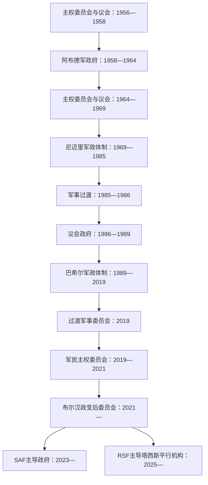

# 苏丹独立后国家领导人表

## 口径

本表分别列国家元首、政府首脑和实际军政领导链。主权委员会是集体国家元首，不能只列主席；军政府中同一人可兼国家元首、政府首脑和武装力量领导。2025年出现的RSF主导平行机构不获联合国安理会和非盟承认，故单列而不混入苏丹共和国法统序列。

历史过程见[独立、南北内战、分离与国家危机](/%E4%BA%BA%E6%96%87%E7%A7%91%E5%AD%A6/%E5%8E%86%E5%8F%B2/%E5%8C%97%E9%9D%9E/%E8%8B%8F%E4%B8%B9/%E7%8B%AC%E7%AB%8B%E3%80%81%E5%8D%97%E5%8C%97%E5%86%85%E6%88%98%E3%80%81%E5%88%86%E7%A6%BB%E4%B8%8E%E5%9B%BD%E5%AE%B6%E5%8D%B1%E6%9C%BA.md)。现任情况核验至2026年7月14日。

## 权力结构图

## 国家元首

| 顺序 | 国家元首／集体机构 | 任期 | 政体与关键说明 |
|---:|---|---|---|
| 1 | **第一主权委员会** | 1955年12月26日—1958年11月17日 | 独立时五人集体国家元首；1958年政变解散 |
| 2 | **易卜拉欣·阿布德** | 1958年11月17日—1964年11月16日 | 最高委员会主席，后称总统；十月革命后辞职 |
| 3 | 西尔·哈提姆·哈利法 | 1964年11月16日—12月3日 | 代理总统，兼过渡总理 |
| 4 | **第二主权委员会** | 1964年12月3日—1965年6月10日 | 五人集体国家元首 |
| 5 | **第三主权委员会** | 1965年6月10日—1969年5月25日 | 五人集体国家元首；伊斯梅尔·阿扎哈里自1965年7月任主席 |
| 6 | **贾法尔·尼迈里** | 1969年5月25日—1985年4月6日 | 先任革命指挥委员会主席，1971年后任总统；1971年7月曾被短暂推翻 |
| — | 哈希姆·阿塔 | 1971年7月19—23日 | 共产党支持的短暂政变实际国家元首；四日后失败 |
| 7 | **阿卜杜勒·拉赫曼·苏瓦尔·达哈卜** | 1985年4月6日—1986年5月6日 | 先为武装部队总司令，后任过渡军事委员会主席；按承诺交权 |
| 8 | 艾哈迈德·米尔加尼 | 1986年5月6日—1989年6月30日 | 最高委员会主席；实权主要由总理和议会政府行使 |
| 9 | **奥马尔·巴希尔** | 1989年6月30日—2019年4月11日 | 先任救国革命指挥委员会主席，1993年后任总统 |
| 10 | 艾哈迈德·阿瓦德·伊本·奥夫 | 2019年4月11—12日 | 过渡军事委员会主席，群众压力下掌权一日即辞职 |
| 11 | **阿卜杜勒·法塔赫·布尔汉** | 2019年4月12日—至今 | 2019年先任军事委员会主席，8月后任过渡主权委员会主席；2021年10月政变后重组委员会；2023年战争后领导SAF一方国家机构 |

## 三届主权委员会成员

| 委员会 | 成员 | 权力说明 |
|---|---|---|
| 第一主权委员会（1955—1958） | 阿卜杜勒·法塔赫·马格里比、艾哈迈德·穆罕默德·亚辛、艾哈迈德·穆罕默德·萨利赫、达尔迪里·穆罕默德·奥斯曼、西里西奥·伊罗·瓦尼 | 五人共同履行国家元首职能，代表不同政治与地区力量 |
| 第二主权委员会（1964—1965） | 阿卜杜勒·哈利姆·穆罕默德、提贾尼·马希、穆巴拉克·沙达德、易卜拉欣·优素福·苏莱曼、路易吉·阿德沃克 | 十月革命后的过渡集体元首 |
| 第三主权委员会（1965—1969） | 伊斯梅尔·阿扎哈里、阿卜杜拉·法迪勒·马赫迪、路易吉·阿德沃克、阿卜杜勒·哈利姆·穆罕默德、哈德尔·哈马德 | 阿扎哈里任主席，但委员会整体仍是法定国家元首 |

## 政府首脑

| 顺序 | 政府首脑 | 任期 | 与国家元首关系及关键事件 |
|---:|---|---|---|
| 1 | **伊斯梅尔·阿扎哈里** | 1956年1月1日—7月5日 | 独立时总理；此前自1954年起任自治政府首席部长 |
| 2 | 阿卜杜拉·哈利勒 | 1956年7月5日—1958年11月17日 | 乌玛党联合政府总理；将权力交军方后政变发生 |
| 3 | 易卜拉欣·阿布德 | 1958年11月18日—1964年10月30日 | 军政府国家元首兼政府首脑 |
| 4 | 西尔·哈提姆·哈利法 | 1964年10月30日—1965年6月2日 | 十月革命后文官过渡总理；一度兼代理国家元首 |
| 5 | 穆罕默德·艾哈迈德·马赫古卜 | 1965年6月10日—1966年7月25日 | 乌玛党总理；6月2—10日为组阁衔接 |
| 6 | 萨迪克·马赫迪 | 1966年7月27日—1967年5月18日 | 首次任总理；乌玛党内分裂背景 |
| 7 | 穆罕默德·艾哈迈德·马赫古卜 | 1967年5月18日—1969年5月25日 | 第二次任总理，被尼迈里政变推翻 |
| 8 | 巴比克尔·阿瓦达拉 | 1969年5月25日—10月27日 | “五月革命”初期总理 |
| 9 | 贾法尔·尼迈里 | 1969年10月28日—1976年8月11日 | 总统兼总理 |
| 10 | 拉希德·巴克尔 | 1976年8月11日—1977年9月10日 | 尼迈里任内总理 |
| 11 | 贾法尔·尼迈里 | 1977年9月10日—1985年4月6日 | 再次总统兼总理 |
| 12 | 贾祖利·达法拉 | 1985年4月22日—1986年5月6日 | 过渡文官总理；4月6—22日由军事委员会直接掌权 |
| 13 | **萨迪克·马赫迪** | 1986年5月6日—1989年6月30日 | 第二次任总理；被巴希尔政变推翻 |
| — | 总理职位废除 | 1989年6月30日—2017年3月2日 | 巴希尔总统及其内阁直接掌政府 |
| 14 | 巴克里·哈桑·萨利赫 | 2017年3月2日—2018年9月10日 | 巴希尔恢复总理职位，实权仍在总统 |
| 15 | 穆塔兹·穆萨 | 2018年9月10日—2019年2月22日 | 经济危机与抗议前期 |
| 16 | 穆罕默德·塔希尔·艾拉 | 2019年2月24日—4月11日 | 巴希尔政权末任总理 |
| — | 职位空缺 | 2019年4月11日—8月21日 | 过渡军事委员会直接统治 |
| 17 | **阿卜杜拉·哈姆杜克** | 2019年8月21日—2021年10月25日 | 军民过渡文官总理，被政变罢黜 |
| 17 | 阿卜杜拉·哈姆杜克（复职） | 2021年11月21日—2022年1月2日 | 与军方协议后复职，因过渡失去可信度辞职 |
| — | 奥斯曼·侯赛因（代理） | 2022年1月19日—2025年4月30日 | 军方主导体制下代理总理 |
| — | 达法拉·哈吉·阿里（代理） | 2025年4月30日—5月31日 | 一个月代理衔接 |
| 18 | **卡米勒·塔伊布·伊德里斯** | 2025年5月31日—至今 | 布尔汉5月19日任命、31日宣誓；组织“希望政府”，截至2026年7月仍任职 |

## 实际军政领导链

| 时段 | 实际最高军政力量 | 领导者 | 与法定机构关系 |
|---|---|---|---|
| 1958—1964 | 苏丹武装部队最高委员会 | 阿布德 | 军队直接成为国家与政府最高权力 |
| 1969—1985 | 革命委员会、总统府、苏丹社会主义联盟与安全机关 | 尼迈里 | 1971年后个人总统制；总理职位从属 |
| 1985—1986 | 过渡军事委员会 | 苏瓦尔·达哈卜 | 掌安全与过渡权后移交议会 |
| 1989—2019 | SAF、国家安全机关、执政党、人民防卫军，后加RSF | 巴希尔；早期与哈桑·图拉比结盟 | 法定总统制下的军政—伊斯兰主义复合体 |
| 2019年4—8月 | 过渡军事委员会 | 布尔汉；赫梅蒂任副主席 | 军方直接统治，伊本·奥夫仅首日 |
| 2019—2021 | SAF与RSF掌握强制力，文官内阁掌部分行政 | 布尔汉、赫梅蒂；哈姆杜克领导内阁 | 军民权力分享不对称，安全部门未受文官控制 |
| 2021年10月—2023年4月 | 政变后军方联盟 | 布尔汉与赫梅蒂 | 解散原过渡机构后共同压制文官，但整合矛盾升级 |
| 2023年4月至今 | SAF及盟友 | **布尔汉**；军方副手包括沙姆斯丁·卡巴希、亚西尔·阿塔、易卜拉欣·贾比尔等 | 以原国家机构、苏丹港和后来的喀土穆为基础 |
| 2023年4月至今 | RSF及盟友 | **穆罕默德·哈姆丹·达加洛（赫梅蒂）**；阿卜杜勒·拉希姆·达加洛等 | 由准军事力量转为交战方，控制达尔富尔大部和部分西南地区 |
| 2025年至今 | RSF—SPLM-N希卢派等塔西斯联盟 | 赫梅蒂、阿卜杜勒阿齐兹·希卢、穆罕默德·哈桑·塔伊希 | 自称平行国家机构，不获联合国安理会和非盟承认 |

## 2019年过渡主权委员会

| 角色 | 成员 | 任期与变化 |
|---|---|---|
| 主席 | 阿卜杜勒·法塔赫·布尔汉 | 2019年8月21日起 |
| 副主席／军方成员 | 穆罕默德·哈姆丹·达加洛（赫梅蒂） | 至2023年战争爆发后被撤；此前RSF实际独立 |
| 其他军方成员 | 亚西尔·阿塔、沙姆斯丁·卡巴希、易卜拉欣·贾比尔 | 2021年后继续成为军方核心 |
| 文官成员 | 艾莎·穆萨、希迪克·陶尔、穆罕默德·法基、哈桑·谢赫·伊德里斯、穆罕默德·哈桑·塔伊希、拉贾·尼古拉等 | 2021年10月原委员会被解散；部分成员被拘押或退出 |
| 2021年重组后副主席 | 赫梅蒂，2023年5月后由马利克·阿加尔接任 | 重组委员会不再是原军民协议下的同一构成 |

## 2025年塔西斯平行机构

| 职位 | 人物 | 状态 |
|---|---|---|
| “总统委员会”主席 | 穆罕默德·哈姆丹·达加洛（赫梅蒂） | RSF司令；2025年7月26日公布的平行最高权力 |
| 副主席 | 阿卜杜勒阿齐兹·阿达姆·希卢 | SPLM-N希卢派领导人，主要活动于南科尔多凡、青尼罗河部分地区 |
| “和平与团结政府”总理 | 穆罕默德·哈桑·奥斯曼·塔伊希 | 前过渡主权委员会文官成员 |
| 承认状态 | 无 | 联合国安理会与非盟明确拒绝承认，并警告国家碎片化风险 |

## 任期与合法性说明

- “国家元首表”记录机构连续性，不等同对某次政变或战争政府的民主合法性背书。
- 布尔汉自2019年连续居最高军职和主席位置，但2019军民协议、2021政变后委员会与2023战争政府是不同制度阶段。
- 2021年10月25日至11月11日，布尔汉以武装部队总司令和政变权力直接掌权；11月11日重建主权委员会。
- 2025年塔西斯机构只能作为实际战争治理结构记录，不能并入受国际承认的国家元首序列。
- “至今”均以2026年7月14日为截止。

## 关联笔记

- 主笔记：[独立、南北内战、分离与国家危机](/%E4%BA%BA%E6%96%87%E7%A7%91%E5%AD%A6/%E5%8E%86%E5%8F%B2/%E5%8C%97%E9%9D%9E/%E8%8B%8F%E4%B8%B9/%E7%8B%AC%E7%AB%8B%E3%80%81%E5%8D%97%E5%8C%97%E5%86%85%E6%88%98%E3%80%81%E5%88%86%E7%A6%BB%E4%B8%8E%E5%9B%BD%E5%AE%B6%E5%8D%B1%E6%9C%BA.md)
- 总览：[苏丹历史](/%E4%BA%BA%E6%96%87%E7%A7%91%E5%AD%A6/%E5%8E%86%E5%8F%B2/%E5%8C%97%E9%9D%9E/%E8%8B%8F%E4%B8%B9/README.md)
- 分离后的国家：[南苏丹](/%E4%BA%BA%E6%96%87%E7%A7%91%E5%AD%A6/%E5%8E%86%E5%8F%B2/%E9%9D%9E%E6%B4%B2/%E4%B8%9C%E9%9D%9E/%E5%8D%97%E8%8B%8F%E4%B8%B9/README.md)
