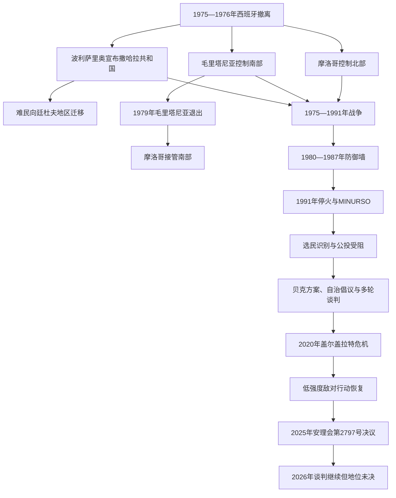

# 西撒哈拉1975年以来的冲突、停火与未决地位

## 时间

1975年—2026年7月14日

## 概括

西班牙没有举行原拟自决公投便撤出西撒哈拉。摩洛哥和毛里塔尼亚依据1975年《马德里原则声明》分别进入北部、南部，波利萨里奥阵线则宣布撒哈拉阿拉伯民主共和国并同时对两国作战。毛里塔尼亚在1979年退出，摩洛哥接管其原控制区。摩洛哥1980—1987年分期修建防御墙，保住阿尤恩、达赫拉、斯马拉、布克拉磷矿和主要沿海人口中心；波利萨里奥退守墙东并以阿尔及利亚廷杜夫附近难民营为政治和社会基地。

1991年停火原与联合国监督的独立／并入选择公投相连，但选民资格、领土最终选项和过渡权力均未谈妥。2020年盖尔盖拉特危机后，波利萨里奥宣布旧停火终止，双方恢复低强度敌对行动。2025年安理会把摩洛哥自治建议明确列为谈判基础，2026年又出现新一轮谈判，但截至7月14日既没有重新建立双方共同遵守的停火，也没有形成最终地位协议。

## 演进图

## 当前政治与实际控制结构

| 参与者／区域 | 主张与法理身份 | 实际权力和治理方式 | 截至2026年7月14日 |
|---|---|---|---|
| 摩洛哥实际控制区 | 摩洛哥称“南部省份”，主张完整主权 | 控制防御墙以西的绝大部分领土、海岸与人口中心；国王、政府、内政部、瓦利和地区议会组成治理链 | 国王穆罕默德六世为最高权威，阿齐兹·阿汉努什任政府首脑 |
| 波利萨里奥／撒哈拉共和国 | 主张全境独立与人民自决；撒哈拉共和国为非盟成员、获部分国家承认 | 声称管理墙东地区；主要政府、教育、配给和社会组织位于廷杜夫附近难民营 | 总统兼波利萨里奥书记卜拉欣·加利，总理布什拉亚·哈穆迪·巴尤恩 |
| MINURSO | 联合国维和及公投任务，不是管理国 | 在墙两侧巡逻、调查射击、排雷、联络并支持政治斡旋；行动受双方安全和通行限制 | 亚历山大·伊万科任任务负责人，授权至2026年10月31日 |
| 联合国政治进程 | 追求相互接受、体现自决的政治方案 | 个人特使分别与摩洛哥、波利萨里奥、阿尔及利亚和毛里塔尼亚磋商 | 斯塔凡·德米斯图拉任个人特使；2026年谈判以摩洛哥自治建议为基础 |
| 阿尔及利亚 | 支持西撒哈拉人民自决和波利萨里奥 | 接纳难民营，提供政治、军事和后勤支持；坚持自身是邻国而非冲突一方 | 是联合国磋商的四个主要参与者之一，与摩洛哥竞争深刻影响进程 |
| 毛里塔尼亚 | 1979年放弃领土主张，正式保持中立 | 管理边境和盖尔盖拉特以南贸易通道，避免重新卷入战争 | 参加联合国磋商并强调地区稳定 |
| 撒哈拉威居民与难民 | 身份和政治选择并不完全一致 | 分处摩洛哥控制区、墙东、廷杜夫营地及海外侨民社会 | 家庭分离、迁徙、就业、资源收益和政治表达条件差异显著 |

完整领导链见[西撒哈拉殖民行政与政治领导人表](/%E4%BA%BA%E6%96%87%E7%A7%91%E5%AD%A6/%E5%8E%86%E5%8F%B2/%E5%8C%97%E9%9D%9E/%E8%A5%BF%E6%92%92%E5%93%88%E6%8B%89/%E8%A5%BF%E6%92%92%E5%93%88%E6%8B%89%E6%AE%96%E6%B0%91%E8%A1%8C%E6%94%BF%E4%B8%8E%E6%94%BF%E6%B2%BB%E9%A2%86%E5%AF%BC%E4%BA%BA%E8%A1%A8.md)。

## 1975—1991年的战争

### 撤离、分割与难民形成

1975年末，摩洛哥军队从北部和东北部推进，毛里塔尼亚军队进入里奥德奥罗南部。西班牙先撤出军队、定居者与行政人员，再于1976年2月通知联合国终止在场。数以万计居民逃向内陆，最终在阿尔及利亚廷杜夫附近形成以原西撒哈拉城镇命名的难民营。逃亡途中发生地面战斗和空袭，平民伤亡、失踪和财产损失成为此后长期记忆政治的一部分。

波利萨里奥在1976年2月27日宣布撒哈拉阿拉伯民主共和国，把武装组织、难民营行政和新国家机构结合起来。其目标从驱逐西班牙转为迫使摩洛哥和毛里塔尼亚撤出；阿尔及利亚成为主要外部支持者，利比亚等国在早期也提供装备和资金。

### 毛里塔尼亚退出

毛里塔尼亚把南部称为“西提里斯”，以达赫拉为中心，但人口、财政和军队规模难以维持漫长沙漠战线。波利萨里奥利用机动纵队攻击铁路、祖埃拉特矿业设施和通向努瓦克肖特的目标，法国一度以空中行动支援毛里塔尼亚。战争成本、经济危机和军中不满促成1978年政变。

1979年8月，毛里塔尼亚同波利萨里奥签署阿尔及尔协议，放弃对西撒哈拉的领土要求并退出战争。摩洛哥军队随即占据毛里塔尼亚撤出的南部。此后军事冲突主要成为摩洛哥与波利萨里奥之间的战争，毛里塔尼亚转向中立和边境安全。

### 防御墙改变战局

早期波利萨里奥依靠熟悉地形、快速袭击和跨边境补给，能威胁分散据点。摩洛哥则有人力、空军和外援优势，却难以守住广阔内陆。1980—1987年，摩洛哥分六个主要阶段修建两千多公里长的沙土防御体系，以雷达、火炮、驻军和大面积雷区包围主要城市、磷矿和交通线。

防御墙使摩洛哥能够集中兵力并显著减少据点被袭，波利萨里奥难再夺取人口中心，战争转为墙线袭扰和消耗。墙东留下人口稀少的地区，由波利萨里奥称为“解放区”；摩洛哥称其为缓冲区或墙东地区。雷区、未爆弹和军事限制切断牧道，也把家庭、墓地和资源空间分隔开。

### 外交战与停火

撒哈拉共和国1982年获准加入非洲统一组织，1984年正式参加会议；摩洛哥随即退出该组织，直到2017年才加入其继承者非洲联盟。战场僵持和财政压力使双方在1988年原则接受联合国—非统组织解决建议：先停火，再确定合格选民，最后在独立和并入摩洛哥之间表决。

安理会1991年第690号决议设立联合国西撒哈拉全民投票特派团。9月6日停火生效，MINURSO部署军事观察员、文职和警察人员，准备交换战俘、释放政治犯、让难民返乡并举行公投。多项过渡措施并未完整实施，任务逐渐从“组织即将举行的公投”转为监测停火和防止再度全面战争。

## 公投为何没有举行

### 选民识别争议

西班牙1974年普查登记约七万四千名本地居民，但游牧路线跨越现代边界，许多亲属未在领土内登记，战争后又出现死亡、流亡和大规模人口迁入。波利萨里奥主张以普查及其可证明的直系后代为核心；摩洛哥要求纳入更多同相关部族有联系的申请者。双方都担心选民范围会预先决定结果。

MINURSO从1990年代中期进行个别听证和部族身份核验，初步名单随即引发大量申诉。1997年休斯敦协议曾重启识别和行为准则谈判，1999年公布的临时资格名单仍未消除争议。识别程序需要双方提交证人、档案和同意，任何一方拒绝合作都足以拖延整个计划。

### 从公投方案到政治折衷

- **2001年第一贝克框架**：提出西撒哈拉在摩洛哥主权下实行有限自治，最终安排没有明确保证独立选项；波利萨里奥和阿尔及利亚拒绝。
- **2003年第二贝克方案**：设过渡自治，数年后由原住民和长期居民参加最终地位公投，选项包括独立；波利萨里奥接受作为谈判基础，摩洛哥拒绝包含独立。
- **2007年摩洛哥自治倡议**：提出在摩洛哥主权和国旗下由地方议会、行政与法院管理内部事务，国防、外交和货币保留给中央；摩洛哥把它视为最终折衷。
- **波利萨里奥方案**：坚持通过含独立选项的自决公投，同时表示独立后可同摩洛哥谈安全、经济和人口保障。
- **2007—2008年曼哈塞特会谈**：双方直接会谈但未缩小核心差距。
- **2018—2019年日内瓦圆桌会议**：摩洛哥、波利萨里奥、阿尔及利亚和毛里塔尼亚恢复共同会晤；个人特使霍斯特·克勒辞职后再度停滞。
- **2021年以后**：德米斯图拉恢复穿梭磋商；摩洛哥坚持只谈自治，波利萨里奥坚持自决必须保留独立结果。

僵局的关键不是缺少方案，而是双方对“谁能投票、有哪些选项、谁在过渡期控制安全、表决结果是否有约束力”没有共同答案。

## 社会、资源与权利争议

### 摩洛哥控制区

摩洛哥投资公路、港口、住房、海水淡化、风能、渔业和城市公共服务，并鼓励来自摩洛哥其他地区的人口迁入。支持者认为发展改善生活并证明地方融入；批评者认为人口结构变化、治安控制和资源政策会预判自决结果。阿尤恩和达赫拉的选举及地区委员会在摩洛哥法律内运作，不能等同于联合国监督的最终地位表决。

2010年，数千人于阿尤恩附近建立格德姆·伊齐克营地，最初集中表达住房、就业和反歧视诉求。11月安全部队拆营后发生严重冲突，撒哈拉威居民和摩洛哥安全人员均有死亡；随后审判、证词和刑罚引发长期人权争议。这一事件显示社会经济诉求、民族身份和治安治理已难以分开。

### 难民营与墙东地区

廷杜夫附近营地由波利萨里奥和撒哈拉共和国机构组织基层区、学校、医疗、配给、法院和群众组织，阿尔及利亚提供领土和安全环境，国际机构提供大量人道援助。长期流亡形成较强公共组织能力，也造成青年就业不足、援助依赖、迁徙受限和代表性争议。人口数字因登记标准和政治立场差异而悬殊，宜说明来源和口径而不使用单一“确定人口”。

墙东地区城镇稀少、基础设施有限，并布有雷区。波利萨里奥举行会议、阅兵和象征性行政活动，摩洛哥则认为这些活动违反缓冲安排。2020年后无人机、远程火力和道路建设进一步压缩传统牧业与民用通行空间。

### 资源与国际司法

布克拉磷矿、近海渔业、可再生能源和潜在油气勘探使“谁有权同意开发、收益是否归当地人民”成为争议核心。摩洛哥主张投资和就业惠及当地人口；波利萨里奥及支持者主张未经西撒哈拉人民同意的协议不能覆盖该领土。

欧盟法院2024年10月判定，2019年欧盟—摩洛哥农业和渔业安排适用于西撒哈拉时没有取得西撒哈拉人民的同意，违反自决和条约相对效力原则；法院同时重申在欧盟法语境中西撒哈拉与摩洛哥是分离、不同的领土。该判决不直接决定最终主权，却影响商品原产地、渔业准入和对外协议的合法性。

联合国2025年报告还指出，人权高专办自2015年以来未获准进入领土进行持续实地访问。摩洛哥国家人权委员会在控制区设有机构；波利萨里奥方面的营地治理同样受到人权、司法独立和异议空间方面的外部质疑。由于长期缺少双方都接受的独立持续监测，具体指控需要区分报告来源。

## 2020年后恢复敌对行动

### 盖尔盖拉特危机

摩洛哥控制区最南端的盖尔盖拉特道路连接达赫拉、毛里塔尼亚和西非市场，穿过1991年军事安排中的缓冲地带。2020年10月，支持波利萨里奥的平民封堵道路，贸易车队滞留。11月13日摩洛哥军队进入缓冲带并修复通道，称行动旨在恢复民用交通；波利萨里奥称其破坏停火并宣布不再受1991年协议约束。

此后波利萨里奥持续报告向防御墙沿线摩洛哥阵地发射火箭和炮弹，摩洛哥则以火炮、空中侦察和无人机打击回应。双方发布的战果难以独立核实。联合国把局势描述为紧张和低强度敌对行动，而不是恢复到1975—1991年的全面机动作战。

### 外交位置变化

美国在2020年承认摩洛哥对西撒哈拉的主权；西班牙2022年转而把摩洛哥自治倡议称为最严肃、现实和可信的基础；法国2024年表示西撒哈拉的现在和未来应处于摩洛哥主权框架内；英国2025年支持自治倡议作为最可信、可行和务实的基础，但没有宣布承认摩洛哥主权。波利萨里奥继续得到阿尔及利亚、部分非洲和拉丁美洲国家支持，撒哈拉共和国仍是非洲联盟成员。

这些双边立场提高了摩洛哥自治方案的外交分量，却没有把联合国非自治领土程序自动终结，也没有使波利萨里奥接受自治。承认、撤回承认、开设领事机构和经贸协议因此成为另一条竞争战线。

### 2025—2026年的联合国进程

2025年10月31日，安理会以11票赞成、3票弃权、阿尔及利亚不参加表决通过第2797号决议，把MINURSO任期延长至2026年10月31日。与早期文本相比，决议更明确要求以摩洛哥自治建议为基础谈判，并称真正自治可能是最可行结果；同时仍要求最终方案相互接受、符合《联合国宪章》并体现西撒哈拉人民自决。该决议没有宣告摩洛哥取得主权，也没有从非自治领土名单移除西撒哈拉。

2026年1—2月，在联合国个人特使与美国共同推动下，各方举行多轮部长级接触；2月23—24日华盛顿会谈深入讨论如何落实第2797号决议，联合国同时强调自决问题仍须处理。5月5日，波利萨里奥在斯马拉附近的火箭袭击引起MINURSO和个人特使公开关切，联合国要求避免危及平民和政治进程。6月德米斯图拉继续访问地区。截至7月14日，谈判仍在进行，没有公布最终协议或恢复停火的共同文件。

## 重要事件

| 时间 | 事件 | 结果与长期影响 |
|---|---|---|
| 1975年末—1976年 | 摩洛哥、毛里塔尼亚进入，西班牙撤离 | 行政真空转成三方战争，大批居民成为难民 |
| 1976年2月27日 | 撒哈拉共和国宣布成立 | 波利萨里奥把民族解放运动转化为国家主张 |
| 1976年6月 | 埃尔-瓦利战死 | 穆罕默德·阿卜杜勒阿齐兹随后建立长期领导 |
| 1978年7月 | 毛里塔尼亚政变 | 战争负担推动政权更替和退战 |
| 1979年8月 | 毛里塔尼亚放弃领土主张 | 摩洛哥接管原毛里塔尼亚控制区 |
| 1980—1987年 | 防御墙分期建成 | 摩洛哥取得防御优势，分区控制固定化 |
| 1982—1984年 | 撒哈拉共和国进入非统组织，摩洛哥退出 | 冲突嵌入非洲区域组织 |
| 1988年 | 双方原则接受联合国—非统组织解决建议 | 停火与公投方案成形 |
| 1991年9月6日 | 停火生效、MINURSO部署 | 全面战争停止，公投任务开始 |
| 1997年 | 休斯敦协议 | 一度重启识别，仍未解决资格争议 |
| 2001—2003年 | 两版贝克方案 | 自治与最终公投的折衷均未获双方接受 |
| 2007年 | 摩洛哥自治倡议和曼哈塞特会谈 | 谈判重心逐渐由执行旧公投转向政治折衷 |
| 2010年 | 格德姆·伊齐克营地及拆营冲突 | 社会经济和民族政治矛盾集中爆发 |
| 2017年 | 摩洛哥重返非洲联盟 | 与撒哈拉共和国在同一组织内并存 |
| 2018—2019年 | 日内瓦圆桌会议 | 四方恢复接触，个人特使辞职后再停 |
| 2020年11月 | 盖尔盖拉特危机 | 1991年停火事实上失效，低强度战事恢复 |
| 2020—2024年 | 多国调整对自治或主权的立场 | 摩洛哥外交优势扩大，最终地位仍未共同解决 |
| 2024年10月 | 欧盟法院裁决 | 对未经西撒哈拉人民同意适用经贸协议设限 |
| 2025年10月 | 安理会第2797号决议 | 自治建议成为明确谈判基础，MINURSO延至2026年10月 |
| 2026年2月 | 华盛顿谈判 | 新框架下恢复深入讨论，但自决与终局仍无协议 |
| 2026年5—6月 | 斯马拉附近袭击与特使地区访问 | 军事升级风险与外交接触同时存在 |

## 长期僵局的原因

### 结构因素

- **终局互斥**：摩洛哥把主权视为不可谈判，只接受主权下自治；波利萨里奥认为没有独立选项就不构成自决。
- **人口与选民问题**：游牧谱系、1974年普查、难民后代和1975年后迁入人口形成彼此不兼容的资格标准。
- **军事不对称**：防御墙让摩洛哥控制人口、港口和资源中心，波利萨里奥难以改变地面格局，却仍有能力维持冲突成本。
- **流亡制度化**：难民营已形成半世纪的政治、教育和社会组织，单纯以经济回迁替代政治协议缺乏可信度。
- **资源和地缘位置**：磷矿、渔业、能源、港口与通往西非的道路提高各方不愿让步的成本。

### 外部压力

- 摩洛哥—阿尔及利亚竞争把领土争议同马格里布领导权、边境封闭和安全政策相连。
- 非洲联盟的撒哈拉共和国席位、联合国的非自治领土议程以及部分国家对摩洛哥自治或主权的支持形成不同制度层次，不能相互自动取代。
- 大国优先维持地区稳定、反恐合作和对摩关系，往往偏向“可行折衷”；支持独立的一方则强调非殖民化和自由表决，两套优先次序长期相撞。

### 直接触发与反复失效

- 1975年行政交接先于公投，造成战争式权力继承。
- 1990年代选民识别把政治分歧转化为无法终结的个案审核。
- 贝克方案与2007年自治倡议都要求一方接受其核心原则的后退，因而只能成为谈判文件。
- 2020年盖尔盖拉特行动把多年累积的不满转成停火破裂；恢复军事压力又没有改变双方基本控制能力。
- 2025年决议改变谈判重心，却仍需摩洛哥、波利萨里奥及关键邻国共同接受，不能单靠安理会措辞完成地位变更。

## 截至2026年7月14日的结论

- 西撒哈拉仍在联合国自1963年维持的非自治领土名单上；联合国名录没有列出新的管理国。
- 摩洛哥实际控制防御墙以西的绝大多数城市、人口与经济设施；这种控制不等于最终主权已获普遍承认。
- 波利萨里奥控制墙东部分地区并领导廷杜夫附近难民营中的撒哈拉共和国机构；其国家主张获部分国家及非洲联盟承认，但不是联合国会员国。
- 1991年设想的公投没有举行。2025年后的谈判更侧重摩洛哥自治建议，同时仍须处理人民自决和相互接受问题。
- 2020年后低强度敌对行动持续，MINURSO努力限制升级；截至核验日没有新的全面停火协议。
- 因而最准确的表述仍是：**实际控制已经长期固定，法理和最终政治地位仍未解决。**

## 演变关系

- 前一阶段：[西属撒哈拉与反殖民运动](/%E4%BA%BA%E6%96%87%E7%A7%91%E5%AD%A6/%E5%8E%86%E5%8F%B2/%E5%8C%97%E9%9D%9E/%E8%A5%BF%E6%92%92%E5%93%88%E6%8B%89/%E8%A5%BF%E5%B1%9E%E6%92%92%E5%93%88%E6%8B%89%E4%B8%8E%E5%8F%8D%E6%AE%96%E6%B0%91%E8%BF%90%E5%8A%A8.md)
- 领导链：[西撒哈拉殖民行政与政治领导人表](/%E4%BA%BA%E6%96%87%E7%A7%91%E5%AD%A6/%E5%8E%86%E5%8F%B2/%E5%8C%97%E9%9D%9E/%E8%A5%BF%E6%92%92%E5%93%88%E6%8B%89/%E8%A5%BF%E6%92%92%E5%93%88%E6%8B%89%E6%AE%96%E6%B0%91%E8%A1%8C%E6%94%BF%E4%B8%8E%E6%94%BF%E6%B2%BB%E9%A2%86%E5%AF%BC%E4%BA%BA%E8%A1%A8.md)
- 上级：[西撒哈拉地区历史](/%E4%BA%BA%E6%96%87%E7%A7%91%E5%AD%A6/%E5%8E%86%E5%8F%B2/%E5%8C%97%E9%9D%9E/%E8%A5%BF%E6%92%92%E5%93%88%E6%8B%89/README.md)
- 直接相关：[摩洛哥历史](/%E4%BA%BA%E6%96%87%E7%A7%91%E5%AD%A6/%E5%8E%86%E5%8F%B2/%E5%8C%97%E9%9D%9E/%E6%91%A9%E6%B4%9B%E5%93%A5/README.md)、[毛里塔尼亚历史](/%E4%BA%BA%E6%96%87%E7%A7%91%E5%AD%A6/%E5%8E%86%E5%8F%B2/%E9%9D%9E%E6%B4%B2/%E8%A5%BF%E9%9D%9E/%E6%AF%9B%E9%87%8C%E5%A1%94%E5%B0%BC%E4%BA%9A/README.md)
- 区域比较：[殖民统治、民族主义与北非独立](/%E4%BA%BA%E6%96%87%E7%A7%91%E5%AD%A6/%E5%8E%86%E5%8F%B2/%E5%8C%97%E9%9D%9E/_%E9%80%9A%E5%8F%B2/%E6%AE%96%E6%B0%91%E7%BB%9F%E6%B2%BB%E3%80%81%E6%B0%91%E6%97%8F%E4%B8%BB%E4%B9%89%E4%B8%8E%E5%8C%97%E9%9D%9E%E7%8B%AC%E7%AB%8B.md)
