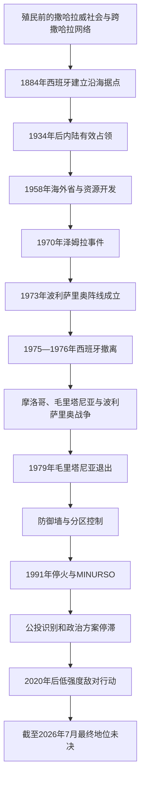

# 西撒哈拉地区历史

## 定位

西撒哈拉位于大西洋东岸与撒哈拉西部。殖民前，这里是连接摩洛哥南部、今毛里塔尼亚、阿尔及利亚西南部与萨赫勒的游牧和商路空间；1884年以后逐步成为西班牙殖民领土。西班牙撤离时没有完成各方认可的自决程序，因而留下战争、难民、分区控制和未决政治地位。

本目录把西撒哈拉作为仍在非殖民化议程中的争议地区处理，不把任何一方的主权主张写成已经获得普遍承认的结论。

## 演进图

## 历史主线

殖民前的社会以亲族、放牧路线、水源、商队和宗教网络组织生活，活动范围跨越后来形成的国界。西班牙最初只控制少数海岸据点，至20世纪30年代才在法军协助和地区权力重组中深入内陆。海外省化、城市化和布克拉磷矿开发加强了领土治理，也促成新的劳工、教育和民族主义网络。

1975—1976年的撤离没有完成原拟公投。摩洛哥和毛里塔尼亚进入原殖民地，波利萨里奥阵线宣布撒哈拉阿拉伯民主共和国并继续作战。1991年停火冻结了主要战线，却没有解决选民资格与最终方案；2020年后双方恢复低强度敌对行动。联合国截至2026年仍把西撒哈拉列为非自治领土。

## 阶段导航

| 顺序 | 阶段 | 时间 | 简要概括 |
|---:|---|---|---|
| 1 | [撒哈拉威社会与跨撒哈拉网络](/%E4%BA%BA%E6%96%87%E7%A7%91%E5%AD%A6/%E5%8E%86%E5%8F%B2/%E5%8C%97%E9%9D%9E/%E8%A5%BF%E6%92%92%E5%93%88%E6%8B%89/%E6%92%92%E5%93%88%E6%8B%89%E5%A8%81%E7%A4%BE%E4%BC%9A%E4%B8%8E%E8%B7%A8%E6%92%92%E5%93%88%E6%8B%89%E7%BD%91%E7%BB%9C.md) | 古代—1884年 | 游牧、绿洲、商路、宗教权威与跨边界亲族网络 |
| 2 | [西属撒哈拉与反殖民运动](/%E4%BA%BA%E6%96%87%E7%A7%91%E5%AD%A6/%E5%8E%86%E5%8F%B2/%E5%8C%97%E9%9D%9E/%E8%A5%BF%E6%92%92%E5%93%88%E6%8B%89/%E8%A5%BF%E5%B1%9E%E6%92%92%E5%93%88%E6%8B%89%E4%B8%8E%E5%8F%8D%E6%AE%96%E6%B0%91%E8%BF%90%E5%8A%A8.md) | 1884年—1976年2月 | 从沿海据点到海外省，民族主义从请愿、示威转向武装斗争 |
| 3 | [1975年以来的冲突、停火与未决地位](/%E4%BA%BA%E6%96%87%E7%A7%91%E5%AD%A6/%E5%8E%86%E5%8F%B2/%E5%8C%97%E9%9D%9E/%E8%A5%BF%E6%92%92%E5%93%88%E6%8B%89/1975%E5%B9%B4%E4%BB%A5%E6%9D%A5%E7%9A%84%E5%86%B2%E7%AA%81%E3%80%81%E5%81%9C%E7%81%AB%E4%B8%8E%E6%9C%AA%E5%86%B3%E5%9C%B0%E4%BD%8D.md) | 1975年—2026年7月14日 | 战争、防御墙、联合国进程、恢复敌对行动与未决地位 |

## 专题表

- [西撒哈拉殖民行政与政治领导人表](/%E4%BA%BA%E6%96%87%E7%A7%91%E5%AD%A6/%E5%8E%86%E5%8F%B2/%E5%8C%97%E9%9D%9E/%E8%A5%BF%E6%92%92%E5%93%88%E6%8B%89/%E8%A5%BF%E6%92%92%E5%93%88%E6%8B%89%E6%AE%96%E6%B0%91%E8%A1%8C%E6%94%BF%E4%B8%8E%E6%94%BF%E6%B2%BB%E9%A2%86%E5%AF%BC%E4%BA%BA%E8%A1%A8.md)：分别列出西班牙殖民行政首脑、反殖民组织领导人、波利萨里奥与撒哈拉共和国领导链、摩洛哥实际治理链和联合国斡旋负责人。

## 重要转折与时间节点

| 时间 | 转折 | 阅读提示 |
|---|---|---|
| 11世纪 | 桑哈贾网络参与穆拉比特运动 | 说明西撒哈拉与马格里布、萨赫勒相连，不等于现代边界内存在统一国家 |
| 1884年 | 西班牙宣布里奥德奥罗沿岸保护范围 | 殖民建制始于海岸，内陆控制晚得多 |
| 1957—1958年 | 伊夫尼—撒哈拉战争 | 军事反殖民、摩洛哥领土主张与法西殖民合作交叠 |
| 1970年 | 泽姆拉抗议遭镇压 | 和平民族主义受挫 |
| 1973年 | 波利萨里奥阵线成立 | 独立运动进入武装斗争 |
| 1975年 | 国际法院意见、绿色进军和《马德里原则声明》 | 自决原则没有被取消，行政撤离却加速 |
| 1979年 | 毛里塔尼亚退出战争与领土主张 | 摩洛哥与波利萨里奥成为主要军事对手 |
| 1980—1987年 | 摩洛哥分期修建防御墙 | 形成延续至今的军事与人口分区 |
| 1991年 | 停火与MINURSO部署 | 公投准备开始，但选民识别长期受阻 |
| 2020年 | 盖尔盖拉特危机后停火失效 | 低强度敌对行动恢复 |
| 2025年 | 安理会第2797号决议 | 以摩洛哥自治建议为谈判基础并延长任务，但没有裁定最终主权 |
| 2026年7月 | 地位仍未解决 | MINURSO任期至2026年10月31日 |

## 关键辨析

- 国际法院1975年意见确认殖民前存在部分效忠、权利和社会联系，但没有认定足以取代当地人民自决的领土主权关系。
- “防御墙以西／以东”是实际控制描述，不是国际公认边界。
- 撒哈拉阿拉伯民主共和国是非洲联盟成员并获部分国家承认，但不是联合国会员国；摩洛哥控制主要城市和绝大多数人口中心，但其主权主张未获普遍承认。
- 联合国名录在西班牙1976年退出后没有列出新的管理国；“实际控制者”“主张方”“谈判方”和“国际法地位”必须分开书写。

## 相关笔记

- 上级：[北非历史](/%E4%BA%BA%E6%96%87%E7%A7%91%E5%AD%A6/%E5%8E%86%E5%8F%B2/%E5%8C%97%E9%9D%9E/README.md)
- 北方联系：[摩洛哥历史](/%E4%BA%BA%E6%96%87%E7%A7%91%E5%AD%A6/%E5%8E%86%E5%8F%B2/%E5%8C%97%E9%9D%9E/%E6%91%A9%E6%B4%9B%E5%93%A5/README.md)
- 南方联系：[毛里塔尼亚历史](/%E4%BA%BA%E6%96%87%E7%A7%91%E5%AD%A6/%E5%8E%86%E5%8F%B2/%E9%9D%9E%E6%B4%B2/%E8%A5%BF%E9%9D%9E/%E6%AF%9B%E9%87%8C%E5%A1%94%E5%B0%BC%E4%BA%9A/README.md)
- 区域网络：[撒哈拉商路、游牧网络与萨赫勒联系](/%E4%BA%BA%E6%96%87%E7%A7%91%E5%AD%A6/%E5%8E%86%E5%8F%B2/%E5%8C%97%E9%9D%9E/_%E9%80%9A%E5%8F%B2/%E6%92%92%E5%93%88%E6%8B%89%E5%95%86%E8%B7%AF%E3%80%81%E6%B8%B8%E7%89%A7%E7%BD%91%E7%BB%9C%E4%B8%8E%E8%90%A8%E8%B5%AB%E5%8B%92%E8%81%94%E7%B3%BB.md)
- 历史总览：[历史](/%E4%BA%BA%E6%96%87%E7%A7%91%E5%AD%A6/%E5%8E%86%E5%8F%B2/README.md)
