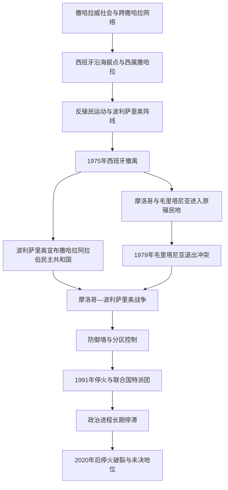

# 西撒哈拉地区历史

## 概括

西撒哈拉位于大西洋沿岸与撒哈拉西部，历史上属于撒哈拉威游牧社会、绿洲和跨撒哈拉商路活动空间。19世纪末西班牙开始建立殖民统治，20世纪反殖民民族主义兴起。1975年西班牙撤离后，摩洛哥、毛里塔尼亚与波利萨里奥阵线围绕领土和自决发生战争。

西撒哈拉的最终政治地位至今未由各方共同接受的安排解决。本目录把它列为“争议地区”而不是无争议主权国家，区分实际控制、领土主张、政治代表和国际非殖民化程序。

## 演进图

## 历史主线

西撒哈拉的社会历史跨越现代边界，与摩洛哥南部、阿尔及利亚西南和[毛里塔尼亚](/%E4%BA%BA%E6%96%87%E7%A7%91%E5%AD%A6/%E5%8E%86%E5%8F%B2/%E9%9D%9E%E6%B4%B2/%E8%A5%BF%E9%9D%9E/%E6%AF%9B%E9%87%8C%E5%A1%94%E5%B0%BC%E4%BA%9A/README.md)北部共享哈桑尼亚语、宗教、亲族与商路联系。殖民边界将流动空间固定为行政领土。去殖民化未能形成获得各方接受的继承安排，因而产生难民营、军事分界线和长期外交争议。

## 阶段导航

| 顺序 | 阶段 | 时间 | 入口 | 简要概括 |
|---:|---|---|---|---|
| 1 | 撒哈拉威社会与跨撒哈拉网络 | 古代—1884年 | [撒哈拉威社会与跨撒哈拉网络](/%E4%BA%BA%E6%96%87%E7%A7%91%E5%AD%A6/%E5%8E%86%E5%8F%B2/%E5%8C%97%E9%9D%9E/%E8%A5%BF%E6%92%92%E5%93%88%E6%8B%89/%E6%92%92%E5%93%88%E6%8B%89%E5%A8%81%E7%A4%BE%E4%BC%9A%E4%B8%8E%E8%B7%A8%E6%92%92%E5%93%88%E6%8B%89%E7%BD%91%E7%BB%9C.md) | 游牧、绿洲、部族联盟、宗教网络和商队路线 |
| 2 | 西属撒哈拉与反殖民运动 | 1884—1975年 | [西属撒哈拉与反殖民运动](/%E4%BA%BA%E6%96%87%E7%A7%91%E5%AD%A6/%E5%8E%86%E5%8F%B2/%E5%8C%97%E9%9D%9E/%E8%A5%BF%E6%92%92%E5%93%88%E6%8B%89/%E8%A5%BF%E5%B1%9E%E6%92%92%E5%93%88%E6%8B%89%E4%B8%8E%E5%8F%8D%E6%AE%96%E6%B0%91%E8%BF%90%E5%8A%A8.md) | 西班牙殖民建制、资源开发和民族解放组织形成 |
| 3 | 冲突、停火与未决地位 | 1975年至今 | [1975年以来的冲突、停火与未决地位](/%E4%BA%BA%E6%96%87%E7%A7%91%E5%AD%A6/%E5%8E%86%E5%8F%B2/%E5%8C%97%E9%9D%9E/%E8%A5%BF%E6%92%92%E5%93%88%E6%8B%89/1975%E5%B9%B4%E4%BB%A5%E6%9D%A5%E7%9A%84%E5%86%B2%E7%AA%81%E3%80%81%E5%81%9C%E7%81%AB%E4%B8%8E%E6%9C%AA%E5%86%B3%E5%9C%B0%E4%BD%8D.md) | 战争、防御墙、联合国进程及持续政治争议 |

## 重要转折与时间节点

| 时间 | 事件 | 意义 |
|---|---|---|
| 11世纪以后 | 桑哈贾网络、穆拉比特运动和后续阿拉伯化 | 西撒哈拉与摩洛哥、毛里塔尼亚及萨赫勒联系加强 |
| 1884年 | 西班牙宣布沿海保护范围 | 殖民领土建制开始 |
| 1958年 | 西属撒哈拉被改为西班牙海外省 | 西班牙加强行政与资源控制 |
| 1970年 | 泽姆拉抗议遭镇压 | 现代撒哈拉威反殖民政治的重要节点 |
| 1973年 | 波利萨里奥阵线成立 | 武装民族解放运动形成 |
| 1975年 | 国际法院咨询意见、绿色进军与《马德里协定》 | 西班牙撤离及后续主权争议的关键转折 |
| 1976年 | 西班牙结束统治，波利萨里奥宣布撒哈拉阿拉伯民主共和国 | 冲突进入国家主张和战争阶段 |
| 1979年 | 毛里塔尼亚退出战争和领土主张 | 摩洛哥与波利萨里奥成为主要军事对手 |
| 1991年 | 停火和联合国西撒哈拉全民投票特派团部署 | 武装冲突冻结，自决安排未能完成 |
| 2020年 | 停火破裂 | 低强度敌对行动恢复，政治地位仍未解决 |

## 关键辨析

- 摩洛哥主张对西撒哈拉拥有主权并控制大部分人口中心；波利萨里奥阵线主张独立并宣布撒哈拉阿拉伯民主共和国。陈述任何一方立场都不等于确认最终主权。
- 1975年国际法院咨询意见讨论了部分效忠关系，但没有取消当地人民通过自决决定政治地位的原则。
- “防御墙以西／以东”描述实际控制格局，不代表国际法上的最终边界。
- 难民营主要位于阿尔及利亚廷杜夫附近，其人口、政治组织与西撒哈拉领土内居民处于不同治理环境。

## 相关笔记

- 上级：[北非历史](/%E4%BA%BA%E6%96%87%E7%A7%91%E5%AD%A6/%E5%8E%86%E5%8F%B2/%E5%8C%97%E9%9D%9E/README.md)
- 相关国家：[摩洛哥](/%E4%BA%BA%E6%96%87%E7%A7%91%E5%AD%A6/%E5%8E%86%E5%8F%B2/%E5%8C%97%E9%9D%9E/%E6%91%A9%E6%B4%9B%E5%93%A5/README.md)、[毛里塔尼亚](/%E4%BA%BA%E6%96%87%E7%A7%91%E5%AD%A6/%E5%8E%86%E5%8F%B2/%E9%9D%9E%E6%B4%B2/%E8%A5%BF%E9%9D%9E/%E6%AF%9B%E9%87%8C%E5%A1%94%E5%B0%BC%E4%BA%9A/README.md)
- 区域网络：[撒哈拉商路、游牧网络与萨赫勒联系](/%E4%BA%BA%E6%96%87%E7%A7%91%E5%AD%A6/%E5%8E%86%E5%8F%B2/%E5%8C%97%E9%9D%9E/_%E9%80%9A%E5%8F%B2/%E6%92%92%E5%93%88%E6%8B%89%E5%95%86%E8%B7%AF%E3%80%81%E6%B8%B8%E7%89%A7%E7%BD%91%E7%BB%9C%E4%B8%8E%E8%90%A8%E8%B5%AB%E5%8B%92%E8%81%94%E7%B3%BB.md)

## 目录层级

- 直接上级：[北非](/%E4%BA%BA%E6%96%87%E7%A7%91%E5%AD%A6/%E5%8E%86%E5%8F%B2/%E5%8C%97%E9%9D%9E/README.md)
- 历史总览：[历史](/%E4%BA%BA%E6%96%87%E7%A7%91%E5%AD%A6/%E5%8E%86%E5%8F%B2/README.md)
