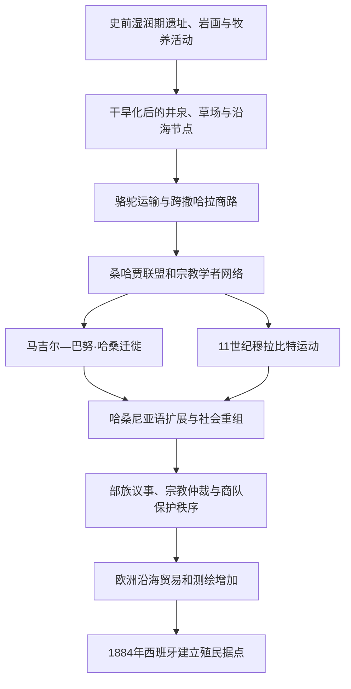

# 西撒哈拉的撒哈拉威社会与跨撒哈拉网络

## 时间

古代—1884年

## 概括

殖民划界以前，今西撒哈拉不是由一条固定国界包围的单一政治体，而是大西洋渔场、季节性草场、盐地、井泉、绿洲和商队路线组成的流动空间。桑哈贾阿马齐格群体、后来进入西部撒哈拉的马吉尔—巴努·哈桑阿拉伯支系、宗教家族、手工业者、附属劳动群体和被奴役者长期混合，逐渐形成以哈桑尼亚阿拉伯语、马立克派伊斯兰教和跨地区亲族关系为主要特征的比丹—撒哈拉威社会。

“撒哈拉威”作为现代民族政治身份主要在殖民统治、城市化、反殖民动员与流亡经历中进一步凝聚，因此不能把19世纪以前的所有居民机械视为已经拥有同一现代民族身份。

## 演进图

## 地理与经济基础

- **生态节律**：降雨不稳定，草场和井泉的可用性随季节变化。家族与部族拥有约定俗成的水源、牧道和停驻权，但权利往往交叠，并通过协商、保护、联盟或冲突调整。
- **牧养与驮运**：骆驼适合长距离运输，也提供肉、奶、毛与军事机动力；山羊和绵羊用于较短距离放牧。牲畜既是财富，也是婚姻、赔偿和政治结盟的媒介。
- **跨撒哈拉贸易**：商队把摩洛哥南部和西撒哈拉同伊吉勒盐矿、欣盖提—瓦丹绿洲、塞内加尔河谷及更东部市场相连，交换盐、黄金、谷物、布匹、牲畜、树胶和奴隶。
- **大西洋沿岸**：渔捞、海盐、贝类采集和季节性营地补充内陆经济。15世纪以后伊比利亚和加那利群岛商人、渔民与捕奴者增加沿岸活动，但在很长时间内难以控制内陆。
- **宗教与知识**：古兰经教育、法学、谱系和诗歌由宗教学者与扎维耶网络传播。朝觐和求学路线把地方社会接入马格里布、廷巴克图和更广阔的伊斯兰世界。

## 社会与政治结构

| 层次或组织 | 主要职能 | 需要辨析 |
|---|---|---|
| 支系、部族与联盟 | 亲族认同、资源使用、防卫、赔偿和迁徙协作 | 成员关系可因婚姻、庇护、收养与政治选择改变，并非封闭“种族” |
| 杰马阿议事会 | 由有声望的成年男性协商迁徙、战争、赔偿和对外关系 | 权力依赖共识和声望，不是固定官僚政府 |
| 战士支系（哈桑） | 武装护卫、征收保护贡、争夺商路和牧场 | “阿拉伯血统”常同时是一种政治地位主张 |
| 宗教支系（扎维耶／马拉布特） | 教育、司法仲裁、调停、宗教声望与贸易信用 | 有些宗教群体也拥有武力和商业资本，类别并非绝对 |
| 贡属与专业群体 | 放牧、渔业、金属与皮革工艺、音乐和服务劳动 | 殖民文献常把复杂身份固化为“等级”，实际流动更大 |
| 哈拉廷、获释者与被奴役者 | 绿洲农业、家内生产、牧养和其他劳动 | 奴役及其后代身份构成长期不平等，不能用“传统分工”淡化 |
| 四十人会议等跨部族传统 | 在战争或共同危机中协调部族 | 其具体年代、成员和制度化程度在口述传统与后世政治叙述中存在争议 |
| 宗教领袖和圣裔家族 | 以学问、祝福、调停和远距追随者形成权威 | 权威可跨越现代边界，不等同于领土国家主权 |

## 形成与演变

### 史前与古代环境

西撒哈拉保存石器地点、岩画、墓冢和古湖泊痕迹，显示撒哈拉并非始终像今天一样干旱。随着全新世后期持续干旱化，人口更依赖沿海资源、间歇河谷和井泉。腓尼基—迦太基、罗马及北非沿岸贸易可能间接影响大西洋南段，但现有证据不足以把今西撒哈拉写成其稳定行政领土。

### 桑哈贾网络与穆拉比特运动

中世纪早期，莱姆图纳、古达拉、马苏法等桑哈贾群体控制或参与西部撒哈拉多条商路。11世纪的宗教改革和军事结盟形成穆拉比特运动，随后向北建立马拉喀什政权并进入安达卢斯，向南影响加纳王国周边贸易。该运动说明沙漠群体可以塑造跨区域帝国，但其统治范围和中心不断变化，不能倒推为现代西撒哈拉边界内的连续国家。

### 阿拉伯化与哈桑尼亚社会

约13世纪以后，马吉尔联盟中的巴努·哈桑支系逐渐进入摩洛哥南部和西部撒哈拉，与桑哈贾群体发生战争、结盟和通婚。1644—1674年的沙尔·布巴战争主要发生在今毛里塔尼亚西南部，却强化了更广阔西部撒哈拉的战士—宗教—贡属秩序和哈桑尼亚语优势。阿拉伯化是数百年的社会过程，而非一次取代原居民的单一征服。

### 多中心权威与邻接政权

部族首领、杰马阿、宗教家族和临时联盟承担政治功能。北部部分特克纳等群体曾在特定时期向摩洛哥苏丹宣誓效忠或接受任命，其他群体则更接近比拉德·欣盖提网络，瑞吉巴特等大部族保持很强自主性。效忠通常针对个人、支系和路线，强度随时局变化；它不等于近代意义上对整片固定领土实行连续行政。

1975年国际法院回看这一历史时，确认殖民前并非“无主地”，也确认摩洛哥苏丹与部分部族及所谓毛里塔尼亚实体之间存在法律联系；法院同时认定这些材料没有证明足以取消人民自决的领土主权关系。

### 沿海竞争与殖民入口

15—19世纪，葡萄牙、西班牙、英国、荷兰和加那利商人先后尝试在沿岸捕鱼、贸易或建立短暂据点。地方群体既交易，也袭击或驱逐外来者。19世纪后期，欧洲列强以测绘、商社和国际会议把季节性接触转成正式领土主张；1884年西班牙在里奥德奥罗设点，开启从海岸据点向殖民领土的漫长转变。

## 重要事件与过程

| 时间 | 事件或过程 | 具体影响 |
|---|---|---|
| 史前—古代 | 湿润与干旱周期反复 | 聚落和牧养活动逐步集中于井泉、谷地、绿洲与海岸 |
| 约1千纪 | 骆驼运输普及 | 大幅降低长途穿越成本，商队与游牧机动增强 |
| 8—10世纪 | 伊斯兰教和马立克派法学传播 | 宗教学者、商人和亲族网络形成跨地区共同语汇 |
| 11世纪 | 桑哈贾群体参与穆拉比特运动 | 西部撒哈拉第一次深刻影响马格里布与安达卢斯政治 |
| 13—17世纪 | 巴努·哈桑迁入与长期阿拉伯化 | 哈桑尼亚语、阿拉伯谱系和战士政治地位扩大 |
| 1644—1674年 | 沙尔·布巴战争 | 以今毛里塔尼亚为中心的权力重组波及西部撒哈拉社会 |
| 18—19世纪 | 宗教家族、商队和部族联盟扩展 | 形成跨今摩洛哥、毛里塔尼亚、阿尔及利亚和西撒哈拉的流动网络 |
| 19世纪 | 欧洲渔业、商社和测绘增加 | 海岸从贸易边缘逐渐变成帝国竞争对象 |
| 1884年 | 西班牙在里奥德奥罗沿岸宣布保护范围 | 流动权利开始被殖民地图和行政边界重新定义 |

## 从流动秩序到殖民划界

- **结构因素**：人口稀疏、生态波动和长距离迁徙使中央官僚统治成本很高，地方权威因而保持多中心。
- **内部变化**：哈桑尼亚语和伊斯兰学术网络提供共同文化，但部族路线、保护关系和社会等级仍造成竞争与不平等。
- **外部压力**：欧洲海上力量、枪械贸易、测绘和非洲殖民竞争改变了沿岸力量平衡。
- **直接转折**：西班牙在1884年以地方协议和海岸据点提出保护主张，随后通过国际条约把未实际控制的内陆也画入殖民边界。

## 演变关系

- 上级：[西撒哈拉地区历史](/%E4%BA%BA%E6%96%87%E7%A7%91%E5%AD%A6/%E5%8E%86%E5%8F%B2/%E5%8C%97%E9%9D%9E/%E8%A5%BF%E6%92%92%E5%93%88%E6%8B%89/README.md)
- 后一阶段：[西属撒哈拉与反殖民运动](/%E4%BA%BA%E6%96%87%E7%A7%91%E5%AD%A6/%E5%8E%86%E5%8F%B2/%E5%8C%97%E9%9D%9E/%E8%A5%BF%E6%92%92%E5%93%88%E6%8B%89/%E8%A5%BF%E5%B1%9E%E6%92%92%E5%93%88%E6%8B%89%E4%B8%8E%E5%8F%8D%E6%AE%96%E6%B0%91%E8%BF%90%E5%8A%A8.md)
- 北方联系：[摩洛哥历史](/%E4%BA%BA%E6%96%87%E7%A7%91%E5%AD%A6/%E5%8E%86%E5%8F%B2/%E5%8C%97%E9%9D%9E/%E6%91%A9%E6%B4%9B%E5%93%A5/README.md)
- 南方联系：[毛里塔尼亚历史](/%E4%BA%BA%E6%96%87%E7%A7%91%E5%AD%A6/%E5%8E%86%E5%8F%B2/%E9%9D%9E%E6%B4%B2/%E8%A5%BF%E9%9D%9E/%E6%AF%9B%E9%87%8C%E5%A1%94%E5%B0%BC%E4%BA%9A/README.md)
- 区域专题：[撒哈拉商路、游牧网络与萨赫勒联系](/%E4%BA%BA%E6%96%87%E7%A7%91%E5%AD%A6/%E5%8E%86%E5%8F%B2/%E5%8C%97%E9%9D%9E/_%E9%80%9A%E5%8F%B2/%E6%92%92%E5%93%88%E6%8B%89%E5%95%86%E8%B7%AF%E3%80%81%E6%B8%B8%E7%89%A7%E7%BD%91%E7%BB%9C%E4%B8%8E%E8%90%A8%E8%B5%AB%E5%8B%92%E8%81%94%E7%B3%BB.md)
