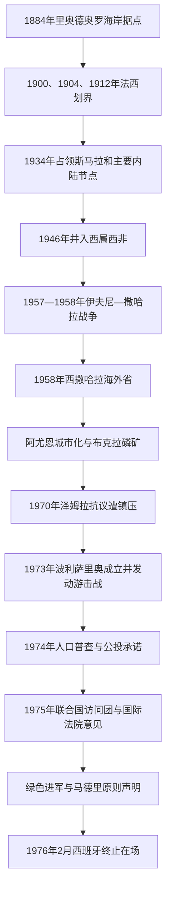

# 西属撒哈拉与反殖民运动

## 时间

1884年—1976年2月26日

## 概括

西班牙在1884年以里奥德奥罗海岸据点和同当地首领签订的协议提出“保护”主张，但约半个世纪内主要只能守住达赫拉等沿海站点。1900、1904和1912年的法西条约在地图上划定边界；真正深入萨基亚哈姆拉和内陆，要到1934年西班牙与法属西非协同行动以后。

1950年代以后，伊夫尼—撒哈拉战争、海外省化、阿尤恩城市建设和布克拉磷矿开发把流动社会更深地纳入殖民国家。教育、工资劳动和城市聚居又促成跨部族政治组织。西班牙先压制巴西里领导的和平民族主义，继而面对波利萨里奥游击战和联合国非殖民化压力。1975—1976年的仓促撤离没有举行原拟自决公投，殖民统治因此终结，非殖民化问题却没有完成。

## 演进图

## 殖民权力结构

| 阶段 | 最高与地方权力 | 管理方式 | 局限 |
|---|---|---|---|
| 海岸据点期（1884—1912） | 西班牙王国、加那利群岛军政机关、里奥德奥罗王室专员／副总督 | 商站、要塞、地方协议和海军补给 | 控制范围很少越出海岸，名义边界大于有效统治 |
| 南部保护区与撒哈拉代表期（1912—1946） | 西属摩洛哥高级专员及其南部代表 | 分区军政、部族中介、逐步占领拉古维拉和内陆 | 游牧路线跨越法西边界，地方抵抗与补给困难持续 |
| 西属西非期（1946—1958） | 西属西非总督 | 西撒哈拉、伊夫尼和朱比角一度合并管理 | 1957—1958年战争暴露殖民军力和合法性危机 |
| 海外省期（1958—1976） | 西班牙国家元首、中央殖民事务机关、撒哈拉总督 | 省、区、部族代表议会、警察与军队；扩大城市和矿业 | “省化”不能消除联合国所认定的非自治领土地位 |
| 地方代表机构 | 1967年成立的杰马阿、地方议会和科尔特斯代表 | 通过经认可的部族显贵提供有限咨询和代表 | 议程、人选与财政受殖民当局控制，不是自由决定地位的机构 |
| 反殖民组织 | 哈拉卡特·塔赫里尔、波利萨里奥以及短暂存在的其他组织 | 请愿、秘密组织、群众示威、游击战和外交动员 | 组织之间对独立、自治或并入邻国的选择并不相同 |

历任殖民行政首脑、主要反殖民领导人与1976年后的领导链见[西撒哈拉殖民行政与政治领导人表](/%E4%BA%BA%E6%96%87%E7%A7%91%E5%AD%A6/%E5%8E%86%E5%8F%B2/%E5%8C%97%E9%9D%9E/%E8%A5%BF%E6%92%92%E5%93%88%E6%8B%89/%E8%A5%BF%E6%92%92%E5%93%88%E6%8B%89%E6%AE%96%E6%B0%91%E8%A1%8C%E6%94%BF%E4%B8%8E%E6%94%BF%E6%B2%BB%E9%A2%86%E5%AF%BC%E4%BA%BA%E8%A1%A8.md)。

## 殖民建立与扩张

### 从海岸声明到条约划界（1884—1934）

1884年埃米利奥·博内利在里奥德奥罗湾建立维拉西斯内罗斯（今达赫拉）据点，西班牙随后向欧洲列强通报保护范围。与法国签订的1900、1904和1912年协定划定了里奥德奥罗、萨基亚哈姆拉及邻近朱比角的边界；这些直线切断了原有牧道，却没有立即带来行政占领。

西班牙依靠海军补给和少数土著辅助部队维持据点。1916年占领朱比角，1920年在南端拉古维拉驻军。内陆的瑞吉巴特、乌拉德·德利姆等群体仍可在法西边界两侧行动，袭击据点或同殖民者谈判。1934年，在法国压缩毛里塔尼亚和阿尔及利亚方向游牧武装空间的背景下，西班牙进入斯马拉等内陆地点，殖民边界才开始成为较稳定的行政现实。

### 西属西非、战争与海外省化（1946—1963）

1946年西班牙把伊夫尼、朱比角和西撒哈拉领地组合为西属西非。1956年摩洛哥独立后，摩洛哥解放军南部支队与多支撒哈拉武装攻击西班牙据点，诉求混合了反殖民、撒哈拉地方自主和“大摩洛哥”统一主张。1957年末至1958年初，战事波及阿尤恩、斯马拉与埃切拉；西班牙和法国以“特德—埃库维永”联合行动清剿武装。西班牙保住西撒哈拉，1958年把朱比角交给摩洛哥，并把萨基亚哈姆拉、里奥德奥罗合为“撒哈拉省”。

省化给予部分居民西班牙身份证明、地方席位和公共服务，却仍由军政总督控制。西班牙最初否认这里是殖民地；联合国在1963年把西撒哈拉列入非自治领土名单，联大自1965年起要求非殖民化，1966年明确要求在联合国监督下通过当地原住民自由表达意愿。

### 城市、矿业与社会重组

阿尤恩成为行政首府，达赫拉、斯马拉和布阿克拉发展为军政或矿业节点。殖民当局招募撒哈拉威人进入游牧部队、警察和基层行政，也扩大寄宿教育、医疗和配给体系。定居并非完全自愿：干旱、工资机会、军政控制和传统牧业受限共同推动人口向城市集中。

布克拉大型磷酸盐矿在20世纪中期勘探后进入开发，长距离传送带把矿石送往阿尤恩附近港口，1970年代初开始出口。矿业提高了西班牙保留领土的经济动机，也形成工人集中、收入差异和土地资源政治。渔业、港口与潜在油气资源同样使去殖民化卷入邻国和外部力量的战略计算。

## 反殖民运动的形成

### 巴西里与泽姆拉事件

穆罕默德·西迪·卜拉欣·巴西里在1960年代后期组织“萨基亚哈姆拉和里奥德奥罗解放运动”，常称哈拉卡特·塔赫里尔。该组织跨越部族召集城市青年、工人与地方显贵，主张结束殖民统治，初期侧重请愿、组织教育和和平示威。

1970年6月17日，运动在阿尤恩泽姆拉区集会，向总督提交政治诉求。西班牙外籍军团驱散人群并开火，造成死伤；巴西里被捕后失踪，其确切结局未获交代。镇压瓦解了公开组织，却使一批青年认定有限请愿无法迫使西班牙撤离。

### 波利萨里奥与武装斗争

1973年5月10日，来自西撒哈拉、摩洛哥南部、毛里塔尼亚和流亡学生圈的活动者成立“萨基亚哈姆拉和里奥德奥罗人民解放阵线”，简称波利萨里奥。5月20日袭击汉加西班牙哨所后，组织通过夺取武器、袭击巡逻队和破坏运输逐步扩大。它强调统一各部族、建立独立国家，并争取阿尔及利亚、利比亚和非洲非殖民化力量支持。

西班牙试图以1974年成立的撒哈拉民族联盟党和有限自治方案分流独立诉求，但成效有限。1975年联合国访问团在主要城镇、营地及邻国接触各方后，观察到当地明显支持独立，波利萨里奥是最有影响力的群众组织；殖民当局扶持的政党迅速瓦解。

## 1974—1976年的撤离过程

1. **人口普查与公投承诺**：西班牙1974年完成普查，登记约七万四千名本地居民，原拟以此为选民基础举行公投。摩洛哥和毛里塔尼亚反对在其历史主张未审理前直接表决。
2. **国际法院咨询意见**：1975年10月16日，法院认定1884年当地并非“无主地”，承认摩洛哥苏丹同部分部族之间的效忠联系，以及所谓毛里塔尼亚实体同当地部族之间的若干权利联系；但没有发现足以影响自决原则的领土主权关系。
3. **绿色进军与军事进入**：11月6日，摩洛哥组织约三十五万名平民越过边境展开“绿色进军”，以政治和后勤压力迫使西班牙谈判；摩洛哥军队也在北部、东北部推进。西班牙避免正面战争并加快“燕子行动”撤运军民。
4. **《马德里原则声明》**：11月14日，西班牙、摩洛哥和毛里塔尼亚约定建立临时三方行政安排，北部由摩洛哥、南部由毛里塔尼亚接管。文本处理的是行政责任和经济安排，没有举行当地人民表决，也没有使领土主权获得联合国确认。
5. **殖民统治的直接终结**：1976年2月26日，西班牙通知联合国已结束在领土内的存在并自认不再承担行政责任。联合国没有把摩洛哥或毛里塔尼亚列为新管理国；次日波利萨里奥宣布撒哈拉阿拉伯民主共和国，战争和难民危机全面展开。

## 重要事件

| 时间 | 事件 | 过程与影响 |
|---|---|---|
| 1884年11—12月 | 维拉西斯内罗斯据点与西班牙保护声明 | 殖民主张从海岸商站起步 |
| 1900、1904、1912年 | 法国与西班牙划界 | 现代领土轮廓形成，但有效占领仍有限 |
| 1916—1920年 | 朱比角与拉古维拉驻军 | 西班牙沿岸链条南北延伸 |
| 1934年 | 斯马拉等内陆节点被占领 | 殖民统治由海岸向内陆推进 |
| 1946年 | 西属西非成立 | 西撒哈拉与伊夫尼、朱比角合并管理 |
| 1957—1958年 | 伊夫尼—撒哈拉战争 | 法西联合反攻保住西撒哈拉，反殖民和领土主张交叠 |
| 1958年 | “撒哈拉省”成立 | 海外省化强化军政、定居和代表制度 |
| 1963—1966年 | 联合国列入非自治领土并要求公投 | 西班牙“国内省”论述未获联合国接受 |
| 1967年 | 杰马阿成立 | 殖民当局建立受控的地方咨询机构 |
| 1970年6月17日 | 泽姆拉抗议遭镇压 | 巴西里失踪，和平民族主义受挫 |
| 1973年5月 | 波利萨里奥成立并首度袭击 | 武装独立运动形成 |
| 1974年 | 普查、公投承诺与亲西班牙政党 | 自决准备与殖民控制同步推进 |
| 1975年5月 | 联合国访问团调查 | 记录到显著独立诉求和波利萨里奥影响 |
| 1975年10月16日 | 国际法院咨询意见 | 历史联系未取代自由、真实表达意愿的自决原则 |
| 1975年11月6日 | 绿色进军 | 西班牙面临直接政治和安全压力 |
| 1975年11月14日 | 《马德里原则声明》 | 行政接管安排取代未完成的公投 |
| 1976年2月26日 | 西班牙终止在场 | 殖民行政结束，最终地位和继承权力未获共同解决 |

## 殖民统治终结的原因

- **结构因素**：领土广阔、人口分散和补给成本高；“海外省”身份与全球非殖民化规范冲突；城市化反而为跨部族政治动员提供空间。
- **资源与内部矛盾**：磷矿增加领土价值，却使谁有权决定资源收益成为政治核心。受控代表机构无法容纳独立诉求，镇压又推动运动转向地下和武装化。
- **外部压力**：联合国、非洲国家和邻国主张相互叠加；摩洛哥与毛里塔尼亚的领土要求、阿尔及利亚支持自决和马格里布竞争使西班牙难以单独安排过渡。
- **直接触发**：波利萨里奥军事压力、国际法院意见、绿色进军以及佛朗哥病危下的西班牙政权过渡共同促成仓促撤离。
- **为何非殖民化未完成**：西班牙把行政交接置于公投之前，《马德里原则声明》又没有产生各方共同接受的主权继承者，军事力量随即填补行政真空。

## 演变关系

- 前一阶段：[撒哈拉威社会与跨撒哈拉网络](/%E4%BA%BA%E6%96%87%E7%A7%91%E5%AD%A6/%E5%8E%86%E5%8F%B2/%E5%8C%97%E9%9D%9E/%E8%A5%BF%E6%92%92%E5%93%88%E6%8B%89/%E6%92%92%E5%93%88%E6%8B%89%E5%A8%81%E7%A4%BE%E4%BC%9A%E4%B8%8E%E8%B7%A8%E6%92%92%E5%93%88%E6%8B%89%E7%BD%91%E7%BB%9C.md)
- 后一阶段：[1975年以来的冲突、停火与未决地位](/%E4%BA%BA%E6%96%87%E7%A7%91%E5%AD%A6/%E5%8E%86%E5%8F%B2/%E5%8C%97%E9%9D%9E/%E8%A5%BF%E6%92%92%E5%93%88%E6%8B%89/1975%E5%B9%B4%E4%BB%A5%E6%9D%A5%E7%9A%84%E5%86%B2%E7%AA%81%E3%80%81%E5%81%9C%E7%81%AB%E4%B8%8E%E6%9C%AA%E5%86%B3%E5%9C%B0%E4%BD%8D.md)
- 行政与领导链：[西撒哈拉殖民行政与政治领导人表](/%E4%BA%BA%E6%96%87%E7%A7%91%E5%AD%A6/%E5%8E%86%E5%8F%B2/%E5%8C%97%E9%9D%9E/%E8%A5%BF%E6%92%92%E5%93%88%E6%8B%89/%E8%A5%BF%E6%92%92%E5%93%88%E6%8B%89%E6%AE%96%E6%B0%91%E8%A1%8C%E6%94%BF%E4%B8%8E%E6%94%BF%E6%B2%BB%E9%A2%86%E5%AF%BC%E4%BA%BA%E8%A1%A8.md)
- 上级：[西撒哈拉地区历史](/%E4%BA%BA%E6%96%87%E7%A7%91%E5%AD%A6/%E5%8E%86%E5%8F%B2/%E5%8C%97%E9%9D%9E/%E8%A5%BF%E6%92%92%E5%93%88%E6%8B%89/README.md)
- 区域比较：[殖民统治、民族主义与北非独立](/%E4%BA%BA%E6%96%87%E7%A7%91%E5%AD%A6/%E5%8E%86%E5%8F%B2/%E5%8C%97%E9%9D%9E/_%E9%80%9A%E5%8F%B2/%E6%AE%96%E6%B0%91%E7%BB%9F%E6%B2%BB%E3%80%81%E6%B0%91%E6%97%8F%E4%B8%BB%E4%B9%89%E4%B8%8E%E5%8C%97%E9%9D%9E%E7%8B%AC%E7%AB%8B.md)
