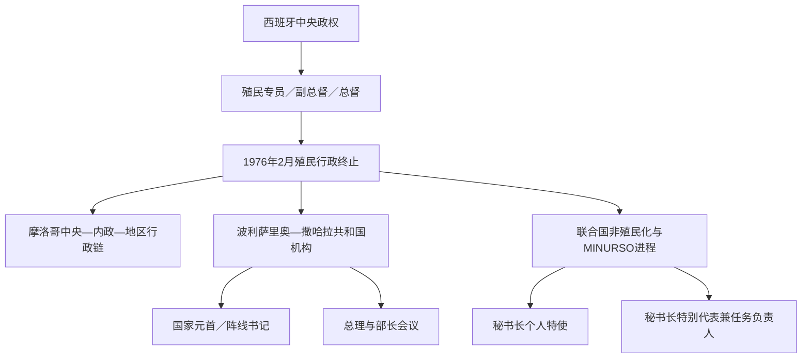

# 西撒哈拉殖民行政与政治领导人表

## 范围与读法

本表把不同性质的权力链分开：

- 西班牙殖民行政首脑是受马德里或西属摩洛哥高级专员节制的官员，不是当地君主。
- 1976年以后，摩洛哥实际控制区服从摩洛哥国王、中央政府与内政系统；当地没有独立国家元首。
- 波利萨里奥阵线书记、撒哈拉阿拉伯民主共和国国家元首和政府总理是相互关联但职能不同的职位。
- 联合国个人特使、MINURSO负责人和部队司令承担斡旋、任务管理与军事观察，不是领土统治者。
- 日期以正式正职和可确认的代理为主。西班牙早期档案对交接日偶有数日差异，表内以年月或“约”标示，不虚构精确日期。

## 权力链示意

## 西班牙殖民行政首脑（1884—1976）

1884—1940年的驻地主要在维拉西斯内罗斯，1940年以后重心转到阿尤恩。机构依次由加那利群岛军政机关、西属摩洛哥高级专员、伊夫尼—撒哈拉政府、西属西非政府及西班牙中央政府节制。下表按任职先后列出可确认的主要正职；同一人在机构更名后连续任职时合并为一行。

| 顺序 | 姓名 | 任期 | 职称与关键说明 |
|---:|---|---|---|
| 1 | **埃米利奥·博内利**（Emilio Bonelli） | 1884年11月—约1902年 | 先任据点指挥官、王室专员，1887年后任里奥德奥罗军政副总督；建立维拉西斯内罗斯 |
| 2 | 安赫尔·比利亚洛沃斯（Ángel Villalobos） | 约1902年—1903年12月 | 里奥德奥罗军政副总督 |
| 3 | **弗朗西斯科·本斯·阿尔甘多尼亚**（Francisco Bens Argandoña） | 1903年12月—1925年11月 | 先任副总督，1913年后任南部区高级专员代表；任内占领朱比角、推进拉古维拉驻军 |
| 4 | 吉列尔莫·德拉佩尼亚·库西（Guillermo de la Peña Cusi） | 1925年11月—1932年6月 | 西属摩洛哥南部区代表 |
| 5 | 爱德华多·卡尼萨雷斯·纳瓦罗（Eduardo Cañizares Navarro） | 1932年6月—1933年8月 | 南部区代表 |
| 6 | 何塞·冈萨雷斯·德莱托（José González Deleito） | 1933年8月—1934年7月 | 南部区代表 |
| 7 | **贝尼尼奥·马丁内斯·波蒂略**（Benigno Martínez Portillo） | 1934年7月—1936年5月 | 先任南部区代表，后任撒哈拉政府代表；1934年内陆占领期主官 |
| 8 | 卡洛斯·佩德蒙特·萨宾（Carlos Pedemonte Sabín） | 1936年5月—8月 | 撒哈拉政府代表；西班牙内战爆发时任职 |
| 9 | 拉斐尔·加列戈·赛恩斯（Rafael Gallego Sainz） | 1936年8月—1937年3月 | 撒哈拉政府代表 |
| 10 | **安东尼奥·德奥罗·普利多**（Antonio de Oro Pulido） | 1937年3月—1940年5月 | 撒哈拉政府代表；任内阿尤恩成为固定殖民城市节点 |
| 11 | 何塞·贝尔梅霍·洛佩斯（José Bermejo López） | 1940年5月—1949年8月 | 先任伊夫尼—撒哈拉军政总督，1946年后任西属西非总督 |
| 12 | 弗朗西斯科·罗萨莱尼·布尔格特（Francisco Rosaleny Burguet） | 1949年8月—1952年3月 | 西属西非总督 |
| 13 | 贝南西奥·图托尔·希尔（Venancio Tutor Gil） | 1952年3月—1954年2月 | 西属西非总督 |
| 14 | 拉蒙·帕尔多·德桑塔亚纳·苏亚雷斯（Ramón Pardo de Santayana y Suárez） | 1954年2月—1957年5月 | 西属西非总督 |
| 15 | **马里亚诺·戈麦斯-萨马略亚·基尔塞**（Mariano Gómez-Zamalloa y Quirce） | 1957年5月—1958年1月 | 西属西非总督；伊夫尼—撒哈拉战争初期主官 |
| 16 | 何塞·埃克托尔·巴斯克斯（José Héctor Vázquez） | 1958年1月—7月 | 首任“西属撒哈拉总督”；战争末期与海外省转制 |
| 17 | 马里亚诺·阿隆索·阿隆索（Mariano Alonso Alonso） | 1958年7月—1961年10月 | 总督；巩固海外省行政 |
| 18 | 佩德罗·拉托雷·阿尔库维埃雷（Pedro Latorre Alcubierre） | 1961年10月—1964年2月 | 总督；联合国列入非自治领土前后任职 |
| 19 | 华金·阿古利亚·希门尼斯-科罗纳多（Joaquín Agulla y Jiménez-Coronado） | 1964年3月—1965年11月 | 总督 |
| 20 | 阿道夫·阿塔莱霍·坎波斯（Adolfo Artalejo Campos） | 1965年11月5—26日 | 短期总督 |
| 21 | 安赫尔·恩里克斯·拉龙多（Ángel Enríquez Larrondo） | 1965年12月—1967年2月 | 总督 |
| 22 | **何塞·马里亚·佩雷斯·德莱马·特赫罗**（José María Pérez de Lema y Tejero） | 1967年2月—1971年3月 | 总督；杰马阿成立及1970年泽姆拉事件时主官 |
| 23 | 费尔南多·德圣地亚哥·迪亚斯·德门迪维尔（Fernando de Santiago y Díaz de Mendívil） | 1971年3月—1974年6月 | 总督；波利萨里奥成立和游击战初期任职 |
| 24 | **费德里科·戈麦斯·德萨拉萨尔·涅托**（Federico Gómez de Salazar y Nieto） | 1974年6月—1976年2月6日 | 末任正式总督；处理普查后危机、绿色进军、谈判和撤离 |
| — | 撤离期军政交接人员 | 1976年2月6—26日 | 正式总督职务停止后，西班牙军政人员执行撤运和交接；2月26日西班牙向联合国声明终止在场 |

## 反殖民组织与波利萨里奥领导链

### 早期组织

| 组织／职位 | 领导人 | 活跃期 | 关键作用 |
|---|---|---|---|
| 哈拉卡特·塔赫里尔创建者 | **穆罕默德·西迪·卜拉欣·巴西里** | 约1967—1970年 | 组织跨部族和平民族主义；泽姆拉事件后被捕失踪 |
| 撒哈拉民族联盟党书记长 | 哈利亨纳·乌尔德·拉希德（Khelli Henna Ould Rachid） | 1974—1975年 | 西班牙扶持的有限自治政党；1975年危机中瓦解，领导人转而支持摩洛哥 |

### 波利萨里奥阵线书记

| 顺序 | 书记 | 任期 | 与前任关系及关键事件 |
|---:|---|---|---|
| 1 | **卜拉欣·加利**（Brahim Ghali） | 1973年5月—1974年8月 | 创建大会选出；参与首次武装行动，二大后转任军事领导 |
| 2 | **埃尔-瓦利·穆斯塔法·赛义德**（El-Ouali Mustapha Sayed） | 1974年8月—1976年6月 | 二大选出；领导反西班牙和初期反摩、反毛里塔尼亚战争，战死于毛里塔尼亚 |
| — | 马赫福兹·阿里·贝巴（Mahfoud Ali Beiba） | 1976年6—8月，代理 | 埃尔-瓦利战死后临时主持，至三大选出新书记 |
| 3 | **穆罕默德·阿卜杜勒阿齐兹**（Mohamed Abdelaziz） | 1976年8月—2016年5月 | 三大选出；经历战争、防御墙、1991年停火和长期公投僵局，任内去世 |
| — | 哈特里·阿杜（Khatri Addouh） | 2016年5—7月，代理 | 以全国委员会负责人身份在非常大会前代行职务 |
| 4 | **卜拉欣·加利** | 2016年7月—2026年7月14日在任 | 非常大会再次选出，2019、2023年连任；2020年宣布旧停火不再有效 |

## 撒哈拉阿拉伯民主共和国国家元首

1976—1982年元首称革命委员会主席；1982年以后宪制改为共和国总统，并规定通常由波利萨里奥书记兼任。该政权的主要机构和人口基础位于阿尔及利亚廷杜夫附近难民营，同时声称管辖防御墙以东地区。

| 顺序 | 国家元首 | 任期 | 职称、继承与关键事件 |
|---:|---|---|---|
| 1 | **埃尔-瓦利·穆斯塔法·赛义德** | 1976年2月29日—6月9日 | 首任革命委员会主席；宣布建政后不久在毛里塔尼亚作战中阵亡 |
| — | 马赫福兹·阿里·贝巴 | 1976年6月9日—8月30日，代理 | 临时主持革命委员会 |
| 2 | **穆罕默德·阿卜杜勒阿齐兹** | 1976年8月30日—2016年5月31日 | 先任革命委员会主席，1982年起称总统；完成机构建设、加入非统组织／非盟并签署1991年停火 |
| — | 哈特里·阿杜 | 2016年5月31日—7月12日，代理 | 依临时继承安排主持 |
| 3 | **卜拉欣·加利** | 2016年7月12日—2026年7月14日在任 | 同时任波利萨里奥书记和武装力量最高领导人 |

## 撒哈拉阿拉伯民主共和国政府总理

| 顺序 | 总理 | 任期 | 说明 |
|---:|---|---|---|
| 1 | 穆罕默德·拉明·乌尔德·艾哈迈德（Mohamed Lamine Ould Ahmed） | 1976年3月—1982年11月 | 首任总理，组织流亡政府基本部门 |
| 2 | 马赫福兹·阿里·贝巴 | 1982年11月—1985年12月 | 首次任期 |
| 3 | 穆罕默德·拉明·乌尔德·艾哈迈德 | 1985年12月—1988年8月 | 第二次任期 |
| 4 | 马赫福兹·阿里·贝巴 | 1988年8月—1993年9月 | 第二次任期，跨越解决计划与停火 |
| 5 | **布什拉亚·哈穆迪·巴尤恩**（Bouchraya Hammoudi Bayoun） | 1993年9月—1995年9月 | 首次任期 |
| 6 | 马赫福兹·阿里·贝巴 | 1995年9月—1999年2月 | 第三次任期 |
| 7 | 布什拉亚·哈穆迪·巴尤恩 | 1999年2月—2003年10月 | 第二次任期 |
| 8 | 阿卜杜勒卡德尔·塔利卜·奥马尔（Abdelkader Taleb Omar） | 2003年10月—2018年2月 | 任期覆盖贝克方案后期、自治倡议和多轮谈判 |
| 9 | 穆罕默德·瓦利·阿凯克（Mohamed Wali Akeik） | 2018年2月—2020年1月 | 日内瓦圆桌会议时期任职 |
| 10 | **布什拉亚·哈穆迪·巴尤恩** | 2020年1月13日—2026年7月14日在任 | 第三次任期，负责2020年后战争状态下的政府事务 |

## 摩洛哥实际控制区的最高与行政权力

这里不是一个另设国家元首的独立政体。摩洛哥把防御墙以西地区编入本国“南部省份”，核心行政单元为阿尤恩—萨基亚哈姆拉、达赫拉—黄金谷等大区；国王和中央政府制定安全、外交与资源政策，内政部任命瓦利和省长，民选大区委员会处理部分发展事务。列出该链不等于确认摩洛哥主权主张。

### 实际最高权威

| 顺序 | 摩洛哥国王 | 与西撒哈拉实际控制相关任期 | 关键事件 |
|---:|---|---|---|
| 1 | **哈桑二世** | 1975年—1999年7月23日 | 发动绿色进军；在毛里塔尼亚退出后接管南部；修建防御墙；接受1988年解决建议和1991年停火 |
| 2 | **穆罕默德六世** | 1999年7月23日—2026年7月14日在位 | 2007年提出自治倡议；推动基础设施与外交承认；2020年盖尔盖拉特行动后冲突恢复 |

### 截至2026年7月14日的执行链

| 层级 | 负责人／机构 | 作用 |
|---|---|---|
| 国家最高权威 | 国王穆罕默德六世 | 军队最高统帅，决定安全与主要外交方向 |
| 政府首脑 | 阿齐兹·阿汉努什（Aziz Akhannouch） | 领导中央政府和发展政策 |
| 内政部长 | 阿卜杜勒瓦菲·拉夫提特（Abdelouafi Laftit） | 节制瓦利、省长、治安和领土行政 |
| 地方行政 | 阿尤恩—萨基亚哈姆拉与达赫拉—黄金谷的瓦利、省长 | 中央任命，执行国家行政与安全政策 |
| 地方民选机构 | 大区委员会、省市议会 | 预算、发展和地方服务，权限受国家宪制与内政体系约束 |

摩洛哥历代君主和政府的完整序列应在[摩洛哥历史](/%E4%BA%BA%E6%96%87%E7%A7%91%E5%AD%A6/%E5%8E%86%E5%8F%B2/%E5%8C%97%E9%9D%9E/%E6%91%A9%E6%B4%9B%E5%93%A5/README.md)维护，本页不重复抄录。

## 联合国斡旋与任务领导（截至2026年7月14日）

| 角色 | 负责人 | 任期／状态 | 职能 |
|---|---|---|---|
| 秘书长西撒哈拉个人特使 | **斯塔凡·德米斯图拉**（Staffan de Mistura） | 2021年11月起在任 | 同摩洛哥、波利萨里奥、阿尔及利亚和毛里塔尼亚磋商，推动政治谈判 |
| 秘书长西撒哈拉特别代表兼MINURSO负责人 | **亚历山大·伊万科**（Alexander Ivanko） | 2021年起在任 | 领导特派团、联络双方并向秘书长报告 |
| MINURSO部队司令 | **穆罕默德·法赫鲁尔·阿赫桑少将**（Md Fakhrul Ahsan） | 截至2026年在任 | 指挥军事观察、巡逻和事故核查 |
| 安理会 | 第2797号决议 | 2025年10月31日通过 | 将MINURSO任期延长至2026年10月31日，并要求以摩洛哥自治建议为谈判基础推进相互接受且体现自决的方案 |

## 相关笔记

- 总览：[西撒哈拉地区历史](/%E4%BA%BA%E6%96%87%E7%A7%91%E5%AD%A6/%E5%8E%86%E5%8F%B2/%E5%8C%97%E9%9D%9E/%E8%A5%BF%E6%92%92%E5%93%88%E6%8B%89/README.md)
- 殖民阶段：[西属撒哈拉与反殖民运动](/%E4%BA%BA%E6%96%87%E7%A7%91%E5%AD%A6/%E5%8E%86%E5%8F%B2/%E5%8C%97%E9%9D%9E/%E8%A5%BF%E6%92%92%E5%93%88%E6%8B%89/%E8%A5%BF%E5%B1%9E%E6%92%92%E5%93%88%E6%8B%89%E4%B8%8E%E5%8F%8D%E6%AE%96%E6%B0%91%E8%BF%90%E5%8A%A8.md)
- 冲突阶段：[1975年以来的冲突、停火与未决地位](/%E4%BA%BA%E6%96%87%E7%A7%91%E5%AD%A6/%E5%8E%86%E5%8F%B2/%E5%8C%97%E9%9D%9E/%E8%A5%BF%E6%92%92%E5%93%88%E6%8B%89/1975%E5%B9%B4%E4%BB%A5%E6%9D%A5%E7%9A%84%E5%86%B2%E7%AA%81%E3%80%81%E5%81%9C%E7%81%AB%E4%B8%8E%E6%9C%AA%E5%86%B3%E5%9C%B0%E4%BD%8D.md)
