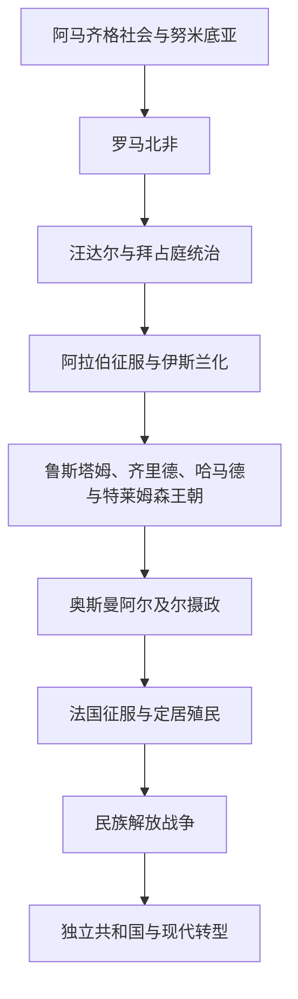

# 阿尔及利亚历史

## 概括

阿尔及利亚横跨地中海沿岸、阿特拉斯山地和广阔撒哈拉。努米底亚、罗马行省、阿马齐格王朝、奥斯曼阿尔及尔摄政和法国定居殖民构成其主要历史层次。1954—1962年的独立战争深刻塑造现代国家的政治合法性、军队地位和民族记忆。

## 演进图

## 历史主线

阿尔及利亚国家疆界形成于殖民时代，但沿海、山地、草原与撒哈拉的政治联系更早存在。古代努米底亚王权介入迦太基—罗马竞争；中世纪地方王朝与马格里布帝国交错；阿尔及尔摄政依托海军、地方军政集团和内陆盟约维持统治。法国征服造成大规模土地转移与法律不平等，最终引发漫长反殖民战争。

## 阶段导航

| 顺序 | 阶段 | 时间 | 入口 | 简要概括 |
|---:|---|---|---|---|
| 1 | 努米底亚、罗马北非与伊斯兰化 | 古代—1516年 | [努米底亚、罗马北非与伊斯兰化](/%E4%BA%BA%E6%96%87%E7%A7%91%E5%AD%A6/%E5%8E%86%E5%8F%B2/%E5%8C%97%E9%9D%9E/%E9%98%BF%E5%B0%94%E5%8F%8A%E5%88%A9%E4%BA%9A/%E5%8A%AA%E7%B1%B3%E5%BA%95%E4%BA%9A%E3%80%81%E7%BD%97%E9%A9%AC%E5%8C%97%E9%9D%9E%E4%B8%8E%E4%BC%8A%E6%96%AF%E5%85%B0%E5%8C%96.md) | 古代王国、罗马行省和中世纪马格里布政权 |
| 2 | 奥斯曼阿尔及尔与法国殖民 | 1516—1954年 | [奥斯曼阿尔及尔与法国殖民](/%E4%BA%BA%E6%96%87%E7%A7%91%E5%AD%A6/%E5%8E%86%E5%8F%B2/%E5%8C%97%E9%9D%9E/%E9%98%BF%E5%B0%94%E5%8F%8A%E5%88%A9%E4%BA%9A/%E5%A5%A5%E6%96%AF%E6%9B%BC%E9%98%BF%E5%B0%94%E5%8F%8A%E5%B0%94%E4%B8%8E%E6%B3%95%E5%9B%BD%E6%AE%96%E6%B0%91.md) | 摄政统治、法国征服、定居殖民与民族运动 |
| 3 | 独立战争与现代阿尔及利亚 | 1954年至今 | [独立战争与现代阿尔及利亚](/%E4%BA%BA%E6%96%87%E7%A7%91%E5%AD%A6/%E5%8E%86%E5%8F%B2/%E5%8C%97%E9%9D%9E/%E9%98%BF%E5%B0%94%E5%8F%8A%E5%88%A9%E4%BA%9A/%E7%8B%AC%E7%AB%8B%E6%88%98%E4%BA%89%E4%B8%8E%E7%8E%B0%E4%BB%A3%E9%98%BF%E5%B0%94%E5%8F%8A%E5%88%A9%E4%BA%9A.md) | 民族解放战争、一党国家、内战危机与政治改革 |

## 重要转折与时间节点

| 时间 | 事件 | 意义 |
|---|---|---|
| 前202年 | 马西尼萨统一努米底亚 | 北非重要地方王权形成 |
| 前46年 | 罗马吞并努米底亚核心区 | 阿尔及利亚北部逐步纳入罗马行省体系 |
| 7—8世纪 | 阿拉伯征服与地方抵抗 | 伊斯兰化开始，阿马齐格政治力量重新组合 |
| 1014年 | 哈马德王朝形成 | 中部马格里布出现重要地方王朝 |
| 1516年 | 巴巴罗萨兄弟介入阿尔及尔 | 阿尔及尔逐步纳入奥斯曼体系 |
| 1830年 | 法国占领阿尔及尔 | 长期殖民征服和定居殖民开始 |
| 1945年 | 塞提夫、盖勒马等地暴力冲突与镇压 | 改革希望受挫，激进独立诉求扩大 |
| 1954年 | 民族解放阵线发动起义 | 阿尔及利亚战争开始 |
| 1962年 | 独立 | 法国统治结束，现代共和国建立 |
| 1988—1990年代 | 政治开放、选举危机与内战 | 一党体制动摇，国家和社会遭受严重暴力 |
| 2019年 | “希拉克”抗议运动 | 大众再次要求政治更新和反腐改革 |

## 相关笔记

- 上级：[北非历史](/%E4%BA%BA%E6%96%87%E7%A7%91%E5%AD%A6/%E5%8E%86%E5%8F%B2/%E5%8C%97%E9%9D%9E/README.md)
- 社会背景：[阿马齐格人、阿拉伯化与北非社会](/%E4%BA%BA%E6%96%87%E7%A7%91%E5%AD%A6/%E5%8E%86%E5%8F%B2/%E5%8C%97%E9%9D%9E/_%E9%80%9A%E5%8F%B2/%E9%98%BF%E9%A9%AC%E9%BD%90%E6%A0%BC%E4%BA%BA%E3%80%81%E9%98%BF%E6%8B%89%E4%BC%AF%E5%8C%96%E4%B8%8E%E5%8C%97%E9%9D%9E%E7%A4%BE%E4%BC%9A.md)
- 比较专题：[殖民统治、民族主义与北非独立](/%E4%BA%BA%E6%96%87%E7%A7%91%E5%AD%A6/%E5%8E%86%E5%8F%B2/%E5%8C%97%E9%9D%9E/_%E9%80%9A%E5%8F%B2/%E6%AE%96%E6%B0%91%E7%BB%9F%E6%B2%BB%E3%80%81%E6%B0%91%E6%97%8F%E4%B8%BB%E4%B9%89%E4%B8%8E%E5%8C%97%E9%9D%9E%E7%8B%AC%E7%AB%8B.md)

## 目录层级

- 直接上级：[北非](/%E4%BA%BA%E6%96%87%E7%A7%91%E5%AD%A6/%E5%8E%86%E5%8F%B2/%E5%8C%97%E9%9D%9E/README.md)
- 历史总览：[历史](/%E4%BA%BA%E6%96%87%E7%A7%91%E5%AD%A6/%E5%8E%86%E5%8F%B2/README.md)
