# 阿尔及利亚独立战争与现代国家

## 时间

1954年至今；现代信息核验截至2026年7月14日。

## 概括

1954—1962年的阿尔及利亚战争同时是反殖民战争、法国国内政治危机和阿尔及利亚民族主义内部权力重组。民族解放阵线通过乡村游击、城市地下组织、边境军队和国际外交挑战法国；法国以大规模驻军、酷刑、集体迁移、边境封锁和行政改革反击。民族解放阵线还同梅萨利·哈吉领导的阿尔及利亚民族运动发生残酷内斗。1962年《埃维昂协议》、停火和公投结束法国统治，但欧洲移民出走、哈基人员遭报复或遗弃，以及民族解放阵线内部的“边境军—内地军”冲突，使独立并非平稳权力交接。

独立后，民族解放阵线以革命合法性建立一党总统制，军队在关键继承和危机中拥有决定性影响。石油和天然气收入支持免费教育、医疗、工业化、住房与补贴，也造成财政对国际能源价格高度敏感。1988年抗议促成多党开放，1991年选举中止却引发长达十余年的国家—伊斯兰主义武装冲突。1999年后大规模暴力下降，和解政策、能源繁荣和强总统制恢复秩序；2019年希拉克运动迫使阿卜杜勒-阿齐兹·布特弗利卡辞职，但国家基本权力结构并未被一次抗议彻底重建。

## 演进图

```mermaid
flowchart LR
    A["1954年民族解放阵线发动起义"] --> B["游击战、城市战与法国反叛乱"]
    B --> C["苏马姆会议、边境军与临时政府"]
    C --> D["1958年法国政局危机与戴高乐回归"]
    D --> E["1962年埃维昂协议、公投与独立"]
    E --> F["民族解放阵线一党国家"]
    F --> G["1965年布迈丁政变"]
    G --> H["能源国有化、工业化与1976年制度化"]
    H --> I["1980年代危机与1989年多党开放"]
    I --> J["1991—1992年选举中止与内战"]
    J --> K["1999年后和解、能源繁荣与布特弗利卡长期执政"]
    K --> L["2019年希拉克与总统更替"]
    L --> M["2020—2026年制度调整、选举与持续改革争议"]
```

## 独立战争的背景

### 殖民制度的封闭

到1954年，阿尔及利亚约有近百万欧洲裔居民，他们在土地、市镇、商业和政治代表中占据优势；穆斯林多数虽经历教育、城市化、赴法劳动和军役，仍被双选举团及行政歧视限制。1945年塞提夫、盖勒马和赫拉塔暴力与镇压，使许多民族主义者不再相信法国会主动提供平等。

1947年制度改革未能打破两个选举团的不平等，殖民当局又操控选举。梅萨利·哈吉领导的民主自由胜利运动具有广泛基础，却因领袖权威、党内组织与武装时机发生分裂。其地下特别组织被镇压后，一批青年干部成立革命团结与行动委员会，随后组建民族解放阵线。

### 1954年起义

1954年11月1日，民族解放阵线在奥雷斯、卡比利亚等地发动协调袭击，并发表《十一月一日宣言》，提出恢复主权、建立民主社会共和国和通过谈判结束冲突。初始行动规模有限，法国政府把它当作治安问题。1955年北君士坦丁地区的袭击造成欧洲平民和亲法穆斯林死亡，法国军队与定居者民兵实施大规模报复，战争的社会边界迅速扩大。

## 战争的组织与阶段

### 苏马姆会议与六大区

1956年8月，民族解放阵线在苏马姆河谷召开会议，建立全国革命委员会和协调执行委员会，划分六个军事—政治区，并原则上提出政治优先于军事、内地优先于海外。该制度提高组织能力，但边境军、外部代表和部分早期领导人对安排并不完全接受；战争后期，驻摩洛哥、突尼斯边境的民族解放军因装备和组织优势成为独立权力竞争的重要力量。

民族解放阵线通过税收、宣传、司法和基层网络争夺乡村治理，也使用暗杀和强制排除竞争者。梅萨利派阿尔及利亚民族运动与民族解放阵线在阿尔及利亚和法国工人社群中发生“兄弟战争”。把独立战争写成全体民族主义者从一开始就团结一致，会遮蔽这一暴力整合过程。

### 阿尔及尔战役

1956—1957年，民族解放阵线在阿尔及尔组织罢工、炸弹和暗杀，法国把治安权交给伞兵部队。军方以情报网、逮捕、失踪、处决和系统性酷刑摧毁城市地下网络。短期军事胜利带来长期政治代价：酷刑和法外手段在法国及国际社会引发危机，殖民战争的合法性进一步下降。

### 边境封锁与人口迁移

法国修建莫里斯线、沙勒线等带电铁丝网、雷区和监控体系，限制突尼斯、摩洛哥方向的武器与人员进入；军队以机动部队扫荡内地。数以百万计农村居民被迁入“重组营”或离开战区，农业、生计和社会网络遭到破坏。1958—1960年的沙勒攻势重创部分内地武装，却不能消灭境外领导、国际外交和政治独立诉求。

## 战时统治与实际权力

| 机构 | 时期 | 角色 | 实际限制与关系 |
|---|---|---|---|
| 民族解放阵线 | 1954—1962年 | 对外宣称代表阿尔及利亚民族，组织政治、外交和地下网络 | 内地、外部代表、历史领袖与军方之间存在路线竞争 |
| 民族解放军内地六大区 | 1956年制度化 | 在战区实施游击、征税、司法和群众组织 | 被法国反叛乱重创，各区资源和自主性不同 |
| 边境军 | 主要在突尼斯、摩洛哥 | 训练、储备装备并形成较完整军队 | 被边境线阻隔，战争末期保存实力，1962年成为权力决定者 |
| 全国革命委员会／协调执行委员会 | 1956年后 | 革命的议决与执行机构 | 名义制度与军事力量分布不完全一致 |
| 阿尔及利亚共和国临时政府 | 1958—1962年 | 外交承认、谈判和临时国家代表 | 不直接控制全部军队，独立前后同政治局、边境军冲突 |
| 法国驻阿尔及利亚军政系统 | 1954—1962年 | 总督、驻节部长、军队和警察实施战争与改革 | 巴黎文官、军方、定居者组织和政权更替之间矛盾尖锐 |
| 秘密军组织 | 1961—1962年 | 反对独立的欧洲极右翼地下武装 | 以爆炸、暗杀和焦土破坏停火，未能阻止独立 |

## 战时政治领导

| 顺序 | 领导人／机构 | 任期 | 职位与产生方式 | 关键事件 |
|---:|---|---|---|---|
| 1 | 穆斯塔法·本·布莱德等“六人组” | 1954年筹备期 | 革命团结与行动委员会核心，集体发动起义 | 建立民族解放阵线，没有设置单一“首任总统” |
| 2 | 阿班·拉姆丹、拉尔比·本·迈赫迪等集体领导 | 1955—1957年前后 | 内地组织者及协调执行机构成员 | 推动苏马姆制度；拉姆丹后在内部斗争中被杀 |
| 3 | **费尔哈特·阿巴斯** | 1958—1961年 | 首任临时政府主席 | 扩大外交承认并代表革命政府 |
| 4 | **本·优素福·本·赫达** | 1961—1962年 | 第二任临时政府主席 | 参与埃维昂谈判；独立危机中同本·贝拉—边境军集团竞争 |
| 并行 | 胡阿里·布迈丁 | 1960—1962年边境军总参谋长 | 由民族解放军外部力量上升 | 率边境军支持本·贝拉政治局，成为独立后实际军事实力核心 |
| 过渡 | 阿卜杜勒·拉赫曼·法雷斯 | 1962年4—9月 | 埃维昂协议设立的临时行政机构主席 | 在法国行政撤离、停火和主权移交间承担过渡，不等同临时政府主席 |

## 戴高乐回归与谈判

1958年5月，阿尔及尔定居者和军方担心巴黎“放弃阿尔及利亚”，建立公共安全委员会并要求戴高乐执政。第四共和国危机促成第五共和国建立。戴高乐最初以含糊语言维持各方支持，同时扩大军事行动和经济改革；1959年提出阿尔及利亚自决，逐步承认永久殖民不可维持。

1960年“街垒周”显示极端定居者反对政策转向。1961年4月，四名将军在阿尔及尔发动政变，因多数军队未响应而失败；秘密军组织随后以恐怖行动阻挠谈判。法国和临时政府经过多轮会谈，于1962年3月签署《埃维昂协议》，3月19日停火。暴力并未立即停止：秘密军组织袭击穆斯林和平民设施，民族解放力量对哈基和政治对手的报复也造成大量死亡。

1962年7月1日自决公投以压倒多数赞成独立，法国7月3日承认主权，阿尔及利亚把7月5日定为独立日。约数十万欧洲居民在短时间内离开；大量哈基及家属未获法国及时撤离，留在阿尔及利亚者中许多人被杀。具体死亡数字存在重大争议，应区分已证实个案、失踪估计和政治记忆。

## 1962年权力危机与一党国家

停火后，临时政府、内地各区、政治局和边境军围绕谁控制首都、军队与国家发生冲突。本·贝拉得到布迈丁边境军支持，击败临时政府及部分内地力量。1962年9月制宪会议成立政府，1963年宪法确立民族解放阵线一党和强总统制。

卡比利亚的社会主义力量阵线等反对一党集中，1963—1965年发生武装对抗。国家接收殖民者离去留下的农场与企业，发展工人自管，但政策、军队和地方权力迅速集中到总统及革命精英。1965年6月，国防部长布迈丁以“革命纠正”名义政变，逮捕本·贝拉，废止正常宪政，由革命委员会统治。

## 布迈丁时期：国家建设与能源主权

布迈丁依靠军队、技术官僚和民族解放阵线重建中央国家。政府推动重工业、教育普及、农业革命和国有企业，1971年把碳氢资源主导权收归国家，国家石油天然气公司成为财政核心。阿尔及利亚积极参与不结盟运动、支持反殖民解放组织，并倡导“国际经济新秩序”。

工业化获得基础设施、技术人才和社会服务成果，也存在重工业投资效率、农业供给不足和官僚集中问题。能源出口让国家能在不广泛征收个人所得税的情况下提供补贴与就业，形成以资源收入交换社会稳定的关系。1976年宪法恢复总统职位和形式制度化，民族解放阵线仍是唯一合法政治组织。布迈丁1978年去世后，国民议会议长拉巴赫·比塔特短暂代理，军政精英选择沙德利·本·杰迪德继任。

## 本·杰迪德时期与多党开放

本·杰迪德减少部分重工业项目，放松国家经济控制并调整精英联盟。1980年“柏柏尔之春”以卡比利亚语言文化诉求挑战单一阿拉伯民族叙事；国家此后逐步承认塔马齐格特身份，但过程漫长。

1986年油价暴跌压缩财政、进口和青年就业。住房短缺、物价、腐败与人口结构压力在1988年10月引发大规模骚乱，军队镇压造成大量伤亡。1989年新宪法取消民族解放阵线垄断，允许政党、报刊和社团迅速发展。伊斯兰拯救阵线利用清真寺网络、地方福利、反腐诉求和对一党国家的不满，在1990年地方选举中获胜。

1991年12月议会选举第一轮，伊斯兰拯救阵线接近取得决定性多数。1992年1月，军方迫使本·杰迪德辞职，取消第二轮并禁止该党。国家领导人认为这可阻止可能终结民主的伊斯兰主义政权，反对者则视之为推翻选举。两种担忧都不能改变直接结果：政治竞争转入大规模武装冲突。

## 1990年代内战

### 权力结构

本·杰迪德辞职后，宪法委员会主席阿卜杜勒马利克·本哈比莱斯短暂代行元首职能，高级国家委员会作为集体元首成立。流亡多年的穆罕默德·布迪亚夫回国主持委员会，试图以革命资历和反腐重建合法性，1992年6月遇刺。阿里·卡菲继任；1994年利亚明·泽鲁阿勒成为国家元首，1995年经总统选举留任。

军方、安全机构、总统和政府并非一个毫无分歧的单一集团。对话、军事镇压、党派重建和总统继承一直存在路线竞争。称其为“军方对伊斯兰主义者”的二元战争，也会忽视地方自卫队、政党、工会、记者和大量不参加任何武装的平民。

### 武装力量与暴力升级

伊斯兰武装运动、伊斯兰救国军和更激进的武装伊斯兰集团等组织目标、组织关系和策略不同。部分武装袭击军警和政府设施，武装伊斯兰集团又杀害知识分子、外国人和平民，并宣称打击不支持其路线的社区。国家军警实施失踪、法外处决和集体惩罚的指控同样严重。

1996年宪法强化总统制并限制以宗教、语言等为基础的政党。1997—1998年莱斯、本塔勒哈等地发生大屠杀，责任、军队反应和渗透问题持续争议。内战伤亡估计通常以十万计，但精确数字因失踪、无名墓和统计口径不同。

### 降级与和解

伊斯兰救国军自1997年起停火，1999年布特弗利卡上台后推动《公民和谐法》，给放下武器且未涉及特定严重罪行者减刑或赦免。2005年《和平与民族和解宪章》进一步扩大安排，大规模战斗显著下降。和解帮助终止战争，却限制对国家人员和武装组织侵害的调查；失踪者家属、受害者与人权团体因此批评以沉默换稳定。

## 布特弗利卡时期

阿卜杜勒-阿齐兹·布特弗利卡以外交资历和军方支持于1999年当选。能源价格上涨使政府偿还外债、建设高速公路、住房和公共设施，并通过补贴与公务就业维持社会契约。国家恢复国际影响，伊斯兰主义武装残余则逐步转向撒哈拉—萨赫勒跨境网络。

总统通过人事、政党联盟和安全系统调整扩大权力。2008年修宪取消连续任期限制，使其获得第三、第四任期；2013年中风后公开活动显著减少，非正式总统圈和军政精英的决策更不透明。2016年宪法恢复两届限制，但不追溯既有任期。石油价格下跌再次暴露经济多元化不足、青年失业、进口依赖和地区不平衡。

## 2019年希拉克与权力更替

2019年2月，布特弗利卡宣布寻求第五任期，引发全国和平示威。希拉克不仅反对个人连任，也要求军政精英整体退出、司法独立和真正公民国家。军方总参谋长艾哈迈德·盖德·萨拉赫最终要求启动宪法罢免程序，布特弗利卡4月2日辞职。

国民议会议长阿卜杜勒卡德尔·本萨拉任临时总统。抗议者反对在旧制度控制下迅速选举，过渡政府逮捕部分前高官和商人，也拘押活动者。2019年12月总统选举投票率较低，前总理阿卜杜勒马吉德·特本当选。希拉克在新冠疫情期间暂停大规模周五游行，2021年短暂恢复后受逮捕、司法限制和组织分散影响而减弱。

## 2020—2026年的制度与政治

2020年宪法经公投通过，恢复两届总统任期限制，规定塔马齐格特为国家和官方语言的地位不可逆，并调整政府称谓：若议会形成总统多数，由总理领导政府；若形成议会多数，则由政府首脑领导。总统仍任武装部队总司令、主持部长会议、主导外交并任命大量高级职位。

2021年提前议会选举投票率低，民族解放阵线仍为最大党。特本在2024年9月总统选举中获连任，任期五年。纳迪尔·拉尔巴维任总理至2025年8月，西菲·格里卜先代理、后于9月14日获正式任命。到2026年7月14日，国家元首为特本，总理为格里卜。

2026年7月2日举行新一届国民议会选举。国家独立选举管理机构公布的初步统计显示，民族解放阵线以90席居407席议会首位，国内最终统计投票率为21.24%；宪法法院仍在接收、审查初步结果和申诉的程序中，因此本笔记不把90席写作已经最终裁定的席位。

## 共和国国家元首完整序列

| 顺序 | 国家元首 | 任期 | 职位／产生方式 | 与前任关系及关键事件 |
|---:|---|---|---|---|
| 1 | **艾哈迈德·本·贝拉** | 1962年9月—1963年9月任政府首脑；1963年9月—1965年6月任总统 | 制宪议会后执政，1963年宪法选为首任总统 | 获边境军支持击败临时政府；1965年被布迈丁政变推翻 |
| 2 | **胡阿里·布迈丁** | 1965年6月—1976年12月任革命委员会主席；1976年12月—1978年12月任总统 | 军事政变后掌权，后经宪法制度化 | 国有化碳氢资源、推动工业化；任内病逝 |
| 3 | 拉巴赫·比塔特 | 1978年12月—1979年2月 | 国民议会议长依宪代理总统 | 过渡至本·杰迪德 |
| 4 | 沙德利·本·杰迪德 | 1979年2月—1992年1月 | 民族解放阵线提名、选举产生 | 经济调整和多党开放；在军方压力下辞职 |
| 临时 | 阿卜杜勒马利克·本哈比莱斯 | 1992年1月11—14日 | 宪法委员会主席短暂代行元首 | 在高级国家委员会成立前维持法定连续 |
| 5 | 高级国家委员会 | 1992年1月—1994年1月 | 集体国家元首 | 取消选举后的非常机构；先后由布迪亚夫、卡菲主持 |
| 5a | **穆罕默德·布迪亚夫** | 1992年1—6月 | 高级国家委员会主席 | 流亡归国主持过渡，任内遇刺 |
| 5b | 阿里·卡菲 | 1992年7月—1994年1月 | 高级国家委员会主席 | 接替遇刺的布迪亚夫，内战扩大 |
| 6 | 利亚明·泽鲁阿勒 | 1994年1月—1995年11月任国家元首；1995年11月—1999年4月任总统 | 军方任命后经选举 | 兼用军事与有限对话路线，提前交权 |
| 7 | **阿卜杜勒-阿齐兹·布特弗利卡** | 1999年4月—2019年4月 | 连续四届总统 | 推动和解、受益能源繁荣；第五任期计划引发希拉克并辞职 |
| 8 | 阿卜杜勒卡德尔·本萨拉 | 2019年4—12月 | 国民议会议长依宪任临时总统 | 组织2019年总统选举，过渡合法性受抗议质疑 |
| 9 | **阿卜杜勒马吉德·特本** | 2019年12月至今 | 2019年当选，2024年连任 | 2020年修宪；截至2026年7月14日为现任总统 |

## 政府首脑完整序列

1963—1979年间不设独立总理，政府由总统直接领导。短暂代理任期单列，不并入前后任。

| 顺序 | 政府首脑 | 任期 | 职称 | 关键事件／备注 |
|---:|---|---|---|---|
| 1 | 艾哈迈德·本·贝拉 | 1962年9月—1963年9月 | 政府主席／总理 | 独立后首任政府首脑；任总统后职位撤销 |
| — | 职位空缺 | 1963年9月—1979年3月 | 总统直接领导政府 | 本·贝拉后期及布迈丁时期 |
| 2 | 穆罕默德·本·艾哈迈德·阿卜杜勒加尼 | 1979年3月—1984年1月 | 总理 | 本·杰迪德初期恢复职位 |
| 3 | 阿卜杜勒哈米德·卜拉希米 | 1984年1月—1988年11月 | 总理 | 油价危机与1988年骚乱前后离任 |
| 4 | 卡斯迪·梅尔巴 | 1988年11月—1989年9月 | 政府首脑 | 负责早期政治开放 |
| 5 | 穆卢德·哈姆鲁什 | 1989年9月—1991年6月 | 政府首脑 | 推进经济和媒体改革，多党竞争扩大 |
| 6 | 西德·艾哈迈德·戈扎利 | 1991年6月—1992年7月 | 政府首脑 | 主持1991年选举及中止后的初期危机 |
| 7 | 贝莱德·阿卜杜萨拉姆 | 1992年7月—1993年8月 | 政府首脑 | 内战初期的国家经济管理 |
| 8 | 雷达·马利克 | 1993年8月—1994年4月 | 政府首脑 | 强硬安全路线时期 |
| 9 | 莫克达德·西菲 | 1994年4月—1995年12月 | 政府首脑 | 泽鲁阿勒过渡与1995年总统选举 |
| 10 | **艾哈迈德·乌亚希亚** | 1995年12月—1998年12月，第一任 | 政府首脑 | 财政紧缩、内战高峰和制度重建 |
| 11 | 斯迈尔·哈姆达尼 | 1998年12月—1999年12月 | 政府首脑 | 泽鲁阿勒至布特弗利卡过渡 |
| 12 | 艾哈迈德·本比图尔 | 1999年12月—2000年8月 | 政府首脑 | 与总统政策分歧后辞职 |
| 13 | 阿里·本弗利斯 | 2000年8月—2003年5月 | 政府首脑 | 后与布特弗利卡竞争总统职位 |
| 14 | 艾哈迈德·乌亚希亚 | 2003年5月—2006年5月，第二任 | 政府首脑 | 能源收入上升期 |
| 15 | 阿卜杜勒阿齐兹·贝勒卡德姆 | 2006年5月—2008年6月 | 政府首脑 | 民族解放阵线领导人执政 |
| 16 | 艾哈迈德·乌亚希亚 | 2008年6月—2012年9月，第三任 | 总理 | 2008年取消总统任期限制及2011年抗议应对 |
| 17 | 阿卜杜勒马利克·塞拉勒 | 2012年9月—2014年3月，第一任 | 总理 | 组织2014年总统选举前辞职 |
| 代理 | 优素福·尤素菲 | 2014年3—4月 | 代理总理 | 塞拉勒担任竞选主管期间代理 |
| 18 | 阿卜杜勒马利克·塞拉勒 | 2014年4月—2017年5月，第二任 | 总理 | 油价下跌后财政调整 |
| 19 | 阿卜杜勒马吉德·特本 | 2017年5—8月 | 总理 | 任期不足三个月，后于2019年当选总统 |
| 20 | 艾哈迈德·乌亚希亚 | 2017年8月—2019年3月，第四任 | 总理 | 布特弗利卡末期，希拉克爆发后离任 |
| 21 | 努尔丁·贝多伊 | 2019年3—12月 | 总理 | 希拉克与临时总统时期 |
| 代理 | 萨布里·布卡杜姆 | 2019年12月19—28日 | 代理总理 | 新总统组阁前短暂代理 |
| 22 | 阿卜杜勒阿齐兹·杰拉德 | 2019年12月—2021年6月 | 总理 | 2020年修宪及疫情时期 |
| 23 | 艾曼·本阿卜杜拉赫曼 | 2021年6月—2023年11月 | 总理 | 兼具财政技术官僚背景 |
| 24 | 纳迪尔·拉尔巴维 | 2023年11月—2025年8月 | 总理 | 特本第一任期末及2024年连任阶段 |
| 25 | **西菲·格里卜** | 2025年8月28日代理；9月14日至今正式任职 | 总理 | 截至2026年7月14日为现任总理 |

## 现行政体与实际权力

| 机构 | 法定地位 | 实际作用 |
|---|---|---|
| 总统 | 直选五年，最多两届；国家元首、武装部队总司令，主持部长会议 | 掌握外交、国防、高级任命与重大政策，是制度核心 |
| 总理／政府首脑 | 由总统根据议会多数性质任命，提出政府方案 | 负责日常行政和经济执行，但自主程度取决于总统与议会格局 |
| 国民议会 | 直选下院，2026年为407席 | 立法、预算和质询；执政党、盟党及独立派构成总统治理基础 |
| 国民院 | 间接选举与总统任命相结合的上院 | 审议法案并代表地方机构，部分成员由总统任命 |
| 宪法法院 | 审查法律、选举和宪法争议 | 负责确认总统、议会选举结果及处理申诉 |
| 人民国家军 | 宪法上受总统统帅 | 在1962年权力竞争、1965年政变、1992年危机和2019年继承中具有决定性历史作用；不能简单写成每日直接执政 |
| 民族解放阵线及其他政党 | 多党制度下参选 | 民族解放阵线保有革命象征和组织网络，但不再是法律上唯一政党 |
| 行政与能源国企 | 执行公共政策、经营国家资源 | 国家石油天然气公司和能源收入支撑财政、补贴与外交空间 |

## 经济与社会结构

阿尔及利亚拥有重要天然气和石油储量，管道与液化天然气使其成为欧洲和地中海能源供应者。资源国有化为国家教育、医疗、住房、食品和燃料补贴提供资金，识字率、寿命和城市基础设施显著改善。问题在于价格周期直接影响预算，私营制造、农业和高技能就业不足，庞大青年人口容易面对就业和住房压力。

国家多次提出工业多元化、可再生能源、数字化和农业开发。进口限制与本地生产政策可保护产业，也可能造成短缺和寻租。评价经济不能只用“资源诅咒”：能源主权曾是摆脱殖民依附的重要成就，真正问题是收入如何透明分配、是否形成长期生产能力，以及公民能否通过税收和代表机制监督国家。

阿拉伯语和塔马齐格特均为官方语言，法语在教育、商业和行政中仍广泛使用。1980年柏柏尔之春、2001年“黑色之春”和后续宪法承认推动阿马齐格文化合法化；这并不意味着语言、地区和国家认同矛盾已经结束。伊斯兰是国教，国家管理清真寺和宗教教育，同时需在宗教自由、安全与政治组织之间作出有争议的界定。

## 外交与区域关系

独立战争经验使阿尔及利亚长期支持反殖民、民族自决和不结盟外交。它在非洲联盟、阿拉伯世界、欧佩克和地中海合作中均有角色，并以军事实力、能源和调停传统影响萨赫勒。

阿尔及利亚支持西撒哈拉人民自决并接纳撒哈拉难民，导致同摩洛哥关系长期紧张；陆地边界自1994年关闭，2021年外交关系中断。两国竞争同时涉及边界记忆、地区领导权和安全叙事，不能简化为单一领土争端。南部面临萨赫勒武装、走私、利比亚和马里不稳定外溢，政府强调不干涉和政治调解，也加强边境军事部署。

## 重要事件

| 时间 | 事件 | 结果与长期影响 |
|---|---|---|
| 1954年11月1日 | 民族解放阵线发动起义 | 把殖民危机转为有组织的独立战争 |
| 1955年8月 | 北君士坦丁袭击与报复 | 平民伤亡和大规模镇压扩大社会参与与恐惧 |
| 1956年8月 | 苏马姆会议 | 建立革命制度、六大区和政治原则，也埋下内外权力争议 |
| 1956—1957年 | 阿尔及尔战役 | 法军摧毁城市地下网，酷刑使法国政治合法性受损 |
| 1958年5月 | 阿尔及尔危机与戴高乐回归 | 法国第五共和国建立，政策逐渐转向自决 |
| 1961年 | 将军政变失败与秘密军组织暴力 | 法军多数服从巴黎，极端定居者转入地下恐怖行动 |
| 1962年3—7月 | 埃维昂停火、公投与独立 | 法国统治结束，人口外流与报复暴力延续 |
| 1962年夏 | 临时政府—政治局—边境军危机 | 本·贝拉和布迈丁集团取得国家权力 |
| 1965年 | 布迈丁政变 | 一党军政国家进一步集中 |
| 1971年 | 碳氢资源国有化 | 国家取得能源主导权，财政和工业化能力增强 |
| 1980年 | 柏柏尔之春 | 语言文化诉求公开挑战单一民族叙事 |
| 1988—1989年 | 十月骚乱与多党宪法 | 一党垄断终结，政治空间迅速开放 |
| 1991—1992年 | 议会选举中止 | 军方干预引发国家与多支伊斯兰武装长期战争 |
| 1997—1998年 | 大屠杀高峰 | 平民成为主要受害者，责任与国家反应争议延续 |
| 1999—2005年 | 公民和谐与民族和解 | 大规模战争下降，真相、司法和失踪问题未解决 |
| 2008年 | 取消连续任期限制 | 布特弗利卡长期执政制度化 |
| 2019年 | 希拉克与布特弗利卡辞职 | 大众阻止第五任期，旧体制通过宪法继承维持连续 |
| 2020年 | 新宪法公投 | 调整任期、政府和军队海外部署规则，低参与反映代表危机 |
| 2024年 | 特本连任 | 开始第二个五年任期 |
| 2026年7月 | 议会选举 | 初步结果显示民族解放阵线90席居首，低投票率延续参与问题；最终裁定尚待完成 |

## 兴衰与转型的分层分析

### 独立战争胜负

- **结构因素**：殖民制度无法在维持定居者特权的同时给予人口多数真正平等；人口、教育和城市化变化扩大民族政治。
- **民族解放阵线机制**：通过武装、基层治理、外交和强制整合建立唯一代表地位。
- **法国压力**：战争财政、国际反殖民潮、酷刑争议和国内政权危机削弱继续殖民的可承受性。
- **直接转折**：戴高乐接受自决、军方政变失败及埃维昂谈判共同打开独立路径。

### 一党国家的稳定与危机

- **稳定条件**：革命合法性、军队组织、能源收入和社会政策支撑中央国家。
- **结构弱点**：政治代表渠道狭窄、资源依赖、青年就业和地区差距积累。
- **直接触发**：1986年油价暴跌和1988年骚乱迫使开放；1992年取消选举将制度危机转为战争。

### 1990年代战争的结束

- 武装组织分裂、国家军警适应、社会厌战和伊斯兰救国军停火削弱持续战争能力。
- 布特弗利卡赦免与和解为退出武装提供制度通道，能源收入帮助国家重建。
- 结束大规模战斗不等于完成转型正义；失踪、酷刑、屠杀责任和档案开放仍是未决问题。

### 2019年后

希拉克成功阻止特定连任并重申公民主权，却缺少统一组织、谈判代表和过渡路线。军队支持宪法内更替，疫情与司法限制削弱街头动员。特本政府以修宪、选举和经济改革恢复制度运转；持续的低投票率则显示正式选举与相当部分社会之间仍有距离。

## 历史辨析

- 阿尔及利亚战争不是只发生在阿尔及利亚：法国本土的民族主义内斗、示威镇压、政治危机和移民网络同样属于战争。
- 民族解放阵线并非从1954年起即获所有民族主义者承认，它通过组织、外交和武力逐步取得垄断地位。
- 1962年独立不等于国家机构从零开始；新国家继承殖民行政、边界和能源基础，同时由革命军政网络重组。
- “军队掌权”需具体说明时点和机制。军方在继承危机中决定性强，但日常政策仍由总统、政府、官僚、政党和国企共同执行。
- 1990年代不能笼统称“政府与一个恐怖组织的战争”；多个武装、地方自卫力量和国家机构内部路线并存。
- 和解与遗忘不同。暴力下降是实质成果，但受害者知情、司法与赔偿诉求不能因此取消。
- 2026年议会席位目前采用选举机构初步统计，宪法法院最终裁定公布后应再更新。

## 演变关系

- 前一阶段：[奥斯曼阿尔及尔与法国殖民](/%E4%BA%BA%E6%96%87%E7%A7%91%E5%AD%A6/%E5%8E%86%E5%8F%B2/%E5%8C%97%E9%9D%9E/%E9%98%BF%E5%B0%94%E5%8F%8A%E5%88%A9%E4%BA%9A/%E5%A5%A5%E6%96%AF%E6%9B%BC%E9%98%BF%E5%B0%94%E5%8F%8A%E5%B0%94%E4%B8%8E%E6%B3%95%E5%9B%BD%E6%AE%96%E6%B0%91.md)
- 上级：[阿尔及利亚历史](/%E4%BA%BA%E6%96%87%E7%A7%91%E5%AD%A6/%E5%8E%86%E5%8F%B2/%E5%8C%97%E9%9D%9E/%E9%98%BF%E5%B0%94%E5%8F%8A%E5%88%A9%E4%BA%9A/README.md)
- 北非比较：[殖民统治、民族主义与北非独立](/%E4%BA%BA%E6%96%87%E7%A7%91%E5%AD%A6/%E5%8E%86%E5%8F%B2/%E5%8C%97%E9%9D%9E/_%E9%80%9A%E5%8F%B2/%E6%AE%96%E6%B0%91%E7%BB%9F%E6%B2%BB%E3%80%81%E6%B0%91%E6%97%8F%E4%B8%BB%E4%B9%89%E4%B8%8E%E5%8C%97%E9%9D%9E%E7%8B%AC%E7%AB%8B.md)
- 法国交叉：[法兰西第四共和国](/%E4%BA%BA%E6%96%87%E7%A7%91%E5%AD%A6/%E5%8E%86%E5%8F%B2/%E6%AC%A7%E6%B4%B2/%E6%B3%95%E5%9B%BD/%E6%B3%95%E5%85%B0%E8%A5%BF%E7%AC%AC%E5%9B%9B%E5%85%B1%E5%92%8C%E5%9B%BD.md)
- 西撒哈拉交叉：[1975年以来的冲突、停火与未决地位](/%E4%BA%BA%E6%96%87%E7%A7%91%E5%AD%A6/%E5%8E%86%E5%8F%B2/%E5%8C%97%E9%9D%9E/%E8%A5%BF%E6%92%92%E5%93%88%E6%8B%89/1975%E5%B9%B4%E4%BB%A5%E6%9D%A5%E7%9A%84%E5%86%B2%E7%AA%81%E3%80%81%E5%81%9C%E7%81%AB%E4%B8%8E%E6%9C%AA%E5%86%B3%E5%9C%B0%E4%BD%8D.md)
