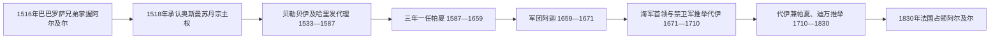

# 阿尔及尔摄政统治者表

## 时间

1516—1830年。

## 使用说明

阿尔及尔摄政不是父子相传的单一王朝。其最高权力先后由巴巴罗萨兄弟、奥斯曼贝勒贝伊及代理人、三年一任帕夏、军团阿迦和经海军首领、禁卫军或迪万推举的代伊掌握。所谓“与前任关系”因此主要是任命、代理、政变或推举关系，而非血缘继承。

十六、十七世纪部分代理人的拼写、任期和正式职衔在奥斯曼档案、欧洲领事记录与后世编年中不完全一致。下表列出可辨认的公认序列；资料断裂处逐项标为“不详”或“存在争议”，不以“若干帕夏”合并掩盖缺口。1671—1830年代伊表采用27位的常见编年；有些机构统计为29位，是因为对短暂代理、代伊兼帕夏及任期起讫的计算不同。

## 制度演变

## 巴巴罗萨统治与奥斯曼保护

| 顺序 | 统治者 | 身份 | 任期 | 产生方式／与前任关系 | 关键事件与备注 |
|---:|---|---|---|---|---|
| 1 | **奥鲁奇·雷斯（巴巴·阿鲁季）** | 阿尔及尔统治者 | 1516—1518年 | 应阿尔及尔地方势力请求介入，随后夺取最高权力 | 抵抗西班牙据点；1518年在特莱姆森方向作战时身亡 |
| 2 | **海雷丁·巴巴罗萨** | 统治者，后为奥斯曼贝勒贝伊 | 1518—1533年；1520—1527年一度失去阿尔及尔 | 奥鲁奇之弟；请求奥斯曼苏丹保护并获军职 | 把阿尔及尔纳入奥斯曼帝国秩序；后任奥斯曼海军统帅 |
| 并立／间断 | 艾哈迈德·伊本·卡迪 | 库库王国统治者 | 约1520—1527年控制阿尔及尔 | 借地方联盟击退海雷丁势力 | 其控制说明奥斯曼统治初期尚未稳固 |
| 代理 | 哈桑·阿迦 | 海雷丁的哈里发／代理 | 1520年代及后续多次代理 | 由海雷丁委任 | 在海雷丁离境时处理阿尔及尔政务 |

## 贝勒贝伊与哈里发代理

贝勒贝伊是奥斯曼在西地中海前线的高级总督。正式贝勒贝伊经常兼任海军和远征职务，实际政务由哈里发代理；因此同一时期“名义在任者”和“驻阿尔及尔代理人”可能重叠。

| 顺序 | 姓名 | 职衔 | 任期 | 产生方式／与前任关系 | 关键事件与备注 |
|---:|---|---|---|---|---|
| 1 | **海雷丁·巴巴罗萨** | 正式贝勒贝伊 | 1533—1546年 | 奥斯曼苏丹任命，延续此前权力 | 长期在帝国海军任职，由哈桑·阿迦代理阿尔及尔 |
| 2 | 哈桑·阿迦 | 哈里发代理 | 1534—1543年 | 海雷丁任命 | 1541年抵御查理五世远征 |
| 3 | 哈吉帕夏 | 临时哈里发 | 1543—1544年 | 接替哈桑·阿迦 | 任期短暂 |
| 4 | **哈桑帕夏** | 正式贝勒贝伊，第一任 | 1544—1551年 | 海雷丁之子，奥斯曼任命 | 1546年前代其父履职，后正式掌权 |
| 5 | 卡伊德·萨法 | 临时哈里发 | 1551—1552年 | 哈桑离任后的代理 | 拼写与具体职衔在资料中有差异 |
| 6 | **萨利赫·雷斯** | 正式贝勒贝伊 | 1552—1556年 | 奥斯曼任命 | 向内陆和西部扩张摄政影响 |
| 7 | 哈桑·科尔索 | 临时哈里发 | 1556—1557年 | 萨利赫死后由军政集团拥立 | 与伊斯坦布尔任命者冲突 |
| 8 | 穆罕默德·泰凯莱尔利 | 哈里发／帕夏 | 1557年 | 奥斯曼派任 | 任期极短 |
| 9 | 优素福 | 临时哈里发 | 1557年 | 接续临时治理 | 史料有限 |
| 10 | 叶海亚 | 临时哈里发 | 1557年 | 接续临时治理 | 史料有限 |
| 11 | **哈桑帕夏** | 正式贝勒贝伊，第二任 | 1557—1561年 | 再次获奥斯曼任命 | 恢复对阿尔及尔的控制 |
| 12 | 哈桑·许斯雷夫·阿迦 | 临时哈里发 | 1561—1562年 | 哈桑帕夏离任后的代理 | 有资料另附共同代理人 |
| 13 | 艾哈迈德·卡比亚帕夏 | 临时哈里发 | 1562年 | 奥斯曼或军政系统任命 | 任期短暂 |
| 14 | **哈桑帕夏** | 正式贝勒贝伊，第三任 | 1562—1567年 | 第三次任职 | 维持奥斯曼西地中海前线 |
| 15 | 穆罕默德帕夏 | 临时哈里发，第一阶段 | 1567—1570年 | 哈桑离任后代理，后代乌鲁奇·阿里履职 | 1568年后名义上隶属乌鲁奇·阿里 |
| 16 | **乌鲁奇／乌卢奇·阿里** | 正式贝勒贝伊 | 1568—1577年 | 奥斯曼任命 | 因在伊斯坦布尔和海军任职，阿尔及尔多由代理治理 |
| 17 | 阿拉伯·艾哈迈德 | 哈里发代理 | 1570—1574年 | 乌鲁奇·阿里委任 | 在勒班陀战役前后治理 |
| 18 | 卡伊德·拉马丹 | 哈里发代理，第一任 | 1574—1577年 | 乌鲁奇·阿里委任 | 奥斯曼收复突尼斯后的西部治理 |
| 19 | 哈桑·韦内齐亚诺 | 哈里发代理，第一任 | 1577—1580年 | 接替拉马丹 | 威尼斯出身的奥斯曼军政人物 |
| 20 | 贾法尔帕夏 | 哈里发代理 | 1580—1582年 | 奥斯曼系统任命 | 任期两年 |
| 21 | 卡伊德·拉马丹 | 哈里发代理，第二任 | 1582年 | 再次任职 | 过渡任期 |
| 22 | 哈桑·韦内齐亚诺 | 哈里发代理，第二任 | 1582—1587年 | 再次任职 | 1587年后制度改为定期派遣帕夏 |

## 三年一任帕夏

1587年以后，伊斯坦布尔原则上按三年任期派遣帕夏。阿尔及尔禁卫军迪万、海军首领和地方贝伊却掌握大量实际权力。现存编年在1589—1592年、1621—1626年等处有缺口，个别人物的正式身份亦有争议。

| 顺序 | 姓名 | 任期 | 产生方式／与前任关系 | 关键事件与备注 |
|---:|---|---|---|---|
| 1 | 达利·艾哈迈德帕夏 | 1587—1589年 | 奥斯曼派任，接替贝勒贝伊体制 | 首批三年制帕夏之一 |
| 2 | 姓名不详 | 1589—1592年 | 奥斯曼派任应有其人，现有序列缺载 | 明确保留史料缺口 |
| 3 | 希兹尔帕夏 | 1592—1595年，第一任 | 奥斯曼派任 | 后多次复任 |
| 4 | 沙班帕夏 | 1595—1596年 | 接替希兹尔 | 任期短于三年 |
| 5 | 希兹尔帕夏 | 1596年，第二任 | 复任 | 短暂过渡 |
| 6 | 穆斯塔法帕夏 | 1596—1599年 | 奥斯曼派任 | 完成约三年任期 |
| 7 | 达利·哈桑帕夏 | 1599—1603年 | 奥斯曼派任 | 任期略长于原则期限 |
| 8 | 苏莱曼帕夏 | 1603—1604年 | 接替达利·哈桑 | 任期短暂 |
| 9 | 希兹尔帕夏 | 1604—1605年，第三任 | 再次复任 | 显示人事并非机械轮换 |
| 10 | 穆罕默德·库沙 | 1605年 | 临时接任 | 任期极短 |
| 11 | 库沙·穆斯塔法 | 1605—1607年，第一任 | 接替穆罕默德·库沙 | 后复任 |
| 12 | 雷德万帕夏 | 1607—1610年 | 奥斯曼派任 | 约三年 |
| 13 | 库沙·穆斯塔法 | 1610—1613年，第二任 | 复任 | 约三年 |
| 14 | 侯赛因·谢赫帕夏 | 1613—1617年，第一任 | 奥斯曼派任 | 后复任 |
| 15 | 库沙·穆斯塔法 | 1617年，第三任 | 短暂复任 | 过渡任期 |
| 16 | 苏莱曼·卡塔尼亚 | 1617—1618年 | 接替穆斯塔法 | 任期约一年 |
| 17 | 侯赛因·谢赫帕夏 | 1618—1619年，第二任 | 复任 | 任期约一年 |
| 18 | 谢里夫·霍贾 | 1619—1621年 | 接替侯赛因 | 军政集团影响加强 |
| 19 | 希兹尔帕夏 | 1621年 | 与早期同名者是否同一人不详 | 任期极短 |
| 20 | 穆斯塔法·库索尔 | 1621年后—不详 | 接替希兹尔 | 起讫资料不完整 |
| 21 | 穆拉德帕夏 | 不详—1626年 | 接替关系不详 | 仅终年较明确 |
| 22 | 霍斯罗帕夏 | 1626—1627年 | 奥斯曼派任 | 任期约一年 |
| 23 | 侯赛因贝伊 | 1627年后，第一任 | 接替霍斯罗 | 正式职衔和终年不详 |
| 24 | 尤努斯 | 日期不详 | 过渡统治者 | 存在明确姓名而缺任期 |
| 25 | 侯赛因贝伊 | 不详—1634年，第二任 | 复任或延续前一阶段 | 具体起年不详 |
| 26 | 优素福帕夏 | 1634—1637年 | 奥斯曼派任 | 约三年 |
| 27 | 阿布·哈桑·阿里帕夏 | 1637—1640年 | 接替优素福 | 约三年 |
| 28 | 谢赫·侯赛因帕夏 | 1640年 | 临时接任 | 任期极短 |
| 29 | 阿布·贾马勒·优素福帕夏 | 1640—1642年 | 接替侯赛因 | 任期约两年 |
| 30 | 穆罕默德·布尔萨勒帕夏 | 1642—1645年 | 奥斯曼派任 | 约三年 |
| 31 | 阿里·比钦 | 1645年 | 海军首领，是否正式帕夏存在争议 | 反映海军寡头与帕夏权威冲突 |
| 32 | 马哈茂德·布尔萨勒帕夏 | 1645—1647年 | 接替前一权力真空 | 任期约两年 |
| 33 | 优素福帕夏 | 1647—1650年 | 奥斯曼派任 | 约三年 |
| 34 | 穆罕默德帕夏 | 1650—1653年 | 奥斯曼派任 | 约三年 |
| 35 | 艾哈迈德帕夏 | 1653—1655年，第一任 | 奥斯曼派任 | 后复任 |
| 36 | 易卜拉欣帕夏 | 1655—1656年，第一任 | 接替艾哈迈德 | 后复任 |
| 37 | 艾哈迈德帕夏 | 1656—1657年，第二任 | 复任 | 禁卫军影响持续上升 |
| 38 | 易卜拉欣帕夏 | 1657—1659年，第二任 | 复任 | 帕夏体制末期 |
| 39 | 另一艾哈迈德帕夏 | 1658—1659年 | 与易卜拉欣任期重叠，身份和权力范围有争议 | 反映末期编年与名实混乱 |

## 军团阿迦

| 顺序 | 姓名 | 任期 | 产生方式／与前任关系 | 关键事件与备注 |
|---:|---|---|---|---|
| 1 | 哈利勒阿迦 | 1659—1660年 | 禁卫军集团拥立 | 帕夏被边缘化后，阿迦掌握实权 |
| 2 | 拉马丹阿迦 | 1660—1661年 | 军团内部更替 | 任期短 |
| 3 | 沙班阿迦 | 1661—1665年 | 军团内部更替 | 权力依赖禁卫军支持 |
| 4 | 阿里阿迦 | 1665—1671年 | 军团内部更替 | 统治引发反对，海军首领于1671年建立代伊制 |

## 代伊完整序列

代伊原则上终身在任，但权力来自军政寡头的推举与支持，罢黜和刺杀频繁。1710—1711年前后，巴巴·阿里·沙乌什拒绝再接纳伊斯坦布尔另派帕夏，代伊此后兼领帕夏名号；摄政仍在钱币、宗教礼仪和国际承认上保持与奥斯曼苏丹的关系，同时拥有高度自主外交。

| 顺序 | 姓名 | 在位时间 | 产生方式／与前任关系 | 关键事件与结局 |
|---:|---|---|---|---|
| 1 | **穆罕默德·特里克** | 1671—1681年 | 海军首领集团推举，取代阿迦制 | 首任代伊；削弱帕夏和禁卫军对日常权力的垄断 |
| 2 | 巴巴·哈桑 | 1681—1683年 | 海军集团推举，接替特里克 | 同法国战争和轰炸中被推翻、杀害 |
| 3 | 哈吉·侯赛因“梅佐莫尔托” | 1683—1688年 | 参与推翻巴巴·哈桑后掌权 | 抵御法国轰炸并直接谈判；1688年被起事逐出 |
| 4 | 哈吉·沙班 | 1688—1695年 | 反对前任的力量拥立 | 对突尼斯、摩洛哥用兵；后被禁卫军杀害 |
| 5 | 哈吉·艾哈迈德 | 1695—1698年 | 禁卫军支持上台 | 受军团制约，最终遇害 |
| 6 | 哈桑·沙乌什 | 1699—1700年 | 政变更替 | 对突尼斯战争失利后被迫退位；1698—1699交接年份有差异 |
| 7 | 哈吉·穆斯塔法 | 1700—1705年 | 军政集团拥立 | 击退摩洛哥并对突尼斯用兵；失败后逃亡并被处死 |
| 8 | 侯赛因·霍贾 | 1705—1707年 | 接替穆斯塔法 | 面对财政与税收困难 |
| 9 | 穆罕默德·贝克塔什 | 1707—1710年 | 军政集团推举 | 1708年从西班牙手中夺回奥兰；后被禁卫军杀害 |
| 10 | 代利·易卜拉欣 | 1710年 | 穆罕默德·贝克塔什之侄，继其被杀后上台 | 在位约五个月即遇刺 |
| 11 | **巴巴·阿里·沙乌什** | 1710—1718年 | 迪万推举 | 清洗反叛禁卫军，拒收新帕夏，确立代伊兼帕夏的高度自治体制 |
| 12 | 穆罕默德·本·哈桑 | 1718—1723年 | 迪万推举 | 拒绝伊斯坦布尔干预对荷政策；在海军首领起事中被杀 |
| 13 | 巴巴·阿卜迪 | 1723—1732年 | 海军集团支持上台 | 支持私掠并延续对奥斯曼中央的自主立场 |
| 14 | 巴巴·易卜拉欣 | 1732—1745年 | 迪万推举 | 未能从西班牙手中夺回奥兰，对突尼斯保持压力 |
| 15 | 易卜拉欣·库楚克 | 1745—1748年 | 接替巴巴·易卜拉欣 | 多地起事，任期较短 |
| 16 | 穆罕默德·伊本·贝基尔 | 1748—1754年 | 迪万推举 | 整顿禁卫军纪律，同时镇压地方起事 |
| 17 | 巴巴·阿里“布塞巴” | 1754—1766年 | 接替伊本·贝基尔 | 借军制整顿压制君士坦丁和特莱姆森方向的离心力量 |
| 18 | **穆罕默德·本·奥斯曼** | 1766—1791年 | 迪万推举 | 任期最长之一；抵御丹麦、西班牙远征并整顿地方贝伊 |
| 19 | 哈桑代伊 | 1791—1798年 | 接替本·奥斯曼 | 1792年接收西班牙撤出的奥兰；与革命法国发生粮食贸易 |
| 20 | 穆斯塔法代伊 | 1798—1805年 | 迪万推举 | 法国债务和巴克里—布斯纳商贸争端逐渐累积 |
| 21 | 艾哈迈德二世 | 1805—1808年 | 政变更替 | 统治受军团和财政冲突影响 |
| 22 | 阿里三世·本·穆罕默德 | 1808—1809年 | 接替艾哈迈德二世 | 任期约一年 |
| 23 | 哈吉·阿里 | 1809—1815年 | 军政集团拥立 | 欧洲战争末期维持摄政，后被杀 |
| 24 | 哈吉·穆罕默德 | 1815年 | 接替哈吉·阿里 | 试图限制军团腐败，在位短暂并遇害 |
| 25 | 奥马尔阿迦 | 1815—1817年 | 军政集团拥立 | 1816年英国—荷兰舰队轰炸阿尔及尔后面临强烈反对，后被杀 |
| 26 | 阿里·霍贾 | 1817—1818年 | 政变上台 | 把宫廷迁入城堡以摆脱禁卫军控制，死于瘟疫 |
| 27 | **侯赛因代伊** | 1818—1830年 | 迪万推举，接替阿里·霍贾 | 1827年扇击事件与法国封锁升级；1830年法国攻占阿尔及尔后投降并流亡 |

## 完整性与争议说明

- 代伊姓名在阿拉伯语、奥斯曼土耳其语、法语和中文转写间差异很大；同名者以序号或父名区分。
- “1671—1710年11位、1710—1830年18位”的机构统计可能把代伊兼帕夏的制度分界和短暂代理分别计数；本表按可连续辨认的27位代伊排列。
- 1587—1659年的帕夏原则上由奥斯曼中央任命，但实际任期并非总是三年；缺载与重叠不是排版遗漏，而是史料本身不完整。
- 阿尔及尔摄政从未成为现代民族国家式的统一行政领土。达尔苏丹由中央较直接控制，奥兰、提特里和君士坦丁三个贝伊领，以及卡比利亚、撒哈拉等地区，同代伊的贡赋、军事和盟约关系强弱不同。

## 双向链接

- 主笔记：[奥斯曼阿尔及尔与法国殖民](/%E4%BA%BA%E6%96%87%E7%A7%91%E5%AD%A6/%E5%8E%86%E5%8F%B2/%E5%8C%97%E9%9D%9E/%E9%98%BF%E5%B0%94%E5%8F%8A%E5%88%A9%E4%BA%9A/%E5%A5%A5%E6%96%AF%E6%9B%BC%E9%98%BF%E5%B0%94%E5%8F%8A%E5%B0%94%E4%B8%8E%E6%B3%95%E5%9B%BD%E6%AE%96%E6%B0%91.md)
- 国家总览：[阿尔及利亚历史](/%E4%BA%BA%E6%96%87%E7%A7%91%E5%AD%A6/%E5%8E%86%E5%8F%B2/%E5%8C%97%E9%9D%9E/%E9%98%BF%E5%B0%94%E5%8F%8A%E5%88%A9%E4%BA%9A/README.md)
- 帝国背景：[奥斯曼帝国](/%E4%BA%BA%E6%96%87%E7%A7%91%E5%AD%A6/%E5%8E%86%E5%8F%B2/%E8%A5%BF%E4%BA%9A/%E5%9C%9F%E8%80%B3%E5%85%B6/%E5%A5%A5%E6%96%AF%E6%9B%BC%E5%B8%9D%E5%9B%BD/README.md)
