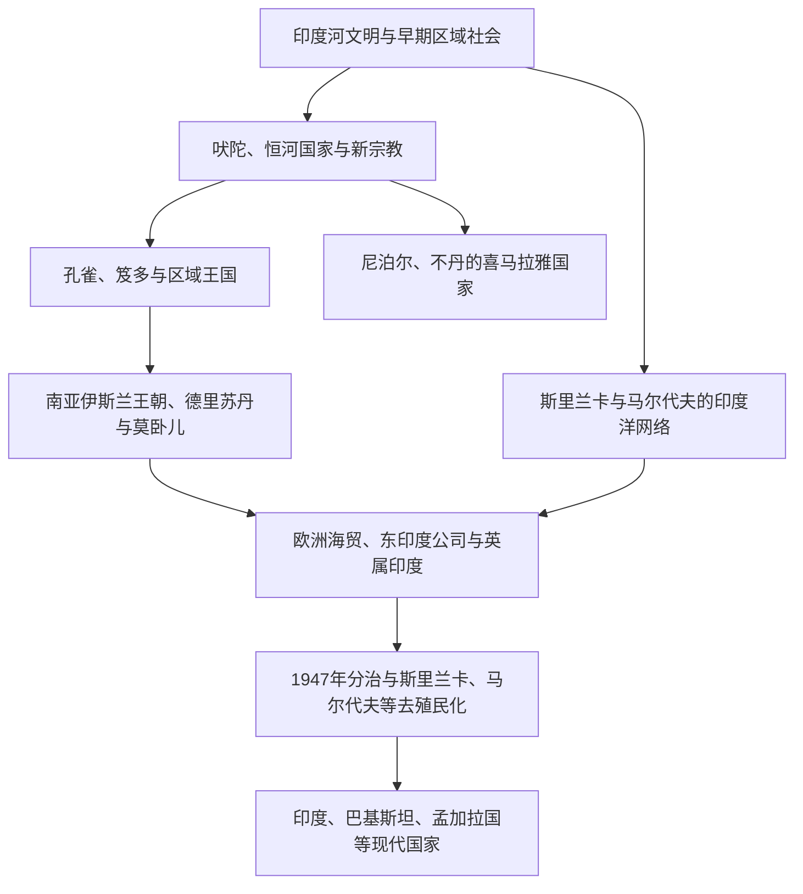

# 南亚

南亚以印度次大陆、喜马拉雅山地与印度洋岛屿为核心。印度河、恒河—布拉马普特拉河、德干高原和海上季风航线，把不同语言、宗教、政体与生态区长期联系在一起。区域历史不能化约为现代印度：巴基斯坦继承西北印度河与旁遮普—信德历史，孟加拉国继承恒河—布拉马普特拉三角洲，尼泊尔和不丹连接喜马拉雅山地，斯里兰卡和马尔代夫则构成印度洋世界的重要节点。

## 阅读框架

| 主线 | 要点 |
|---|---|
| 古代文明与思想 | 印度河城市、吠陀传统、佛教、耆那教、印度教诸传统及区域王国 |
| 山地与高原 | 喜马拉雅通道、尼泊尔谷地、不丹宗教国家与西藏—印度联系 |
| 伊斯兰与波斯化 | 阿拉伯海贸易、德里苏丹国、莫卧儿帝国、孟加拉与德干区域政权 |
| 海洋与殖民 | 印度洋季风、斯里兰卡与马尔代夫、葡荷英竞争、东印度公司 |
| 分治与建国 | 英属印度解体、印巴冲突、孟加拉独立、各国宪制与地区合作 |

## 国家入口

| 国家或地区 | 入口 | 历史主线 |
|---|---|---|
| 印度 | [印度历史](/%E4%BA%BA%E6%96%87%E7%A7%91%E5%AD%A6/%E5%8E%86%E5%8F%B2/%E5%8D%97%E4%BA%9A/%E5%8D%B0%E5%BA%A6/README.md) | 印度河、恒河诸国、孔雀、笈多、德里苏丹、莫卧儿、英属印度与共和国 |
| 巴基斯坦 | [巴基斯坦历史](/%E4%BA%BA%E6%96%87%E7%A7%91%E5%AD%A6/%E5%8E%86%E5%8F%B2/%E5%8D%97%E4%BA%9A/%E5%B7%B4%E5%9F%BA%E6%96%AF%E5%9D%A6/README.md) | 印度河、犍陀罗、旁遮普—信德、穆斯林联盟与联邦国家 |
| 孟加拉国 | [孟加拉国历史](/%E4%BA%BA%E6%96%87%E7%A7%91%E5%AD%A6/%E5%8E%86%E5%8F%B2/%E5%8D%97%E4%BA%9A/%E5%AD%9F%E5%8A%A0%E6%8B%89%E5%9B%BD/README.md) | 古代孟加拉、伊斯兰苏丹、英属孟加拉、语言运动与独立战争 |
| 尼泊尔 | [尼泊尔历史](/%E4%BA%BA%E6%96%87%E7%A7%91%E5%AD%A6/%E5%8E%86%E5%8F%B2/%E5%8D%97%E4%BA%9A/%E5%B0%BC%E6%B3%8A%E5%B0%94/README.md) | 加德满都谷地、马拉王朝、廓尔喀统一、拉纳与联邦共和国 |
| 不丹 | [不丹历史](/%E4%BA%BA%E6%96%87%E7%A7%91%E5%AD%A6/%E5%8E%86%E5%8F%B2/%E5%8D%97%E4%BA%9A/%E4%B8%8D%E4%B8%B9/README.md) | 山地佛教传统、宗萨、英国关系与君主制改革 |
| 斯里兰卡 | [斯里兰卡历史](/%E4%BA%BA%E6%96%87%E7%A7%91%E5%AD%A6/%E5%8E%86%E5%8F%B2/%E5%8D%97%E4%BA%9A/%E6%96%AF%E9%87%8C%E5%85%B0%E5%8D%A1/README.md) | 阿努拉德普勒、泰米尔王国、殖民种植园、独立与内战 |
| 马尔代夫 | [马尔代夫历史](/%E4%BA%BA%E6%96%87%E7%A7%91%E5%AD%A6/%E5%8E%86%E5%8F%B2/%E5%8D%97%E4%BA%9A/%E9%A9%AC%E5%B0%94%E4%BB%A3%E5%A4%AB/README.md) | 岛屿佛教遗产、伊斯兰苏丹国、英国保护与共和国 |
| 阿富汗 | [阿富汗历史（中亚目录）](/%E4%BA%BA%E6%96%87%E7%A7%91%E5%AD%A6/%E5%8E%86%E5%8F%B2/%E4%B8%AD%E4%BA%9A/%E9%98%BF%E5%AF%8C%E6%B1%97/README.md) | 兼具中亚、伊朗高原与南亚西北边缘历史，本库保留在中亚主线 |

## 通史入口

[南亚通史](/%E4%BA%BA%E6%96%87%E7%A7%91%E5%AD%A6/%E5%8E%86%E5%8F%B2/%E5%8D%97%E4%BA%9A/_%E9%80%9A%E5%8F%B2/README.md)集中整理跨越现代国家边界的文明、宗教、帝国、海陆网络、殖民与分治专题。

## 跨区域专题

- [古代文明、宗教与思想传统](/%E4%BA%BA%E6%96%87%E7%A7%91%E5%AD%A6/%E5%8E%86%E5%8F%B2/%E5%8D%97%E4%BA%9A/_%E9%80%9A%E5%8F%B2/%E5%8F%A4%E4%BB%A3%E6%96%87%E6%98%8E%E3%80%81%E5%AE%97%E6%95%99%E4%B8%8E%E6%80%9D%E6%83%B3%E4%BC%A0%E7%BB%9F.md)
- [喜马拉雅与印度洋：山地、季风与贸易网络](/%E4%BA%BA%E6%96%87%E7%A7%91%E5%AD%A6/%E5%8E%86%E5%8F%B2/%E5%8D%97%E4%BA%9A/_%E9%80%9A%E5%8F%B2/%E5%96%9C%E9%A9%AC%E6%8B%89%E9%9B%85%E4%B8%8E%E5%8D%B0%E5%BA%A6%E6%B4%8B%EF%BC%9A%E5%B1%B1%E5%9C%B0%E3%80%81%E5%AD%A3%E9%A3%8E%E4%B8%8E%E8%B4%B8%E6%98%93%E7%BD%91%E7%BB%9C.md)
- [伊斯兰王朝、莫卧儿与区域国家](/%E4%BA%BA%E6%96%87%E7%A7%91%E5%AD%A6/%E5%8E%86%E5%8F%B2/%E5%8D%97%E4%BA%9A/_%E9%80%9A%E5%8F%B2/%E4%BC%8A%E6%96%AF%E5%85%B0%E7%8E%8B%E6%9C%9D%E3%80%81%E8%8E%AB%E5%8D%A7%E5%84%BF%E4%B8%8E%E5%8C%BA%E5%9F%9F%E5%9B%BD%E5%AE%B6.md)
- [英属印度、分治与现代南亚](/%E4%BA%BA%E6%96%87%E7%A7%91%E5%AD%A6/%E5%8E%86%E5%8F%B2/%E5%8D%97%E4%BA%9A/_%E9%80%9A%E5%8F%B2/%E8%8B%B1%E5%B1%9E%E5%8D%B0%E5%BA%A6%E3%80%81%E5%88%86%E6%B2%BB%E4%B8%8E%E7%8E%B0%E4%BB%A3%E5%8D%97%E4%BA%9A.md)

## 重要时间节点

| 时间 | 事件或过程 | 意义 |
|---|---|---|
| 约前2600—前1900年 | 印度河文明城市化 | 南亚最早的大规模城市文明之一 |
| 约前600年 | 恒河流域国家化与新宗教兴起 | 佛教、耆那教与城市商业发展 |
| 前3世纪 | 孔雀帝国与阿育王 | 北印度大规模政治整合与佛教传播 |
| 8—13世纪 | 区域王国与印度洋贸易扩展 | 南亚与东南亚、西亚、东非联系加深 |
| 1206—1526年 | 德里苏丹国 | 北印度伊斯兰国家形成 |
| 1526—18世纪 | 莫卧儿帝国 | 南亚大帝国与波斯化宫廷体系 |
| 1757—1947年 | 东印度公司与英属印度 | 殖民国家、铁路、种植园与民族主义形成 |
| 1947年 | 印巴分治 | 现代南亚国家体系的关键断裂 |
| 1971年 | 孟加拉国独立 | 巴基斯坦两翼结构终结 |
| 1985年 | 南亚区域合作联盟成立 | 区域合作制度化 |

## 辨析

- 南亚不是单一文明国家，而是由河谷、山地、海岛和多语言社会构成的历史区域。
- 现代国界不能倒推到古代：印度河文明、犍陀罗、孟加拉、泰米尔地区等均跨越今天国家边界。
- 宗教传统与政治疆域并不重合；佛教、印度教、伊斯兰教、锡克教、基督教等在不同地区留下交织遗产。
- 阿富汗为南亚区域合作组织成员之一，但本库按其核心历史地理将其主目录置于中亚，并在此互链。
