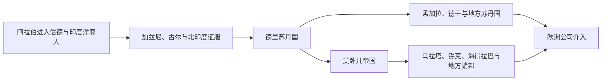

# 南亚伊斯兰王朝、莫卧儿与区域国家

## 时间

约8世纪—18世纪

## 概括

伊斯兰在南亚的传播有多条路径：阿拉伯军队8世纪进入信德，商人长期活动于印度洋港口，苏菲社团进入乡村与城市，突厥和阿富汗军事集团则在北印度建立苏丹国。德里苏丹国和莫卧儿帝国是关键政治节点，但孟加拉、德干、旁遮普、克什米尔、信德与马拉巴尔都有不同的伊斯兰社会史。

## 主要政权与过程

| 政权或过程 | 时间 | 特征 |
|---|---|---|
| 信德阿拉伯统治 | 8世纪以后 | 南亚西北最早的伊斯兰政治据点之一 |
| 加兹尼、古尔诸王朝 | 10—12世纪 | 从阿富汗高原向旁遮普和恒河平原扩张 |
| 德里苏丹国 | 1206—1526年 | 奴隶、卡尔吉、图格鲁克、赛义德、洛迪诸王朝 |
| 孟加拉苏丹国 | 14—16世纪 | 三角洲开发、孟加拉语文化与印度洋贸易 |
| 德干苏丹国 | 14—17世纪 | 巴赫曼尼及后继诸国，连接波斯湾与南印度 |
| 莫卧儿帝国 | 1526—1857年 | 波斯化宫廷、曼萨卜制、土地税与区域整合 |
| 锡克、马拉塔及诸邦 | 18—19世纪 | 莫卧儿衰落后新的军事财政国家兴起 |

## 辨析

- 伊斯兰化不是单靠军事征服完成；贸易、苏菲网络、婚姻、地方政治和农业开发同样重要。
- 莫卧儿帝国并未持续直接统治整个次大陆，地方王国、部族与城市精英始终具有能动性。
- 印度教与伊斯兰社会之间既有冲突，也有语言、音乐、建筑、法律和日常生活中的长期交织。
