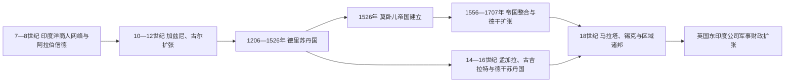

# 南亚伊斯兰王朝、莫卧儿与区域国家

## 时间

约8世纪—19世纪中叶；重点为1206—18世纪的苏丹国、莫卧儿帝国与区域军事财政国家。

## 概括

伊斯兰进入南亚有多条路径：阿拉伯军队8世纪进入信德，阿拉伯与波斯商人更早已活动于印度洋港口，苏菲社团、学者和移民在城市与乡村建立网络，突厥与阿富汗军事集团则从西北建立苏丹国。德里苏丹国和莫卧儿帝国是重要政治节点，但孟加拉、克什米尔、古吉拉特、德干、旁遮普、信德、马拉巴尔和泰米尔海岸都有不同的伊斯兰社会史；印度教、耆那教、锡克教等社群也始终参与国家与市场。

## 传播与建国路径

### 信德、海岸与西北通道

711—712年，倭马亚将领穆罕默德·本·卡西姆征服信德部分地区，建立南亚西北较早的伊斯兰政权据点，但统治范围和文化影响长期局限于区域。与此同时，阿拉伯海商人通过古吉拉特、马拉巴尔、斯里兰卡和马尔代夫港口建立侨居社群；贸易、婚姻、法学和地方保护比领土征服更能解释若干海岸社会的伊斯兰化。

10—12世纪，加兹尼和古尔统治者从阿富汗高原进入旁遮普与恒河平原。加兹尼的多次远征以战利品、威望和边疆控制为主要目标；古尔势力则在1192年第二次德赖战役后建立较持久据点。1206年古尔系将领库特布丁·艾伊拜克自立，通常视为德里苏丹国起点。

### 德里苏丹国的扩张与分化

奴隶、卡尔吉、图格鲁克、赛义德、洛迪五朝以德里为中心相继统治。苏丹依靠奴隶军人、突厥—阿富汗骑兵、波斯语文官和伊克塔税赋分配扩张，同时必须与拉其普特、地方地主、城市商人、宗教人士及村社妥协。阿拉乌丁·卡尔吉控制市场和军费、向德干远征；穆罕默德·本·图格鲁克的迁都、代用货币和远征计划则暴露行政能力边界。

14世纪后，孟加拉、古吉拉特、马尔瓦、克什米尔和德干相继形成独立苏丹国。巴赫曼尼王国分裂后出现艾哈迈德讷格尔、比贾布尔、戈尔康达等德干国家，与毗奢耶那伽罗、葡萄牙海上势力和后来的莫卧儿长期竞争。南亚政治由多个波斯化宫廷组成，而非德里向全境单向辐射。

### 莫卧儿的建立、重建与整合

巴布尔在1526年第一次帕尼帕特战役击败洛迪王朝，火器、骑兵机动和对手分裂帮助其建立新政权。其子胡马雍一度被舍尔沙击败；舍尔沙的道路、银币和土地财政改革被后来的莫卧儿吸收。1556年阿克巴重新稳固王朝，通过曼萨卜等级、扎吉尔俸地、测量税制、王族婚姻和吸纳拉其普特等地方精英，把征服转化为可持续统治。

贾汉吉尔、沙贾汗时期宫廷文化、城市、纺织品和印度洋贸易繁荣，帝国也依赖地方中介和不断分配的税源。奥朗则布吞并比贾布尔、戈尔康达，使版图达到最大，却把军队长期拖入德干；马拉塔游击、扎吉尔不足、继承战争和地方精英自主使帝国扩张成本超过财政整合能力。

### 18世纪区域国家

1707年后，莫卧儿皇帝仍提供名义合法性，但孟加拉、奥德、海得拉巴等总督政权趋于自主；马拉塔以佩什瓦、税权和军事联盟扩张，锡克密团最终由兰季特·辛格整合，迈索尔、特拉凡哥尔、拉其普特诸邦也各有国家化路径。1739年纳迪尔沙攻陷德里和随后阿富汗入侵削弱帝国中心。英国东印度公司利用地方战争、信贷、印度兵和孟加拉税收，逐步从区域竞争者变为殖民霸权。

## 统治结构比较

| 政权 | 军事与财政基础 | 地方统治 | 宗教与合法性 |
|---|---|---|---|
| 德里苏丹国 | 骑兵、奴隶军人、伊克塔税赋 | 依赖地方首领、村社与税收承包者 | 哈里发承认、伊斯兰法与胜利者王权并用 |
| 孟加拉与德干苏丹国 | 稻作三角洲、港口、马匹贸易和区域军队 | 吸纳本地文官、地主、工匠和商人 | 波斯化宫廷与孟加拉语、达克尼语及地方圣地并存 |
| 莫卧儿帝国 | 曼萨卜军官、扎吉尔俸地、土地税与火器军队 | 皇帝、行省、地主和村社形成分层关系 | 帖木儿血统、君主正义、苏菲联系与多社群协商 |
| 马拉塔联盟 | 骑兵、乔特税与地方堡垒 | 佩什瓦和辛迪亚、霍尔卡等家族形成联盟 | 印度教王权象征与现实军事财政并重 |
| 锡克国家 | 密团武装、土地税与拉合尔中心 | 军事首领被王国机构逐步整合 | 古鲁传统、卡尔萨共同体与君主制结合 |

## 重要事件与转折

| 时间 | 事件 | 结果与长期影响 |
|---|---|---|
| 711—712年 | 阿拉伯军队进入信德 | 建立区域据点，但未造成次大陆整体伊斯兰化 |
| 1192年 | 第二次德赖战役 | 古尔势力打开恒河平原政治空间 |
| 1206年 | 德里苏丹国建立 | 北印度出现持续数世纪的苏丹国传统 |
| 1290—1316年 | 卡尔吉扩张与市场管制 | 德里势力深入德干，军费与行政集中加强 |
| 1320—1351年 | 图格鲁克扩张及政策试验 | 过度扩张和叛乱推动地方苏丹国形成 |
| 1347年 | 巴赫曼尼苏丹国建立 | 德干形成独立的伊斯兰王朝中心 |
| 1526年 | 第一次帕尼帕特战役 | 巴布尔击败洛迪，莫卧儿政权建立 |
| 1540—1555年 | 舍尔沙与苏尔王朝统治 | 莫卧儿中断，财政、道路和货币制度影响后世 |
| 1556—1605年 | 阿克巴统治 | 王朝完成军事财政和精英联盟整合 |
| 1658—1707年 | 奥朗则布统治 | 帝国领土最大化，德干战争与财政紧张同步加深 |
| 1739年 | 纳迪尔沙攻陷德里 | 帝国威望和财富受重创，区域国家自主加速 |
| 1757—1765年 | 公司控制孟加拉财政 | 南亚军事竞争开始被殖民税收体系重塑 |

## 伊斯兰化与文化交织

伊斯兰化速度因地区而异。孟加拉三角洲的新垦殖、苏菲圣地与地方政治相连；旁遮普受苏菲、军政与跨境交通共同影响；马拉巴尔和马尔代夫更依赖海商社群；宫廷和城市的波斯语文化又与本地语言、音乐、建筑和文学结合。改宗可能来自信仰、婚姻、社群保护、职业网络或土地开发，不能归结为强迫或物质利益中的单一原因。

冲突确实存在，包括战争、寺庙破坏、征税差异和宗派竞争；合作同样存在于行政任用、军队、市场、艺术和共享圣地。分析具体统治者时，应区分政治宣传、战争行为、法律规范与地方日常实践。

## 兴衰因果

- **崛起条件：** 西北军事通道、机动骑兵与火器、波斯语官僚传统、富庶农业税源和吸纳地方精英的能力。
- **结构压力：** 官员俸地与可征税土地之间失衡、继承制度缺少固定规则、帝国扩张依赖持续战争，以及地方社会保有强大自主资源。
- **外部压力：** 蒙古威胁、伊朗与阿富汗入侵、葡萄牙等海上势力及欧洲公司的金融—军事介入。
- **直接触发：** 德里苏丹国终结于1526年洛迪内部分裂和巴布尔胜利；莫卧儿中央权威则在18世纪继承战争、德干消耗、地方自主与外敌打击中分解，并非1707年一次性“灭亡”。

## 相关入口

- [德里苏丹国](/%E4%BA%BA%E6%96%87%E7%A7%91%E5%AD%A6/%E5%8E%86%E5%8F%B2/%E5%8D%97%E4%BA%9A/%E5%8D%B0%E5%BA%A6/%E5%BE%B7%E9%87%8C%E8%8B%8F%E4%B8%B9%E5%9B%BD.md)
- [莫卧儿帝国](/%E4%BA%BA%E6%96%87%E7%A7%91%E5%AD%A6/%E5%8E%86%E5%8F%B2/%E5%8D%97%E4%BA%9A/%E5%8D%B0%E5%BA%A6/%E8%8E%AB%E5%8D%A7%E5%84%BF%E5%B8%9D%E5%9B%BD.md)
- [马拉塔联盟与地方诸邦](/%E4%BA%BA%E6%96%87%E7%A7%91%E5%AD%A6/%E5%8E%86%E5%8F%B2/%E5%8D%97%E4%BA%9A/%E5%8D%B0%E5%BA%A6/%E9%A9%AC%E6%8B%89%E5%A1%94%E8%81%94%E7%9B%9F%E4%B8%8E%E5%9C%B0%E6%96%B9%E8%AF%B8%E9%82%A6.md)
- [古代孟加拉、帕拉与伊斯兰苏丹国](/%E4%BA%BA%E6%96%87%E7%A7%91%E5%AD%A6/%E5%8E%86%E5%8F%B2/%E5%8D%97%E4%BA%9A/%E5%AD%9F%E5%8A%A0%E6%8B%89%E5%9B%BD/%E5%8F%A4%E4%BB%A3%E5%AD%9F%E5%8A%A0%E6%8B%89%E3%80%81%E5%B8%95%E6%8B%89%E4%B8%8E%E4%BC%8A%E6%96%AF%E5%85%B0%E8%8B%8F%E4%B8%B9%E5%9B%BD.md)
- [印度河、犍陀罗与伊斯兰化](/%E4%BA%BA%E6%96%87%E7%A7%91%E5%AD%A6/%E5%8E%86%E5%8F%B2/%E5%8D%97%E4%BA%9A/%E5%B7%B4%E5%9F%BA%E6%96%AF%E5%9D%A6/%E5%8D%B0%E5%BA%A6%E6%B2%B3%E3%80%81%E7%8A%8D%E9%99%80%E7%BD%97%E4%B8%8E%E4%BC%8A%E6%96%AF%E5%85%B0%E5%8C%96.md)
- [早期岛屿社会与伊斯兰苏丹国](/%E4%BA%BA%E6%96%87%E7%A7%91%E5%AD%A6/%E5%8E%86%E5%8F%B2/%E5%8D%97%E4%BA%9A/%E9%A9%AC%E5%B0%94%E4%BB%A3%E5%A4%AB/%E6%97%A9%E6%9C%9F%E5%B2%9B%E5%B1%BF%E7%A4%BE%E4%BC%9A%E4%B8%8E%E4%BC%8A%E6%96%AF%E5%85%B0%E8%8B%8F%E4%B8%B9%E5%9B%BD.md)
