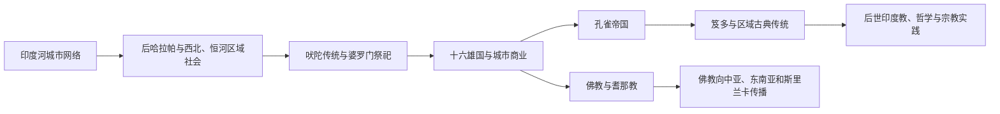

# 南亚古代文明、宗教与思想传统

## 时间

约前2600年—公元1千纪中期

## 概括

南亚古代史由多中心社会构成。印度河流域出现高度城市化的哈拉帕传统；其后西北、恒河、德干和南部地区发展不同的语言、农业与政治共同体。吠陀文献、婆罗门祭祀、奥义书思想、佛教、耆那教和后来的印度教诸传统，既有相互影响，也不能被理解为一条单线继承。

## 主要传统

| 传统或过程 | 核心区域 | 历史意义 |
|---|---|---|
| 印度河文明 | 信德、旁遮普及今印度西北 | 城市规划、手工业、远程贸易与未释读文字 |
| 吠陀传统 | 西北至恒河上游 | 祭祀、梵语文献、社会等级与思想讨论 |
| 恒河国家化 | 摩揭陀、憍萨罗等 | 城市、货币、王权与商人群体发展 |
| 佛教 | 恒河中下游、尼泊尔南部 | 苦、无常、解脱与僧团传统，后形成跨亚洲网络 |
| 耆那教 | 北印度与西印度 | 非暴力、苦行和商人社群传统 |
| 南印度古典社会 | 泰米尔地区与德干 | 泰米尔文学、港口贸易与地方王权 |

## 重要节点

- 印度河文明的文字至今未被可靠释读，不能用后世印度教或吠陀传统直接解释其全部社会。
- 前6—前5世纪恒河平原出现城市与国家竞争，释迦牟尼和耆那教祖师大雄均处于这一历史背景。
- 阿育王石刻使用多种文字和语言，说明孔雀帝国面对的是多样化社会。
- 佛教借由僧团、王权赞助与海陆商路传入斯里兰卡、中亚、东南亚和东亚。
- 吠陀、佛教、耆那教和后来的宗派印度教彼此竞争、交流，并非互相替代的简单阶段。
