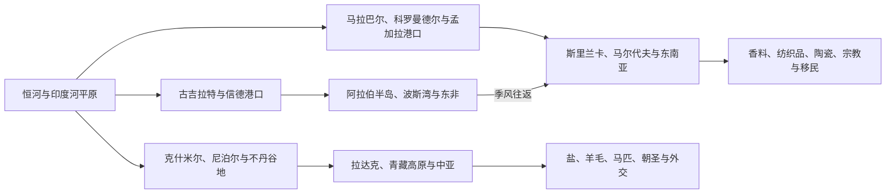

# 喜马拉雅与印度洋：山地、季风与贸易网络

## 时间

史前至今；重点观察山地通道、季风海运与国家边界如何共同改变人口、商品和思想流动。

## 概括

喜马拉雅并非不可穿越的“天然城墙”，印度洋也不是空白海面。山地谷地、垭口、河谷、绿洲和驿站把恒河平原、克什米尔、拉达克、尼泊尔、不丹与青藏高原、中亚连接；季风风向则使阿拉伯海、孟加拉湾、斯里兰卡和马尔代夫形成有节律的航行网络。两种网络都依赖中介社群、政治保护、仓储信用和对生态风险的适应。

## 环境如何塑造网络

### 山地不是单一路线

喜马拉雅贸易沿可季节通行的垭口和谷地展开。克什米尔—拉达克—叶尔羌路线、西尼泊尔通道、加德满都谷地—西藏路线以及不丹各山谷连接不同生态带。高原输出盐、羊毛、硼砂、牲畜和药材，低地输入粮食、棉布、金属器和香料；商队必须依靠驮畜、地方向导、市场节期和沿途政治许可。

山地王国可通过关税、驿站、婚姻和宗教赞助控制中转，却很难持续占领所有垭口。寺院、商人家族和边民往往同时承担信贷、翻译、外交与情报功能。佛教从恒河流域向克什米尔、尼泊尔、喜马拉雅和西藏传播时，也沿用这些物质网络。

### 季风形成往返节律

阿拉伯海冬夏风向转换，使船只在特定季节从红海、波斯湾、东非驶向南亚，再等待反向季风返航。港口因此需要仓储、修船、信贷、司法和多语中介；外来商人常长期居留并与本地社群通婚。孟加拉湾航线把斯里兰卡、泰米尔海岸、孟加拉、阿拉干和东南亚连接，海峡与岛屿既是补给点也是政治争夺对象。

季风知识早于欧洲远航。南印度—斯里兰卡—东南亚海路在公元初已有稳定往来；阿拉伯和波斯商人后来扩大网络，葡萄牙、荷兰和英国则以武装通行证、公司垄断和港口炮台试图改变既有规则，而非从无到有“发现”印度洋。

## 两类网络比较

| 网络 | 关键节点 | 主要流动 | 权力与风险 |
|---|---|---|---|
| 西喜马拉雅—中亚 | 克什米尔、列城、喀喇昆仑垭口、叶尔羌 | 羊毛、马匹、玉石、藏红花、粮食、棉布 | 雪季、山口封闭、边境战争与商队保护 |
| 尼泊尔—西藏 | 加德满都谷地、吉隆等通道、拉萨 | 盐、羊毛、金属工艺、钱币、僧侣与使团 | 尼瓦尔商人、山地王权、清帝国和后来的边界制度 |
| 不丹—孟加拉 | 帕罗、普那卡、杜阿尔平原 | 山地产品、稻米、布匹、税贡与劳务 | 山谷政权控制低地门口，英属印度条约改变主权关系 |
| 阿拉伯海 | 信德、古吉拉特、马拉巴尔、马尔代夫、阿曼、东非 | 马匹、胡椒、棉布、椰绳、黄金、象牙与朝圣者 | 季风等待、海盗、护航和港口关税 |
| 孟加拉湾 | 孟加拉、奥里萨、科罗曼德尔、斯里兰卡、阿拉干、东南亚 | 稻米、纺织品、象、宝石、陶瓷、佛教与伊斯兰网络 | 三角洲变迁、风暴、海峡控制和区域战争 |
| 斯里兰卡—马尔代夫 | 曼纳尔、科伦坡、亭可马里、马累等 | 肉桂、宝石、珍珠、贝币、椰产品和补给 | 岛屿王权、外来商站与殖民据点竞争 |

## 历史阶段

### 古代陆海联系

印度河城市与伊朗高原、海湾已有交换。孔雀以后，西北道路把南亚连接到中亚帝国，海路则把红海、印度西岸、斯里兰卡和东南亚串联。佛教僧团、商人捐赠和港口城市相互支持；罗马钱币与陶器说明贸易联系，不能据此推断罗马政治统治。

### 伊斯兰商贸与区域港国

8世纪以后，阿拉伯和波斯商人深入马拉巴尔、古吉拉特、孟加拉湾和马尔代夫。商业定居、婚姻、苏菲网络与地方统治者保护推动伊斯兰社群成长。朱罗远征、斯里兰卡诸王国、古吉拉特和孟加拉苏丹国等都以海关、船运和港口资源参与区域竞争。

### 欧洲公司与殖民海权

1498年达·伽马到达卡利卡特后，葡萄牙试图用炮舰、要塞和通行证垄断航路，但须与古吉拉特、奥斯曼、阿拉伯商人及印度港国竞争。荷兰公司集中香料和斯里兰卡海岸贸易，英国公司最终把孟加拉税收、印度造船与皇家海军结合，将商业优势转成领土帝国。

山地国家没有全部被直接吞并，却被条约、驻扎官、战争赔款和边界测绘纳入英属印度安全体系。尼泊尔在1814—1816年英尼战争后签署《塞高里条约》；不丹在19世纪冲突后割让或放弃部分低地权利。所谓“缓冲国”地位伴随真实的主权约束。

### 蒸汽、苏伊士与现代边界

蒸汽船和1869年苏伊士运河缩短欧洲—南亚航程，使港口、铁路和种植园更紧密地纳入帝国经济。1947年后，印巴边界、中印边界和封闭山口切断若干旧商路；航空、公路和集装箱港又建立新网络。海湾劳务迁移、石油航线、旅游业和跨境汇款成为斯里兰卡、尼泊尔、孟加拉国、印度、巴基斯坦和马尔代夫经济的重要部分。

## 重要转折

| 时间 | 转折 | 网络变化 |
|---|---|---|
| 前3—前2千纪 | 印度河城市与海湾交换 | 南亚早期海陆远程网络形成 |
| 前3世纪以后 | 佛教僧团与帝国道路扩展 | 朝圣、文本和艺术沿贸易路线传播 |
| 公元1世纪前后 | 红海—印度洋航行记录增多 | 季风往返把罗马世界、南亚和东南亚相连 |
| 8世纪以后 | 阿拉伯、波斯海商网络扩大 | 海岸穆斯林社群和跨区域法商网络成长 |
| 10—13世纪 | 朱罗海上活动与孟加拉湾贸易 | 南印度王权更直接介入港口和海峡政治 |
| 1498年以后 | 葡萄牙武装商路进入 | 航线从多方竞争转向炮舰、要塞与通行证竞争 |
| 17—18世纪 | 荷兰、英国公司扩张 | 商业公司把港口网络同殖民财政结合 |
| 1814—1865年 | 英国与尼泊尔、不丹战争及条约 | 喜马拉雅通道被边界测绘和缓冲国体系重塑 |
| 1869年 | 苏伊士运河开通 | 蒸汽航运与欧洲市场的时间距离缩短 |
| 1947年以后 | 国家边界、战争与新交通 | 若干旧商路中断，港口、航空和劳务网络兴起 |

## 国家、社群与宗教

- **国家形成：** 山地关口和海港提供税收，却也使政权依赖商人、船主、寺院、部族和地方首领。
- **宗教传播：** 佛教、印度教、伊斯兰和基督宗教都借网络移动，但改宗和制度化取决于本地语言、婚姻、王权与社群组织。
- **离散社群：** 古代商人侨居、殖民契约劳工和现代海湾劳务迁移形成不同类型的跨国家庭和汇款网络。
- **生态限制：** 季风失败、旋风、海平面上升、冰川融化和河流变化会同时冲击农业、港口、水电与边界政治。
- **方法提醒：** “封闭山国”与“欧洲发现航路”都会遮蔽长期本地知识和跨境流动；应把路线、节点与中介社群同时纳入分析。

## 相关入口

- [尼泊尔历史](/%E4%BA%BA%E6%96%87%E7%A7%91%E5%AD%A6/%E5%8E%86%E5%8F%B2/%E5%8D%97%E4%BA%9A/%E5%B0%BC%E6%B3%8A%E5%B0%94/README.md)
- [不丹历史](/%E4%BA%BA%E6%96%87%E7%A7%91%E5%AD%A6/%E5%8E%86%E5%8F%B2/%E5%8D%97%E4%BA%9A/%E4%B8%8D%E4%B8%B9/README.md)
- [斯里兰卡历史](/%E4%BA%BA%E6%96%87%E7%A7%91%E5%AD%A6/%E5%8E%86%E5%8F%B2/%E5%8D%97%E4%BA%9A/%E6%96%AF%E9%87%8C%E5%85%B0%E5%8D%A1/README.md)
- [马尔代夫历史](/%E4%BA%BA%E6%96%87%E7%A7%91%E5%AD%A6/%E5%8E%86%E5%8F%B2/%E5%8D%97%E4%BA%9A/%E9%A9%AC%E5%B0%94%E4%BB%A3%E5%A4%AB/README.md)
- [南亚古代文明、宗教与思想传统](/%E4%BA%BA%E6%96%87%E7%A7%91%E5%AD%A6/%E5%8E%86%E5%8F%B2/%E5%8D%97%E4%BA%9A/_%E9%80%9A%E5%8F%B2/%E5%8F%A4%E4%BB%A3%E6%96%87%E6%98%8E%E3%80%81%E5%AE%97%E6%95%99%E4%B8%8E%E6%80%9D%E6%83%B3%E4%BC%A0%E7%BB%9F.md)
- [南亚伊斯兰王朝、莫卧儿与区域国家](/%E4%BA%BA%E6%96%87%E7%A7%91%E5%AD%A6/%E5%8E%86%E5%8F%B2/%E5%8D%97%E4%BA%9A/_%E9%80%9A%E5%8F%B2/%E4%BC%8A%E6%96%AF%E5%85%B0%E7%8E%8B%E6%9C%9D%E3%80%81%E8%8E%AB%E5%8D%A7%E5%84%BF%E4%B8%8E%E5%8C%BA%E5%9F%9F%E5%9B%BD%E5%AE%B6.md)
