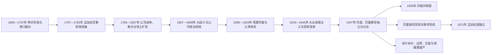

# 英属印度、分治与现代南亚

## 时间

1600年至今；重点为1757年公司领土扩张、1858年英王直接统治、1947年分治及其区域遗产。

## 概括

英国东印度公司先以特许贸易公司身份进入南亚，借孟加拉财政、印度兵源、海军和地方盟友，在区域国家竞争中取得领土。1857年大起义后，英王政府直接统治英属印度，同时保留数百土邦。殖民国家重组土地税、军队、铁路、法律、教育和人口分类，也使饥荒、商品化、劳工迁移与族群代表权具有新的制度尺度。

1947年分治不是“古老宗教仇恨”的必然结果，而是殖民统治、民族政治、联邦谈判、战争压力、精英选择和地方暴力共同造成的断裂。印度、巴基斯坦、孟加拉国以及斯里兰卡、尼泊尔、不丹、马尔代夫的现代路径不同，却持续受到殖民边界、安全体系、人口迁移和不均衡发展的影响。

## 公司从贸易到领土国家

1600年英国东印度公司获特许，17世纪在苏拉特、马德拉斯、孟买和加尔各答等地建立商站。它起初须向莫卧儿及地方统治者取得贸易权；18世纪莫卧儿中心衰弱、欧洲战争外溢和孟加拉宫廷斗争才给公司军事介入空间。

1757年普拉西战役并非少量英军单独“征服印度”，而是公司与孟加拉反对派、银行家及地方将领合谋击败西拉杰·乌德·达乌拉。1764年布克萨尔战役后，公司于1765年取得孟加拉、比哈尔、奥里萨的税收权，以本地财政支付军队，再通过迈索尔战争、马拉塔战争、附属同盟、驻军费用和“丧失权利原则”等方式扩张。印度兵、文官、商人和盟邦是帝国运作的一部分，但其合作处于不平等权力关系中。

公司建立永久地税、莱特瓦里和马哈尔瓦里等差异化征收制度，推动现金作物、土地市场和税收固定化。制度效果因地区而异；高额征收、市场波动、战争和救济不足加重若干饥荒。公司司法和教育也制造新的职业精英，同时把英国法、本地习惯和宗教身份重新分类。

## 1857年起义与英王统治

1857年军用弹药争议触发孟加拉军团印度兵哗变，但深层原因还包括吞并政策、军队歧视、地主和农民损失、宫廷被废及宗教社会恐惧。起义从密拉特扩展到德里、奥德、坎普尔和占西，各地目标并不统一；旁遮普、孟买和马德拉斯军团及若干土邦支持或未加入起义。1858年英国废除公司领土统治，由国务大臣、印度总督兼副王和殖民官僚直接管理。

殖民国家此后调整军队族群构成，与土邦、地主和地方精英结盟，避免大规模社会改革触发反抗。铁路、电报、运河和统一行政便利商品流动，也首先服务军队调动、税收和出口。印度军队参与阿富汗、东非、中国及两次世界大战；契约劳工则被运往加勒比、毛里求斯、斐济、东南亚和非洲，形成跨洋离散社群。

## 民族主义与代表权政治

1885年印度国民大会成立，早期以请愿、预算批评和文官平等为主。1905年孟加拉分割引发抵制与“自产”运动；1906年全印穆斯林联盟成立。殖民政府以有限选举和分社群选区回应政治压力，在扩大参与的同时把宗教类别写入代表制度。

第一次世界大战后的税负、征兵、罗拉特法和1919年阿姆利则屠杀推动群众政治。甘地领导不合作、食盐进军和公民抗命，国大党建立跨地区组织；革命者、工会、农民、达利特运动、妇女组织、印度国民军和各省党派也有独立目标。安贝德卡等人强调种姓压迫和政治保障，说明反殖民阵营内部并非意见一致。

1935年《印度政府法》扩大省自治，1937年选举使国大党和联盟在省级治理中竞争。第二次世界大战期间，英国未经印度代表同意宣布参战；“退出印度”运动遭镇压，联盟则扩大组织。战争财政、1943年孟加拉饥荒、印度国民军审判和1946年海军兵变共同削弱殖民统治能力。

## 1947年谈判、划界与暴力

1940年拉合尔决议提出穆斯林多数地区的政治安排，但“巴基斯坦”边界和制度并未立即确定。1946年内阁使团曾尝试以弱中央和省群组维持统一，国大党、穆斯林联盟、锡克代表、土邦和英国对主权分配的分歧使方案失败。直接行动日及其后的加尔各答、诺阿卡利、比哈尔和旁遮普暴力加深恐惧。

英国原拟在1948年6月前退出，蒙巴顿把移交提前至1947年8月。拉德克利夫委员会在极短时间内按宗教多数并兼顾交通、水利等因素划分旁遮普和孟加拉；边界在独立庆典后公布。约一千多万人迁徙，民兵、军队、警察、地方政治组织和报复循环造成大规模屠杀、绑架与性暴力。暴力既有崩溃失序，也有组织者，不应以“自发宗教仇恨”卸除殖民撤退和政治动员责任。

## 现代国家重组

| 地区 | 宪制与政治路径 | 分治及殖民遗产 |
|---|---|---|
| 印度 | 1950年宪法建立联邦议会共和国；语言邦重组与选举制度维持大规模多党政治 | 土邦整合、种姓不平等、宗教政治、边疆治理与殖民官僚体系持续调整 |
| 巴基斯坦 | 1947年以东西两翼建国；文官、军队、司法和省级力量反复重组 | 首都与资源集中、克什米尔战争和安全国家化削弱联邦协商 |
| 孟加拉国 | 语言运动、1970年选举危机、军事镇压和1971年战争后独立 | 殖民孟加拉分割、东西巴基斯坦不平等和难民问题叠加 |
| 斯里兰卡 | 1948年独立，议会制度延续；语言、族群和国家认同冲突最终演成内战 | 种植园经济、人口分类和殖民宪制影响公民权与代表权 |
| 尼泊尔、不丹 | 未被直接并入英属印度，但受战争、条约、贸易和边界体系约束 | 喜马拉雅安全缓冲逻辑延续到独立后的地区关系 |
| 马尔代夫 | 英国保护关系下保留苏丹内政，1965年独立、1968年建共和国 | 海上战略、基地与旅游经济取代早期保护关系 |

## 重要事件与转折

| 时间 | 事件 | 结果与长期影响 |
|---|---|---|
| 1757年 | 普拉西战役 | 公司借地方联盟进入孟加拉权力核心 |
| 1764—1765年 | 布克萨尔战役与税收权取得 | 孟加拉财政成为继续扩张的基础 |
| 1799、1818、1849年 | 迈索尔、马拉塔和锡克主要战争终结 | 公司逐步成为次大陆最强领土政权 |
| 1857—1858年 | 大起义与统治转移 | 公司政治统治终结，英王直接统治开始 |
| 1885年 | 印度国民大会成立 | 全印度政治协商与民族主义组织化 |
| 1905—1911年 | 孟加拉分割与反分割运动 | 大众抵制、社群政治和殖民让步同步发展 |
| 1919年 | 罗拉特法、阿姆利则屠杀与新宪制 | 殖民合法性受重创，群众运动扩大 |
| 1930年 | 食盐进军 | 公民抗命把日常税制转化为全国政治议题 |
| 1940—1946年 | 拉合尔决议、战争与内阁使团失败 | 分治从模糊诉求转为可执行政治方案 |
| 1947年8月 | 独立、划界与迁徙暴力 | 印度、巴基斯坦建立，旁遮普和孟加拉社会被重组 |
| 1950年 | 印度宪法生效 | 联邦、基本权利和议会制度制度化 |
| 1971年 | 孟加拉国独立战争 | 巴基斯坦两翼国家解体，南亚格局再变 |

## 因果层次与长期影响

- **公司扩张的结构条件：** 印度洋海军和全球信贷、孟加拉税收、印度兵源，以及莫卧儿后区域国家竞争。
- **殖民统治的维持机制：** 土邦和地主合作、族群化军队、法律与人口分类、基础设施及有限代表制度。
- **殖民衰落因素：** 大众组织、劳工和农民政治、两次世界大战成本、国际反殖民环境、军队忠诚疑虑和英国国内政治选择。
- **分治的直接触发：** 1946年联邦谈判破裂、社群暴力扩大和1947年仓促移交；不能以单一领袖或单一宗教解释。
- **长期遗产：** 克什米尔争端、三次以上印巴战争、难民与少数群体问题、河水分配和核威慑；殖民铁路、军队、文官和普通法体系则被新国家以不同方式继承。

## 相关入口

- [英属印度](/%E4%BA%BA%E6%96%87%E7%A7%91%E5%AD%A6/%E5%8E%86%E5%8F%B2/%E5%8D%97%E4%BA%9A/%E5%8D%B0%E5%BA%A6/%E8%8B%B1%E5%B1%9E%E5%8D%B0%E5%BA%A6.md)
- [印度总督与副王表](/%E4%BA%BA%E6%96%87%E7%A7%91%E5%AD%A6/%E5%8E%86%E5%8F%B2/%E5%8D%97%E4%BA%9A/%E5%8D%B0%E5%BA%A6/%E5%8D%B0%E5%BA%A6%E6%80%BB%E7%9D%A3%E4%B8%8E%E5%89%AF%E7%8E%8B%E8%A1%A8.md)
- [印度独立与印巴分治](/%E4%BA%BA%E6%96%87%E7%A7%91%E5%AD%A6/%E5%8E%86%E5%8F%B2/%E5%8D%97%E4%BA%9A/%E5%8D%B0%E5%BA%A6/%E5%8D%B0%E5%BA%A6%E7%8B%AC%E7%AB%8B%E4%B8%8E%E5%8D%B0%E5%B7%B4%E5%88%86%E6%B2%BB.md)
- [印度共和国](/%E4%BA%BA%E6%96%87%E7%A7%91%E5%AD%A6/%E5%8E%86%E5%8F%B2/%E5%8D%97%E4%BA%9A/%E5%8D%B0%E5%BA%A6/%E5%8D%B0%E5%BA%A6%E5%85%B1%E5%92%8C%E5%9B%BD.md)
- [巴基斯坦分治、联邦与军政循环](/%E4%BA%BA%E6%96%87%E7%A7%91%E5%AD%A6/%E5%8E%86%E5%8F%B2/%E5%8D%97%E4%BA%9A/%E5%B7%B4%E5%9F%BA%E6%96%AF%E5%9D%A6/%E5%88%86%E6%B2%BB%E3%80%81%E8%81%94%E9%82%A6%E4%B8%8E%E5%86%9B%E6%94%BF%E5%BE%AA%E7%8E%AF.md)
- [东巴基斯坦、独立战争与人民共和国](/%E4%BA%BA%E6%96%87%E7%A7%91%E5%AD%A6/%E5%8E%86%E5%8F%B2/%E5%8D%97%E4%BA%9A/%E5%AD%9F%E5%8A%A0%E6%8B%89%E5%9B%BD/%E4%B8%9C%E5%B7%B4%E5%9F%BA%E6%96%AF%E5%9D%A6%E3%80%81%E7%8B%AC%E7%AB%8B%E6%88%98%E4%BA%89%E4%B8%8E%E4%BA%BA%E6%B0%91%E5%85%B1%E5%92%8C%E5%9B%BD.md)
- [斯里兰卡独立、族群冲突与战后国家](/%E4%BA%BA%E6%96%87%E7%A7%91%E5%AD%A6/%E5%8E%86%E5%8F%B2/%E5%8D%97%E4%BA%9A/%E6%96%AF%E9%87%8C%E5%85%B0%E5%8D%A1/%E7%8B%AC%E7%AB%8B%E3%80%81%E6%97%8F%E7%BE%A4%E5%86%B2%E7%AA%81%E4%B8%8E%E6%88%98%E5%90%8E%E5%9B%BD%E5%AE%B6.md)
