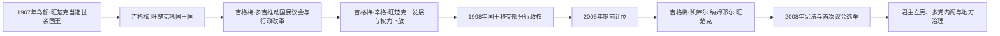

# 不丹的君主制改革与议会民主

## 时间

1907年至今；本页重点叙述1949年后国家现代化与2008年宪政转型。现任信息核验截止2026年7月：国王为吉格梅·凯萨尔·纳姆耶尔·旺楚克，首相为策林·托杰。

## 概括

旺楚克王朝由通萨宗本乌颜·旺楚克在内战和对外谈判中取得优势后，于1907年经宗教、地方和行政精英推举建立。王朝以世袭君主统一此前分散的政教体制，先后同英国和印度维持特殊关系。第三、第四任国王推动废除劳役、土地与司法改革、国民议会、地方分权、发展规划和“国民幸福总值”理念。第四任国王主动启动制宪并于2006年提前退位，第五任国王在2008年宪法下成为国家元首。不丹因而从绝对色彩较强的世袭君主国转为有竞争选举、两院议会和责任内阁的宪政君主国。

## 王朝与民主转型图

民主化主要由王室自上而下推动，但议会选举、反对党、司法和公民社会此后形成自身制度逻辑。完整表分别列国王和民选首相，二者权限不能混同。

## 旺楚克王朝完整世系

| 顺序 | 国王 | 在位时间 | 与前任关系 | 关键事件 / 备注 |
|---:|---|---|---|---|
| 1 | **乌颜·旺楚克** | 1907—1926年 | 开国君主 | 作为通萨宗本在1885年内战后成为实际强人；1907年被推举为世袭国王；1910年《普那卡条约》确认英国指导对外事务。 |
| 2 | 吉格梅·旺楚克 | 1926—1952年 | 乌颜之子 | 维持谨慎对外与传统行政；1949年同独立印度签订友好条约，获得补贴并调整特殊关系。 |
| 3 | **吉格梅·多吉·旺楚克** | 1952—1972年 | 吉格梅·旺楚克之子 | 建国民议会、部长会议和高等法院；改革土地与劳役，推行五年计划；1971年加入联合国。 |
| 4 | **吉格梅·辛格·旺楚克** | 1972—2006年 | 吉格梅·多吉之子 | 提出国民幸福总值，扩大地方参与和内阁责任；处理南部族群与难民危机；启动宪法、政党和议会民主，主动退位。 |
| 5 | **吉格梅·凯萨尔·纳姆耶尔·旺楚克** | 2006年至今 | 吉格梅·辛格长子 | 2008年加冕并在新宪法下履职；以土地赐予、灾害救助和公共服务形成王室社会角色；2026年7月仍在位。 |

王位按世袭继承，但2008年宪法规定国王最迟65岁退位，并设国会在特定条件下要求退位的程序；这使王权不再只受家族惯例约束。

## 宪政结构与实际权力

| 机构 / 角色 | 构成与职权 |
|---|---|
| 国王 | 国家统一和宪法守护者；任命若干宪法职位、授予荣典并承担重要社会救助。多数国务行为须依民选政府和宪法程序，不能自行日常执政。 |
| 国民议会 | 下院，47席，按政党选举；初选后得票前两党进入大选，赢得多数者组阁。 |
| 国民委员会 | 上院，25席，其中20席由各宗选民直接选出、5席由国王任命；成员不得属于政党，负责复核立法。 |
| 首相与内阁 | 下院多数党领袖任首相，部长会议负责实际行政并向国民议会负责；首相任期受宪法限制。 |
| 司法与宪法机构 | 最高法院、选举委员会、反腐败委员会、审计机关等构成制衡；国王依法任命但不能替代机构职能。 |
| 地方政府 | 宗、格窝和市镇有民选机构；地方分权在宪政前已逐步展开，2008年后纳入宪法。 |
| 宗教 | 竹巴噶举传统具有国家文化地位，杰堪布领导中央僧团；僧侣与宗教人士不参加政党选举，以维持宗教与竞争政治区分。 |

## 民选首相

宪政前“不丹首相”职位曾间歇设置，内阁主席也轮任，不能同2008年后的责任内阁首相直接等同。下表列宪法议会时期的民选政府首脑。

| 顺序 | 首相 | 政党 | 任期 | 关键事件 / 备注 |
|---:|---|---|---|---|
| 1 | 吉格梅·廷里 | 不丹繁荣进步党 | 2008—2013年 | 首届民选政府；落实新宪法、地方选举和五年计划，推进国民幸福总值国际倡议。 |
| 2 | **策林·托杰** | 人民民主党 | 2013—2018年 | 首次政党轮替；侧重财政管理、青年就业、环境与对印度关系。 |
| 3 | 洛塔·策林 | 不丹统一党 | 2018—2023年 | 医生出身；推动医疗和公共服务改革，任内应对新冠疫情和边境封控。 |
| 4 | **策林·托杰** | 人民民主党 | 2024年至今 | 2024年再次组阁；应对青年外流、就业和经济转型，并配合格勒普正念之城等长期项目；2026年7月仍在任。 |

选举之间由首席大法官领导的临时政府负责日常事务并组织大选，不属于民选首相序列。

## 重要事件与发展阶段

1. **1949年印不友好条约**：印度承认不丹内政自主并提供补贴，不丹同意在对外关系上接受印度“指导”。它不是正式殖民保护国条约的简单延续，但反映两国安全不对称。
2. **1953年国民议会成立**：第三任国王召集代表僧团、官员和地方居民的议会，为代议与公开讨论建立制度场所。
3. **1950—1960年代社会改革**：废除部分农奴和强制劳役，重分土地，建立现代法院、部长会议、道路、学校和医院；改革依赖印度援助和边境道路建设。
4. **1961年五年计划启动**：国家以计划方式扩展基础设施和公共服务，行政从宗萨网络转向专业文官体系。
5. **1971年加入联合国**：不丹扩大国际承认，随后逐步建立多边外交，同时限制旅游规模以保护文化和环境。
6. **1972年国民幸福总值理念形成**：第四任国王强调经济增长、文化、环境和良政平衡。后来发展为指标体系，但不能把一切政策自动视为幸福最大化。
7. **1980—1990年代南部族群危机**：公民身份审查、语言服饰同化政策、抗议与安全镇压导致大量洛昌人离境或被驱逐至尼泊尔难民营。政府强调非法移民和国家安全，难民与人权组织强调公民权剥夺；责任、人数和自愿性至今存在争议。
8. **1998年行政权下放**：国王把日常行政交给部长会议，并由内阁成员轮任政府首脑，国民议会获得对内阁的不信任程序。
9. **2001—2006年制宪与退位**：宪法委员会参考多国制度并开展全国咨询；第四任国王坚持培养政党与选举，2006年提前传位。
10. **2003年“清剿行动”**：不丹军队清除在南部设营的印度东北部武装组织，显示其安全政策虽与印度合作，仍由不丹国家直接执行。
11. **2007年新版印不条约**：将“接受印度指导”改为双方在国家利益问题上密切合作，强化不丹独立外交表述。
12. **2008年宪法与首次选举**：不丹繁荣进步党赢得国民议会多数，成文宪法生效，第五任国王在宪政框架下加冕。
13. **2013、2018、2024年政党轮替**：每次选举均由不同政党或重新执政的政党和平组阁，证明制度不只是一次性王室安排。
14. **21世纪发展挑战**：水电出口、印度市场和援助支撑财政，森林保护和“高价值、低数量”旅游维护环境；债务、青年失业、海外迁移、住房和经济多元化成为新压力。

## 王朝维系与民主转型原因

- **合法性来源**：旺楚克家族结束19世纪地方战争，王室又以公共服务、宗教文化和个人巡访建立超党派威望。
- **外部安全**：同印度的紧密关系提供市场、道路和安全支持，使国家可在有限军费下推进社会建设，同时需要维护外交自主。
- **渐进式制度建设**：议会、地方机构、内阁和司法在宪法前数十年逐步建立，2008年不是从绝对君主制一夜转成完整民主。
- **由上而下与社会参与并存**：国王是转型主要推动者，但宪法咨询、政党、选民和文官使制度获得实际运行基础。
- **持续张力**：王室威望很高，可能弱化对日常政治责任的公共区分；南部难民问题、媒体空间、政党规模小和经济依赖也限制民主包容性。

## 国家发展机制与争议

不丹以免费基础医疗教育、森林宪法保护、水电收入和审慎旅游形成独特发展模式。国民幸福总值提供超越国内生产总值的政策语言，却不能替代就业、收入、权利和分配的具体衡量。水电使不丹获得外汇，也造成对单一出口和印度融资的依赖；环境保护与基础建设、城市化及气候风险需要持续权衡。

## 演变关系

- 前一阶段：[不丹的宗萨、英属印度与保护关系](/%E4%BA%BA%E6%96%87%E7%A7%91%E5%AD%A6/%E5%8E%86%E5%8F%B2/%E5%8D%97%E4%BA%9A/%E4%B8%8D%E4%B8%B9/%E5%AE%97%E8%90%A8%E3%80%81%E8%8B%B1%E5%B1%9E%E5%8D%B0%E5%BA%A6%E4%B8%8E%E4%BF%9D%E6%8A%A4%E5%85%B3%E7%B3%BB.md)。
- 上级：[不丹历史](/%E4%BA%BA%E6%96%87%E7%A7%91%E5%AD%A6/%E5%8E%86%E5%8F%B2/%E5%8D%97%E4%BA%9A/%E4%B8%8D%E4%B8%B9/README.md)。
- 区域背景：[南亚历史](/%E4%BA%BA%E6%96%87%E7%A7%91%E5%AD%A6/%E5%8E%86%E5%8F%B2/%E5%8D%97%E4%BA%9A/README.md)。
