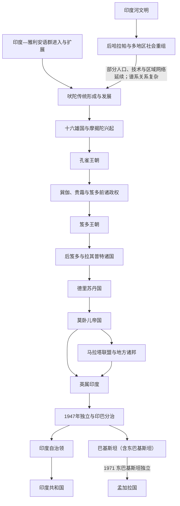

# 印度

## 范围与对象

本页从今日印度共和国所处地域及其现代国家形成出发，串联相关历史阶段。印度河文明、莫卧儿帝国和英属印度是跨越今印度、巴基斯坦、孟加拉国等边界的南亚共享历史；它们在本目录中的既有主笔记供全区域复用，不表示现代印度对这些共同前史具有排他性继承。

1947年以后，本页只沿印度自治领与印度共和国主线继续展开；巴基斯坦和后来的孟加拉国分别进入各自国家目录。

## 历史主线

印度历史的主线可以概括为：印度河流域首先形成城市文明；吠陀时代以后，恒河流域逐步国家化并形成婆罗门、佛教、耆那教等思想宗教传统；孔雀王朝第一次大规模整合北印度，阿育王推动佛教传播；笈多时期常被视为古典印度文化高峰；中世纪以后，突厥、阿富汗和波斯化伊斯兰王朝进入北印度，最终形成德里苏丹国和莫卧儿帝国；18世纪以后，英国东印度公司和英王政府建立殖民统治，1947年英属印度分治后，印度共和国成为现代南亚主要国家。

## 演变图

图中印度河文明与吠陀传统之间通过“后哈拉帕与多地区社会重组”连接，表示时序重叠、区域接触及部分社会延续，不表示已经证实的单一民族或文明直系继承。

## 文明连续性

- 印度河城市体系衰退后，信德、旁遮普、古吉拉特和恒河流域出现多种区域社会；后哈拉帕传统与吠陀文化之间存在接触和延续问题，但不能画成无争议的直接谱系。
- 吠陀、婆罗门、佛教、耆那教、印度教、伊斯兰与锡克等传统在不同区域并存、竞争和融合，并非前一传统整体消失后才出现下一传统。
- 孔雀、笈多、德里苏丹、莫卧儿和英属印度都曾整合广大地区，但其疆界、制度和人口认同并不等同于现代印度共和国。
- 德干、泰米尔地区、东北与边疆社会具有自身连续主线，不能只作为北印度王朝的附属阶段。

## 按时间排序的时期导航

| 顺序 | 阶段 | 时间 | 入口 | 简要概括 |
|---:|---|---|---|---|
| 1 | 印度河文明 | 约前2600年-前1900年 | [印度河文明](/%E4%BA%BA%E6%96%87%E7%A7%91%E5%AD%A6/%E5%8E%86%E5%8F%B2/%E5%8D%97%E4%BA%9A/%E5%8D%B0%E5%BA%A6/%E5%8D%B0%E5%BA%A6%E6%B2%B3%E6%96%87%E6%98%8E.md) | 印度河流域城市文明，以哈拉帕、摩亨佐-达罗、城市规划、贸易和未释读文字为代表。 |
| 2 | 吠陀时代 | 约前1500年-前600年 | [吠陀时代](/%E4%BA%BA%E6%96%87%E7%A7%91%E5%AD%A6/%E5%8E%86%E5%8F%B2/%E5%8D%97%E4%BA%9A/%E5%8D%B0%E5%BA%A6/%E5%90%A0%E9%99%80%E6%97%B6%E4%BB%A3.md) | 印度-雅利安人进入并扩展，吠陀宗教、部落政治、婆罗门祭祀和早期种姓秩序逐渐形成。 |
| 3 | 十六雄国与摩揭陀兴起 | 约前600年-前321年 | [十六雄国与摩揭陀兴起](/%E4%BA%BA%E6%96%87%E7%A7%91%E5%AD%A6/%E5%8E%86%E5%8F%B2/%E5%8D%97%E4%BA%9A/%E5%8D%B0%E5%BA%A6/%E5%8D%81%E5%85%AD%E9%9B%84%E5%9B%BD%E4%B8%8E%E6%91%A9%E6%8F%AD%E9%99%80%E5%85%B4%E8%B5%B7.md) | 恒河流域国家化加强，摩揭陀崛起，佛教、耆那教和城市商业发展。 |
| 4 | 孔雀王朝 | 前321年-前185年 | [孔雀王朝](/%E4%BA%BA%E6%96%87%E7%A7%91%E5%AD%A6/%E5%8E%86%E5%8F%B2/%E5%8D%97%E4%BA%9A/%E5%8D%B0%E5%BA%A6/%E5%AD%94%E9%9B%80%E7%8E%8B%E6%9C%9D.md) | 旃陀罗笈多建立大帝国，阿育王时期扩张和佛教传播达到高峰。 |
| 5 | 巽伽、贵霜与笈多前诸政权 | 前2世纪-4世纪 | [巽伽、贵霜与笈多前诸政权](/%E4%BA%BA%E6%96%87%E7%A7%91%E5%AD%A6/%E5%8E%86%E5%8F%B2/%E5%8D%97%E4%BA%9A/%E5%8D%B0%E5%BA%A6/%E5%B7%BD%E4%BC%BD%E3%80%81%E8%B4%B5%E9%9C%9C%E4%B8%8E%E7%AC%88%E5%A4%9A%E5%89%8D%E8%AF%B8%E6%94%BF%E6%9D%83.md) | 孔雀以后北印度多政权并立，印度-希腊、塞种、贵霜等连接中亚和印度。 |
| 6 | 笈多王朝 | 约320年-550年 | [笈多王朝](/%E4%BA%BA%E6%96%87%E7%A7%91%E5%AD%A6/%E5%8E%86%E5%8F%B2/%E5%8D%97%E4%BA%9A/%E5%8D%B0%E5%BA%A6/%E7%AC%88%E5%A4%9A%E7%8E%8B%E6%9C%9D.md) | 北印度古典文化高峰，梵文文学、印度教、数学、天文学和艺术发展显著。 |
| 7 | 后笈多与拉其普特诸国 | 6世纪-12世纪 | [后笈多与拉其普特诸国](/%E4%BA%BA%E6%96%87%E7%A7%91%E5%AD%A6/%E5%8E%86%E5%8F%B2/%E5%8D%97%E4%BA%9A/%E5%8D%B0%E5%BA%A6/%E5%90%8E%E7%AC%88%E5%A4%9A%E4%B8%8E%E6%8B%89%E5%85%B6%E6%99%AE%E7%89%B9%E8%AF%B8%E5%9B%BD.md) | 笈多后北印度分裂，拉其普特诸国、区域王国和南印度政权并行。 |
| 8 | 德里苏丹国 | 1206年-1526年 | [德里苏丹国](/%E4%BA%BA%E6%96%87%E7%A7%91%E5%AD%A6/%E5%8E%86%E5%8F%B2/%E5%8D%97%E4%BA%9A/%E5%8D%B0%E5%BA%A6/%E5%BE%B7%E9%87%8C%E8%8B%8F%E4%B8%B9%E5%9B%BD.md) | 突厥、阿富汗军事集团在北印度建立伊斯兰苏丹国，推动印度伊斯兰化和波斯化宫廷文化。 |
| 9 | 莫卧儿帝国 | 1526年-1857年 | [莫卧儿帝国](/%E4%BA%BA%E6%96%87%E7%A7%91%E5%AD%A6/%E5%8E%86%E5%8F%B2/%E5%8D%97%E4%BA%9A/%E5%8D%B0%E5%BA%A6/%E8%8E%AB%E5%8D%A7%E5%84%BF%E5%B8%9D%E5%9B%BD.md) | 帖木儿—蒙古系王朝在北印度建立大帝国，阿克巴时期制度成熟，后期与马拉塔、锡克和欧洲公司竞争。 |
| 10 | 马拉塔联盟与地方诸邦 | 17世纪-19世纪 | [马拉塔联盟与地方诸邦](/%E4%BA%BA%E6%96%87%E7%A7%91%E5%AD%A6/%E5%8E%86%E5%8F%B2/%E5%8D%97%E4%BA%9A/%E5%8D%B0%E5%BA%A6/%E9%A9%AC%E6%8B%89%E5%A1%94%E8%81%94%E7%9B%9F%E4%B8%8E%E5%9C%B0%E6%96%B9%E8%AF%B8%E9%82%A6.md) | 莫卧儿衰落后，马拉塔、锡克、海得拉巴、迈索尔等区域力量兴起。 |
| 11 | 英属印度 | 1757年-1947年 | [英属印度](/%E4%BA%BA%E6%96%87%E7%A7%91%E5%AD%A6/%E5%8E%86%E5%8F%B2/%E5%8D%97%E4%BA%9A/%E5%8D%B0%E5%BA%A6/%E8%8B%B1%E5%B1%9E%E5%8D%B0%E5%BA%A6.md) | 英国东印度公司和英王政府逐步控制印度，建立殖民行政、铁路、军队和现代政治结构。 |
| 12 | 印度独立与印巴分治 | 1947年 | [印度独立与印巴分治](/%E4%BA%BA%E6%96%87%E7%A7%91%E5%AD%A6/%E5%8E%86%E5%8F%B2/%E5%8D%97%E4%BA%9A/%E5%8D%B0%E5%BA%A6/%E5%8D%B0%E5%BA%A6%E7%8B%AC%E7%AB%8B%E4%B8%8E%E5%8D%B0%E5%B7%B4%E5%88%86%E6%B2%BB.md) | 英属印度结束，印度和巴基斯坦分治，伴随大规模迁徙和暴力。 |
| 13 | 印度共和国 | 1950年至今 | [印度共和国](/%E4%BA%BA%E6%96%87%E7%A7%91%E5%AD%A6/%E5%8E%86%E5%8F%B2/%E5%8D%97%E4%BA%9A/%E5%8D%B0%E5%BA%A6/%E5%8D%B0%E5%BA%A6%E5%85%B1%E5%92%8C%E5%9B%BD.md) | 印度建立共和国，形成议会民主、联邦制、多语言多宗教国家和现代南亚大国。 |

## 关键断裂与现代承接

| 转折 | 断裂 | 后续承接 |
|---|---|---|
| 印度河城市体系衰退 | 城市网络、河道与远程贸易发生重组，文字传统未获可靠释读 | 后哈拉帕及西北、恒河、古吉拉特等多地区社会继续发展，不能简化为直接转入吠陀时代。 |
| 18—19世纪殖民扩张 | 莫卧儿与区域诸邦的财政军事秩序逐步被公司和英王殖民国家重组 | 殖民行政、铁路、军队、法律、民族主义和宗教政治共同塑造去殖民化。 |
| 1947年分治 | 英属印度结束并分为印度与巴基斯坦，旁遮普和孟加拉划界伴随大规模迁徙与暴力 | [印度共和国](/%E4%BA%BA%E6%96%87%E7%A7%91%E5%AD%A6/%E5%8E%86%E5%8F%B2/%E5%8D%97%E4%BA%9A/%E5%8D%B0%E5%BA%A6/%E5%8D%B0%E5%BA%A6%E5%85%B1%E5%92%8C%E5%9B%BD.md)与[巴基斯坦历史](/%E4%BA%BA%E6%96%87%E7%A7%91%E5%AD%A6/%E5%8E%86%E5%8F%B2/%E5%8D%97%E4%BA%9A/%E5%B7%B4%E5%9F%BA%E6%96%AF%E5%9D%A6/README.md)分别承接。 |
| 1971年东巴基斯坦独立 | 巴基斯坦东西两翼国家结构终结 | [孟加拉国历史](/%E4%BA%BA%E6%96%87%E7%A7%91%E5%AD%A6/%E5%8E%86%E5%8F%B2/%E5%8D%97%E4%BA%9A/%E5%AD%9F%E5%8A%A0%E6%8B%89%E5%9B%BD/README.md)进入独立国家主线。 |

## 关键辨析

- “印度”在古代更多是地理和文明区域概念，不等同于现代印度共和国。
- 印度河文明、吠陀文化、恒河国家、德干与南印度政权并非单线发展，而是多个区域长期叠加。
- “印度教”“佛教”“伊斯兰王朝”“英国殖民统治”是理解印度史的几条横向主线，不应只按王朝列表理解。
- 1947年分治后，印度、巴基斯坦和孟加拉国进入不同现代国家主线；当前目录先维护印度共和国方向。

## 跨区域转折

| 转折 | 跨区域联系 | 入口 |
|---|---|---|
| 波斯帝国与西北印度 | 行省治理、道路与伊朗高原—印度河联系 | [阿契美尼德王朝](/%E4%BA%BA%E6%96%87%E7%A7%91%E5%AD%A6/%E5%8E%86%E5%8F%B2/%E8%A5%BF%E4%BA%9A/%E4%BC%8A%E6%9C%97/%E9%98%BF%E5%A5%91%E7%BE%8E%E5%B0%BC%E5%BE%B7%E7%8E%8B%E6%9C%9D.md) |
| 希腊化、贵霜与中亚通道 | 亚历山大东征、印度—希腊政权、贵霜与佛教传播 | [希腊化时代](/%E4%BA%BA%E6%96%87%E7%A7%91%E5%AD%A6/%E5%8E%86%E5%8F%B2/%E6%AC%A7%E6%B4%B2/_%E9%80%9A%E5%8F%B2/%E5%8F%A4%E5%B8%8C%E8%85%8A/%E5%B8%8C%E8%85%8A%E5%8C%96%E6%97%B6%E4%BB%A3.md) |
| 伊斯兰与突厥—蒙古政治网络 | 信德、德里苏丹、莫卧儿与波斯化宫廷传统 | [南亚伊斯兰王朝、莫卧儿与区域国家](/%E4%BA%BA%E6%96%87%E7%A7%91%E5%AD%A6/%E5%8E%86%E5%8F%B2/%E5%8D%97%E4%BA%9A/_%E9%80%9A%E5%8F%B2/%E4%BC%8A%E6%96%AF%E5%85%B0%E7%8E%8B%E6%9C%9D%E3%80%81%E8%8E%AB%E5%8D%A7%E5%84%BF%E4%B8%8E%E5%8C%BA%E5%9F%9F%E5%9B%BD%E5%AE%B6.md) |
| 印度洋与欧洲殖民 | 海贸、公司国家和英国帝国统治 | [英属印度、分治与现代南亚](/%E4%BA%BA%E6%96%87%E7%A7%91%E5%AD%A6/%E5%8E%86%E5%8F%B2/%E5%8D%97%E4%BA%9A/_%E9%80%9A%E5%8F%B2/%E8%8B%B1%E5%B1%9E%E5%8D%B0%E5%BA%A6%E3%80%81%E5%88%86%E6%B2%BB%E4%B8%8E%E7%8E%B0%E4%BB%A3%E5%8D%97%E4%BA%9A.md) |
| 1947年与1971年国家分叉 | 印度、巴基斯坦与孟加拉国分别进入现代国家主线 | [印度独立与印巴分治](/%E4%BA%BA%E6%96%87%E7%A7%91%E5%AD%A6/%E5%8E%86%E5%8F%B2/%E5%8D%97%E4%BA%9A/%E5%8D%B0%E5%BA%A6/%E5%8D%B0%E5%BA%A6%E7%8B%AC%E7%AB%8B%E4%B8%8E%E5%8D%B0%E5%B7%B4%E5%88%86%E6%B2%BB.md) |

- 波斯与西北印度：[阿契美尼德王朝](/%E4%BA%BA%E6%96%87%E7%A7%91%E5%AD%A6/%E5%8E%86%E5%8F%B2/%E8%A5%BF%E4%BA%9A/%E4%BC%8A%E6%9C%97/%E9%98%BF%E5%A5%91%E7%BE%8E%E5%B0%BC%E5%BE%B7%E7%8E%8B%E6%9C%9D.md)、[伊朗](/%E4%BA%BA%E6%96%87%E7%A7%91%E5%AD%A6/%E5%8E%86%E5%8F%B2/%E8%A5%BF%E4%BA%9A/%E4%BC%8A%E6%9C%97/README.md)。
- 亚历山大东征和印度-希腊 / 贵霜背景：[马其顿霸权与亚历山大帝国](/%E4%BA%BA%E6%96%87%E7%A7%91%E5%AD%A6/%E5%8E%86%E5%8F%B2/%E6%AC%A7%E6%B4%B2/_%E9%80%9A%E5%8F%B2/%E5%8F%A4%E5%B8%8C%E8%85%8A/%E9%A9%AC%E5%85%B6%E9%A1%BF%E9%9C%B8%E6%9D%83%E4%B8%8E%E4%BA%9A%E5%8E%86%E5%B1%B1%E5%A4%A7%E5%B8%9D%E5%9B%BD.md)、[希腊化时代](/%E4%BA%BA%E6%96%87%E7%A7%91%E5%AD%A6/%E5%8E%86%E5%8F%B2/%E6%AC%A7%E6%B4%B2/_%E9%80%9A%E5%8F%B2/%E5%8F%A4%E5%B8%8C%E8%85%8A/%E5%B8%8C%E8%85%8A%E5%8C%96%E6%97%B6%E4%BB%A3.md)。
- 伊斯兰化和突厥—蒙古王朝背景：[阿拉伯帝国](/%E4%BA%BA%E6%96%87%E7%A7%91%E5%AD%A6/%E5%8E%86%E5%8F%B2/%E8%A5%BF%E4%BA%9A/_%E9%80%9A%E5%8F%B2/%E9%98%BF%E6%8B%89%E4%BC%AF%E5%B8%9D%E5%9B%BD/README.md)、[土耳其](/%E4%BA%BA%E6%96%87%E7%A7%91%E5%AD%A6/%E5%8E%86%E5%8F%B2/%E8%A5%BF%E4%BA%9A/%E5%9C%9F%E8%80%B3%E5%85%B6/README.md)。
- 英属印度与英国帝国史：[联合王国](/%E4%BA%BA%E6%96%87%E7%A7%91%E5%AD%A6/%E5%8E%86%E5%8F%B2/%E6%AC%A7%E6%B4%B2/%E4%B8%8D%E5%88%97%E9%A2%A0%E7%BE%A4%E5%B2%9B/%E8%81%94%E5%90%88%E7%8E%8B%E5%9B%BD/README.md)。
- 中国唐代与印度佛教、元代蒙古帝国横向比较：[唐](/%E4%BA%BA%E6%96%87%E7%A7%91%E5%AD%A6/%E5%8E%86%E5%8F%B2/%E4%B8%9C%E4%BA%9A/%E4%B8%AD%E5%9B%BD/%E5%94%90/README.md)、[元](/%E4%BA%BA%E6%96%87%E7%A7%91%E5%AD%A6/%E5%8E%86%E5%8F%B2/%E4%B8%9C%E4%BA%9A/%E4%B8%AD%E5%9B%BD/%E5%85%83/README.md)。
- 所属总览：[南亚](/%E4%BA%BA%E6%96%87%E7%A7%91%E5%AD%A6/%E5%8E%86%E5%8F%B2/%E5%8D%97%E4%BA%9A/README.md)。
