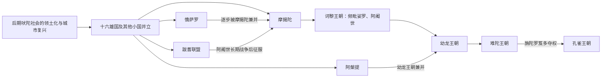

# 十六雄国与摩揭陀兴起

## 时间

约前600—前321年。君主年代主要依据佛教、耆那教和往世书传统回推，不同文献的王次与绝对年代差异明显，表中均按约数理解。

## 概括

恒河流域在前1千纪中叶经历城市复兴、铁器农业扩展、货币与远程贸易发展，形成多个“雄国”（摩诃迦那波陀）。它们既有世袭王国，也有由多个贵族家族共同议政的伽那—僧伽政体。摩揭陀凭借恒河与支流水运、农业人口、象兵、连续扩张型君主和新都华氏城，先后击败鸯伽、憍萨罗、跋耆与阿槃提，最终由难陀建立比早期城邦更集中的军事财政国家，为孔雀王朝奠定基础。

## 城邦国家与摩揭陀统一图

十六雄国名单来自后世佛教、耆那教文献，不同文本略有差异；许多国家同期并立。摩揭陀崛起是地理、铁矿与农业、象军、城防、婚姻和持续战争共同作用的结果。

## 十六雄国

传统名单在不同文献中略有差异，下表采用佛教文献中最常见的一组。

| 雄国 | 大致区域 / 中心 | 政体与走向 |
|---|---|---|
| 鸯伽 | 今比哈尔东部、孟加拉西部，瞻波 | 王国；被频毗娑罗并入摩揭陀。 |
| 摩揭陀 | 南比哈尔，王舍城、后为华氏城 | 王国；连续兼并并成为帝国核心。 |
| 迦尸 | 瓦拉纳西一带 | 王国；长期同憍萨罗争夺，后被其吸收。 |
| 憍萨罗 | 阿瓦德地区，舍卫城 | 强大王国；与摩揭陀联姻、战争后衰落。 |
| 跋耆 | 毗舍离及北比哈尔 | 离车等氏族组成的联盟共和政体；被阿阇世征服。 |
| 末罗 | 拘尸那揭罗、波婆 | 多中心共和政体；与佛陀涅槃传统密切相关。 |
| 车底 | 奔德尔坎德一带 | 王国或部族国家，后续史料有限。 |
| 跋沙 | 乔赏弥 | 王国；控制亚穆纳河交通，后受阿槃提、摩揭陀影响。 |
| 俱卢 | 德里—哈里亚纳一带 | 由早期吠陀核心王国转为较小政体。 |
| 般阇罗 | 恒河—亚穆纳河间东部 | 东西两支或多个中心并存。 |
| 摩差 | 拉贾斯坦东北部 | 王国；后被更强邻国吸收。 |
| 苏罗娑 | 马图拉地区 | 王国；处在北方商路节点。 |
| 阿湿波 | 戈达瓦里河上游 | 十六国中唯一明确位于文迪亚山以南者。 |
| 阿槃提 | 马尔瓦，邬阇衍那、摩醯湿摩蒂 | 西部强国；最终被尸修那伽王朝并入摩揭陀。 |
| 犍陀罗 | 白沙瓦、塔克西拉 | 连接伊朗和中亚；部分时期受阿契美尼德波斯控制。 |
| 剑浮沙 | 阿富汗东北与帕米尔邻近 | 骑马与跨山贸易地区，政体形态有争议。 |

## 摩揭陀崛起机制

- **地理与税源**：恒河、宋河等水道连接农业区和商路，河运降低粮食、军队和贡赋运输成本；湿润稻作区提供高人口密度。
- **军事资源**：森林和东部地区可获得战象、木材等资源。南比哈尔铁矿常被视为优势，但其开发规模与摩揭陀崛起的直接关系仍有争议。
- **都城转换**：王舍城四面环山，适合早期防守；华氏城位于河流汇合和交通节点，更适合管理扩大的恒河帝国。
- **联姻与兼并并用**：频毗娑罗以婚姻稳定憍萨罗、离车等方向，又直接消灭鸯伽；阿阇世则以长期战争摧毁跋耆联盟。
- **持续的军事财政积累**：诃黎王朝、尸修那伽王朝和难陀虽由不同家族掌权，却继承前朝都城、税源和军队，使扩张并未因改朝换代完全中断。

## 摩揭陀王统

### 诃黎王朝

| 顺序 | 君主 | 在位时间 | 与前任关系 | 关键事件 / 备注 |
|---:|---|---|---|---|
| 1 | **频毗娑罗** | 约前6世纪末—前5世纪初 | 王朝重要奠基者 | 并吞鸯伽；同憍萨罗、离车等联姻；佛教与耆那教传统均把他列为护持者。 |
| 2 | **阿阇世** | 约前5世纪前半 | 频毗娑罗之子 | 传统称其夺位并导致父死；与憍萨罗、跋耆战争，修筑华氏村要塞。 |
| 3 | 优陀夷 | 约前5世纪中叶 | 阿阇世之子 | 通常认为把政治中心迁至华氏城；后续记载混杂。 |
| 4 | 阿㝹楼陀 | 年代不详 | 优陀夷之后，关系说法不一 | 主要见后世王表，史实细节很少。 |
| 5 | 文荼 | 年代不详 | 继承关系不详 | 后期君主，宫廷政变叙事增多。 |
| 6 | 那伽达沙迦 | 约前5世纪末 | 文荼之后 | 传统称因弑亲暴政被民众或大臣推翻，诃黎王朝终结。 |

### 尸修那伽王朝

| 顺序 | 君主 | 在位时间 | 与前任关系 | 关键事件 / 备注 |
|---:|---|---|---|---|
| 1 | **尸修那伽** | 约前5世纪末—前4世纪初 | 被推举或由大臣夺权；非前朝直系 | 击败并吞阿槃提，结束摩揭陀在恒河流域最大的西部对手。 |
| 2 | 迦罗阿输迦（乌鸦色王） | 约前4世纪前半 | 尸修那伽之子 | 以华氏城为中心；佛教传统把毗舍离第二次结集置于其时代。 |
| 后继 | 十王或若干王子 | 次序与年代有争议 | 迦罗阿输迦诸子 | 佛教、耆那教和往世书给出的姓名、人数不同，可能存在分区统治。 |
| 末主 | 摩诃难丁 | 约前4世纪中叶 | 往世书传统列为尸修那伽末王 | 被摩诃钵特摩·难陀取代；其同难陀家族的血缘叙述具有合法性建构色彩。 |

### 难陀王朝

| 顺序 | 君主 | 在位时间 | 与前任关系 | 关键事件 / 备注 |
|---:|---|---|---|---|
| 1 | **摩诃钵特摩·难陀** | 约前4世纪中叶 | 开国君主；出身说法带有敌对王朝贬抑 | 扩大摩揭陀疆域和税收军队；往世书称其消灭多支刹帝利王族。 |
| 2—8 | 难陀诸王 | 年代与姓名不定 | 传统多称摩诃钵特摩之子 | 文献称“九难陀”，但九人是否含开国者、各王姓名与顺序均无共识，不宜强造完整名单。 |
| 9 | **达那·难陀** | 约前329—前321年 | 通常列为末代难陀 | 以巨额财富、重税和大军著称；被旃陀罗笈多·孔雀推翻。希腊资料未直接使用此名，身份对应仍有讨论。 |

## 重要事件与过程

1. **第二次城市化**：恒河平原出现设防城市、打制印记银币、商队和行会；国家从部落贡赋转向较稳定的土地和商业征收。
2. **沙门思潮兴起**：佛教、耆那教及其他出家传统在城市、商路与王国竞争环境中发展，质疑祭祀垄断和既有社会秩序；它们与婆罗门传统并存而非简单取代。
3. **频毗娑罗并吞鸯伽**：取得瞻波和东向商路，摩揭陀首次成为区域霸权。
4. **阿阇世—跋耆战争**：据传统持续多年，军事进攻、外交分化和新武器叙事共同出现；跋耆联盟败亡使北比哈尔纳入摩揭陀。
5. **华氏城成为首都**：从山城王舍城转向河运枢纽，适应更大疆域和官僚军队。
6. **吞并阿槃提**：尸修那伽消除横跨中印度的主要对手，摩揭陀势力从东部伸向西部。
7. **难陀军事财政集中**：庞大常备军数字多来自夸张或间接记载，但王朝高税收与强军形象反映国家动员能力显著增强。
8. **亚历山大东征的间接冲击（前326—前325年）**：马其顿军抵达旁遮普后拒绝继续东进，疲劳、季风、恒河诸国军力传闻等共同作用；亚历山大并未同难陀直接交战。
9. **约前321年孔雀夺权**：旃陀罗笈多与考底利耶相关叙事细节带有后世文学色彩，但难陀被推翻和孔雀接管摩揭陀资源是明确的王朝转折。

## 鼎盛、失势与历史承接

摩揭陀崛起不是单一“铁矿决定论”，而是农业人口、河运、象兵、都城、战争与连续制度积累的组合。难陀王朝因高强度征税和非传统王族出身在后世文本中形象负面，但这些叙事可能服务孔雀王朝合法性。其直接灭亡源于宫廷与社会支持不足以及旃陀罗笈多领导的夺权；其财政、军队和领土框架却被新王朝继承，成为孔雀帝国迅速扩张的基础。

## 演变关系

- 前一节点：[吠陀时代](/%E4%BA%BA%E6%96%87%E7%A7%91%E5%AD%A6/%E5%8E%86%E5%8F%B2/%E5%8D%97%E4%BA%9A/%E5%8D%B0%E5%BA%A6/%E5%90%A0%E9%99%80%E6%97%B6%E4%BB%A3.md)。
- 后续节点：[孔雀王朝](/%E4%BA%BA%E6%96%87%E7%A7%91%E5%AD%A6/%E5%8E%86%E5%8F%B2/%E5%8D%97%E4%BA%9A/%E5%8D%B0%E5%BA%A6/%E5%AD%94%E9%9B%80%E7%8E%8B%E6%9C%9D.md)。
