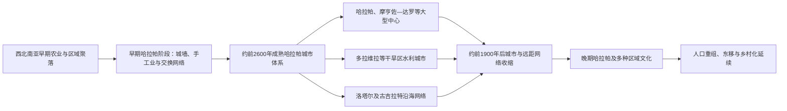

# 印度河文明

## 范围与对象

本页是南亚共享前史的规范主笔记，覆盖今巴基斯坦、印度西北、哈里亚纳、拉贾斯坦和古吉拉特等地区的哈拉帕城市网络；文件沿用现有路径，不表示印度河文明属于现代印度一国。巴基斯坦目录从今巴基斯坦地域补充哈拉帕、摩亨佐—达罗与信德—旁遮普视角。

## 时间

- 前哈拉帕与区域发展：约前7000—前3300年，包含梅赫尔格尔等更早农业聚落，但这些遗址不能全部直接称为“印度河文明”。
- 早期哈拉帕：约前3300—前2600年，城镇、区域陶器与贸易网络扩大。
- 成熟哈拉帕：约前2600—前1900年，城市、文字、印章、标准权衡和远程网络达到高峰。
- 晚期哈拉帕：约前1900—前1300年或更晚，各地区转向较小聚落和地方文化，变化并不同步。

## 概括

印度河文明又称哈拉帕文明，是南亚最早的广域城市体系。它并非只有印度河谷，而从俾路支山麓、阿富汗贸易通道延伸到旁遮普、干涸河道区、信德、古吉拉特和恒河—亚穆纳河间西缘。哈拉帕、摩亨佐—达罗、多拉维拉、拉基加里、甘韦里瓦拉等大型中心共享标准砖比、砝码、印章和符号系统，却又保留地方建筑与物质差异。由于文字未释读，王名、战争和法律不可知，政治结构必须从城市与物资分布谨慎推断。

## 城市体系形成与转型图

城市衰退不是单次外来入侵造成的突然“灭亡”。河道变化、季风减弱、贸易重组和城市制度适应失败在不同区域作用不同，文字尚未释读也限制了对政权名称和统治者的判断。

## 主要中心与区域差异

| 遗址 / 区域 | 位置 | 主要特点 |
|---|---|---|
| 哈拉帕 | 今巴基斯坦旁遮普 | 多个筑台与城丘、工艺区、墓地和长期分期；为文明命名遗址。 |
| 摩亨佐—达罗 | 今巴基斯坦信德 | 规则街区、砖砌排水、“大浴池”和大量民居；反复洪水沉积与重建。 |
| 多拉维拉 | 今印度古吉拉特卡奇 | 石砌城市、分区城墙、蓄水池和大型文字牌；适应半干旱环境。 |
| 拉基加里 | 今印度哈里亚纳 | 规模庞大的多城丘中心，展示干涸河道区的城市化。 |
| 甘韦里瓦拉 | 今巴基斯坦乔利斯坦 | 大型未充分发掘遗址，说明城市网络不只沿今日印度河。 |
| 洛塔尔 | 今印度古吉拉特 | 手工业与海岸贸易中心；所谓“船坞”功能仍有讨论。 |
| 苏特卡根多尔、肖图盖等边缘据点 | 俾路支海岸、阿富汗东北 | 控制海陆通道，联系铜、青金石及更远市场。 |

城市大小并不自动对应首都和附属城；现有证据无法确定存在一个统一帝国、数个城邦，还是由商贸、宗教和地方精英共同协调的多中心体系。

## 政治与社会结构

| 证据 | 可作出的判断 | 不能直接推出的结论 |
|---|---|---|
| 标准化砖、砝码、印章与城市规划 | 跨区域存在长期规则、技术传承和协调网络 | 不足以证明由一位皇帝或单一官僚中央直接命令 |
| 高台、城墙和分区 | 城市有公共工程、空间管理和防洪 / 防卫需求 | “高城”不必然是王宫区，迄今没有无争议的宫殿 |
| 大浴池、仓储状建筑和水利 | 集体仪式、储运或公共管理具有重要地位 | 建筑功能多有争论，不宜沿用早期发掘者的确定命名 |
| 墓葬差异相对有限 | 精英展示方式与埃及、两河王陵不同 | 不等于社会完全平等；住宅、工艺和营养仍显示差异 |
| 广泛印章与封泥 | 身份、货物、机构或交易需要标记 | 图像和文字含义未解，不能据动物图案确定具体神名与官职 |

聚落中存在农民、牧民、工匠、商人、运输者和管理者。珠饰、金属、陶器、贝壳和石器生产表现出高度专业化，有些工艺区可能受城市机构或商人群体组织。没有王表可列，也不应套用后世“王朝世系”模板。

## 城市、技术与日常生活

- 城市多使用规则化街道、烧砖或泥砖建筑。许多住宅设庭院、井、洗浴空间和通向街巷的排水沟，显示清洁、水源与维护制度的重要性。
- 排水系统并非所有地区和住户完全相同；维护可能由家庭、街区和城市组织共同承担。它不是现代下水道的简单同类物。
- 多拉维拉以水坝、渠道和蓄水池收集季节水，摩亨佐—达罗和哈拉帕则大量使用水井，说明共同城市传统会依生态条件调整。
- 铜、青铜、金、银、铅、石料、贝壳、陶器和棉纺织品被加工；尚未发现普遍铁器。标准砝码有利于跨城市计量。
- 轮车、牛、羊、山羊和水牛参与运输与农业；小麦、大麦、豆类、芝麻、枣、棉花等作物因地区而异，古吉拉特和晚期聚落更重视小米等耐旱作物。

## 文字、印章与知识边界

印度河符号见于滑石印章、陶器、铜片、小牌和少数大型标识，常同“独角兽”、瘤牛、象、犀牛、水牛等图像并列。铭文通常很短，缺少长篇文本、已知双语铭文和可确认后裔文字，因此尚无被学界普遍接受的释读。

- 符号数量和重复位置支持其可能具有书写或编码功能，但它记录何种语言仍未知。
- 任何声称已经读出王名、吠陀梵语、泰米尔语或完整宗教经典的方案，都必须解释全部符号、语法和跨遗址材料；目前没有方案通过这一检验。
- 印章可能用于货物封缄、身份和仪式，不同用途可以并存。动物图像不能直接等同后世湿婆坐骑或某一固定宗教。
- 文字在成熟城市体系解体后不再以相同形式延续；这不表示人口和所有文化知识消失。

## 经济与跨区域网络

- 农业与畜牧是城市基础，城市同周围村落交换粮食、原料和手工业品。河流、季风和海岸航行连接内陆与阿拉伯海。
- 两河文献中的“麦鲁哈”通常同印度河区域联系。印度河式印章、红玉髓珠等见于两河、阿曼和巴林，巴林的迪尔蒙商人可能充当中介。
- 海外贸易重要但不是城市经济的唯一支柱；多数粮食、陶器和日用品来自区域内部。远程网络衰减会增加压力，却不足以单独解释整个文明转型。
- 阿富汗青金石、拉贾斯坦和阿曼铜源、古吉拉特贝壳与石料体现多方向供应链；成品和技术也向外传播。

## 重要过程与转折

1. **农业聚落与区域传统发展**：梅赫尔格尔等早期社区逐步采用农业、畜牧和手工业；其后各地形成不同陶器和聚落传统。
2. **早期哈拉帕城镇化**：约前4千纪后半，筑墙聚落、专业生产、区域贸易和符号使用增加，不同区域传统开始趋同。
3. **约前2600年成熟体系形成**：主要城市扩建，砖、砝码、印章和规划规则在广阔范围标准化；这是组织重构而非一座城市征服全境的已知事件。
4. **城市网络高峰**：大型中心、次级城镇、村落、矿源与港口组成层级网络；不同生态区通过粮食、牧业和工艺互补。
5. **同伊朗高原、阿曼、迪尔蒙和两河贸易**：约前3千纪末至前2千纪初，商人和海运网络交换原料、珠饰、印章技术和文化形式。
6. **约前2200—前1900年水文与季风压力增强**：多次长期干旱、河道改变和洪水风险在不同地区叠加，农业可靠性下降；具体时间和强度并不一致。
7. **约前1900年后去城市化**：大型公共工程、远程标准化、印章文字和部分专业工艺减少，摩亨佐—达罗等中心衰落或被放弃。
8. **人口与作物重组**：聚落总体向较湿润的旁遮普东部、哈里亚纳和恒河上游方向分散，社区采用更耐旱作物和地方陶器。
9. **晚期哈拉帕延续**：墓地H、朱卡尔、朗布尔等地方传统保留部分器物、农业和聚落知识；“城市体系结束”不等于居民全部消失。

## 城市体系兴起的条件

早期区域交换、农业剩余、河流和海路、专业工艺与共同计量规则逐步结合，使陌生人之间能够在大范围内交换并维持城市。环境并非单纯“恩赐”：印度河洪泛既提供肥沃沉积，也需要不断维护；半干旱地区则依靠季节水和蓄水。标准化降低协作成本，但地区适应性使文明得以覆盖多种生态。

## 衰退与转型原因

- **环境压力**：季风减弱、长期河流干旱、河道迁移和部分城市洪水改变农业与供水条件。环境变化不是同一天发生的灾难，也不会自动决定社会结果。
- **经济与组织压力**：大型城市、公共工程和专业工艺依赖稳定粮食与跨区交换；生产下降或贸易网络改变会使集中组织成本上升。
- **区域分化**：不同地区选择迁移、缩小聚落、改变作物或保留局部城镇，统一标准逐渐失去维持基础。
- **疾病与社会因素**：部分遗骸显示创伤或健康压力，但证据不足以证明一次大瘟疫、内战或全面暴力毁灭。
- **直接过程**：约前1900年后，大城市人口和公共建设持续减少，文字与封印行政消失，居民向小型聚落分散。它是数百年的“去城市化与适应”，不是某支军队一次攻陷全部城市。
- 旧式“雅利安入侵毁灭印度河文明”缺少城市毁灭层和同时性证据；印度—雅利安语人群进入南亚与哈拉帕城市衰退在时间、地区和机制上不能画成简单因果。

## 历史承接与争议

后哈拉帕人口、农作物、工艺和聚落传统延续到前2千纪各地社会。某些宗教图像、沐浴习惯或符号可能影响后世，但“原始湿婆”“瑜伽印章”“种姓源头”等解释无法由未释读文字证实。古DNA显示南亚人群形成涉及多次古老混合，现代族群都不能把哈拉帕居民简单视为未改变的单一祖先群体。

## 演变关系

- 印度河城市体系衰退后进入后哈拉帕与多地区社会重组；与后来的[吠陀时代](/%E4%BA%BA%E6%96%87%E7%A7%91%E5%AD%A6/%E5%8E%86%E5%8F%B2/%E5%8D%97%E4%BA%9A/%E5%8D%B0%E5%BA%A6/%E5%90%A0%E9%99%80%E6%97%B6%E4%BB%A3.md)存在时序、区域接触及部分人口与技术延续问题，但不是已证实的单一直系继承。
- 区域共同史：[南亚古代文明、宗教与思想传统](/%E4%BA%BA%E6%96%87%E7%A7%91%E5%AD%A6/%E5%8E%86%E5%8F%B2/%E5%8D%97%E4%BA%9A/_%E9%80%9A%E5%8F%B2/%E5%8F%A4%E4%BB%A3%E6%96%87%E6%98%8E%E3%80%81%E5%AE%97%E6%95%99%E4%B8%8E%E6%80%9D%E6%83%B3%E4%BC%A0%E7%BB%9F.md)。
- 今巴基斯坦地域视角：[巴基斯坦的印度河、犍陀罗与伊斯兰化](/%E4%BA%BA%E6%96%87%E7%A7%91%E5%AD%A6/%E5%8E%86%E5%8F%B2/%E5%8D%97%E4%BA%9A/%E5%B7%B4%E5%9F%BA%E6%96%AF%E5%9D%A6/%E5%8D%B0%E5%BA%A6%E6%B2%B3%E3%80%81%E7%8A%8D%E9%99%80%E7%BD%97%E4%B8%8E%E4%BC%8A%E6%96%AF%E5%85%B0%E5%8C%96.md)。
- 所属总览：[印度](/%E4%BA%BA%E6%96%87%E7%A7%91%E5%AD%A6/%E5%8E%86%E5%8F%B2/%E5%8D%97%E4%BA%9A/%E5%8D%B0%E5%BA%A6/README.md)。
