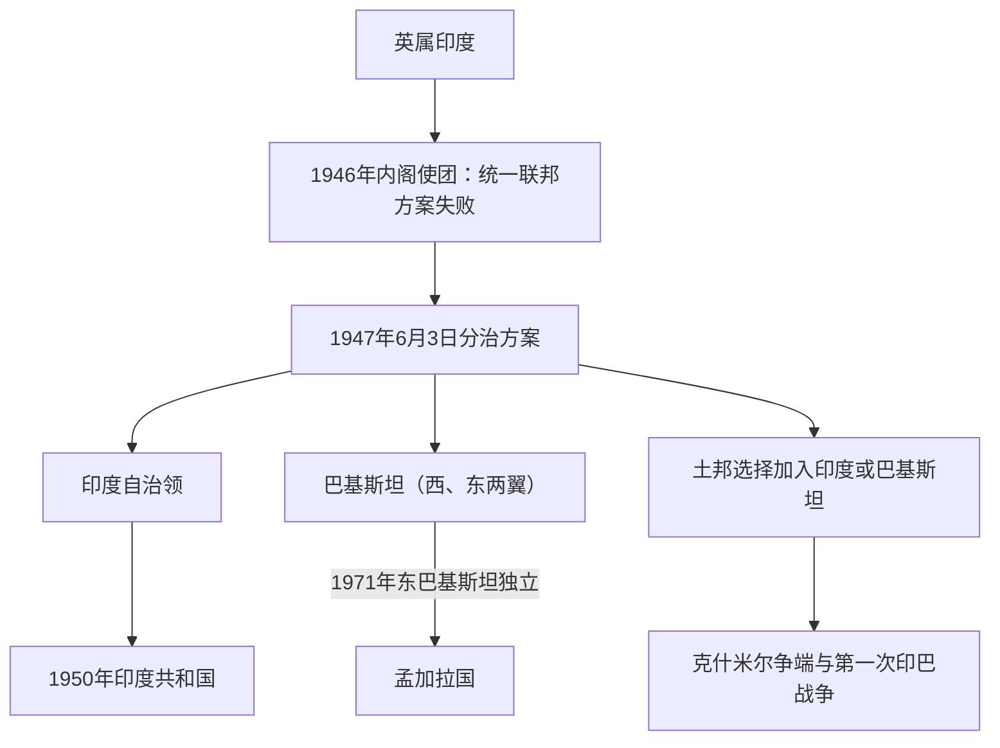

# 印度独立与印巴分治

## 时间

1946—1948年为直接决策、划界和人口迁徙阶段；印度与巴基斯坦分别在1947年8月15日和8月14日取得自治领地位。

## 概括

印度独立结束近两个世纪的公司—英王殖民扩张，却同英属印度分治同时发生。国大党主张以较强中央政府维持统一，穆斯林联盟认为穆斯林在单一多数制国家中缺乏可靠保障并要求巴基斯坦，英国则在战后财政、军政和国内压力下加速撤出。1946年内阁使团提出的统一、弱中央联邦方案未能落实，宗派暴力和互不信任推动各方接受分治。旁遮普、孟加拉被划分，土邦另行决定加入；仓促划界和国家机器分裂引发约一千多万人迁徙及数十万至约百万人死亡，确切数字至今有争议。

## 背景

- **殖民宪制的共同与分立代表**：1909年后穆斯林单独选举、1935年法案的省自治和人口分类，使宗教共同体成为谈判代表权的重要单位，但政治立场从未只由宗教决定。
- **国大党与穆斯林联盟竞争**：1937年省选举后，国大党在多个省执政，联盟担心无法在全印中央获得同等地位；1940年拉合尔决议要求穆斯林占多数地区组成“独立国家”，其精确制度含义随后才逐步固定。
- **第二次世界大战**：英国未经印度领导人同意宣布参战；国大党1942年发动退出印度运动并遭镇压，联盟在战争时期扩大组织。战争耗尽英国财政，也削弱长期控制印度军队和行政的能力。
- **省份差异**：旁遮普、孟加拉、信德、西北边境省和阿萨姆的政党、土地和语言结构不同。“印度教—穆斯林二分”无法解释锡克、达利特、部落、区域党派和反对分治穆斯林的选择。
- **土邦问题**：五百余土邦不属于普通英属省；英国宗主权终止后，王公需考虑地理、人口、经济和安全，决定加入某一自治领，而非自动成为完全可持续的独立国。

## 主要参与者与目标

| 参与方 | 主要代表 | 核心目标与内部差异 |
|---|---|---|
| 英国政府与副王府 | 艾德礼、韦维尔、蒙巴顿 | 尽快且可控地移交权力，保护战略、军队与英联邦利益；对统一或分治的偏好随谈判失败改变。 |
| 印度国民大会党 | 甘地、尼赫鲁、帕特尔、阿扎德等 | 结束殖民统治并建立民主印度；多支持统一国家，但对弱中央联邦、分治和强制维持统一的判断不同。 |
| 全印穆斯林联盟 | 穆罕默德·阿里·真纳、利亚卡特·阿里·汗等 | 取得穆斯林政治平等和安全保障，最终坚持建立巴基斯坦；并非所有穆斯林选民、宗教学者和省级领袖都赞同分治。 |
| 锡克政治力量 | 阿卡利达尔等 | 反对把整个旁遮普交给巴基斯坦，要求划分或自身保障；锡克人口集中区被边界切割。 |
| 土邦与王公 | 海得拉巴尼扎姆、克什米尔王公、朱纳格特纳瓦布等 | 维持王权、选择加入条件或寻求独立；实际选择受地理、民意和两自治领压力限制。 |
| 地方民众与组织 | 农民、城市社群、志愿团体、民兵、难民救援网络 | 诉求从安全、土地与就业到宗教国家想象不等；既有施暴者，也有保护邻居和组织救援者。 |

## 过程与转折

### 1. 1946年内阁使团方案

英国使团提出英属印度保持统一，中央只掌外交、防务和交通，省份按区域分组并可日后重新选择。国大党接受制宪会议但反对分组永久束缚和弱中央，联盟先接受、后因解释冲突撤回。双方都担心对方进入制宪程序后改变规则，统一方案失去互信基础。

### 2. 直接行动日与暴力扩散

联盟宣布1946年8月16日为“直接行动日”。加尔各答发生大规模杀戮，随后诺阿卡利、比哈尔、旁遮普等地出现报复和连锁暴力。地方政府、警察和政党组织在不同地区或失能、或偏袒、或参与动员。暴力不是分治不可避免的古老仇恨爆发，而同权力真空、选举政治、谣言、民兵和报复循环有关。

### 3. 临时政府与制宪僵局

尼赫鲁领导的临时政府于1946年9月组成，穆斯林联盟随后加入，但主要部门合作困难；联盟抵制或退出制宪会议。军队、财政、铁路和公务员未来归属无法在统一制度内解决。

### 4. 撤离期限提前

英国首相艾德礼于1947年2月宣布最迟1948年6月移交权力，并以蒙巴顿取代韦维尔。蒙巴顿判断强行维持统一可能导致行政和军队崩溃，同主要领导人协商后提出6月3日方案。把期限提前到当年8月减少了长期不确定性，也压缩了划界、资产分配和治安准备时间。

### 5. 分治决定与法律

旁遮普、孟加拉议会分别表决是否分省，西北边境省举行公投，信德议会决定加入巴基斯坦。《印度独立法》于1947年7月通过，设印度、巴基斯坦两个自治领，英国对土邦的宗主权同时终止。巴基斯坦由西北部省区和东孟加拉组成，两翼相隔约1600公里印度领土。

### 6. 拉德克利夫线

西里尔·拉德克利夫主持旁遮普和孟加拉边界委员会，在约五周内依据1941年人口、行政、交通、灌溉和“其他因素”划线。委员无法达成一致，由主席裁决。边界结果在独立庆典后才公布，使部分居民和地方部队直到最后仍不知归属；铁路、运河、村庄和土地被切开。

### 7. 人口迁徙与暴力

旁遮普发生最快、最对称的跨境迁徙：穆斯林向西，印度教徒和锡克向东；火车、难民队伍和村庄遭袭。孟加拉的迁徙更分阶段延续多年。绑架、强奸、强迫改宗和家庭杀害具有明显性别特征，女性在战后又受到“寻回”政策和家庭名誉压力。约一千二百万至一千五百万人跨境，死亡估计从数十万到约一百万以上不等。

### 8. 土邦并入与克什米尔战争

大多数土邦在帕特尔、梅农及巴基斯坦方面谈判压力下签署加入书。朱纳格特的穆斯林统治者选择巴基斯坦、但人口以印度教徒为主，印度介入并经公投并入。海得拉巴试图独立，1948年被印度军事行动兼并。克什米尔王公哈里·辛格起初观望，1947年10月部落武装自巴基斯坦方向进入后签署加入印度文书，印度出兵；第一次印巴战争和1949年停火线使争端长期化。

## 结果

- 印度和巴基斯坦继承不同领土、军队、现金、档案和公务员，分配过程充满延误和争执。
- 德里、拉合尔、卡拉奇、加尔各答等城市人口和财产结构剧变。难民安置推动新住宅、商业与选举集团形成，也留下“敌产”和赔偿争议。
- 两国都以殖民官僚和军队为基础建国，但印度较快完成制宪和共和国转型，巴基斯坦因东西两翼、制宪和中央—省关系长期不稳。
- 甘地在德里、加尔各答等地绝食制止暴力，1948年1月被印度教民族主义者南度蓝姆·戈德塞刺杀。
- 分治没有实现宗教人口完全分离：印度仍有庞大穆斯林人口，巴基斯坦也有印度教、锡克、基督教及其他少数群体；公民权和少数群体安全成为两国长期议题。

## 长期影响

- **印巴关系**：克什米尔、河水、边界和安全竞争导致多次战争与核军备；国内政治又不断借用分治记忆。
- **孟加拉分叉**：东巴基斯坦在人口上占多数，却在语言、财政和军政权力上受西翼主导；孟加拉语言运动、自治要求和1971年战争最终建立孟加拉国。
- **身份与史学**：印度、巴基斯坦和孟加拉国分别以不同国家叙事解释1947年。口述史、女性史和地方研究显示，“独立的庆典”与“失乡的创伤”同时成立。
- **宪政路线**：印度以世俗联邦和普选框架容纳多元，巴基斯坦围绕伊斯兰国家、联邦和军政关系持续探索；两者都继承殖民边界和紧急权力。
- **全球去殖民化**：英属印度退出成为战后帝国瓦解的重要转折，但仓促分治也成为殖民撤离未充分承担安全责任的典型。

## 关键辨析

- 分治边界主要按宗教多数划定，但决定过程还受行政、交通、灌溉和政治交易影响，不能称为自然国界。
- 暴力没有单一施害群体；不同地区的国家机关、民兵和社区角色不同。承认多方施暴不等于抹平责任或否认受害经验。
- 1947年的巴基斯坦包括西、东两翼；把今日巴基斯坦版图直接投射到1947年会遗漏孟加拉历史。
- 土邦“选择”受到军力、地理和民众动员约束，不能一概视为王公自由公投。

## 演变关系

- 前一节点：[英属印度](/%E4%BA%BA%E6%96%87%E7%A7%91%E5%AD%A6/%E5%8E%86%E5%8F%B2/%E5%8D%97%E4%BA%9A/%E5%8D%B0%E5%BA%A6/%E8%8B%B1%E5%B1%9E%E5%8D%B0%E5%BA%A6.md)。
- 区域共同史：[英属印度、分治与现代南亚](/%E4%BA%BA%E6%96%87%E7%A7%91%E5%AD%A6/%E5%8E%86%E5%8F%B2/%E5%8D%97%E4%BA%9A/_%E9%80%9A%E5%8F%B2/%E8%8B%B1%E5%B1%9E%E5%8D%B0%E5%BA%A6%E3%80%81%E5%88%86%E6%B2%BB%E4%B8%8E%E7%8E%B0%E4%BB%A3%E5%8D%97%E4%BA%9A.md)。
- 印度方向：[印度共和国](/%E4%BA%BA%E6%96%87%E7%A7%91%E5%AD%A6/%E5%8E%86%E5%8F%B2/%E5%8D%97%E4%BA%9A/%E5%8D%B0%E5%BA%A6/%E5%8D%B0%E5%BA%A6%E5%85%B1%E5%92%8C%E5%9B%BD.md)。
- 巴基斯坦方向：[巴基斯坦的分治、联邦与军政循环](/%E4%BA%BA%E6%96%87%E7%A7%91%E5%AD%A6/%E5%8E%86%E5%8F%B2/%E5%8D%97%E4%BA%9A/%E5%B7%B4%E5%9F%BA%E6%96%AF%E5%9D%A6/%E5%88%86%E6%B2%BB%E3%80%81%E8%81%94%E9%82%A6%E4%B8%8E%E5%86%9B%E6%94%BF%E5%BE%AA%E7%8E%AF.md)。
- 东巴基斯坦及1971年后的孟加拉国方向：[东巴基斯坦、独立战争与人民共和国](/%E4%BA%BA%E6%96%87%E7%A7%91%E5%AD%A6/%E5%8E%86%E5%8F%B2/%E5%8D%97%E4%BA%9A/%E5%AD%9F%E5%8A%A0%E6%8B%89%E5%9B%BD/%E4%B8%9C%E5%B7%B4%E5%9F%BA%E6%96%AF%E5%9D%A6%E3%80%81%E7%8B%AC%E7%AB%8B%E6%88%98%E4%BA%89%E4%B8%8E%E4%BA%BA%E6%B0%91%E5%85%B1%E5%92%8C%E5%9B%BD.md)。
