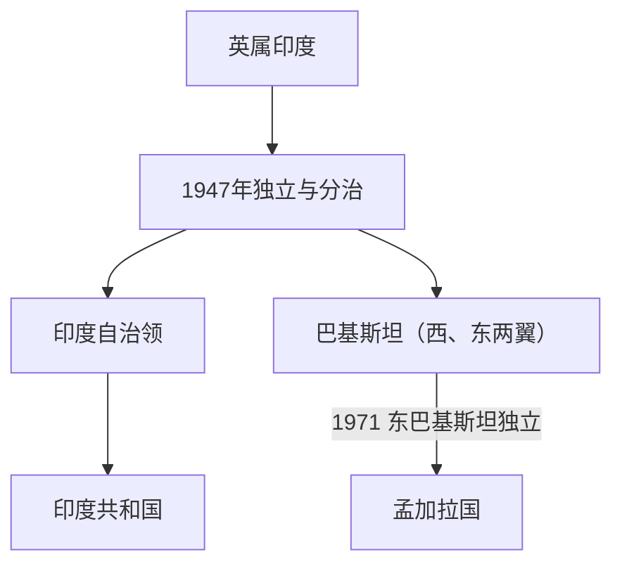

# 印度独立与印巴分治

## 时间

1947年

## 概括

印度独立与印巴分治标志英属印度结束。依据宗教、政治和殖民行政边界，英属印度分为印度和巴基斯坦，随后伴随大规模人口迁徙、暴力冲突和克什米尔等长期争议。1947年的巴基斯坦包括彼此分隔的西巴基斯坦与东巴基斯坦；1971年东巴基斯坦独立为孟加拉国。

## 统治结构

| 阶段 | 说明 |
|---|---|
| 英国撤出 | 英国通过《印度独立法》结束直接统治。 |
| 印巴分治 | 印度和巴基斯坦分别独立，土邦选择加入。 |
| 共和国转型 | 印度随后制定宪法，1950年成为共和国。 |

## 重要事件

- 1947年8月，印度和巴基斯坦分别独立。
- 旁遮普、孟加拉等地出现大规模迁徙和暴力。
- 克什米尔问题成为印巴长期冲突源头。

## 演变关系

- 前一节点：[英属印度](/%E4%BA%BA%E6%96%87%E7%A7%91%E5%AD%A6/%E5%8E%86%E5%8F%B2/%E5%8D%97%E4%BA%9A/%E5%8D%B0%E5%BA%A6/%E8%8B%B1%E5%B1%9E%E5%8D%B0%E5%BA%A6.md)。
- 区域共同史：[英属印度、分治与现代南亚](/%E4%BA%BA%E6%96%87%E7%A7%91%E5%AD%A6/%E5%8E%86%E5%8F%B2/%E5%8D%97%E4%BA%9A/_%E9%80%9A%E5%8F%B2/%E8%8B%B1%E5%B1%9E%E5%8D%B0%E5%BA%A6%E3%80%81%E5%88%86%E6%B2%BB%E4%B8%8E%E7%8E%B0%E4%BB%A3%E5%8D%97%E4%BA%9A.md)。
- 印度方向：[印度共和国](/%E4%BA%BA%E6%96%87%E7%A7%91%E5%AD%A6/%E5%8E%86%E5%8F%B2/%E5%8D%97%E4%BA%9A/%E5%8D%B0%E5%BA%A6/%E5%8D%B0%E5%BA%A6%E5%85%B1%E5%92%8C%E5%9B%BD.md)。
- 巴基斯坦方向：[巴基斯坦的分治、联邦与军政循环](/%E4%BA%BA%E6%96%87%E7%A7%91%E5%AD%A6/%E5%8E%86%E5%8F%B2/%E5%8D%97%E4%BA%9A/%E5%B7%B4%E5%9F%BA%E6%96%AF%E5%9D%A6/%E5%88%86%E6%B2%BB%E3%80%81%E8%81%94%E9%82%A6%E4%B8%8E%E5%86%9B%E6%94%BF%E5%BE%AA%E7%8E%AF.md)。
- 东巴基斯坦及1971年后的孟加拉国方向：[东巴基斯坦、独立战争与人民共和国](/%E4%BA%BA%E6%96%87%E7%A7%91%E5%AD%A6/%E5%8E%86%E5%8F%B2/%E5%8D%97%E4%BA%9A/%E5%AD%9F%E5%8A%A0%E6%8B%89%E5%9B%BD/%E4%B8%9C%E5%B7%B4%E5%9F%BA%E6%96%AF%E5%9D%A6%E3%80%81%E7%8B%AC%E7%AB%8B%E6%88%98%E4%BA%89%E4%B8%8E%E4%BA%BA%E6%B0%91%E5%85%B1%E5%92%8C%E5%9B%BD.md)。
