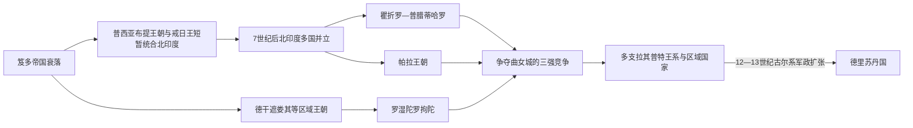

# 后笈多与拉其普特诸国

## 时间

约6—12世纪。北印度的古尔王朝征服以1192年塔拉因战役和1206年德里苏丹国建立为重大转折，但区域王国、拉其普特家族和南印度政权并未在同一时刻结束。

## 概括

笈多帝国瓦解后，南亚没有进入单纯的“黑暗分裂期”，而是由多个区域王国、地方领主、寺院城市和贸易网络重组。戒日王一度整合恒河上游，死后未形成稳定继承帝国；8—10世纪瞿折罗—普腊蒂诃罗、波罗与罗湿陀罗拘陀围绕曲女城竞争；西北、拉贾斯坦和中印度出现乔汉、帕拉玛拉、昌德拉、索兰基等王族；德干和南方则有遮娄其、罗湿陀罗拘陀、帕拉瓦、朱罗等强国。所谓“拉其普特”是数百年间形成的武士—王族身份，不是自古不变的单一民族或王朝。

## 区域王权分化图

“拉其普特”不是笈多灭亡时一次形成的单一民族或王朝，而是不同武士、土地与宗族集团在数百年内通过谱系、婚姻、军役和地方国家建构形成的身份集合。

## 政治格局与主要王系

本页覆盖并行政权，不存在一张可按“前王—后王”排列的全印度世系。下表列能够解释区域主线的王朝和主要统治者；各王朝内部的旁支、共治和地方王远比表中复杂。

| 区域 / 政权 | 时间 | 关键统治者 | 形成、鼎盛与终结 |
|---|---|---|---|
| 弗栗多那 / 戒日王政权 | 6世纪末—647年 | 曷利沙伐弹那（戒日王，606—647年） | 由塔内萨尔王族在兄长遇害后崛起，控制恒河上游和曲女城；玄奘来访。戒日无稳定继承人，死后权力迅速区域化。 |
| 瞿折罗—普腊蒂诃罗 | 约730—11世纪 | 那伽跋吒一世、婆蹉罗阇、那伽跋吒二世、**密希拉·波阇**、摩醯因陀罗波罗 | 从西印度抗击阿拉伯信德势力，后控制曲女城与北印度；10世纪后因封臣独立、罗湿陀罗拘陀进攻和继承分裂而衰落。 |
| 波罗王朝 | 约750—12世纪 | 瞿波罗、**达摩波罗**、提婆波罗、摩醯波罗一世、罗摩波罗 | 孟加拉贵族推举瞿波罗结束混战；达摩波罗、提婆波罗扩张恒河东部并护持佛教寺院；后受羯罗朱利、犀那及地方叛乱削弱。 |
| 罗湿陀罗拘陀 | 约753—973年 | 檀提突伽、黑天一世、陀楼婆、瞿频陀三世、**阿慕伽跋沙一世**、黑天三世 | 推翻德干遮娄其，骑兵远征北方并参与曲女城竞争；首都曼耶凯塔。后期封臣西遮娄其夺权。 |
| 帕拉瓦 | 约6—9世纪 | 摩醯因陀罗跋摩一世、**那罗僧诃跋摩一世**、那罗僧诃跋摩二世 | 以建志为中心，与遮娄其长期战争；摩诃巴利普兰石窟与海岸寺院著名；9世纪被朱罗和其他泰米尔力量取代。 |
| 巴达米遮娄其 | 约543—753年 | 补罗稽舍一世、**补罗稽舍二世**、超日王一世、超日王二世 | 整合德干，补罗稽舍二世抵挡戒日南下并同帕拉瓦战争；首都被攻陷后复兴，最终被罗湿陀罗拘陀取代。 |
| 西遮娄其 | 973—12世纪末 | 台拉二世、娑底耶室罗耶、超日王六世 | 推翻罗湿陀罗拘陀，控制卡利亚尼和德干；同朱罗长期争夺东遮娄其和南部，后被曷萨拉、耶陀婆等封臣分解。 |
| 朱罗帝国 | 约9世纪中叶—13世纪 | 毗阇耶罗耶、**罗阇罗阇一世**、**罗阇因陀罗一世**、俱卢同伽一世 | 从高韦里三角洲崛起，建立高效地方税收、寺院和海军；远征斯里兰卡、马尔代夫及室利佛逝关联港口。12世纪后受潘地亚、曷萨拉和继承压力削弱。 |
| 乔汉 / 契诃曼那 | 约8世纪—1192年后 | 阿阇耶罗阇、毗瞿罗阇四世、**普里特维拉杰三世** | 以阿杰梅尔、德里为中心；1191年击退穆罕默德·古里，1192年第二次塔拉因战败。旁支和拉其普特身份继续存在。 |
| 昌德拉 | 约9—13世纪 | 耶输跋摩、陀伽、毗地耶陀罗 | 控制本德尔坎德，建造克久拉霍神庙群；受羯罗朱利、乔汉与古尔势力挤压后地方化。 |
| 帕拉玛拉 | 约9—14世纪 | 锡耶迦二世、文阇、**波阇王** | 以马尔瓦陀罗城为中心，波阇同文学、建筑和王权记忆相连；后受邻国与德里苏丹势力削弱。 |
| 遮娄其 / 索兰基（古吉拉特） | 约940—13世纪 | 穆拉罗阇、悉陀罗阇·阇耶僧诃、鸠摩罗波罗 | 控制古吉拉特贸易与城市；后期权力转入跋伽罗摄政家族，最终受德里苏丹扩张。 |
| 伽诃陀婆罗 | 约1089—1194年 | 旃陀罗提婆、瞿频陀旃陀罗、阇耶旃陀罗 | 以曲女城、瓦拉纳西为核心；1194年昌德瓦尔战役败于古尔军，北印度旧中心失守。 |

## 拉其普特身份的形成

- “罗阇补怛罗”意为“王子 / 王族之子”，在早期并非固定族名；约7—12世纪，既有统治家族、地方军人、部族首领和外来集团通过土地、婚姻、谱系和婆罗门仪式获得刹帝利—拉其普特身份。
- 日族、月族、火族等谱系为王权提供神话合法性，不能当作可直接验证的生物血统。不同家族常在数代内重写祖先叙事。
- 拉其普特政治以家族领地、山堡、武士随从和同附属首领的互惠关系为基础。荣誉、婚姻和战斗伦理很重要，但后世“宁死不降”的统一形象受到宫廷史诗和殖民分类塑造。
- 拉其普特王国并非只互相战争；它们经营灌溉、市场和寺院，同耆那教商人、婆罗门、部族社群及穆斯林商人都有合作。

## 统治、土地与社会机制

- **萨曼多体系**：征服者常保留地方首领为纳贡、供军的封臣。强君主可调动层级网络，中央衰弱时封臣转为独立王。
- **土地授予**：王室把村落税收和司法特权授予婆罗门、寺院、军人和官员，推动清林、灌溉与农业边界扩展，也使权力地方化。
- **寺院与神庙**：大型宗教机构不仅举行仪式，还拥有土地、雇佣工匠、放贷、储粮和连接商路。国王通过捐赠表现普遍王权，商人和村社同样是重要捐赠者。
- **城市与贸易**：曲女城、瓦拉纳西、乌阇衍那、建志、坦贾武尔和沿海港口连接陆海贸易。朱罗海军行动服务贸易、贡赋和区域战争，但不能称为现代殖民帝国。
- **语言与文化**：梵文继续是跨区域王权语言，泰米尔语、卡纳达语、泰卢固语、孟加拉语等地方文学逐步获得宫廷与宗教地位。巴克提运动通过地方语言诗歌发展，但各派形成时间和社会立场不同。
- **宗教多元**：湿婆、毗湿奴、女神、佛教和耆那教机构竞争并共享赞助网络。东印度波罗长期护持那烂陀、超戒寺等佛教中心，南亚佛教衰退是赞助、寺院经济和政治环境数百年变化的结果。

## 重要事件与转折

1. **6世纪笈多帝国解体**：匈那冲击、王族分支和地方长官独立形成多个区域中心；茂腊佉利与弗栗多那竞争恒河上游。
2. **606—647年戒日统治**：戒日以曲女城为中心扩大联盟，向南被补罗稽舍二世阻挡；其死后无继承帝国。
3. **711—712年阿拉伯征服信德**：倭马亚军击败达希尔王，建立信德行省；其影响主要限于西北，印度洋贸易和文化联系长期延伸。
4. **8世纪三大王朝形成**：瞿折罗—普腊蒂诃、波罗和罗湿陀罗拘陀分别控制北西、东部和德干，构成曲女城竞争。
5. **曲女城三方争夺（约8—10世纪）**：三方多次扶植或击败当地王，谁也未建立长期全印度中央；战争促成封臣扩张与军事资源流动。
6. **南方神庙—国家发展**：帕拉瓦、遮娄其和朱罗以石窟、结构寺和土地档案联结王权、村社与工匠，区域艺术语言成熟。
7. **罗阇罗阇与罗阇因陀罗扩张（约985—1044年）**：朱罗控制泰米尔地区、斯里兰卡部分和马拉巴尔，罗阇因陀罗北征恒河并于1025年前后袭击室利佛逝相关港口。
8. **伽色尼的马哈茂德远征（约1000—1027年）**：多次从阿富汗进入西北和恒河上游，掠夺城市与神庙，包括1025年苏摩那特；其目标含战利品、政治声望和边疆控制，并未建立覆盖北印度的持续行政。
9. **12世纪区域竞争加剧**：乔汉、伽诃陀婆罗、犀那、索兰基、昌德拉等互相竞争，缺乏统一并非“民族不团结”的道德问题，而是当时正常多国政治。
10. **1191—1192年塔拉因战役**：普里特维拉杰三世先击退穆罕默德·古里，次年被古尔军以机动骑射和战术重组击败，德里—阿杰梅尔进入古尔军事体系。
11. **1194年昌德瓦尔战役**：伽诃陀婆罗王阇耶旃陀罗战败，恒河中游多个城市转入古尔将领控制。
12. **1206年德里苏丹国形成**：古里死后库特卜丁·艾巴克自立；这是北印度军政网络的重组，不是拉其普特、印度教政权或南印度历史的整体终止。

## 区域繁荣的条件

这段时期的强国多依靠农业边界扩展、灌溉、土地捐赠、寺院与市场、封臣供军及商路控制。多中心竞争促进宫廷文学、建筑和地方语言投入，也使资源经常用于战争。强王能够把封臣网络、宗教合法性和税收暂时集中；统治者去世或军事失败后，同一网络也容易转为独立区域国家。

## 分裂、外压与转型

- **结构因素**：封臣体系和土地权转授有利于低成本扩张，却使中央对军队与税源的直接控制有限；王位继承和家族分封常造成分裂。
- **区域竞争**：三方争夺、德干—泰米尔战争和拉其普特家族竞争消耗资源，但也形成可持续的多国均势，并非必然走向“灭亡”。
- **西北军事变化**：伽色尼与古尔国家可利用中亚战马、职业军队和跨区域税源；部分北印度军队同样有骑兵和弓箭，胜负来自组织、情报、联盟和具体战术，不能归结为单一武器或宗教。
- **直接转折**：1192、1194年几场败仗使德里和恒河中游政权失去核心军队与首都，古尔将领随后通过驻军、分封和同本地精英合作巩固统治。
- **连续性**：梅瓦尔、马尔瓦、古吉拉特和中印度拉其普特政权继续存在，南印度朱罗、潘地亚等主线也未中断；新苏丹国吸收大量既有税制、工匠、城市和地方首领。

## 关键辨析

- “后笈多”在此是时间描述，不等于所有政权属于同一个“后笈多王朝”。
- “拉其普特时代”适合描述北西印度部分政治文化，不能覆盖整个南亚，也不能把所有战士集团视为同一民族。
- 所谓“印度教复兴”同佛教衰退并非一次王朝命令；宗教赞助、土地经济、哲学竞争和区域政治长期交织。
- 德里苏丹国建立不是“古代印度文明终结”，而是一个新军政精英进入既有区域体系并逐步本地化。

## 演变关系

- 前一节点：[笈多王朝](/%E4%BA%BA%E6%96%87%E7%A7%91%E5%AD%A6/%E5%8E%86%E5%8F%B2/%E5%8D%97%E4%BA%9A/%E5%8D%B0%E5%BA%A6/%E7%AC%88%E5%A4%9A%E7%8E%8B%E6%9C%9D.md)。
- 后续节点：[德里苏丹国](/%E4%BA%BA%E6%96%87%E7%A7%91%E5%AD%A6/%E5%8E%86%E5%8F%B2/%E5%8D%97%E4%BA%9A/%E5%8D%B0%E5%BA%A6/%E5%BE%B7%E9%87%8C%E8%8B%8F%E4%B8%B9%E5%9B%BD.md)。
