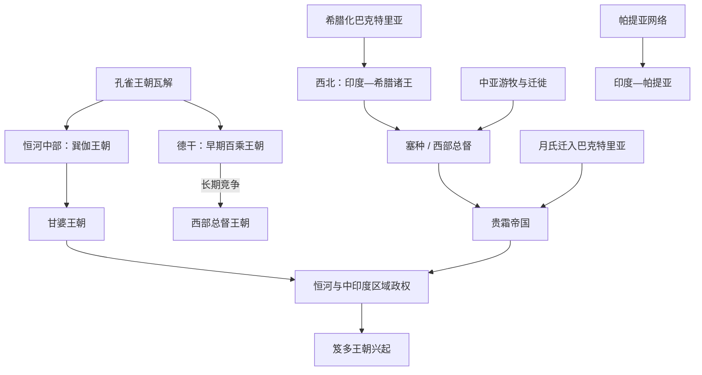

# 巽伽、贵霜与笈多前诸政权

## 时间

约前185年—4世纪初。不同地区的政权长期并立，起止时间和王统主要依赖钱币、铭文、考古和互相矛盾的后世王表，不能整理成一条覆盖全印度的连续朝代线。

## 概括

孔雀王朝瓦解后，恒河流域由巽伽、甘婆等王朝维持区域王权；德干的百乘逐渐扩张；西北先后出现印度—希腊、塞种、印度—帕提亚和贵霜政治中心；西印度则有西部总督王朝。多个政权围绕恒河、德干、西海岸和犍陀罗商路竞争，也把南亚更深地连接到地中海、伊朗、中亚和中国西域。佛教、印度教、耆那教与地方崇拜在王室、城市、商人和寺院网络支持下共同发展。

## 政治格局

图中箭头表示政治环境与控制中心的转换，不表示各族群或王室都是直系继承。

## 巽伽与甘婆王统

巽伽十王的完整姓名主要来自往世书，版本差异较大；除华友、火天友、婆须蜜多、婆伽跋陀等少数君主外，许多王仅见王表。年份按常见推算列示，不是精确纪年。

| 顺序 | 巽伽君主 | 约在位时间 | 关键事件 / 争议 |
|---:|---|---|---|
| 1 | **华友（普希亚密多）** | 前185—前149年 | 杀孔雀末王建立王朝；举行马祭。佛教文献称其迫害僧团，但考古与其他材料显示地区差异，不能视为全境系统灭佛定论。 |
| 2 | 火天友（阿耆尼密多） | 前149—前141年 | 华友之子；迦梨陀娑戏剧以其王子时期为背景。 |
| 3 | 婆苏逝瑟吒 | 前141—前131年 | 王表君主，史实有限。 |
| 4 | 婆须蜜多 | 前131—前124年 | 传统称击退印度—希腊势力并保护马祭。 |
| 5 | 安得罗迦 / 跋陀罗迦 | 前124—前122年 | 姓名、次序因文本而异。 |
| 6 | 补邻陀迦 | 前122—前119年 | 主要见王表。 |
| 7 | 瞿沙 | 前119—前116年 | 主要见王表。 |
| 8 | 金刚友 | 前116—前110年 | 主要见王表。 |
| 9 | **婆伽跋陀** | 前110—前83年 | 维迪沙赫利奥多罗斯柱铭可证；与印度—希腊使节往来。 |
| 10 | 提婆菩提 | 前83—前73年 | 末王；被大臣婆苏提婆·甘婆推翻。 |

| 顺序 | 甘婆君主 | 约在位时间 | 与前任关系 / 备注 |
|---:|---|---|---|
| 1 | 婆苏提婆 | 前73—前64年 | 巽伽大臣夺权；开国君主。 |
| 2 | 地友 | 前64—前50年 | 婆苏提婆之子或继承人。 |
| 3 | 那罗延 | 前50—前38年 | 继承关系见王表。 |
| 4 | 善铠 | 前38—前28年 | 末王；被百乘或其他德干势力取代的具体过程不明。 |

## 西北诸王：为何没有单一世系

印度—希腊、塞种和印度—帕提亚政权由多个中心和竞争王系组成，同名君主、共同钱币与重叠疆域很多，学界仍依钱币窖藏不断调整次序。把它们强排成一条“西北王朝世系”会制造错误。

| 政治集团 | 代表统治者 | 时间 | 关键意义 |
|---|---|---|---|
| 印度—希腊 | 德米特里一世 | 约前2世纪初 | 从巴克特里亚越过兴都库什，进入犍陀罗和印度河区域。 |
| 印度—希腊 | **米南德一世** | 约前165—前130年 | 统治范围较广；佛教文献《弥兰王问经》以其同僧人辩论为主题，文本形成晚于其时代。 |
| 印度—希腊 | 阿波罗多特、安提阿尔基达等 | 前2—前1世纪 | 分属不同区域和王系；双语钱币显示希腊语与佉卢文并用。 |
| 塞种 | 毛伊斯 | 约前1世纪初 | 在犍陀罗建立塞种王权；具体年代有争议。 |
| 塞种 | 阿泽斯一世、阿齐利塞斯、阿泽斯二世 | 前1世纪 | 王次和“阿泽斯纪元”归属仍有争论，可能存在共同或区域统治。 |
| 印度—帕提亚 | **贡多法勒斯** | 约1世纪 | 由锡斯坦—阿富汗进入犍陀罗；后继者分区统治。 |
| 北部总督 | 罗茹武罗、首达娑 | 约前1世纪末—1世纪初 | 控制马图拉等地，吸收印度政治称号。 |
| 西部总督 | 纳哈帕纳、查什塔纳、**鲁陀罗达曼一世** | 1—2世纪 | 同百乘争夺西印度；鲁陀罗达曼朱纳格尔梵文铭文记载水利修复和征战。 |

## 贵霜王统

贵霜出自迁入巴克特里亚的月氏诸部之一。表中采用钱币与铭文支持较强的主序列；贵霜晚期可能有并立王和地方“小贵霜”，不能用单一灭亡年份概括。

| 顺序 | 君主 | 约在位时间 | 与前任关系 | 关键事件 / 备注 |
|---:|---|---|---|---|
| 1 | **丘就却（库朱拉·卡德菲塞斯）** | 约40—90年 | 统一贵霜诸部的奠基者 | 控制巴克特里亚、喀布尔等地，钱币沿用希腊化和前代图像。 |
| 2 | 阎膏珍 / 索特尔·麦伽斯（维马·塔克图） | 约90—113年 | 关系不完全确定 | 姓名与“无名王”钱币的对应经碑铭研究建立，仍有细节争议。 |
| 3 | 阎膏珍（维马·卡德菲塞斯） | 约113—127年 | 通常视为前王之后 | 大量铸造金币，印度与罗马、伊朗贸易繁盛。 |
| 4 | **迦腻色伽一世** | 约127—150年 | 继承关系不详 | 帝国高峰；以犍陀罗、马图拉为核心，兼用希腊—巴克特里亚、伊朗和印度神祇图像；同佛教护持传统密切相关。 |
| 5 | 胡毗色伽 | 约150—190年 | 可能为迦腻色伽近亲或后裔 | 长期统治，钱币和铭文分布广，城市与宗教捐献活跃。 |
| 6 | **波调（婆苏提婆一世）** | 约190—224年 | 继承关系不详 | 名号印度化明显；统治后期萨珊王朝在伊朗兴起。 |
| 7 | 迦腻色伽二世 | 约230—244年 | 晚期王系 | 帝国西部受到萨珊“贵霜沙”压力。 |
| 8 | 婆湿色伽 | 约248—256年 | 继承关系不详 | 铭文可证，控制范围缩小。 |
| 9 | 迦腻色伽三世及其他晚期王 | 约256年以后 | 次序与并立关系有争议 | 北印度和阿富汗出现萨珊、贵霜—萨珊及地方王权；部分贵霜支系延续至4世纪。 |

## 百乘王朝的可证主序列

百乘王朝延续数百年，往世书列出十九至三十余位君主且版本互异，铭文与钱币只能固定部分次序。下表列出能支撑政治主线的早期奠基者和较连续的晚期王系，不把无法核定的王表姓名伪装成精确世系。

| 阶段 | 君主 | 约在位时间 | 关键事件 / 备注 |
|---|---|---|---|
| 奠基 | **西穆迦** | 约前2—前1世纪 | 通常列为开国者；绝对年代争议很大。 |
| 早期 | 黑闼（迦湿那） | 西穆迦之后 | 洞窟铭文显示王朝进入西德干。 |
| 早期扩张 | 娑多迦尼一世 | 约前1世纪 | 通过婚姻和马祭宣示王权，向讷尔默达河与中印度扩张。 |
| 文化记忆 | 诃罗 | 年代有争议 | 传统归为普拉克里特诗集《七百咏》编者，实际编纂过程更长。 |
| 中兴 | **乔达弥子·室利·娑多迦尼** | 约1世纪后半 | 击败纳哈帕纳系西部总督，重建德干—西海岸控制；其母乔达弥·巴拉室利铭文是关键材料。 |
| 继承 | 婆私提子·室利·补卢摩夷 | 约84—119年或稍后 | 同西部总督既战争又联姻；控制安得罗与西德干。 |
| 中晚期 | 婆私提子·室利·娑多迦尼 | 约119—148年 | 铭文、钱币可证；与鲁陀罗达曼有姻亲和战争关系。 |
| 中晚期 | 湿婆室利·补卢摩夷 | 约148—156年 | 王朝控制范围开始分化。 |
| 中晚期 | 室利建陀·娑多迦尼 | 约156—170年 | 史料有限。 |
| 后期强主 | **乔达弥子·祭祀室利·娑多迦尼** | 约171—199年 | 重获部分西部领土，海船图案钱币反映沿海联系。 |
| 末期 | 室利毗阇耶、室利旃陀、末代补卢摩夷等 | 约200—230年 | 多位王的区域和次序依钱币重建；王朝分解为安得罗易叉迦等地方政权。 |

## 统治、经济与文化机制

- 各政权普遍依靠城市税收、土地贡赋、铸币、关隘和商路，而不是只有游牧征服或宗教护持。印度洋季风贸易把西海岸与红海、罗马世界连接，陆路则通往巴克特里亚和塔里木盆地。
- 双语、多文字钱币是统治不同人群的工具。印度—希腊钱币常用希腊语和佉卢文；贵霜钱币展示希腊、伊朗、佛教和印度教神祇，反映包容性王权表达而非单一“国教”。
- 佛塔、洞窟和寺院常由国王之外的王后、商人、行会、工匠和地方官捐建。犍陀罗与马图拉佛像传统同时发展，不能把佛像出现只归因于一个君主或一次宗教会议。
- 贵霜连接丝路与印度洋，促进僧侣、文本、艺术和货币流动；“佛教传入中国”是数代译经者和交通网络的过程，并非迦腻色伽一道命令的结果。
- 百乘和西部总督既争夺纳西克等地，也通过婚姻和商路共享精英文化；梵文与普拉克里特的使用随政治场合变化。

## 重要事件与转折

1. **前185年孔雀宫廷政变**：华友建立巽伽，但只继承孔雀部分恒河领地，各区域迅速自主化。
2. **印度—希腊东进**：巴克特里亚王系进入犍陀罗和旁遮普，形成多个铸币中心，希腊化制度与南亚传统结合。
3. **巽伽—西北冲突与外交**：王朝既抵抗部分希腊势力，也接受安提阿尔基达使节赫利奥多罗斯；后者在维迪沙立柱并敬奉婆薮提婆。
4. **塞种与帕提亚重组西北**：新军事集团逐步取代印度—希腊诸王，继续使用其钱币和行政传统。
5. **贵霜统一与迦腻色伽扩张**：月氏贵霜支系整合巴克特里亚—犍陀罗，在2世纪形成跨山帝国和贸易高峰。
6. **百乘—西部总督战争**：乔达弥子·娑多迦尼击败纳哈帕纳，鲁陀罗达曼后又恢复西部总督优势，边界多次反复。
7. **萨珊兴起与贵霜分裂**：3世纪萨珊向东建立贵霜沙，贵霜在北印度的权力转为多个支系；中亚贸易没有因此立即中断。
8. **德干区域化**：百乘约3世纪前期解体，易叉迦、阿毗罗和其他家族承接各地，说明“灭亡”是分区转型。
9. **4世纪笈多崛起**：恒河中游的笈多家族通过联姻和征服形成新核心；它继承这一时期的货币、梵文政治文化和区域网络，但不是所有前代政权的直接王室后继。

## 兴衰机制

这段时期没有一个同时覆盖所有地区的“鼎盛—衰落”。巽伽、百乘、贵霜等都依靠交通节点、军事联盟和地方精英快速扩张，也因王室分支、贸易重心、地方总督自主与外部竞争而分裂。西北政权频繁更替并不意味着文化每次中断：征服者持续采用前代钱币、语言和城市。笈多统一的是其中部分北印度空间，德干、西北和南印度仍保有独立主线。

## 演变关系

- 前一节点：[孔雀王朝](/%E4%BA%BA%E6%96%87%E7%A7%91%E5%AD%A6/%E5%8E%86%E5%8F%B2/%E5%8D%97%E4%BA%9A/%E5%8D%B0%E5%BA%A6/%E5%AD%94%E9%9B%80%E7%8E%8B%E6%9C%9D.md)。
- 后续节点：[笈多王朝](/%E4%BA%BA%E6%96%87%E7%A7%91%E5%AD%A6/%E5%8E%86%E5%8F%B2/%E5%8D%97%E4%BA%9A/%E5%8D%B0%E5%BA%A6/%E7%AC%88%E5%A4%9A%E7%8E%8B%E6%9C%9D.md)。
- 相关区域：[伊朗](/%E4%BA%BA%E6%96%87%E7%A7%91%E5%AD%A6/%E5%8E%86%E5%8F%B2/%E8%A5%BF%E4%BA%9A/%E4%BC%8A%E6%9C%97/README.md)、[希腊化时代](/%E4%BA%BA%E6%96%87%E7%A7%91%E5%AD%A6/%E5%8E%86%E5%8F%B2/%E6%AC%A7%E6%B4%B2/_%E9%80%9A%E5%8F%B2/%E5%8F%A4%E5%B8%8C%E8%85%8A/%E5%B8%8C%E8%85%8A%E5%8C%96%E6%97%B6%E4%BB%A3.md)。
