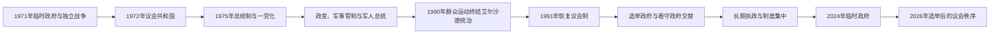

# 孟加拉国国家元首与政府首脑表

本表把国家元首、政府首脑和无总理时期的实际最高行政权分开整理。1971年的战时政府、1975—1991年的总统制与军政时期、1996年及2001—2009年的看守政府，以及2024—2026年的临时政府并非同一种制度，不应混入一张“历任总统或总理”表。现任信息核验截止到2026年7月。

## 国家领导体制演变图

总统、总理、首席顾问和军法管制首席执行官在不同阶段拥有不同权限。下表分列法定国家元首、政府首脑和无总理时期的实际最高行政权，不能把同年并行职位误作连续任次。

## 国家元首

| 顺序 | 国家元首 | 身份 / 党派或基础 | 任期 | 继任方式与关键事件 |
|---|---|---|---|---|
| 1 | **谢赫·穆吉布·拉赫曼（Sheikh Mujibur Rahman）** | 独立宣言所设总统，人民联盟 | 1971年3月26日—1972年1月12日 | 在西巴基斯坦被拘押期间被视为战时共和国总统；1972年回国后改任总理。 |
| 代行 | 赛义德·纳兹鲁尔·伊斯兰（Syed Nazrul Islam） | 战时临时总统，人民联盟 | 1971年4月17日—1972年1月10日 | 穆吉布被拘期间代理总统，主持流亡政府的国家元首职能。 |
| 2 | 阿布·赛义德·乔杜里（Abu Sayeed Chowdhury） | 总统 | 1972年1月12日—1973年12月24日 | 议会制宪法下的礼仪元首；辞职后由议长代理。 |
| 3 | 穆罕默德·穆罕默杜拉（Mohammad Mohammadullah） | 代理总统、后当选总统 | 1973年12月24日—1975年1月25日 | 先代理、1974年1月27日起正式任职；第四修正案建立总统制后由穆吉布接任。 |
| 4 | **谢赫·穆吉布·拉赫曼** | 总统，孟加拉国农工人民联盟体系 | 1975年1月25日—8月15日 | 推动一党总统制；在军事政变中遇刺。 |
| 5 | 洪达卡尔·穆什塔克·艾哈迈德（Khondaker Mostaq Ahmad） | 总统，政变支持者 | 1975年8月15日—11月6日 | 政变后就任；11月军内再度变局后下台。 |
| 6 | 阿布·萨达特·穆罕默德·赛耶姆（Abu Sadat Mohammad Sayem） | 总统兼首席军法管制执行官 | 1975年11月6日—1977年4月21日 | 在军方主导下任职，逐步把实际权力交给齐亚·拉赫曼。 |
| 7 | **齐亚·拉赫曼（Ziaur Rahman）** | 总统、军人，后创建孟加拉国民族主义党 | 1977年4月21日—1981年5月30日 | 先掌握军政实权，后任总统；遇刺身亡。 |
| 8 | 阿卜杜勒·萨塔尔（Abdus Sattar） | 代理总统、后当选总统，孟加拉国民族主义党 | 1981年5月30日—1982年3月24日 | 先代理、1981年11月20日起正式任职；被艾尔沙德军事政变推翻。 |
| 9 | 阿布·法扎尔·穆罕默德·阿赫桑丁·乔杜里（A. F. M. Ahsanuddin Chowdhury） | 军政府任命总统 | 1982年3月27日—1983年12月11日 | 名义国家元首，实际权力由首席军法管制执行官艾尔沙德掌握。 |
| 10 | **侯赛因·穆罕默德·艾尔沙德（H. M. Ershad）** | 总统、军人，民族党 | 1983年12月11日—1990年12月6日 | 将军政府制度化；在大规模反对运动中辞职。 |
| 11 | 沙哈布丁·艾哈迈德（Shahabuddin Ahmed） | 代理总统、过渡政府负责人 | 1990年12月6日—1991年10月9日 | 以最高法院首席大法官身份主持中立过渡；议会制恢复后回法院。 |
| 12 | 阿卜杜勒·拉赫曼·比斯瓦斯（Abdur Rahman Biswas） | 总统，孟加拉国民族主义党背景 | 1991年10月9日—1996年10月9日 | 议会制下的礼仪元首；1996年看守政府危机中仍具有关键宪政职能。 |
| 13 | 沙哈布丁·艾哈迈德 | 总统 | 1996年10月9日—2001年11月14日 | 由议会选出，经历人民联盟政府及2001年政权交接。 |
| 14 | A. Q. M. 巴德鲁多扎·乔杜里（A. Q. M. Badruddoza Chowdhury） | 总统，孟加拉国民族主义党背景 | 2001年11月14日—2002年6月21日 | 与执政党关系恶化后辞职。 |
| 代行 | 穆罕默德·贾米鲁丁·西尔卡尔（Muhammad Jamiruddin Sircar） | 议长、代理总统 | 2002年6月21日—9月6日 | 总统缺位期间代理。 |
| 15 | 伊阿久丁·艾哈迈德（Iajuddin Ahmed） | 总统；2006—2007年兼首席顾问 | 2002年9月6日—2009年2月12日 | 2006年选举危机中兼任看守政府首席顾问，紧急状态后退出该职但继续任总统。 |
| 16 | 齐勒·拉赫曼（Zillur Rahman） | 总统，人民联盟 | 2009年2月12日—2013年3月20日 | 在任内病逝。 |
| 17 | **阿卜杜勒·哈米德（Abdul Hamid）** | 代理总统、后当选总统，人民联盟 | 2013年3月14日—2023年4月23日 | 齐勒住院及病逝后代理；2013年4月24日起正式任职，2018年连任，是首位完成两个完整总统任期者。 |
| 18 | **穆罕默德·谢哈布丁（Mohammed Shahabuddin）** | 总统，人民联盟提名 | 2023年4月24日—至今 | 2023年宣誓就任第22任总统；2024年政府更替及2026年民选政府就任时仍在职，核验截止2026年7月。 |

## 政府首脑

| 顺序 | 政府首脑 | 职务与政治基础 | 任期 | 关键事件 / 备注 |
|---|---|---|---|---|
| 1 | **塔杰丁·艾哈迈德（Tajuddin Ahmad）** | 战时总理，人民联盟 | 1971年4月17日—1972年1月12日 | 组织流亡政府、解放军和国际支援体系；穆吉布回国后交接。 |
| 2 | **谢赫·穆吉布·拉赫曼** | 总理，人民联盟 | 1972年1月12日—1975年1月25日 | 领导战后重建和1972年宪法实施；1975年改行总统制。 |
| 3 | 穆罕默德·曼苏尔·阿里（Muhammad Mansur Ali） | 总理，孟加拉国农工人民联盟 | 1975年1月25日—8月15日 | 一党总统制下主持内阁；八月政变后被捕，11月在狱中遇害。 |
| 4 | 沙阿·阿齐兹尔·拉赫曼（Shah Azizur Rahman） | 总理，孟加拉国民族主义党 | 1979年4月15日—1982年3月24日 | 齐亚总统制下任职，后在萨塔尔时期留任；艾尔沙德政变终止政府。 |
| 5 | 阿陶尔·拉赫曼·汗（Ataur Rahman Khan） | 总理，军政府支持的文官内阁 | 1984年3月30日—1985年1月1日 | 艾尔沙德总统制下的行政首脑，实权仍在总统和军方。 |
| 6 | 米扎努尔·拉赫曼·乔杜里（Mizanur Rahman Chowdhury） | 总理，民族党 | 1986年7月9日—1988年3月27日 | 议会重新运作但总统仍掌握主导权。 |
| 7 | 毛杜德·艾哈迈德（Moudud Ahmed） | 总理，民族党 | 1988年3月27日—1989年8月12日 | 艾尔沙德体系内调整政府，后转任副总统。 |
| 8 | 卡齐·扎法尔·艾哈迈德（Kazi Zafar Ahmed） | 总理，民族党 | 1989年8月12日—1990年12月6日 | 反对运动迫使艾尔沙德辞职时政府终结。 |
| 9 | **卡莉达·齐亚（Khaleda Zia）** | 总理，孟加拉国民族主义党 | 1991年3月20日—1996年3月30日 | 第十二修正案恢复议会制；1996年争议选举后辞职并把权力交给看守政府。 |
| 看守 | 穆罕默德·哈比布尔·拉赫曼（Muhammad Habibur Rahman） | 看守政府首席顾问 | 1996年3月30日—6月23日 | 主持1996年6月选举和首次制度化的中立交接。 |
| 10 | **谢赫·哈西娜（Sheikh Hasina）** | 总理，人民联盟 | 1996年6月23日—2001年7月15日 | 完成恒河水协议和吉大港山区和平协议，任期届满后交看守政府。 |
| 看守 | 拉蒂富尔·拉赫曼（Latifur Rahman） | 看守政府首席顾问 | 2001年7月15日—10月10日 | 主持2001年议会选举。 |
| 11 | **卡莉达·齐亚** | 总理，孟加拉国民族主义党 | 2001年10月10日—2006年10月29日 | 联盟政府任期结束时，看守政府人选与选举名册争议升级。 |
| 看守 | 伊阿久丁·艾哈迈德 | 总统兼看守政府首席顾问 | 2006年10月29日—2007年1月11日 | 在政治危机中兼任两职；紧急状态后辞去首席顾问职务。 |
| 看守 | 法赫鲁丁·艾哈迈德（Fakhruddin Ahmed） | 军方支持的看守政府首席顾问 | 2007年1月12日—2009年1月6日 | 紧急状态下推进选民登记和反腐行动，2008年选举后交权。 |
| 12 | **谢赫·哈西娜** | 总理，人民联盟 | 2009年1月6日—2024年8月5日 | 连续执政，推动出口制造、基础设施和社会指标改善；同时选举竞争、言论空间和权力集中争议加深，2024年抗议浪潮中辞职。 |
| 临时 | **穆罕默德·尤努斯（Muhammad Yunus）** | 临时政府首席顾问 | 2024年8月8日—2026年2月17日 | 学生运动和政权更替后受命组建临时政府，负责制度调整、秩序恢复与大选过渡。 |
| 13 | **塔里克·拉赫曼（Tarique Rahman）** | 总理，孟加拉国民族主义党 | 2026年2月17日—至今 | 2026年议会选举后宣誓组阁；现任信息核验截止2026年7月。 |

## 无总理时期的实际最高行政权

| 时段 | 名义元首 / 实际掌权者 | 权力结构 |
|---|---|---|
| 1975年8月—1979年4月 | 穆什塔克、赛耶姆、齐亚先后任总统；军方高层居核心 | 总理职位取消或空缺，总统制、军法管制机构与军队指挥链共同决定行政权；齐亚在正式任总统前已逐步成为实际最高领导人。 |
| 1982年3月—1984年3月 | 艾尔沙德为首席军法管制执行官，阿赫桑丁·乔杜里任名义总统 | 军事委员会掌握实权，文职总统不构成独立政府首脑。 |
| 1985年1月—1986年7月 | 艾尔沙德总统 | 总理职位再度空缺，总统直接主导内阁和行政。 |
| 1990年12月—1991年3月 | 代理总统沙哈布丁·艾哈迈德与顾问委员会 | 过渡政府以中立选举和恢复议会制为目标，不能简单归入军政或普通总统制。 |
| 2024年8月5—8日 | 谢哈布丁总统主持组建临时安排 | 哈西娜辞职后至尤努斯宣誓前的短暂权力交接期。 |

## 制度演变要点

- 1972年宪法建立议会制；1975年第四修正案改行总统制并集中权力。
- 1975—1990年的总统任职不能只按法律名义理解：多次军变、军法管制和军队内部权力重组决定了实际统治。
- 1991年第十二修正案恢复议会制，总统主要成为礼仪元首；看守政府曾承担选举过渡，但其宪制基础后来被取消并引发持续争议。
- 2024—2026年临时政府以“首席顾问”为政府首脑称号；2026年2月17日新总理宣誓后，临时政府任期结束。

## 演变关系

- 对应时期：[东巴基斯坦、独立战争与人民共和国](/%E4%BA%BA%E6%96%87%E7%A7%91%E5%AD%A6/%E5%8E%86%E5%8F%B2/%E5%8D%97%E4%BA%9A/%E5%AD%9F%E5%8A%A0%E6%8B%89%E5%9B%BD/%E4%B8%9C%E5%B7%B4%E5%9F%BA%E6%96%AF%E5%9D%A6%E3%80%81%E7%8B%AC%E7%AB%8B%E6%88%98%E4%BA%89%E4%B8%8E%E4%BA%BA%E6%B0%91%E5%85%B1%E5%92%8C%E5%9B%BD.md)
- 上级：[孟加拉国历史](/%E4%BA%BA%E6%96%87%E7%A7%91%E5%AD%A6/%E5%8E%86%E5%8F%B2/%E5%8D%97%E4%BA%9A/%E5%AD%9F%E5%8A%A0%E6%8B%89%E5%9B%BD/README.md)
