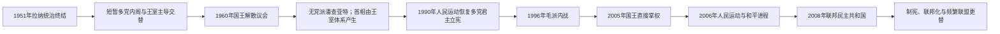

# 1951年以来尼泊尔政府首脑表

## 说明

1951年以后，尼泊尔先后经历国王直接统治、议会内阁、无党派潘查亚特、君主立宪、多党共和国和临时选举政府。同一人物可能多次组阁；下表按连续任期而非个人合并排列。部分过渡政府在正式头衔上使用“部长会议主席”，表中在备注中区分。日期以公历常用记载为主，短暂看守期按实际延续处理。

## 政府首脑制度演变图

总理任期常被国王解散政府、议会不信任、党内分裂、看守安排和共和国联盟重组打断。下表保留复任者的每段任期，不以“多次任职”合并。

## 1951—1990年：王权与潘查亚特时期

| 顺序 | 政府首脑或实际执政者 | 任期 | 政体与备注 |
|---|---|---|---|
| 1 | 莫汉·沙姆谢尔·拉纳 | 至1951年11月 | 拉纳末代首相；1951年2月后主持王室—拉纳—大会党联合政府 |
| 2 | 马特里卡·普拉萨德·柯伊拉腊 | 1951年11月—1952年8月 | 尼泊尔大会党；首个后拉纳时期文官首相 |
| 3 | 特里布万国王直接主持政府 | 1952年8月—1953年6月 | 内阁危机中的王室直接统治 |
| 4 | 马特里卡·普拉萨德·柯伊拉腊 | 1953年6月—1955年4月 | 第二次任首相 |
| 5 | 王室直接统治 | 1955年4月—1956年1月 | 特里布万去世后由马亨德拉延续 |
| 6 | 坦卡·普拉萨德·阿查里亚 | 1956年1月—1957年7月 | 尼泊尔人民委员会领袖，获释后组阁 |
| 7 | K·I·辛格 | 1957年7—11月 | 任期短，未能稳定党派与王室关系 |
| 8 | 马亨德拉国王直接统治 | 1957年11月—1958年5月 | 为选举和过渡内阁作准备 |
| 9 | 苏巴尔纳·沙姆谢尔·拉纳 | 1958年5月—1959年5月 | 选举看守政府 |
| 10 | **B·P·柯伊拉腊** | 1959年5月—1960年12月 | 首位经全国议会选举产生的首相；被国王政变推翻 |
| 11 | 图尔西·吉里 | 1960年12月—1963年12月 | 国王任命的部长会议主席，潘查亚特体制建立 |
| 12 | 苏里亚·巴哈杜尔·塔帕 | 1963年12月—1964年2月 | 潘查亚特政府 |
| 13 | 图尔西·吉里 | 1964年2月—1965年1月 | 第二次主持政府 |
| 14 | 苏里亚·巴哈杜尔·塔帕 | 1965年1月—1969年4月 | 推动无党制中央化 |
| 15 | 基尔蒂·尼迪·比斯塔 | 1969年4月—1970年4月 | 潘查亚特政府 |
| 16 | 苏里亚·巴哈杜尔·塔帕 | 1970年4月—1971年4月 | 再次组阁 |
| 17 | 基尔蒂·尼迪·比斯塔 | 1971年4月—1973年7月 | 马亨德拉去世、比兰德拉继位期间执政 |
| 18 | 纳根德拉·普拉萨德·里贾尔 | 1973年7月—1975年12月 | 潘查亚特政府 |
| 19 | 图尔西·吉里 | 1975年12月—1977年9月 | 第三次主持政府 |
| 20 | 基尔蒂·尼迪·比斯塔 | 1977年9月—1979年5月 | 1979年学生抗议后辞职 |
| 21 | 苏里亚·巴哈杜尔·塔帕 | 1979年5月—1983年7月 | 主持1980年政体公投及后续改革 |
| 22 | 洛肯德拉·巴哈杜尔·昌德 | 1983年7月—1986年3月 | 潘查亚特内部权力调整 |
| 23 | 纳根德拉·普拉萨德·里贾尔 | 1986年3—6月 | 短期过渡任期 |
| 24 | 马里奇·曼·辛格·什雷斯塔 | 1986年6月—1990年4月 | 1989年印尼贸易与过境危机、1990年人民运动期间执政 |
| 25 | 洛肯德拉·巴哈杜尔·昌德 | 1990年4月 | 潘查亚特末代短期政府，接受多党过渡 |

## 1990—2008年：君主立宪、内战与王室干政

| 顺序 | 政府首脑或实际执政者 | 任期 | 政体与备注 |
|---|---|---|---|
| 26 | 克里希纳·普拉萨德·巴特拉伊 | 1990年4月—1991年5月 | 民主过渡政府，制定1990年宪法并举行选举 |
| 27 | 吉里贾·普拉萨德·柯伊拉腊 | 1991年5月—1994年11月 | 恢复多党后的首届民选政府 |
| 28 | 曼·莫汉·阿迪卡里 | 1994年11月—1995年9月 | 少数政府；尼泊尔首位共产党首相 |
| 29 | 谢尔·巴哈杜尔·德乌帕 | 1995年9月—1997年3月 | 1996年毛主义武装斗争爆发 |
| 30 | 洛肯德拉·巴哈杜尔·昌德 | 1997年3—10月 | 联盟政府 |
| 31 | 苏里亚·巴哈杜尔·塔帕 | 1997年10月—1998年4月 | 联盟政府 |
| 32 | 吉里贾·普拉萨德·柯伊拉腊 | 1998年4月—1999年5月 | 第二阶段任期 |
| 33 | 克里希纳·普拉萨德·巴特拉伊 | 1999年5月—2000年3月 | 议会多数政府 |
| 34 | 吉里贾·普拉萨德·柯伊拉腊 | 2000年3月—2001年7月 | 内战升级、王宫惨案后辞职 |
| 35 | 谢尔·巴哈杜尔·德乌帕 | 2001年7月—2002年10月 | 宣布紧急状态；被贾南德拉国王解职 |
| 36 | 洛肯德拉·巴哈杜尔·昌德 | 2002年10月—2003年6月 | 国王任命、缺乏议会授权 |
| 37 | 苏里亚·巴哈杜尔·塔帕 | 2003年6月—2004年6月 | 国王任命政府 |
| 38 | 谢尔·巴哈杜尔·德乌帕 | 2004年6月—2005年2月 | 再次被国王解职 |
| 39 | 贾南德拉国王直接统治 | 2005年2月—2006年4月 | 解散政府、限制公民权利；第二次人民运动迫使还政 |
| 40 | 吉里贾·普拉萨德·柯伊拉腊 | 2006年4月—2008年8月 | 过渡首相兼一度代行国家元首职能；签署全面和平协议并筹建共和国 |

## 2008年以来：联邦民主共和国

| 顺序 | 政府首脑 | 任期 | 政治阶段与备注 |
|---|---|---|---|
| 41 | 普拉昌达（普什帕·卡迈勒·达哈尔） | 2008年8月—2009年5月 | 共和国首任民选政府首脑；军队统帅争议后辞职 |
| 42 | 马达夫·库马尔·尼泊尔 | 2009年5月—2011年2月 | 联盟政府；辞职后长期看守 |
| 43 | 贾拉·纳特·卡纳尔 | 2011年2—8月 | 联盟政府，制宪僵局持续 |
| 44 | 巴布拉姆·巴特拉伊 | 2011年8月—2013年3月 | 第一届制宪会议解散后主持过渡 |
| 45 | 基尔·拉杰·雷格米 | 2013年3月—2014年2月 | 时任首席大法官，以“部长会议主席”主持无党派选举政府 |
| 46 | 苏希尔·柯伊拉腊 | 2014年2月—2015年10月 | 2015年地震与新宪法颁布期间执政 |
| 47 | K·P·夏尔马·奥利 | 2015年10月—2016年8月 | 新宪法后首届政府；边境供应危机与联邦执行争议 |
| 48 | 普拉昌达 | 2016年8月—2017年6月 | 第二次任首相，按联盟协议交接 |
| 49 | 谢尔·巴哈杜尔·德乌帕 | 2017年6月—2018年2月 | 完成首轮联邦、省和地方选举 |
| 50 | K·P·夏尔马·奥利 | 2018年2月—2021年7月 | 左翼联盟多数；两次解散众议院均引发宪法诉讼 |
| 51 | 谢尔·巴哈杜尔·德乌帕 | 2021年7月—2022年12月 | 最高法院命令恢复众议院后组阁 |
| 52 | 普拉昌达 | 2022年12月—2024年7月 | 多次改组执政联盟，信任基础不断变化 |
| 53 | K·P·夏尔马·奥利 | 2024年7月—2025年9月 | 联盟政府；2025年青年抗议和政治危机中下台 |
| 54 | **苏希拉·卡尔基** | 2025年9月13日—2026年3月27日 | 前首席大法官；青年抗议后的临时政府首脑，主要任务是在六个月内组织选举 |
| 55 | **巴伦德拉·沙阿（巴伦·沙阿）** | 2026年3月27日至今 | 新当选首相；截至2026年7月在任 |

## 制度辨析

- 1960—1990年首相或部长会议主席由国王主导任免，并非竞争性政党议会政府。
- 2002—2006年多届内阁由国王直接任命，议会授权中断；2005—2006年更由贾南德拉亲自掌权。
- 2013—2014年雷格米的正式头衔是“部长会议主席”，属于为举行第二届制宪会议选举而设的特殊过渡安排。
- 2025—2026年卡尔基政府是青年抗议和政治真空后的限期选举政府；巴伦德拉·沙阿于2026年3月27日宣誓接任。
- 共和国的总统是礼仪性国家元首，行政权由获得众议院信任的总理和部长会议行使。

## 相关笔记

- [民主运动、内战与联邦共和国](/%E4%BA%BA%E6%96%87%E7%A7%91%E5%AD%A6/%E5%8E%86%E5%8F%B2/%E5%8D%97%E4%BA%9A/%E5%B0%BC%E6%B3%8A%E5%B0%94/%E6%B0%91%E4%B8%BB%E8%BF%90%E5%8A%A8%E3%80%81%E5%86%85%E6%88%98%E4%B8%8E%E8%81%94%E9%82%A6%E5%85%B1%E5%92%8C%E5%9B%BD.md)
- [沙阿王朝与拉纳首相世系表](/%E4%BA%BA%E6%96%87%E7%A7%91%E5%AD%A6/%E5%8E%86%E5%8F%B2/%E5%8D%97%E4%BA%9A/%E5%B0%BC%E6%B3%8A%E5%B0%94/%E6%B2%99%E9%98%BF%E7%8E%8B%E6%9C%9D%E4%B8%8E%E6%8B%89%E7%BA%B3%E9%A6%96%E7%9B%B8%E4%B8%96%E7%B3%BB%E8%A1%A8.md)
- [尼泊尔历史](/%E4%BA%BA%E6%96%87%E7%A7%91%E5%AD%A6/%E5%8E%86%E5%8F%B2/%E5%8D%97%E4%BA%9A/%E5%B0%BC%E6%B3%8A%E5%B0%94/README.md)
