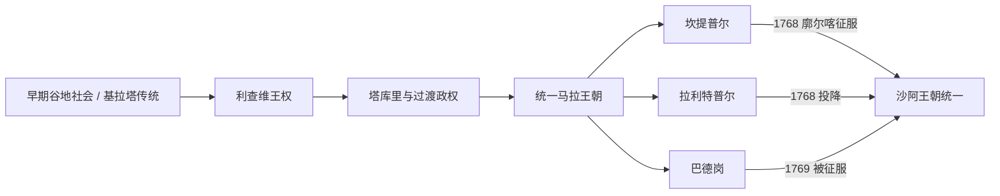

# 尼泊尔谷地与马拉王朝

## 时间

古代—1769年

## 概括

加德满都谷地位于喜马拉雅南北交通的交会处，灌溉稻作、尼瓦尔手工业和印度—西藏贸易共同支撑了城市国家。早期“基拉塔王统”主要来自后世编年传统；从利查维时期开始，碑铭、钱币和建筑遗存才使王权、土地授予与宗教赞助变得较为可考。约12世纪兴起的马拉诸王把谷地发展为南亚重要的城市文化中心，但15世纪后分裂为坎提普尔、拉利特普尔和巴德岗三支，长期竞争最终削弱了共同防御能力。

## 史料范围与年代争议

- 基拉塔诸王、阿育王到访以及某些早期佛塔的创建年代兼有传说成分，不能直接当作连续王表。
- 利查维碑铭只覆盖部分君主；实际执政者、共治者和地方贵族有时与名义国王并存。
- “马拉王朝”不是一条从12世纪连续到18世纪的单线世系。1482年前后以后，谷地三城形成并立王支，且帕坦一度由贵族集团选立或废黜国王。
- 因此下表列出能够支撑政治转折的主要统治者与末代支系，不把缺乏可靠年代的姓名拼接成虚假的完整世系。

## 政权形成与统治结构

| 阶段 | 时间 | 权力结构与代表统治者 | 历史意义 |
|---|---|---|---|
| 基拉塔与早期谷地传统 | 约4世纪以前 | 后世传说称有一系列基拉塔王；考古显示谷地已与恒河平原保持交流 | 保存早期族群和王权记忆，但具体世系存在争议 |
| 利查维王权 | 约4—9世纪 | 国王与贵族、地方村社及婆罗门—佛教机构共享资源；摩那提婆约464年留下现存早期重要碑铭 | 奠定可考的行政、土地授予、税役和宗教赞助体系 |
| 阿姆舒瓦尔曼与复辟期 | 约605—733年 | 阿姆舒瓦尔曼先任大臣后以王号执政；纳伦德拉·提婆约643年复位；阇耶提婆二世约8世纪初在位 | 谷地卷入吐蕃、北印度与跨喜马拉雅外交 |
| 塔库里及过渡政权 | 约9—12世纪 | 多个王族和地方势力交替，王表与年代不完整 | 城市、寺院和贸易网络延续，为马拉兴起提供基础 |
| 早期马拉 | 约1200—1382年 | 阿利·马拉通常被视为早期马拉君主；阿巴耶·马拉在1255年大地震中遇难 | “马拉”王号确立，但权力仍受贵族与城市集团制约 |
| 统一与改革期 | 1382—1482年 | **阇耶悉提·马拉**（约1382—1395）整顿法制、赋役与社会等级；**夜叉·马拉**（约1428—1482）扩展谷地王权 | 马拉文化和行政整合的高峰 |
| 三城并立 | 约1482—1769年 | 坎提普尔、拉利特普尔、巴德岗各有王支、宫廷和贵族集团 | 艺术与城市竞争繁荣，军事协作却日益困难 |

## 三城末期王支

| 城邦 | 末期关键统治者 | 在位 | 继承与结局 |
|---|---|---|---|
| 坎提普尔（加德满都） | 阇耶·普拉卡什·马拉 | 1736—1746、1750—1768年 | 两度在位；1768年因陀罗节期间坎提普尔失守，后转往拉利特普尔、巴德岗继续抵抗 |
| 拉利特普尔（帕坦） | 特杰·纳拉辛哈·马拉 | 1765—1768年 | 贵族政治下的末代马拉王；城邦在坎提普尔失守后不久向廓尔喀投降 |
| 巴德岗（巴克塔普尔） | 兰吉特·马拉 | 1722—1769年 | 与阇耶·普拉卡什等共同进行最后抵抗；1769年城破，谷地马拉政权终结 |

## 经济、社会与文化机制

- 谷地利用河流和台地发展密集灌溉农业，城市则由职业、亲族、寺院和社区组织维持供水、节庆与公共工程。
- 尼瓦尔商人经营通往西藏的盐、羊毛、金属和货币贸易，也与恒河平原交换粮食、纺织品及宗教用品。
- 印度教王权、金刚乘佛教与地方神祇并存；同一神庙、节庆和工匠网络常跨越教派界限。
- 三城宫廷以塔庙、王宫广场、金属造像、木雕和手抄本竞争声望，形成今日加德满都谷地最醒目的文化遗产。
- 阇耶悉提时期的社会分类与司法整顿加强了赋役和职业秩序，但后世关于其“创设全部种姓制度”的说法有所夸大。

## 重要事件

1. **约464年摩那提婆碑铭**：显示利查维国王、地方聚落、土地与宗教捐赠的关系，是重建早期谷地史的关键锚点。
2. **7世纪跨喜马拉雅外交**：阿姆舒瓦尔曼和纳伦德拉·提婆时期，谷地在吐蕃与北印度力量之间周旋，贸易通道的重要性上升。
3. **1255年大地震**：据编年传统造成阿巴耶·马拉及大量居民死亡，城市和王权都经历重建。
4. **1349年孟加拉军入侵**：沙姆斯丁·伊利亚斯·沙阿的军队劫掠谷地，暴露城防弱点，但没有建立长期统治。
5. **阇耶悉提·马拉改革**：14世纪后期通过司法、土地、赋役和社会身份整顿加强王权，并推动三城共同文化的发展。
6. **夜叉·马拉扩张与分裂**：15世纪达到领土高峰；其死后继承分割逐步固化为三个竞争王国。
7. **贸易与铸币竞争**：17—18世纪三城争夺西藏贸易、关税和铸币收益，宫廷繁荣与财政竞争同时加深。
8. **1768—1769年廓尔喀征服**：普里特维·纳拉扬·沙阿先封锁谷地商路，再依次攻取坎提普尔、拉利特普尔和巴德岗。

## 兴盛、分裂与灭亡原因

### 兴盛条件

- 肥沃谷地和灌溉农业提供稳定剩余，连接印度与西藏的商路又带来关税、铸币和手工业收入。
- 城市社区、寺院和工匠行会能够在王权更替时继续维持社会运作。
- 王室以跨宗教赞助和公共建筑塑造合法性，并吸收南亚与喜马拉雅地区的艺术、法制和仪式传统。

### 结构性衰弱

- 三城王室相互结盟、废立和求援，难以形成统一军事指挥；贵族集团也频繁介入王位继承。
- 山地外围的新兴廓尔喀国家拥有更集中的军事动员和长期封锁能力。
- 贸易关口被逐步切断后，谷地粮食、税收和军费承压，城市之间仍未停止内耗。

### 直接灭亡过程

廓尔喀军在多次正面进攻受挫后改用包围、封锁和控制山口的方式消耗三城。1768年坎提普尔在节庆期间失守，拉利特普尔随即投降；阇耶·普拉卡什退守巴德岗，与兰吉特·马拉进行最后抵抗。1769年巴德岗被攻克，马拉诸王国灭亡，其城市行政、尼瓦尔社区和宗教文化则被沙阿王朝继续利用。

## 演变关系

- 上级：[尼泊尔历史](/%E4%BA%BA%E6%96%87%E7%A7%91%E5%AD%A6/%E5%8E%86%E5%8F%B2/%E5%8D%97%E4%BA%9A/%E5%B0%BC%E6%B3%8A%E5%B0%94/README.md)
- 后继：[廓尔喀统一、拉纳政权与英国关系](/%E4%BA%BA%E6%96%87%E7%A7%91%E5%AD%A6/%E5%8E%86%E5%8F%B2/%E5%8D%97%E4%BA%9A/%E5%B0%BC%E6%B3%8A%E5%B0%94/%E5%BB%93%E5%B0%94%E5%96%80%E7%BB%9F%E4%B8%80%E3%80%81%E6%8B%89%E7%BA%B3%E6%94%BF%E6%9D%83%E4%B8%8E%E8%8B%B1%E5%9B%BD%E5%85%B3%E7%B3%BB.md)
- 区域背景：[南亚历史](/%E4%BA%BA%E6%96%87%E7%A7%91%E5%AD%A6/%E5%8E%86%E5%8F%B2/%E5%8D%97%E4%BA%9A/README.md)
