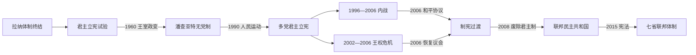

# 民主运动、内战与联邦共和国

## 时间

1951年至今（现况核验至2026年7月）

## 概括

拉纳统治结束后，尼泊尔并未直线走向议会民主，而是在王室、政党、官僚军队和社会运动之间反复重组权力。1959年首次议会选举仅一年多便被马亨德拉国王推翻，1962年宪法建立由国王主导的无党派潘查亚特制度。1990年人民运动恢复多党君主立宪，但土地、阶级、族群、地区代表和国家能力问题未获解决，1996—2006年毛主义武装斗争遂演变为全国性内战。2006年和平进程削弱王权，2008年制宪会议建立共和国；2015年宪法确立联邦制，此后政治竞争主要表现为联盟更替、联邦实施和社会代表性争议。

## 政治阶段

| 阶段 | 时间 | 权力结构 | 核心矛盾 |
|---|---|---|---|
| 后拉纳过渡 | 1951—1959年 | 国王、尼泊尔大会党和旧官僚反复组阁 | 制宪、选举与王权边界 |
| 议会试验 | 1959—1960年 | B·P·柯伊拉腊民选政府 | 改革议程与国王权力冲突 |
| 潘查亚特无党制 | 1960—1990年 | 国王居核心，分级议会禁止政党竞争 | 中央集权、发展主义与政治自由 |
| 多党君主立宪 | 1990—2002年 | 国王为国家元首，议会内阁执政 | 政府频繁更替、社会排斥与毛主义叛乱 |
| 王权危机与内战终局 | 2002—2006年 | 议会中断，国王任命政府并一度直接统治 | 军事解决失败、七党联盟与毛派合作 |
| 和平过渡与共和国 | 2006—2015年 | 临时议会、制宪会议、联盟政府 | 军队整合、君主制、联邦边界与宪法 |
| 联邦共和国运行 | 2015年至今 | 礼仪总统、议会总理、七省与地方政府 | 联盟稳定、财政联邦制、包容与治理效能 |

## 国家元首与政府首脑

完整连续内阁序列见[1951年以来尼泊尔政府首脑表](/%E4%BA%BA%E6%96%87%E7%A7%91%E5%AD%A6/%E5%8E%86%E5%8F%B2/%E5%8D%97%E4%BA%9A/%E5%B0%BC%E6%B3%8A%E5%B0%94/1951%E5%B9%B4%E4%BB%A5%E6%9D%A5%E6%94%BF%E5%BA%9C%E9%A6%96%E8%84%91%E8%A1%A8.md)；沙阿君主及拉纳首相见[沙阿王朝与拉纳首相世系表](/%E4%BA%BA%E6%96%87%E7%A7%91%E5%AD%A6/%E5%8E%86%E5%8F%B2/%E5%8D%97%E4%BA%9A/%E5%B0%BC%E6%B3%8A%E5%B0%94/%E6%B2%99%E9%98%BF%E7%8E%8B%E6%9C%9D%E4%B8%8E%E6%8B%89%E7%BA%B3%E9%A6%96%E7%9B%B8%E4%B8%96%E7%B3%BB%E8%A1%A8.md)。

### 共和国总统

| 顺序 | 总统 | 任期 | 产生与备注 |
|---|---|---|---|
| 1 | **拉姆·巴兰·亚达夫** | 2008年7月—2015年10月 | 制宪会议选出；共和国首任总统，任期因制宪延宕而延长 |
| 2 | **比迪娅·德维·班达里** | 2015年10月—2023年3月 | 首位女性总统；2018年经联邦选举团连任 |
| 3 | **拉姆·钱德拉·保德尔** | 2023年3月13日至今 | 第三任总统；截至2026年7月在任 |

### 2025—2026年最新政府交接

| 角色 | 人物 | 任期或状态 | 权力性质 |
|---|---|---|---|
| 临时总理 | 苏希拉·卡尔基 | 2025年9月13日—2026年3月27日 | 青年抗议后的限期选举政府；前首席大法官 |
| 总理 | **巴伦德拉·沙阿（巴伦·沙阿）** | 2026年3月27日至今 | 议会政府首脑；截至2026年7月在任 |
| 总统 | 拉姆·钱德拉·保德尔 | 2023年3月13日至今 | 宪法国家元首，通常依内阁建议履职 |

## 统治结构

- **总统**由联邦议会议员与省议会议员组成的选举团产生，是国家元首与宪法守护者，日常行政权有限。
- **总理与部长会议**须获得众议院信任；多党并立和议席碎片化使联盟协议、信任投票与政党分合成为政府寿命的关键。
- **联邦议会**由众议院和国民议会组成；混合选举制兼顾选区代表与比例包容，但也增加联盟协调成本。
- **七个省与地方政府**依2015年宪法取得立法、预算和行政权限；财政、人事和职权划分仍在磨合。
- **军队与前战斗员**在2006年后经联合国监督、安置和有限整合，避免形成两套长期并立武装体系。
- **最高法院**多次审理议会解散、政府任命和宪法权限争议，成为共和国权力平衡的重要参与者。

## 重要事件与具体过程

1. **1951年拉纳统治结束**：特里布万复位，王室、拉纳和尼泊尔大会党组成联合政府，但制宪承诺、军政控制和党内分裂使过渡长期不稳。
2. **1959年首次全国议会选举**：尼泊尔大会党获胜，B·P·柯伊拉腊出任首相，推动土地、行政和财政改革。
3. **1960年王室政变**：马亨德拉逮捕首相、解散议会并禁止政党；1962年宪法把地方到中央的潘查亚特议会置于国王领导下。
4. **1979—1980年抗议与公投**：学生运动迫使王室在“改革后的潘查亚特”和多党制间公投；官方结果保留无党制，但引入直接选举等有限调整。
5. **1990年第一次人民运动**：尼泊尔大会党与左翼联盟的群众抗议迫使比兰德拉接受多党宪法，国王从直接统治者转为立宪君主。
6. **1996年“人民战争”开始**：毛主义者以土地、阶级、族群与地区不平等为动员议题，从西部农村扩展；政府警察行动升级为军队参战。
7. **2001年王宫惨案**：比兰德拉及多名王室成员死亡，迪彭德拉在昏迷中短暂继位，贾南德拉随后登基；官方调查结论长期受到社会质疑。
8. **2002—2005年王权扩张**：国王解散或更换政府，2005年直接接管政权并限制媒体、通信和政治活动，试图以军事方式结束叛乱。
9. **2006年第二次人民运动**：七党联盟与毛主义者在此前达成合作，持续街头动员迫使国王恢复议会；同年《全面和平协议》结束十年战争。
10. **2008年废除君主制**：第一届制宪会议首次会议宣布建立联邦民主共和国，贾南德拉离开王宫。
11. **2013年第二次制宪会议选举**：第一届制宪会议未能就联邦边界和政体达成宪法，特别选举政府组织新一轮制宪。
12. **2015年地震、宪法与边境危机**：大地震造成严重伤亡和重建压力；同年宪法确立联邦制，但马德西等群体对省界与代表安排提出强烈抗议，南部通道受阻导致物资短缺。
13. **2017—2018年三级选举**：地方、省和联邦机构依新宪法运行，联邦制从文本进入实际行政阶段。
14. **2020—2021年议会解散争议**：奥利政府两次推动解散众议院，最高法院两次干预并恢复议会，确立了总理解散权受到宪法条件约束。
15. **2025—2026年政治过渡**：青年主导的反腐与治理抗议引发政府更替；前首席大法官苏希拉·卡尔基主持限期临时政府和选举，巴伦德拉·沙阿于2026年3月27日宣誓就任总理。

## 内战的阶段、转折与结果

### 背景

1990年后的多党制恢复了政治竞争，却未迅速改变土地不均、偏远地区国家服务不足、达利特与少数族群排斥、青年失业和政府频繁更替。毛主义者把制宪会议、共和国、土地改革和社会平等结合成革命纲领。

### 过程

- **1996—2001年**：叛乱以西部农村警察站、地方官署和地主权力为目标，政府主要依靠警察镇压。
- **2001—2005年**：停火谈判破裂后军队全面参战，紧急状态、失踪、法外杀害和毛派处决均造成严重平民伤害。
- **2005—2006年**：国王直接统治疏远议会政党；七党联盟与毛派的十二点谅解把反王权目标汇合。
- **2006年以后**：停火、《全面和平协议》、联合国监督、战斗员营地与制宪选举逐步把冲突转入政治程序。

### 结果与长期影响

战争造成约一万七千人死亡，并伴随大规模失踪、流离失所和基础设施破坏。毛主义力量进入议会，君主制被废除，联邦、世俗、共和与包容原则写入新制度；但转型正义、受害者赔偿、地方不平等与前战斗员生计至今仍未完全解决。

## 转型成功条件与持续困难

### 制度突破

- 反拉纳、反潘查亚特和反王权运动先后建立政党组织、群众动员与制宪传统。
- 2006年各方接受以选举、制宪和武装管理替代全面军事胜负，避免国家长期分裂。
- 比例代表、保留席位和联邦地方层级扩大了女性、达利特、马德西、原住民族与偏远地区的政治入口。

### 结构性困难

- 政党分裂、个人化领导和联盟反复重组削弱政策连续性；同一批领导人多次轮替。
- 联邦与省、地方之间的财权、人事和执法权限仍有重叠，公共服务能力地区差异明显。
- 对外经济高度依赖劳务汇款、进口和印度过境，同时需在印度与中国之间保持外交平衡。
- 转型正义和反腐改革推进缓慢，青年就业与公共信任不足周期性转化为街头抗议。

## 演变关系

- 前一阶段：[廓尔喀统一、拉纳政权与英国关系](/%E4%BA%BA%E6%96%87%E7%A7%91%E5%AD%A6/%E5%8E%86%E5%8F%B2/%E5%8D%97%E4%BA%9A/%E5%B0%BC%E6%B3%8A%E5%B0%94/%E5%BB%93%E5%B0%94%E5%96%80%E7%BB%9F%E4%B8%80%E3%80%81%E6%8B%89%E7%BA%B3%E6%94%BF%E6%9D%83%E4%B8%8E%E8%8B%B1%E5%9B%BD%E5%85%B3%E7%B3%BB.md)
- 政府首脑专表：[1951年以来尼泊尔政府首脑表](/%E4%BA%BA%E6%96%87%E7%A7%91%E5%AD%A6/%E5%8E%86%E5%8F%B2/%E5%8D%97%E4%BA%9A/%E5%B0%BC%E6%B3%8A%E5%B0%94/1951%E5%B9%B4%E4%BB%A5%E6%9D%A5%E6%94%BF%E5%BA%9C%E9%A6%96%E8%84%91%E8%A1%A8.md)
- 王室与拉纳世系：[沙阿王朝与拉纳首相世系表](/%E4%BA%BA%E6%96%87%E7%A7%91%E5%AD%A6/%E5%8E%86%E5%8F%B2/%E5%8D%97%E4%BA%9A/%E5%B0%BC%E6%B3%8A%E5%B0%94/%E6%B2%99%E9%98%BF%E7%8E%8B%E6%9C%9D%E4%B8%8E%E6%8B%89%E7%BA%B3%E9%A6%96%E7%9B%B8%E4%B8%96%E7%B3%BB%E8%A1%A8.md)
- 上级：[尼泊尔历史](/%E4%BA%BA%E6%96%87%E7%A7%91%E5%AD%A6/%E5%8E%86%E5%8F%B2/%E5%8D%97%E4%BA%9A/%E5%B0%BC%E6%B3%8A%E5%B0%94/README.md)
