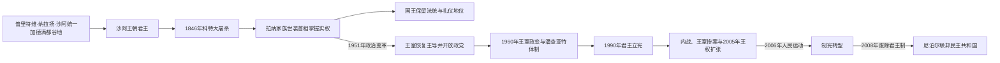

# 沙阿王朝与拉纳首相世系表

## 范围

本表把沙阿王朝的名义国家元首与1846—1951年掌握实际权力的拉纳世袭首相分开排列。1950—1951年年幼的贾南德拉曾被拉纳政府宣布为国王，但特里布万并未正式退位，该次“在位”未获广泛承认；2001—2008年才是贾南德拉无争议的正式统治期。

## 王权与实际权力演变图

沙阿国王与拉纳首相在1846—1951年是两条并行序列：前者为法定君主，后者垄断军政与继承。表中分别列全，并注明复位、幼主和实际权力断点。

## 沙阿王朝君主

| 顺序 | 君主 | 在位 | 生卒 | 与前任关系 | 关键事件与备注 |
|---|---|---|---|---|---|
| 1 | **普里特维·纳拉扬·沙阿** | 1743—1775年；1768年起为统一国家之王 | 1723—1775年 | 纳拉·布帕尔·沙阿之子 | 廓尔喀国王；夺取谷地并奠定近代尼泊尔国家 |
| 2 | 普拉塔普·辛格·沙阿 | 1775—1777年 | 1751—1777年 | 前任之子 | 在位短；王后拉金德拉·拉克希米随后为幼主摄政 |
| 3 | 拉纳·巴哈杜尔·沙阿 | 1777—1799年 | 1775—1806年 | 前任之子 | 幼年即位；1799年退位，1804年返国掌权，1806年遇刺 |
| 4 | 吉尔万·尤达·比克拉姆·沙阿 | 1799—1816年 | 1797—1816年 | 前任之子 | 幼主；摄政与比姆森·塔帕执政；英尼战争期间去世 |
| 5 | 拉金德拉·比克拉姆·沙阿 | 1816—1847年 | 1813—1881年 | 前任之子 | 幼年即位；宫廷派系争斗激烈；科特大屠杀后被废 |
| 6 | 苏伦德拉·比克拉姆·沙阿 | 1847—1881年 | 1829—1881年 | 前任之子 | 江格·巴哈杜尔扶立；拉纳首相掌握实权 |
| 7 | 普里特维·比尔·比克拉姆·沙阿 | 1881—1911年 | 1875—1911年 | 前任之孙 | 幼年即位；拉纳寡头制稳定化 |
| 8 | **特里布万·比尔·比克拉姆·沙阿** | 1911—1955年 | 1906—1955年 | 前任之子 | 1950年出走印度并支持反拉纳运动；1951年复位。拉纳政府曾在1950—1951年另立贾南德拉，故部分表会标示一次争议中断 |
| — | 贾南德拉·比尔·比克拉姆·沙阿（争议童王） | 1950—1951年（拉纳政府单方面宣布） | 1947年生 | 特里布万之孙 | 当时约3岁，未获广泛国际承认；不作为公认连续王序单列编号 |
| 9 | 马亨德拉·比尔·比克拉姆·沙阿 | 1955—1972年 | 1920—1972年 | 特里布万之子 | 1960年解散民选政府，建立无党派潘查亚特体制 |
| 10 | 比兰德拉·比尔·比克拉姆·沙阿 | 1972—2001年 | 1945—2001年 | 前任之子 | 1990年接受多党君主立宪；2001年王宫惨案中遇难 |
| 11 | 迪彭德拉·比尔·比克拉姆·沙阿 | 2001年6月1—4日 | 1971—2001年 | 前任之子 | 王宫惨案后昏迷中被宣布为王，三日后死亡；责任与具体经过仍有社会争议 |
| 12 | **贾南德拉·比尔·比克拉姆·沙阿** | 2001—2008年 | 1947年生 | 比兰德拉之弟、迪彭德拉之叔 | 2005年直接接管政府；2006年恢复议会；2008年制宪会议废除君主制 |

## 拉纳世袭首相

拉纳统治采用家族内部的长幼与派系继承规则，首相同时控制军队和高级官职。正式继承之外偶有数日代理，本表以掌握政府的公认首相为主；江格·巴哈杜尔第一次辞职后，克里希纳·巴哈杜尔曾在1857年短暂代行职权，随后江格复任。

| 顺序 | 首相 | 任期 | 生卒 | 与前任关系 | 关键事件与备注 |
|---|---|---|---|---|---|
| 1 | **江格·巴哈杜尔·拉纳** | 1846—1856年、1857—1877年 | 1817—1877年 | 科特大屠杀后掌权 | 创建拉纳体制；1850年访欧；颁行《穆卢基法典》；援助英国镇压1857年印度大起义 |
| 2 | 巴姆·巴哈杜尔·昆瓦尔·拉纳 | 1856—1857年 | 1818—1857年 | 江格之弟 | 在任病逝；其后有短暂代理期 |
| 3 | 拉诺迪普·辛格·拉纳 | 1877—1885年 | 1825—1885年 | 江格之弟 | 被侄辈发动政变杀害，权力转入沙姆谢尔支系 |
| 4 | 比尔·沙姆谢尔·江格·巴哈杜尔·拉纳 | 1885—1901年 | 1852—1901年 | 拉诺迪普之侄 | 稳固沙姆谢尔支系；扩展宫廷与有限公共设施 |
| 5 | 德夫·沙姆谢尔·拉纳 | 1901年3—6月 | 1862—1914年 | 前任之弟 | 倡导教育与报刊，因改革倾向迅速被家族废黜 |
| 6 | **钱德拉·沙姆谢尔·拉纳** | 1901—1929年 | 1863—1929年 | 前任之弟 | 废除法定奴隶制，支持英国参加一战；1923年条约确认尼泊尔独立 |
| 7 | 比姆·沙姆谢尔·拉纳 | 1929—1932年 | 1865—1932年 | 前任之弟 | 延续家族寡头统治，在经济压力中维持对英合作 |
| 8 | 朱达·沙姆谢尔·拉纳 | 1932—1945年 | 1875—1952年 | 前任之侄 | 1934年大地震后重建；镇压尼泊尔人民委员会等反对力量 |
| 9 | 帕德马·沙姆谢尔·拉纳 | 1945—1948年 | 1882—1961年 | 前任之侄 | 尝试有限宪政与行政改革，受保守派压力辞职 |
| 10 | **莫汉·沙姆谢尔·拉纳** | 1948—1951年 | 1885—1967年 | 前任之侄 | 末代拉纳世袭首相；1951年协议后短暂任联合政府首相，同年辞职 |

## 权力交接的关键断点

- **1799—1806年**：拉纳·巴哈杜尔退位后仍以太上王身份干政，说明名义王位与实际权力已经可能分离。
- **1846—1847年**：江格·巴哈杜尔先控制军队和内阁，再废拉金德拉、立苏伦德拉，拉纳首相制由此制度化。
- **1885年政变**：拉诺迪普被杀后，拉纳家族内的沙姆谢尔支系接管继承秩序。
- **1950—1951年王位争议**：另立童王未能取代特里布万的国内外合法性，反而加速拉纳统治瓦解。
- **2008年废除王制**：沙阿王朝并非被另一王朝取代，而是由制宪会议建立的联邦共和国终结。

## 相关笔记

- [廓尔喀统一、拉纳政权与英国关系](/%E4%BA%BA%E6%96%87%E7%A7%91%E5%AD%A6/%E5%8E%86%E5%8F%B2/%E5%8D%97%E4%BA%9A/%E5%B0%BC%E6%B3%8A%E5%B0%94/%E5%BB%93%E5%B0%94%E5%96%80%E7%BB%9F%E4%B8%80%E3%80%81%E6%8B%89%E7%BA%B3%E6%94%BF%E6%9D%83%E4%B8%8E%E8%8B%B1%E5%9B%BD%E5%85%B3%E7%B3%BB.md)
- [民主运动、内战与联邦共和国](/%E4%BA%BA%E6%96%87%E7%A7%91%E5%AD%A6/%E5%8E%86%E5%8F%B2/%E5%8D%97%E4%BA%9A/%E5%B0%BC%E6%B3%8A%E5%B0%94/%E6%B0%91%E4%B8%BB%E8%BF%90%E5%8A%A8%E3%80%81%E5%86%85%E6%88%98%E4%B8%8E%E8%81%94%E9%82%A6%E5%85%B1%E5%92%8C%E5%9B%BD.md)
- [尼泊尔历史](/%E4%BA%BA%E6%96%87%E7%A7%91%E5%AD%A6/%E5%8E%86%E5%8F%B2/%E5%8D%97%E4%BA%9A/%E5%B0%BC%E6%B3%8A%E5%B0%94/README.md)
