# 巴基斯坦国家元首与政府首脑表

## 说明

巴基斯坦1947—1956年为英联邦自治领，由总督代表君主；1956年成为共和国。1958—1973年、1977—1985年和1999—2002年，总理职位被取消或暂停，行政权集中于军人总统。看守总理、复职、代理总统和任期中断均按实际先后单列。现况核验至2026年7月。

## 国家权力结构演变图

```mermaid
flowchart LR
    D47["1947年巴基斯坦自治领"] --> GG["总督与总理并立"]
    GG --> R56["1956年共和国与总统制"]
    R56 --> C58["1958年军事政变"]
    C58 --> AY["阿尤布汗总统统治"]
    AY --> Y["叶海亚汗军政与1971年分裂"]
    Y --> B["布托时期文官总统／总理制"]
    B --> Z77["1977年齐亚军政"]
    Z77 --> C88["1988年后民选政府与总统解散权交替"]
    C88 --> M99["1999年穆沙拉夫政变"]
    M99 --> R08["2008年文官与议会秩序恢复"]
    R08 --> H["政党竞争、司法与军方持续共同塑权"]
```

国家元首、总理、戒严首席执行官与陆军参谋长在政变时期可能重合或并行。下表分列法定职位，并在“实际权力结构”中说明军方主导阶段，避免把军职直接混入总统一列。

## 自治领总督

| 顺序 | 总督 | 任期 | 与前任关系 | 关键事件 |
|---|---|---|---|---|
| 1 | **穆罕默德·阿里·真纳** | 1947年8月15日—1948年9月11日 | 建国制宪会议推举 | 建国领袖，实际权威远超一般礼仪总督 |
| 2 | 卡瓦贾·纳齐姆丁 | 1948年9月14日—1951年10月17日 | 原东孟加拉首席部长 | 真纳去世后继任；后转任总理 |
| 3 | 马利克·古拉姆·穆罕默德 | 1951年10月17日—1955年10月6日 | 官僚系统出身 | 1953年解散纳齐姆丁内阁，1954年解散制宪会议，扩大总督权力 |
| 4 | 伊斯坎德尔·米尔扎 | 1955年10月6日—1956年3月23日 | 前国防秘书、东巴总督 | “一个单位”方案实施；共和国成立后转任总统 |

## 共和国总统

| 顺序 | 总统 | 任期 | 产生或继任 | 关键事件与备注 |
|---|---|---|---|---|
| 1 | 伊斯坎德尔·米尔扎 | 1956年3月23日—1958年10月27日 | 由总督转任首任总统 | 1958年废宪并与军方实施戒严，旋即被阿尤布·汗放逐 |
| 2 | **穆罕默德·阿尤布·汗** | 1958年10月27日—1969年3月25日 | 军事政变 | 1962年总统制、“基本民主制”、工业化与1965年印巴战争 |
| 3 | 阿迦·穆罕默德·叶海亚·汗 | 1969年3月25日—1971年12月20日 | 军方接管 | 取消“一个单位”；举行1970年大选；镇压东巴后国家分裂 |
| 4 | **佐勒菲卡尔·阿里·布托** | 1971年12月20日—1973年8月13日 | 战败后接任总统兼首席戒严长官 | 重建西翼国家；1973年宪法后改任总理 |
| 5 | 法扎尔·伊拉希·乔杜里 | 1973年8月14日—1978年9月16日 | 议会选举 | 1973年议会制下的礼仪总统；1977年后受齐亚控制 |
| 6 | **穆罕默德·齐亚·哈克** | 1978年9月16日—1988年8月17日 | 1977年军事政变后兼任 | 伊斯兰化、无党派选举、阿富汗战争；空难身亡 |
| 7 | 古拉姆·伊沙克·汗 | 1988年8月17日—1993年7月18日 | 参议院主席代理后当选 | 多次使用宪法第八修正案解散政府；与纳瓦兹·谢里夫同时辞职 |
| — | 瓦西姆·萨贾德（代理） | 1993年7月18日—11月14日 | 参议院主席 | 选举过渡 |
| 8 | 法鲁克·莱加里 | 1993年11月14日—1997年12月2日 | 议会选举 | 1996年解散贝娜齐尔政府；与纳瓦兹政府冲突后辞职 |
| — | 瓦西姆·萨贾德（代理） | 1997年12月2日—1998年1月1日 | 参议院主席 | 短期代理 |
| 9 | 穆罕默德·拉菲克·塔拉尔 | 1998年1月1日—2001年6月20日 | 议会选举 | 1999年政变后仍短暂保留总统名义 |
| 10 | **佩尔韦兹·穆沙拉夫** | 2001年6月20日—2008年8月18日 | 1999年军事接管后自任总统 | 反恐战争、2002年宪制安排、2007年紧急状态；弹劾压力下辞职 |
| — | 穆罕默德·米安·苏姆罗（代理） | 2008年8月18日—9月9日 | 参议院主席 | 文官交接 |
| 11 | **阿西夫·阿里·扎尔达里** | 2008年9月9日—2013年9月9日 | 议会选举 | 第十八修正案削减总统权力、恢复议会联邦制 |
| 12 | 马姆努恩·侯赛因 | 2013年9月9日—2018年9月9日 | 议会选举 | 礼仪总统 |
| 13 | 阿里夫·阿尔维 | 2018年9月9日—2024年3月10日 | 议会选举 | 政府更替与议会、选举争议期间任职 |
| 14 | **阿西夫·阿里·扎尔达里** | 2024年3月10日至今 | 选举团再次选出 | 第二次任总统；截至2026年7月在任 |

## 政府首脑

| 顺序 | 总理或政府首脑 | 任期 | 性质与备注 |
|---|---|---|---|
| 1 | **利雅卡特·阿里·汗** | 1947年8月15日—1951年10月16日 | 首任总理；遇刺身亡 |
| 2 | 卡瓦贾·纳齐姆丁 | 1951年10月17日—1953年4月17日 | 被总督解职，仍有议会支持 |
| 3 | 穆罕默德·阿里·博格拉 | 1953年4月17日—1955年8月12日 | 提出东西两翼权力平衡方案；制宪会议被解散 |
| 4 | 乔杜里·穆罕默德·阿里 | 1955年8月12日—1956年9月12日 | 1956年宪法制定期间执政 |
| 5 | 侯赛因·沙希德·苏拉瓦底 | 1956年9月12日—1957年10月17日 | 联盟政府；东巴政治领袖 |
| 6 | 易卜拉欣·伊斯梅尔·琼德里加尔 | 1957年10月17日—12月16日 | 短期联盟政府 |
| 7 | 费罗兹·汗·努恩 | 1957年12月16日—1958年10月7日 | 戒严后职位被取消 |
| — | 阿尤布·汗、叶海亚·汗总统制 | 1958年10月—1971年12月 | 无常设总理；军人总统掌握行政权 |
| 8 | 努鲁勒·阿明 | 1971年12月7—20日 | 战争末期短暂总理，唯一来自东巴的中央总理 |
| 9 | **佐勒菲卡尔·阿里·布托** | 1973年8月14日—1977年7月5日 | 1973年宪法后总理；被齐亚政变推翻 |
| — | 齐亚·哈克军政 | 1977年7月—1985年3月 | 总理职位暂停 |
| 10 | 穆罕默德·汗·居内久 | 1985年3月24日—1988年5月29日 | 无党派选举后组阁；被齐亚解散 |
| 11 | **贝娜齐尔·布托** | 1988年12月2日—1990年8月6日 | 首次任总理；首位领导穆斯林多数国家政府的女性 |
| — | 古拉姆·穆斯塔法·贾托伊 | 1990年8月6日—11月6日 | 看守总理 |
| 12 | **纳瓦兹·谢里夫** | 1990年11月6日—1993年4月18日 | 首次任期，被总统解职 |
| — | 米尔·巴拉赫·谢尔·马扎里 | 1993年4月18日—5月26日 | 看守总理；最高法院恢复前政府 |
| 12续 | 纳瓦兹·谢里夫 | 1993年5月26日—7月8日 | 复职后与总统一同辞职 |
| — | 莫因·库雷希 | 1993年7月8日—10月19日 | 看守总理 |
| 13 | 贝娜齐尔·布托 | 1993年10月19日—1996年11月5日 | 第二次任期，被总统解散 |
| — | 马利克·梅拉杰·哈立德 | 1996年11月6日—1997年2月17日 | 看守总理 |
| 14 | 纳瓦兹·谢里夫 | 1997年2月17日—1999年10月12日 | 第二次任期；穆沙拉夫军事接管 |
| — | 佩尔韦兹·穆沙拉夫军政 | 1999年10月—2002年11月 | 行政长官兼后来的总统；总理职位暂停 |
| 15 | 米尔·扎法鲁拉·汗·贾迈利 | 2002年11月23日—2004年6月26日 | 穆沙拉夫时期议会政府 |
| 16 | 乔杜里·舒贾特·侯赛因 | 2004年6月30日—8月26日 | 过渡总理 |
| 17 | 肖卡特·阿齐兹 | 2004年8月28日—2007年11月15日 | 穆沙拉夫时期总理 |
| — | 穆罕默德·米安·苏姆罗 | 2007年11月16日—2008年3月24日 | 看守总理 |
| 18 | 优素福·拉扎·吉拉尼 | 2008年3月25日—2012年6月19日 | 最高法院裁定其自2012年4月26日起失去资格，实际离任程序延至6月 |
| 19 | 拉贾·佩尔韦兹·阿什拉夫 | 2012年6月22日—2013年3月24日 | 完成文官政府任期 |
| — | 米尔·哈扎尔·汗·科索 | 2013年3月25日—6月5日 | 看守总理 |
| 20 | 纳瓦兹·谢里夫 | 2013年6月5日—2017年7月28日 | 第三次任期；最高法院取消任职资格 |
| 21 | 沙希德·哈坎·阿巴西 | 2017年8月1日—2018年5月31日 | 完成议会余下任期 |
| — | 纳西尔·穆尔克 | 2018年6月1日—8月18日 | 看守总理 |
| 22 | 伊姆兰·汗 | 2018年8月18日—2022年4月10日 | 不信任案通过后离任 |
| 23 | **米安·穆罕默德·夏巴兹·谢里夫** | 2022年4月11日—2023年8月14日 | 联盟政府，首次任期 |
| — | 安瓦尔·哈克·卡卡尔 | 2023年8月14日—2024年3月3日 | 看守总理 |
| 24 | **米安·穆罕默德·夏巴兹·谢里夫** | 2024年3月3日至今 | 2024年大选后联盟政府；截至2026年7月在任 |

## 实际权力结构辨析

- 1958—1969年、1969—1971年、1977—1988年和1999—2008年分别以阿尤布、叶海亚、齐亚和穆沙拉夫为军政核心；有总理的部分年份也不等于军方失去主导。
- 1985年后总统曾凭第八修正案解散民选政府；2010年第十八修正案大体把总统恢复为礼仪国家元首，并加强议会与省权。
- 军队不仅掌握国防，还长期影响安全、印度与阿富汗政策、核战略及重大政治协调；这种影响不应与宪法规定的文官行政职能混为一谈。
- 看守内阁本应负责选举过渡，但其任期、权限与军方—官僚关系在不同阶段存在争议。

## 相关笔记

- [分治、联邦与军政循环](/%E4%BA%BA%E6%96%87%E7%A7%91%E5%AD%A6/%E5%8E%86%E5%8F%B2/%E5%8D%97%E4%BA%9A/%E5%B7%B4%E5%9F%BA%E6%96%AF%E5%9D%A6/%E5%88%86%E6%B2%BB%E3%80%81%E8%81%94%E9%82%A6%E4%B8%8E%E5%86%9B%E6%94%BF%E5%BE%AA%E7%8E%AF.md)
- [巴基斯坦历史](/%E4%BA%BA%E6%96%87%E7%A7%91%E5%AD%A6/%E5%8E%86%E5%8F%B2/%E5%8D%97%E4%BA%9A/%E5%B7%B4%E5%9F%BA%E6%96%AF%E5%9D%A6/README.md)
- [印度独立与印巴分治](/%E4%BA%BA%E6%96%87%E7%A7%91%E5%AD%A6/%E5%8E%86%E5%8F%B2/%E5%8D%97%E4%BA%9A/%E5%8D%B0%E5%BA%A6/%E5%8D%B0%E5%BA%A6%E7%8B%AC%E7%AB%8B%E4%B8%8E%E5%8D%B0%E5%B7%B4%E5%88%86%E6%B2%BB.md)
