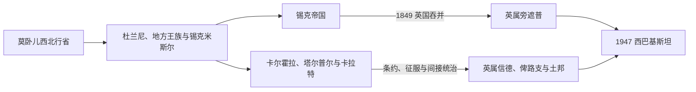

# 莫卧儿、锡克与英属西北印度

## 时间

1526—1947年

## 概括

今巴基斯坦各地区在1526—1947年间从未始终处于一种统一制度之下。旁遮普和木尔坦较深地进入莫卧儿军政税收体系，信德在帝国总督、卡尔霍拉和塔尔普尔诸米尔之间转换，俾路支则以卡拉特汗国、部落协商和帝国间接宗主权为主。18世纪莫卧儿财政与军事网络瓦解后，杜兰尼、锡克米斯尔和地方王族争夺控制。兰吉特·辛格以拉合尔为中心建立锡克帝国；其死后宫廷、军队与摄政集团失衡，两次英锡战争使英国于1849年吞并旁遮普。至1947年，旁遮普、信德、西北边境省、俾路支诸机构以不同法律地位进入分治。

## 莫卧儿时期的区域结构

| 地区 | 行政与权力 | 经济与社会 |
|---|---|---|
| 拉合尔—旁遮普 | 拉合尔苏巴、曼萨卜军官、札明达尔与堡垒城市共同治理；阿克巴1584—1598年间长期驻跸拉合尔 | 灌溉农业、军马与陆路贸易；苏菲圣祠和多宗教城市文化 |
| 木尔坦 | 帝国行省与西向交通节点 | 纺织、农业、商队和圣祠经济 |
| 信德 | 1591—1592年后纳入莫卧儿，但塔达等地依赖地方精英与河海贸易 | 印度河航运、港口、纺织和土地税 |
| 俾路支与卡拉特 | 多数时期为间接影响或边缘宗主关系，部落首领和汗权并存 | 牧业、商路、绿洲与海岸贸易 |
| 白沙瓦边疆 | 莫卧儿、萨法维及后来的杜兰尼反复争夺 | 山口关税、军役和普什图部落政治 |

## 帝国衰退后的并立政权

- **杜兰尼帝国**：艾哈迈德·沙阿·杜兰尼1747年后把白沙瓦、旁遮普和信德置于贡赋或军事控制下，但距离、继承战争和地方反抗限制了直接治理。
- **锡克米斯尔**：18世纪的锡克武装共同体分成多个米斯尔；阿富汗反复入侵未能消灭其地方网络，反而促使其掌握乡村税收和堡垒。
- **卡尔霍拉王朝**：约1701—1783年控制信德大部，在莫卧儿、波斯和杜兰尼名义宗主权之间周旋；继承内战和俾路支军队坐大导致覆亡。
- **塔尔普尔诸米尔**：1783—1843年由海得拉巴、海尔布尔、米尔布尔等支系共治信德，并非单一父子相承的中央王国；英国在条约和军事压力下逐步干预。
- **卡拉特汗国**：艾哈迈德扎伊汗族与俾路支部落首领通过盟约维持松散统合；纳西尔汗一世时期较强，19世纪后受阿富汗、锡克与英国竞争牵制。

## 锡克帝国君主与实际权力

| 顺序 | 统治者 | 在位或权力期 | 继承关系 | 重要事件与备注 |
|---|---|---|---|---|
| 1 | **兰吉特·辛格** | 1801—1839年；1799年已占拉合尔 | 苏克尔恰基亚米斯尔领袖 | 统一主要米斯尔，控制木尔坦、克什米尔和白沙瓦；以多宗教官僚、欧洲军官训练部队和卡尔萨军为支柱 |
| 2 | 卡拉克·辛格 | 1839—1840年 | 前任长子 | 权力受太子瑙·尼哈尔和大臣集团限制；被废黜性软禁后去世 |
| — | 瑙·尼哈尔·辛格 | 1840年11月（短暂、是否正式登基有争议） | 卡拉克之子 | 父死当日成为继承人，返宫时遭拱门坠落重伤，次日死亡 |
| — | 昌德·考尔 | 1840—1841年摄政并称王后 | 卡拉克遗孀、瑙·尼哈尔之母 | 以可能的遗腹继承人为依据与谢尔·辛格争位，后被迫退位 |
| 3 | 谢尔·辛格 | 1841—1843年 | 兰吉特之子、卡拉克之弟 | 依军队支持即位，后与大臣达延·辛格一同遇刺 |
| 4 | **达利普·辛格** | 1843—1849年 | 兰吉特幼子 | 幼主；母亲金德·考尔摄政，卡尔萨军、宫廷大臣和英方相互角力；1849年被废，帝国并入英属印度 |

### 锡克帝国的崛起与维持

- 兰吉特·辛格利用杜兰尼衰退和米斯尔竞争，以婚姻、收编、贡赋和军事征服逐步统一旁遮普。
- 国家保留锡克卡尔萨合法性，同时任用印度教、穆斯林和锡克官员；法基尔兄弟、道格拉贵族及欧洲军官均进入权力网络。
- 现金税、关税和被征服区贡赋维持现代化炮兵与常备军，但制度高度依赖君主个人协调。

### 衰落与直接灭亡

- 1839年后连续死亡、暗杀和幼主继位破坏了宫廷平衡，军队潘查亚特成为可左右政府的政治力量。
- 大臣、道格拉贵族、王后摄政和卡尔萨军彼此猜忌，财政难以持续负担扩张后的大军。
- 英国在萨特累季河以南集结力量并干预拉合尔宫廷。第一次英锡战争（1845—1846）后，英国驻扎军队、割让领土并控制摄政；第二次英锡战争（1848—1849）以旁遮普全面吞并告终。

## 英国征服与差异化统治

| 地区 | 纳入过程 | 殖民制度 |
|---|---|---|
| 信德 | 1839年后以阿富汗战争补给和条约施压；1843年米亚尼、杜博战役击败塔尔普尔诸米尔 | 先由总督治理，1847年并入孟买管辖区，1936年成为独立省 |
| 旁遮普 | 两次英锡战争后于1849年吞并 | 先设行政委员会，后为首席专员区、1859年起副总督省；土地清丈、运河殖民和军队招募并行 |
| 西北边境 | 英国从锡克帝国接收白沙瓦等地，长期以驻军、部落补贴和边境条例管理 | 1901年从旁遮普分出西北边境省，部落地带保持特殊间接治理 |
| 俾路支 | 1876年条约强化英国驻卡拉特代表和对外控制 | 英属俾路支、俾路支机构辖区与卡拉特等土邦并存，主权层级复杂 |
| 海尔布尔等土邦 | 承认英国最高权力但保留王族 | 内政自治程度随时期变化，1947年后另行加入巴基斯坦 |

完整英属印度最高行政首脑序列见[印度总督与副王表](/%E4%BA%BA%E6%96%87%E7%A7%91%E5%AD%A6/%E5%8E%86%E5%8F%B2/%E5%8D%97%E4%BA%9A/%E5%8D%B0%E5%BA%A6/%E5%8D%B0%E5%BA%A6%E6%80%BB%E7%9D%A3%E4%B8%8E%E5%89%AF%E7%8E%8B%E8%A1%A8.md)，本页不重复维护同一批总督。

## 殖民经济、军队与社会重组

- **运河殖民**：19世纪末起在旁遮普西部兴建大型灌溉工程，把土地分配给军人、农户和受偏好的农业群体，提升商品粮产量，也制造新的地主等级。
- **军队招募**：1857年后英国以“尚武种族”理论扩大旁遮普穆斯林、锡克和普什图士兵比例，把军役、土地奖励和政治忠诚连接起来。
- **产权与习惯法**：殖民清丈把流动、共有和部落土地关系固定成可征税类别；《边境犯罪条例》则赋予行政官集体惩罚等非常权力。
- **城市与教育**：拉合尔、卡拉奇成为铁路、港口、大学、报刊和政治社团中心；英语教育与宗教改革运动共同塑造新精英。
- **宗教政治**：人口普查、分离选区和代表名额把流动身份转化为制度化社群类别，并与土地、语言、省权和就业竞争交织。

## 重要事件

1. **1584—1598年阿克巴驻拉合尔**：帝国以此应对西北边疆和中亚威胁，城市成为重要宫廷中心。
2. **1739年纳迪尔沙入侵**：莫卧儿西北防线崩溃，随后杜兰尼多次进入旁遮普。
3. **1799—1801年锡克国家建立**：兰吉特·辛格占领拉合尔并称大君。
4. **1839年兰吉特去世**：继承危机迅速军事化。
5. **1843年英国吞并信德**：条约冲突被转化为军事征服。
6. **1845—1846年第一次英锡战争**：拉合尔条约使锡克帝国丧失领土与自主权。
7. **1848—1849年第二次英锡战争**：旁遮普被英国吞并，达利普·辛格被废。
8. **1857年印度大起义**：旁遮普行政与部分军队支持英国，殖民政府此后扩大本区招募和土地奖励。
9. **1876年卡拉特条约**：英国通过驻扎代表、补贴和仲裁加强对俾路支的间接控制。
10. **1901年西北边境省成立**：边境治理从旁遮普分离，但部落地带仍实行特殊法规。
11. **1906年全印穆斯林联盟成立**：创立地在达卡，后来旁遮普、信德与穆斯林少数省精英逐步改变其群众基础。
12. **1930年伊克巴尔演说**：提出在印度西北穆斯林多数省形成自治政治单位的设想，但不等同于已经完成的巴基斯坦国家方案。
13. **1940年拉合尔决议**：要求穆斯林多数的西北和东部地区组成“独立国家/单位”，具体单数国家形式后来才被政治化。
14. **1946—1947年分治进程**：选举、内阁使团失败、社群暴力和英国加速撤离，使旁遮普与孟加拉边界在极短时间内划定。

## 演变关系

- 跨区域主笔记：[莫卧儿帝国](/%E4%BA%BA%E6%96%87%E7%A7%91%E5%AD%A6/%E5%8E%86%E5%8F%B2/%E5%8D%97%E4%BA%9A/%E5%8D%B0%E5%BA%A6/%E8%8E%AB%E5%8D%A7%E5%84%BF%E5%B8%9D%E5%9B%BD.md)
- 殖民共享背景：[英属印度](/%E4%BA%BA%E6%96%87%E7%A7%91%E5%AD%A6/%E5%8E%86%E5%8F%B2/%E5%8D%97%E4%BA%9A/%E5%8D%B0%E5%BA%A6/%E8%8B%B1%E5%B1%9E%E5%8D%B0%E5%BA%A6.md)
- 前一阶段：[印度河、犍陀罗与伊斯兰化](/%E4%BA%BA%E6%96%87%E7%A7%91%E5%AD%A6/%E5%8E%86%E5%8F%B2/%E5%8D%97%E4%BA%9A/%E5%B7%B4%E5%9F%BA%E6%96%AF%E5%9D%A6/%E5%8D%B0%E5%BA%A6%E6%B2%B3%E3%80%81%E7%8A%8D%E9%99%80%E7%BD%97%E4%B8%8E%E4%BC%8A%E6%96%AF%E5%85%B0%E5%8C%96.md)
- 后一阶段：[分治、联邦与军政循环](/%E4%BA%BA%E6%96%87%E7%A7%91%E5%AD%A6/%E5%8E%86%E5%8F%B2/%E5%8D%97%E4%BA%9A/%E5%B7%B4%E5%9F%BA%E6%96%AF%E5%9D%A6/%E5%88%86%E6%B2%BB%E3%80%81%E8%81%94%E9%82%A6%E4%B8%8E%E5%86%9B%E6%94%BF%E5%BE%AA%E7%8E%AF.md)
- 上级：[巴基斯坦历史](/%E4%BA%BA%E6%96%87%E7%A7%91%E5%AD%A6/%E5%8E%86%E5%8F%B2/%E5%8D%97%E4%BA%9A/%E5%B7%B4%E5%9F%BA%E6%96%AF%E5%9D%A6/README.md)
