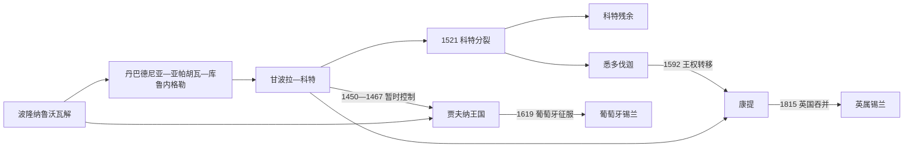

# 中世纪斯里兰卡并立王国王统表

## 编排原则

13 世纪以后的斯里兰卡同时存在北部贾夫纳王国、西南部不断迁都的僧伽罗王权、悉多伐迦和中部康提。下表按各政治体内部的在位顺序分别排列，不能把不同表首尾相接成一条“全岛王统”。表内约数、重叠和空档保留不同编年体系的分歧；除有同时代铭文或明确外部纪年外，不把年份理解到月日级精度。

贾夫纳早期王统尤其依赖较晚的地方编年史、潘地亚材料、钱币和铭文重建；Āryacakravarti 各王使用交替的王号，个人名、王号和序数在不同著作中并不完全一致。科特对贾夫纳的控制、康提从科特分离的起年，以及部分共治和短期废立也存在编年差异，故表中使用常见工作年代，并在有必要处保留重叠。

## 并立关系

## 贾夫纳王国

> 早期王名与精确年代依赖后出的地方编年史、潘地亚材料和钱币／铭文重建；这是常用工作序列，不表示每项亲属关系都已由同时代证据证实。

| 顺序 | 统治者 | 在位 | 继承关系／备注 |
|---:|---|---|---|
| 1 | Kalinga Magha（又称 Kalinga Chodaganga、Gangaraja Kalinga Vijayabahu） | 1215年—约1255年 | 来自迦陵伽的军事领袖；传统把他与东恒伽、朱罗姻亲或贾夫纳建国相连，直系关系存在争议 |
| 2 | Chandrabhanu | 约1255年—1262年 | 来自 Tambralinga／Javaka 的统治者；在潘地亚压力下承认 Sadayavarman Sundara Pandyan I 的宗主权 |
| 3 | Savakanmaindan | 1262年—1277年 | 之子： Chandrabhanu |
| 4 | Kulasekara Cinkaiariyan | 1277年—1284年 | 不详 |
| 5 | Kulotunga Cinkaiariyan | 1284年—1292年 | 之子： Kulasekara Pararacacekaran I |
| 6 | Vickrama Cinkaiariyan | 1292年—1302年 | 之子： Kulottunga Cekaracacekaran II |
| 7 | Varodaya Cinkaiariyan | 1302年—1325年 | 之子： Vikkrama Pararacacekaran II |
| 8 | Martanda Cinkaiariyan | 1325年—1348年 | 之子： Varotaya Cekaracacekaran III |
| 9 | Gunabhooshana Cinkaiariyan | 约1347／1348年—1371年 | Martanda 的继承者；起年与前任末年重叠，反映编年换算差异 |
| 10 | Virodaya Cinkaiariyan | 1371年—1380年 | 之子： Kunapusana Cekaracacekaran IV |
| 11 | Jeyaveera Cinkaiariyan | 1380年—1410年 | 之子： Virotaya Pararacacekaran IV |
| 12 | Gunaveera Cinkaiariyan | 1410年—1440年 | 之子： Jeyavira Cekaracacekaran V |
| 13 | Kanakasooriya Cinkaiariyan | 1440年—1450年 | 之子： Kunavira Pararacacekaran V |
| 14 | Bhuvanekabahu VI（又称 Chempaka Perumal／Sapumal Kumara） | 约1450年—1467年 | 科特王 Parakramabahu VI 派出的征服者；此期贾夫纳受科特控制 |
| 15 | Kanakasooriya Cinkaiariyan; (复位) | 1467年—1478年 | 不详 |
| 16 | Singai Pararasasegaram | 1478年—1519年 | 之子： Cekaracacekaran V |
| 17 | Cankili I | 1519年—1561年 | 之子： Singai Pararacacekaran VI |
| 18 | Puviraja Pandaram | 1561年—1565年 | 之子： Cekaracacekaran VI |
| 19 | Kasi Nayinar Pararacacekaran | 1565年—1570年 | 不详 |
| 20 | Periyapillai | 约1565年—1582年 | 与 Kasi Nayinar、Puviraja Pandaram 的年代重叠，可能是并立或争位者 |
| 21 | Puviraja Pandaram; (复位) | 1582年—1591年 | 不详 |
| 22 | Ethirimana Cinkam | 1591年—1617年 | 之子： Pararacacekaran VII |
| 23 | Cankili II | 1617年—1619年 | 王族旁支与前代亲属；继承合法性受争议，1619年被葡萄牙征服 |
| 24 | Don Constantine | 1619年—约1624年 | 葡萄牙扶植的名义继承人，不代表独立贾夫纳王国延续 |

## 僧伽罗过渡王统：丹巴德尼亚—亚帕胡瓦—库鲁内格勒—甘波拉—科特

| 顺序 | 统治者 | 在位 | 继承关系／备注 |
|---:|---|---|---|
| 1 | Vijayabahu III | 约1232年—1236年 | 南部本地王族领袖；具体出身系谱不详 |
| 2 | Parakramabahu II | 1236年—1270年 | 长子，父为 Vijaya Bahu III |
| 3 | Vijayabahu IV | 1270年—1272年10月 | Parakramabahu II 长子 |
| 4 | Bhuvanekabahu I; (以亚帕胡瓦为都) | 1272年—1284年 | 之兄弟： Vijaya Bahu IV |
| 5 | 王位空缺 | 1285年—1286年 | 不详 |
| 6 | Parakramabahu III（以波隆纳鲁沃为都） | 1287年—1293年 | Vijayabahu IV 之子、Bhuvanekabahu I 之侄 |
| 7 | Bhuvanekabahu II（以库鲁内格勒为都） | 1293年—1302年 | Bhuvanekabahu I 之子、Parakramabahu III 之堂亲 |
| 8 | Parakramabahu IV（以库鲁内格勒为都） | 1302年—1326年 | Bhuvanekabahu II 之子；以学术和佛牙仪式著称 |
| 9 | Bhuvanekabahu III | 1326年—约1335年 | 又称 Vanni Bhuvanekabahu；出身和确切在位末年有争议 |
| 10 | Vijayabahu V | 约1335年—1341年 | 承接库鲁内格勒末期，之后王权转向甘波拉 |
| 11 | Bhuvanekabahu IV | 1341年—1351年 | 之子： Vijaya Bahu V |
| 12 | Parakramabahu V | 1344年—1359年 | 之子： Vijaya Bahu V; 之兄弟： Bhuvanekabahu IV |
| 13 | Vikramabahu III | 1357年—1374年 | 之子： Bhuvanekabahu IV |
| 14 | Bhuvanekabahu V | 约1372年—1408年 | 与 Alagakkonara 家族及 Vikramabahu III 王族有姻亲关系 |
| 15 | Vira Alakesvara（Alagakkonara 家族实际统治） | 1408年—1411年 | 非传统直系王族；明军介入后失势 |
| 16 | Parakramabahu VI | 约1412年—1467年 | 出身与收养关系存在争议；科特王权奠基者，一度控制贾夫纳 |
| 17 | Jayavira Parakramabahu | 约1467年—约1472年 | 短期继承者；名号、亲属关系和在位年存在编年分歧 |
| 18 | Bhuvanekabahu VI | 约1472／1473年—约1480年 | 又与 Sapumal Kumara 相联系；曾主持科特对贾夫纳的统治 |
| 19 | Pandita Parakramabahu VII | 约1480年—约1484年 | 短期统治；部分编年与前后诸王发生重叠 |
| 20 | Vīra Parakramabahu VIII | 约1484年—约1508年 | 又称 Ambulagala Kumara；与 Parakramabahu VI 王族有关 |
| 21 | Dharma Parakramabahu IX | 1489年—1513年 | 之子： Vira Parakrama Bahu VIII |
| 22 | Vijayabahu VI | 1513年—1521年 | 之兄弟： Dharma Parakrama Bahu IX; Rajah of Menik Kadavara |
| 23 | Bhuvanekabahu VII | 1521年—1551年 | 长子，父为 Vijaya Bahu |
| 24 | Dharmapala | 1551年—1597年5月27日 | Bhuvanekabahu VII 外孙及继承人；改宗天主教并把科特遗赠葡萄牙 |

## 悉多伐迦王国

| 顺序 | 统治者 | 在位 | 继承关系／备注 |
|---:|---|---|---|
| 1 | Mayadunne | 1521年—1581年 | 之兄弟： Bhuvaneka Bahu VII; 之子： Vijaya Bahu VII |
| 2 | Rajasinha I（又称 Tikiri Banda） | 1581年—1593年 | Mayadunne 之子；扩张悉多伐迦并长期对葡作战，其宗教政策在不同传统中评价不一 |
| 3 | Rajasuriya | 1593年—1594年 | 不详 |

## 康提王国

| 顺序 | 统治者 | 在位 | 继承关系／备注 |
|---:|---|---|---|
| 1 | Senasammata Vikramabahu | 约1469年—1511年 | 与科特王族有关，领导康提脱离科特的过程 |
| 2 | Jayavira | 1511年—1552年 | 之子： Senasammata |
| 3 | Karalliyadde Bandara | 1552年—1582年 | 之子： Jayaweera |
| 4 | Kusumasana Devi | 1581年—1581年 | 之女： Karalliyadde |
| 5 | Rajasinha I（又称 Tikiri Banda） | 1581年—1592年 | 来自悉多伐迦，废黜短暂受扶植的 Kusumasana Devi |
| 6 | Vimaladharmasuriya I; (又称 Don João da Austria) | 1592年—1604年 | 之子： Vijayasundara Bandara |
| 7 | Senarat | 1604年—1635年 | Vimaladharmasuriya I 的王族亲属，承接其王位 |
| 8 | Rajasinha II | 1635年—1687年11月25日 | Senarat 与 Dona Catherina 之子 |
| 9 | Vimaladharmasurya II | 1687年—1707年6月4日 | Rajasinha II 之子 |
| 10 | Vira Narendra Sinha（又称 Sri Vira Parakrama Narendra Singha） | 1707年6月4日—1739年5月13日 | Vimaladharmasurya II 之子 |
| 11 | Sri Vijaya Rajasinha | 1739年5月13日—1747年8月11日 | Vira Narendra Sinha 的内弟，以王室姻亲关系继位 |
| 12 | Kirti Sri Rajasinha | 1747年8月11日—1782年1月2日 | Sri Vijaya Rajasinha 的内弟 |
| 13 | Sri Rajadhi Rajasinha | 1782年1月2日—1798年7月26日 | Kirti Sri Rajasinha 之弟 |
| 14 | Sri Vikrama Rajasinha（又称 Rajasinha IV、Kannasamy） | 1798年7月26日—1815年3月5日 | Sri Rajadhi Rajasinha 的外甥；1815年被英国废黜 |

## 读表要点

- 贾夫纳王国并非从 Kalinga Magha 到 Cankili II 毫无中断的同一家族直系继承：Tambralinga 势力、潘地亚宗主关系、Āryacakravarti 王系、科特占领和复辟必须分开理解。
- 13—15 世纪僧伽罗王权的“迁都”常伴随区域控制缩小、佛牙舍利转移和新军事基地形成，并非旧国家整齐迁往一座新城。
- 1521 年 Vijayabā Kollaya 后，科特、悉多伐迦和康提形成相互竞争的格局；同一人物 Rajasinha I 可在悉多伐迦与短期康提控制中重复出现。
- 康提 1739 年转入南印度 Nayak 王系，合法性来自王室婚姻和宫廷承认；这不是简单的“外国征服”。末王 Sri Vikrama Rajasinha 的失势则与宫廷—贵族冲突和英国介入共同有关。

## 相关笔记

- 前期王统：[阿努拉德普勒与波隆纳鲁沃王统表](/%E4%BA%BA%E6%96%87%E7%A7%91%E5%AD%A6/%E5%8E%86%E5%8F%B2/%E5%8D%97%E4%BA%9A/%E6%96%AF%E9%87%8C%E5%85%B0%E5%8D%A1/%E9%98%BF%E5%8A%AA%E6%8B%89%E5%BE%B7%E6%99%AE%E5%8B%92%E4%B8%8E%E6%B3%A2%E9%9A%86%E7%BA%B3%E9%B2%81%E6%B2%83%E7%8E%8B%E7%BB%9F%E8%A1%A8.md)
- 阶段说明：[阿努拉德普勒、波隆纳鲁沃与僧伽罗王国](/%E4%BA%BA%E6%96%87%E7%A7%91%E5%AD%A6/%E5%8E%86%E5%8F%B2/%E5%8D%97%E4%BA%9A/%E6%96%AF%E9%87%8C%E5%85%B0%E5%8D%A1/%E9%98%BF%E5%8A%AA%E6%8B%89%E5%BE%B7%E6%99%AE%E5%8B%92%E3%80%81%E6%B3%A2%E9%9A%86%E7%BA%B3%E9%B2%81%E6%B2%83%E4%B8%8E%E5%83%A7%E4%BC%BD%E7%BD%97%E7%8E%8B%E5%9B%BD.md)
- 殖民与并立政权：[泰米尔王国、葡荷英殖民](/%E4%BA%BA%E6%96%87%E7%A7%91%E5%AD%A6/%E5%8E%86%E5%8F%B2/%E5%8D%97%E4%BA%9A/%E6%96%AF%E9%87%8C%E5%85%B0%E5%8D%A1/%E6%B3%B0%E7%B1%B3%E5%B0%94%E7%8E%8B%E5%9B%BD%E3%80%81%E8%91%A1%E8%8D%B7%E8%8B%B1%E6%AE%96%E6%B0%91.md)
- 总览：[斯里兰卡历史](/%E4%BA%BA%E6%96%87%E7%A7%91%E5%AD%A6/%E5%8E%86%E5%8F%B2/%E5%8D%97%E4%BA%9A/%E6%96%AF%E9%87%8C%E5%85%B0%E5%8D%A1/README.md)
