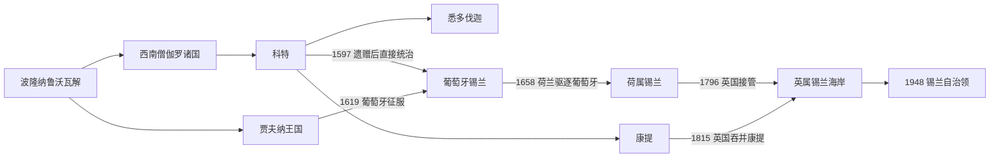

# 斯里兰卡的泰米尔王国、葡荷英殖民

## 时间

13世纪—1948年

## 概括

13世纪以后，北部贾夫纳王国、西南部僧伽罗诸国与中部康提长期并立。葡萄牙、荷兰和英国的势力也不是一次性“占领全岛”：葡萄牙先控制堡垒、王位继承和海岸贸易，荷兰东印度公司借康提联盟驱逐葡萄牙后拒绝交还海岸，英国再利用欧洲战争接收荷属据点，最终在1815年凭军事压力与康提贵族倒戈吞并高地王国。只有从1815年起，全岛才首次稳定纳入一个殖民行政框架。

殖民统治把肉桂垄断、种植园、铁路、英语教育、成文司法和人口分类带入同一国家结构，也制造了土地剥夺、强制劳役遗产、族群化代表制与山地泰米尔劳工的脆弱地位。1948年的独立继承了这套统一领土和多数制度，而没有自动消除其社会分层。

## 并立政权与王权结构

### 贾夫纳王国

- Kalinga Magha 与 Chandrabhanu 时代是北部国家形成的前史；约13世纪末起，Āryacakravarti 王系以 Nallur 为中心，先与潘地亚帝国联系，后在潘地亚衰落时扩大自主。
- 王国控制贾夫纳半岛、部分 Vanni 首领和曼纳尔海峡网络，收入来自珍珠、象、土地税、港口和与 Rameswaram 的宗教—商业联系。
- 早期王名、交替王号与精确年代主要靠后出的地方编年史、钱币、南印度铭文和外来旅行记重建，不能写成毫无争议的父子单线。
- Parakramabahu VI 派军在约1450年占领贾夫纳，Āryacakravarti 王系约1467年复辟。Cankili I 抵制葡萄牙传教与曼纳尔控制；1619年 Cankili II 被葡军击败，独立王国终结。

### 科特、悉多伐迦与康提

| 政权 | 权力基础 | 关键转折 |
|---|---|---|
| 科特 | 西南湿润区稻作、科伦坡港、肉桂贸易与佛牙合法性 | Parakramabahu VI 一度统一大部岛屿；1521年王子弑父后分裂 |
| 悉多伐迦 | 内陆山麓、反葡萄牙军事动员 | Mayadunne 与 Rajasinha I 压缩科特；1593年后迅速瓦解 |
| 康提 | 高地地形、地方贵族、寺院与佛牙、机动战 | 1594年 Danture 击败葡军；1739年转入 Nayak 王系；1815年被英国吞并 |
| 雷伽马等小政权 | 分裂后的王族封地与地方首领 | 多被科特、悉多伐迦或康提吸收，不宜机械拆成独立长王统 |

1521年 Vijayabā Kollaya 将科特遗产分给 Bhuvanekabahu VII、Mayadunne 等王子。Bhuvanekabahu 借葡萄牙保护继承安排，Dharmapala 改宗天主教并把王国遗赠葡萄牙王室；这使葡萄牙由“盟友和保护者”转为直接统治主张。与此同时，Vimaladharmasuriya I 以康提王位、Kusumasana Devi 的婚姻和佛牙控制重建高地正统。康提的 Radala 贵族、地方长官、寺院土地和 rajakariya 劳役共同支撑王国，国王必须与这些集团协商，不能视为绝对君主。

各政权完整在位序列见[中世纪斯里兰卡并立王国王统表](/%E4%BA%BA%E6%96%87%E7%A7%91%E5%AD%A6/%E5%8E%86%E5%8F%B2/%E5%8D%97%E4%BA%9A/%E6%96%AF%E9%87%8C%E5%85%B0%E5%8D%A1/%E4%B8%AD%E4%B8%96%E7%BA%AA%E6%96%AF%E9%87%8C%E5%85%B0%E5%8D%A1%E5%B9%B6%E7%AB%8B%E7%8E%8B%E5%9B%BD%E7%8E%8B%E7%BB%9F%E8%A1%A8.md)。

## 葡萄牙扩张：堡垒、保护关系与直接征服

### 过程

1. 1505或1506年前后葡萄牙船队抵达，目标是控制印度洋航线和肉桂；1518年在科伦坡建立较持久堡垒。
2. 科特内争使葡萄牙军队、火器和海运成为王位政治的一部分。葡方以保护、贡纳和传教换取贸易与驻军权，控制范围长期集中于海岸和盟国宫廷。
3. 1557年 Dharmapala 受洗，1597年死后葡萄牙依据遗赠把科特残余改为王室属地。地方 lascarin 军队、改宗首领和旧税制仍是实际统治基础。
4. 1594年葡军企图以 Kusumasana Devi 建立受控康提政权，却在 Danture 被 Vimaladharmasuriya I 击败；1630年 Randeniwela 战役中总司令 Constantino de Sá 阵亡，高地征服再次失败。
5. 1619年葡军征服贾夫纳，随后控制其堡垒、教会和税收。天主教传教、寺庙破坏和王族处置加深抵抗，也改变沿海宗教地理。
6. 1638年康提王 Rajasinha II 与荷兰东印度公司结盟。荷军逐步夺取亭可马里、加勒、科伦坡等据点，1658年贾夫纳失守，葡萄牙统治结束。

### 统治结构

葡萄牙行政首脑由堡垒长官、总长官演变为总督／总司令，受果阿 Estado da Índia 体系节制。其权力依赖少数堡垒、舰船、葡裔与混血社群、传教团、本地 mudaliyar 和 lascarin。葡萄牙从未征服康提，其所谓“锡兰”也不能等同现代全岛边界。完整任期见[葡荷英殖民行政首脑表](/%E4%BA%BA%E6%96%87%E7%A7%91%E5%AD%A6/%E5%8E%86%E5%8F%B2/%E5%8D%97%E4%BA%9A/%E6%96%AF%E9%87%8C%E5%85%B0%E5%8D%A1/%E8%91%A1%E8%8D%B7%E8%8B%B1%E6%AE%96%E6%B0%91%E8%A1%8C%E6%94%BF%E9%A6%96%E8%84%91%E8%A1%A8.md)。

## 荷兰东印度公司统治

- 康提原希望荷兰驱逐葡萄牙后归还海岸堡垒；公司则以战争费用和条约解释保留据点，双方由盟友转为竞争者。
- 1658年后，公司控制主要海岸、港口、肉桂产区和关税。科伦坡总督受巴达维亚节制，政治委员会、地方 commandery、土地登记簿和本地首领共同执行行政。
- 公司整编葡萄牙时期的教会地产和税制，推广荷兰归正宗教会，但现实中仍依赖佛教、印度教和天主教社群。罗马—荷兰法与土地登记对后世司法、继承和财产权影响长久。
- 肉桂由公司垄断，采集义务压在特定社群与劳役网络上；北部、东部与西南部行政并不完全相同。
- 1760年代康提战争后，1766年条约扩大荷兰沿海控制并限制康提出海口，但公司仍不能直接统治高地。
- 法国革命战争中荷兰本土政局改变。英国依据 Kew Letters 等安排接管荷属殖民地，1795—1796年沿海堡垒相继投降。

## 英属锡兰：全岛行政、种植园与自治

### 从海岸占领到吞并康提

- 1796年英国占领荷属地区，1798年把锡兰改为直接受伦敦控制的王室殖民地，避免并入英属印度。
- 1803年第一次康提战争显示高地补给、疾病、伏击和地方动员仍可击败欧洲驻军。此后英国转向拉拢 Radala 贵族。
- Sri Vikrama Rajasinha 与部分贵族的冲突、严厉惩罚和继承合法性争议使宫廷孤立。1815年英国军队进入康提，贵族通过《康提公约》承认英国君主、废黜末王，并要求保护佛教与传统权利。
- 1817—1818年乌沃—韦拉萨起义反对英国重组，殖民军以焦土、处决、没收土地和人口控制镇压。1848年马特莱起义又反映税收、土地和劳役制度冲突。

### 统一行政与实际权力结构

| 阶段 | 名义首脑 | 实际机构 | 权力特征 |
|---|---|---|---|
| 1795—1798军事占领 | 军事长官；东印度公司驻地监督并行 | 驻军、海岸税关、原荷兰官僚 | 权责重叠，税收政策引发抵抗 |
| 1798—1833王室殖民地早期 | 英国总督 | 殖民秘书、军队、分区官员 | 海岸与康提一度分轨治理 |
| 1833年后统一殖民地 | 总督 | 行政会议、立法会议、文官系统 | 科尔布鲁克—卡梅伦改革把全岛纳入统一财政与行政 |
| 1931—1947有限自治 | 总督保留国防、外交等权力 | 国务会议与部长委员会 | 普选扩大本地政治，但没有完全责任内阁 |
| 1947—1948自治领转型 | 总督／总督继任者 | 议会责任内阁 | 本地总理掌握日常政府，英国保留的宪制纽带逐步终结 |

### 种植园经济与社会改造

- 19世纪中叶咖啡种植园扩张，殖民土地法把大量“荒地”认定为王室土地；咖啡叶锈病后，茶叶、橡胶和椰子取代或补充咖啡。
- 殖民资本、港口和铁路把高地种植园连接科伦坡。大量南印度泰米尔劳工在契约、债务和种植园纪律下迁入，其居住、教育、卫生和政治代表长期与岛内泰米尔社群不同。
- 英语学校、传教教育和文官考试形成跨族群本地精英，也使教育机会分布不均。殖民人口普查、宗教分类与按社群安排代表席位，把流动身份进一步政治化。
- 佛教、印度教与穆斯林复兴运动借印刷、学校和社团回应传教与殖民文化，后来成为民族政治的重要组织基础。

### 宪政改革与独立

- 1915年僧伽罗—穆斯林骚乱后，殖民政府实施戒严并处决、拘押多人，促使不同精英暂时共同反对专断统治。
- 1919年锡兰国民大会成立，但地区、阶级、种姓和族群代表问题很快造成分歧。
- 1931年 Donoughmore 宪制引入成年普选和国务会议，使锡兰比多数殖民地更早积累选举与部长行政经验；总督仍掌握保留权力。
- 第二次世界大战期间锡兰成为印度洋军事基地，本地领导人以合作换取更大自治。Soulbury 改革建立两院制议会与责任内阁。
- 1947年选举后 D. S. Senanayake 组阁，1948年2月4日锡兰成为自治领。独立是谈判式宪制移交，不是殖民社会矛盾的终点。

## 殖民统治得以扩张及终结的原因

| 层次 | 因素 | 结果 |
|---|---|---|
| 岛内结构 | 科特分裂、王位竞争、地方贵族拥有独立军事与土地基础 | 欧洲势力可先以盟友、保护者和继承仲裁者进入 |
| 欧洲优势 | 海军航线、堡垒炮兵、跨殖民财政和增援网络 | 海岸城市和贸易节点较易被持续控制 |
| 限制条件 | 康提高地、季风、疾病、补给困难与游击战 | 葡荷长期不能征服全岛，英国1803年仍遭失败 |
| 直接触发 | 1638康提—荷兰联盟、1795—1796欧洲战争、1815贵族倒戈 | 三次殖民权力更替均借助既有政治冲突 |
| 终结条件 | 普选经验、本地文官和部长体系、战后英国收缩、精英谈判 | 1948年实现自治领独立 |
| 遗产 | 统一行政、种植园、族群分类和不均衡公民权 | 独立后语言、国籍与代表权冲突延续 |

## 演变关系

- 上级：[斯里兰卡历史](/%E4%BA%BA%E6%96%87%E7%A7%91%E5%AD%A6/%E5%8E%86%E5%8F%B2/%E5%8D%97%E4%BA%9A/%E6%96%AF%E9%87%8C%E5%85%B0%E5%8D%A1/README.md)
- 王统：[中世纪斯里兰卡并立王国王统表](/%E4%BA%BA%E6%96%87%E7%A7%91%E5%AD%A6/%E5%8E%86%E5%8F%B2/%E5%8D%97%E4%BA%9A/%E6%96%AF%E9%87%8C%E5%85%B0%E5%8D%A1/%E4%B8%AD%E4%B8%96%E7%BA%AA%E6%96%AF%E9%87%8C%E5%85%B0%E5%8D%A1%E5%B9%B6%E7%AB%8B%E7%8E%8B%E5%9B%BD%E7%8E%8B%E7%BB%9F%E8%A1%A8.md)
- 殖民行政首脑：[葡荷英殖民行政首脑表](/%E4%BA%BA%E6%96%87%E7%A7%91%E5%AD%A6/%E5%8E%86%E5%8F%B2/%E5%8D%97%E4%BA%9A/%E6%96%AF%E9%87%8C%E5%85%B0%E5%8D%A1/%E8%91%A1%E8%8D%B7%E8%8B%B1%E6%AE%96%E6%B0%91%E8%A1%8C%E6%94%BF%E9%A6%96%E8%84%91%E8%A1%A8.md)
- 前一阶段：[阿努拉德普勒、波隆纳鲁沃与僧伽罗王国](/%E4%BA%BA%E6%96%87%E7%A7%91%E5%AD%A6/%E5%8E%86%E5%8F%B2/%E5%8D%97%E4%BA%9A/%E6%96%AF%E9%87%8C%E5%85%B0%E5%8D%A1/%E9%98%BF%E5%8A%AA%E6%8B%89%E5%BE%B7%E6%99%AE%E5%8B%92%E3%80%81%E6%B3%A2%E9%9A%86%E7%BA%B3%E9%B2%81%E6%B2%83%E4%B8%8E%E5%83%A7%E4%BC%BD%E7%BD%97%E7%8E%8B%E5%9B%BD.md)
- 后一阶段：[独立、族群冲突与战后国家](/%E4%BA%BA%E6%96%87%E7%A7%91%E5%AD%A6/%E5%8E%86%E5%8F%B2/%E5%8D%97%E4%BA%9A/%E6%96%AF%E9%87%8C%E5%85%B0%E5%8D%A1/%E7%8B%AC%E7%AB%8B%E3%80%81%E6%97%8F%E7%BE%A4%E5%86%B2%E7%AA%81%E4%B8%8E%E6%88%98%E5%90%8E%E5%9B%BD%E5%AE%B6.md)
- 区域背景：[南亚历史](/%E4%BA%BA%E6%96%87%E7%A7%91%E5%AD%A6/%E5%8E%86%E5%8F%B2/%E5%8D%97%E4%BA%9A/README.md)
