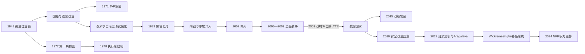

# 斯里兰卡的独立、族群冲突与战后国家

## 时间

1948年—2026年7月

## 概括

1948年成立的锡兰自治领继承了议会、公务员体系、种植园经济和统一行政，却也继承了殖民时期不均衡的公民资格、语言机会与地区发展。独立初期政府先限制大批印度来源种植园泰米尔人的国籍和选举权，1956年又以僧伽罗语取代英语成为唯一官方语言。多数民族民主、福利国家与佛教复兴因此和少数群体的不安全感同时发展。

1972、1978年两次共和宪法分别终结君主制和建立执行总统制。1971年与1987—1989年，人民解放阵线（JVP）两度发动以僧伽罗青年为主的叛乱；泰米尔自治运动则在协议屡次失败、教育与语言争议、反泰米尔暴力和国家镇压中武装化。1983年“黑色七月”后，政府与泰米尔伊拉姆猛虎解放组织（LTTE）的战争经历印度介入、数轮停火与全面作战，至2009年由政府军军事结束。战争结束不等于争议终结，失踪者、土地、军事化、地方自治和战争末期责任继续影响政治。

2022年外汇、债务和治理危机引发“Aragalaya”抗议，总统 Gotabaya Rajapaksa 辞职。2024年 Anura Kumara Dissanayake 与国家人民力量（NPP）赢得总统和议会选举，标志传统两大政治阵营之外的首次全国性权力更替。截至2026年7月，新政府仍在国际货币基金组织框架、债务重组、反腐承诺、生活成本与战后和解之间寻求平衡。

## 国家结构与权力演变

| 阶段 | 国家元首 | 政府首脑与实际权力 | 制度特征 |
|---|---|---|---|
| 1948—1972 锡兰自治领 | 锡兰君主，由总督代表 | 总理主持责任内阁 | 独立议会制国家，仍与英国王室共享君主 |
| 1972—1978 第一共和国 | 礼仪总统 | 总理及国民议会多数 | 共和、单一制、佛教“首要地位”，议会主权增强 |
| 1978年至今 第二共和国 | 民选执行总统 | 总统掌握主要行政权；总理联系内阁与议会 | 比例代表制、强总统制；多次修宪调整制衡 |
| 1987年后地方层级 | 总统任命省长 | 省议会与首席部长权限受中央和财政制约 | 第13次修宪建立省议会，北部—东部安排长期有争议 |

完整国家元首、总督和总理任期见[独立后国家元首与政府首脑表](/%E4%BA%BA%E6%96%87%E7%A7%91%E5%AD%A6/%E5%8E%86%E5%8F%B2/%E5%8D%97%E4%BA%9A/%E6%96%AF%E9%87%8C%E5%85%B0%E5%8D%A1/%E7%8B%AC%E7%AB%8B%E5%90%8E%E5%9B%BD%E5%AE%B6%E5%85%83%E9%A6%96%E4%B8%8E%E6%94%BF%E5%BA%9C%E9%A6%96%E8%84%91%E8%A1%A8.md)。

## 国籍、语言与多数民族政治

### 种植园泰米尔人的国籍

- 1948年《锡兰公民法》以血统、出生和严格文件要求界定公民，1949年的印度与巴基斯坦居民立法及选举法修订，使大量英殖民时期迁入高地茶园的印度来源泰米尔人难以取得国籍并失去选举权。
- 这不仅是法律身份问题，也改变了议会席位和左翼政党的选民基础。岛内长期居住的工人被当作“印度问题”处理，强化了种植园社群与斯里兰卡泰米尔人的差异。
- 1964年 Sirima—Shastri 协定及后续安排，以归化斯里兰卡、移送印度和待定人口分配身份；过程持续数十年并造成家庭分离。
- 1980年代后法律逐步恢复无国籍者身份，2003年立法为仍未取得国籍的印度来源人口提供公民资格。法律问题基本解决后，种植园住房、土地、教育和工资不平等仍然存在。

### 官方语言与行政机会

- 1956年《官方语言法》把僧伽罗语定为唯一官方语言。它回应多数僧伽罗人反对英语精英垄断的要求，却在公务员考试、行政、司法和教育中迅速削弱泰米尔语使用者的机会。
- 1958年《泰米尔语特别规定法》承诺在教育、考试和北部、东部行政中使用泰米尔语，但执行缓慢；1957年 Bandaranaike—Chelvanayakam 协议和1965年 Dudley—Chelvanayakam 协议均因多数民族反对而未能充分落实。
- 1970年代大学录取“标准化”与地区配额被许多泰米尔青年视为进一步限制教育上升通道，推动议会自治运动激进化。
- 1978年宪法及1987年第13次修宪最终确认泰米尔语也是官方语言、英语为联系语言；法律平等并未自动消除行政能力、翻译资源和地方执行差距。

## 两次共和宪法

### 1972年宪法

- 1972年5月22日锡兰改为斯里兰卡共和国，英国君主和枢密院上诉终止，William Gopallawa 由总督转任礼仪总统。
- 新宪法确立单一制国家、国民议会主权，并给予佛教“首要地位”；制宪过程没有把联邦党提出的地区自治和语言保障纳入核心安排。
- 土地改革、国有化、福利与进口替代政策扩大国家作用，但失业、物资短缺和行政集中也加深青年不满。
- 对许多泰米尔政治力量而言，少数权利从殖民宪法的有限保障转为依赖议会多数，促使1976年 Vaddukoddai Resolution 转向建立 Tamil Eelam 的主张。

### 1978年宪法

- J. R. Jayewardene 政府建立由全国选举产生的执行总统，采用比例代表制，并把国家改称“斯里兰卡民主社会主义共和国”。
- 总统任命总理和内阁、掌握安全与行政资源，可解散或休会议会；议会多数仍决定立法与预算，因此总统和总理来自不同阵营时会出现共治冲突。
- 1987年第13次修宪建立省议会并承认泰米尔语官方地位；北部、东部的土地、警察和财政权限如何落实始终有争议。
- 第18次修宪（2010）取消总统两届限制并强化任命权；第19次（2015）恢复两届限制与独立委员会；第20次（2020）再强化总统；第21次（2022）部分恢复制衡。宪制变化反映的不是稳定终点，而是对强总统权的持续拉扯。

## JVP两次叛乱

### 1971年叛乱

JVP 吸收受教育却失业的僧伽罗青年，以马克思主义、反精英和反帝国主义语言批判传统政党。1971年4月，组织同步攻击警察站，企图瘫痪国家。准备不足、通讯失灵和武器有限使叛乱很快被政府与外援压制；大规模逮捕、紧急法和特别司法随之而来。政府随后增加青年就业与土地政策，但没有消除教育扩张、地区失衡和政治排斥。

### 1987—1989年叛乱

JVP 反对印斯协议、印度维和部队和省议会，借民族主义与反政府动员在南部发动罢工、暗杀和强制停工；其地下武装也杀害官员、左翼竞争者和拒绝服从的平民。政府、军警及关联反叛乱组织以失踪、法外处决和酷刑回应。1989年 Rohana Wijeweera 被捕后死亡，组织军事网络被摧毁。JVP 后来转入选举政治，最终成为 NPP 的核心力量；这一路径是理解2024年权力更替的重要背景。

## 泰米尔武装化与内战

### 从自治诉求到“黑色七月”

- 泰米尔政党最初主要要求联邦安排、语言平等和地区权力，而不是立即武装独立。两次主要妥协协议未落实、1958与1977年族群暴力、教育争议和安全部队扩张削弱了温和路线。
- 1976年泰米尔联合解放阵线提出独立 Tamil Eelam；多个青年武装出现，LTTE 在竞争中以暗杀和强制整合压倒其他组织。
- 1981年贾夫纳公共图书馆被焚毁，成为文化损失和国家失信的象征。
- 1983年7月 LTTE 伏击造成13名政府军士兵死亡，科伦坡等地随即发生有组织的反泰米尔暴力。政府未能保护平民并长期压制信息，“黑色七月”促使大批泰米尔人流亡或加入武装，战争全面化。

### 第一阶段与印度介入（1983—1990）

- 政府军、LTTE和其他泰米尔组织在北部、东部交战，印度南部训练、政治压力与难民问题使冲突国际化。
- 1987年政府发动 Vadamarachchi 行动，印度以空投和外交压力介入。7月29日印斯协议要求地方分权、武装解除和印度维和部队进驻，第13次修宪据此建立省议会。
- LTTE 与印度维和部队很快开战；反叛乱造成大量军民伤亡。Premadasa 政府一度与 LTTE 接触并要求印度撤军，维和部队于1990年撤离。

### 第二、第三阶段（1990—2001）

- 1990年停火破裂后战事重启。LTTE 驱逐北部穆斯林，并对穆斯林、僧伽罗与泰米尔异议者实施袭击；政府军行动、拘押和失踪也扩大平民伤害。
- LTTE 自杀式袭击造成印度前总理 Rajiv Gandhi（1991）和斯里兰卡总统 Premadasa（1993）死亡，组织的国际孤立加深。
- 1994年 Kumaratunga 政府开启谈判，1995年再次破裂。政府军在 Operation Riviresa 中夺取贾夫纳城，LTTE 转向游击、海上力量和纵深爆炸。
- 1996年中央银行爆炸、1998年佛牙寺袭击、2000年 Elephant Pass 基地陷落和2001年班达拉奈克国际机场袭击，显示双方都无法迅速取胜，经济压力推动新停火。

### 2002年停火及失败

- 2002年 Wickremesinghe 政府与 LTTE 在挪威斡旋下签署停火协议，设监督机制、承认实际控制线并展开数轮谈判。
- 停火减少大规模战斗，也让双方补充组织与军力；核心问题——国家结构、解除武装、人权监督和临时行政——没有解决。
- 2003年 LTTE 退出正式谈判；2004年东部指挥官 Karuna 分裂削弱其东部网络，同年海啸造成巨大损失，但共同救灾机制亦因互不信任受阻。
- 暗杀、失踪和局部战斗持续。2005年 Mahinda Rajapaksa 当选后立场更强硬，2006年 Mavil Aru 水闸危机成为全面战争恢复的直接触发点。

### 第四阶段与2009年终战

- 政府军先在2007年控制东部，2008年政府正式退出停火协议，随后沿多路推进北部。
- 2009年1月 Kilinochchi 失守，LTTE控制区与大量平民被压缩到东北海岸。5月政府军夺取 Mullivaikkal 一带，Velupillai Prabhakaran 与主要领导层死亡，LTTE作为领土武装组织被摧毁。
- LTTE 对平民强制征募、限制撤离并长期使用自杀袭击；政府军则被指在“禁火区”使用重武器、攻击医疗设施及实施拘押后处决。战争末期死亡、失踪和投降者命运至今存在统计与责任争议。
- 因此“2009年终战”应理解为军事胜利和武装组织灭亡，不等于已完成政治和解或司法追责。

## 战后治理（2009—2019）

- Rajapaksa 政府修建公路、港口和北东部基础设施，恢复旅游与增长；军队继续广泛参与土地、商业和地方治理，权力集中、家族任用与债务项目受到批评。
- 2010年第18次修宪取消总统任期限制，2013年首席大法官被弹劾，制度制衡进一步减弱。
- 2015年 Sirisena 击败 Mahinda Rajapaksa，与 Wickremesinghe 组成“善治”联盟；第19次修宪恢复任期限制和独立委员会，政府设立失踪人员办公室并承诺宪改。
- 联盟内部竞争、改革迟缓和2018年总统试图更换总理引发宪政危机。议会与法院迫使 Mahinda Rajapaksa 的争议政府退场，显示制度仍有抵抗行政扩张的能力。
- 2019年复活节连环爆炸造成250余人死亡，暴露情报协调失败并重新强化安全政治。Gotabaya Rajapaksa 随后以安全与效率议程当选总统，2020年第20次修宪恢复强总统权。

## 2022年经济与政治危机全过程

### 结构因素

- 长期财政赤字、低税收、进口与能源依赖、外币商业债务和亏损国企，使国家需要持续借新债和外汇收入；
- 内战后基础设施借贷和国际主权债券增加再融资风险，但债务危机不能归因于单一国家或单一项目；
- 2019年大幅减税削弱政府收入，复活节爆炸与新冠疫情重创旅游，国家在失去国际资本市场后仍以固定汇率和储备偿债；
- 2021年突然限制化肥和农药进口，虽以节汇和有机农业为名，却冲击农业产量与政策可信度。

### 外部压力与直接触发

- 疫情切断旅游、汇款和运输收入，2022年俄乌战争又推高燃料和食品价格；
- 外汇储备耗尽后，燃料、药品、食品和烹饪气短缺，停电和排队成为日常；卢比贬值与货币融资推动通胀；
- 2022年4月12日政府暂停大部分外债偿付，5月进入主权违约；经济困难迅速转为对 Rajapaksa 家族、腐败和失政的全国抗议。

### 政权更替

1. “Gota Go Gama”等抗议营地把青年、专业人士、工会和不同社群聚合为 Aragalaya 运动。
2. 5月9日亲政府人员袭击抗议者后，全国暴力升级，Mahinda Rajapaksa 辞去总理；Ranil Wickremesinghe 受任组建少数支持的危机政府。
3. 7月9日示威者进入总统府和总理官邸。Gotabaya Rajapaksa 离境，并于7月14日辞职；Wickremesinghe 先代理总统。
4. 7月20日议会依宪法选出 Wickremesinghe 补足任期。他恢复燃料分配、实施紧急措施并压制部分抗议，同时推进税收、电价、央行和国企改革。
5. 2023年3月国际货币基金组织批准四年期扩展基金安排；债权人协调、国内债务调整和外债重组逐步推进。通胀与短缺缓解，但税费上升、贫困和移民压力构成社会代价。

## 2024年权力更替与截至2026年7月的国家

- 2024年9月 Anura Kumara Dissanayake 赢得总统选举，成为第九位执行总统；这也是首次需要计算第二偏好后确定总统结果。
- 11月议会选举中，NPP 获159席，超过三分之二；Harini Amarasuriya 在临时三人内阁后再次出任总理。
- 新政府承诺反腐、精简特权、改善公共服务并重新审视部分旧政治网络，同时选择在谈判调整后继续 IMF 稳定与债务重组框架，而非突然退出。
- 截至2026年7月，总统 Dissanayake、总理 Amarasuriya 仍在任。外汇与宏观指标较2022年稳定，但生活成本、税负、就业、国企改革和改革收益分配仍决定政府支持度。
- 战后问题没有被经济议程取代：第13次修宪的地方权力、北东部土地与军事存在、失踪者调查、纪念空间、反恐立法以及穆斯林与泰米尔社群安全仍是国家整合的长期考验。

## 重要事件

| 时间 | 事件 | 结果与长期影响 |
|---|---|---|
| 1948—1949年 | 国籍与选举法 | 大批种植园泰米尔人失去公民和选举资格 |
| 1956年 | “僧伽罗语唯一” | 打破英语精英优势，也扩大泰米尔政治疏离 |
| 1971年 | 第一次JVP叛乱 | 青年失业与国家镇压成为长期政治议题 |
| 1972年 | 第一共和宪法 | 终结君主制，强化单一制与佛教地位 |
| 1978年 | 第二共和宪法 | 建立执行总统制和比例代表制 |
| 1983年 | 黑色七月 | 族群冲突转为长期全面内战 |
| 1987年 | 印斯协议与第13次修宪 | 印度维和部队进入，建立省议会 |
| 1987—1989年 | 第二次JVP叛乱 | 南部经历武装暴力与大规模反叛乱 |
| 2002年 | 停火协议 | 大战暂停，但核心政治安排未解决 |
| 2006—2009年 | 第四阶段战争 | 政府军摧毁LTTE领土统治 |
| 2009年5月 | 战争结束 | 重建开始，问责与和解争议延续 |
| 2015年 | 政权轮替与第19次修宪 | 一度加强独立机构与任期限制 |
| 2019年 | 复活节爆炸 | 安全政治回潮，Gotabaya当选 |
| 2022年 | 主权违约、Aragalaya与总统辞职 | 宏观危机转化为宪法内权力更替 |
| 2024年 | NPP赢得总统与议会选举 | 传统政治之外的全国性执政联盟上台 |

## 兴衰与冲突原因分层

| 层次 | 内战 | 2022年危机 |
|---|---|---|
| 结构因素 | 单一制权力集中、语言与教育机会不平等、协议反复失效 | 低税收、高债务、进口依赖、外汇收入脆弱 |
| 政治机制 | 选举竞争奖励多数民族动员，温和派失去可信度 | 家族化决策、政策透明度不足、制衡弱化 |
| 外部压力 | 印度介入、侨民融资与国际反恐环境 | 疫情、旅游崩溃、全球能源与食品涨价 |
| 直接触发 | 1983年伏击与黑色七月；2006年停火破裂 | 储备耗尽、物资短缺、暂停偿债和全国抗议 |
| 终结方式 | 2009年军事摧毁LTTE，政治根因未完全解决 | 宪法继承与议会选举完成政权更替，债务调整仍继续 |

## 演变关系

- 上级：[斯里兰卡历史](/%E4%BA%BA%E6%96%87%E7%A7%91%E5%AD%A6/%E5%8E%86%E5%8F%B2/%E5%8D%97%E4%BA%9A/%E6%96%AF%E9%87%8C%E5%85%B0%E5%8D%A1/README.md)
- 领导人专表：[独立后国家元首与政府首脑表](/%E4%BA%BA%E6%96%87%E7%A7%91%E5%AD%A6/%E5%8E%86%E5%8F%B2/%E5%8D%97%E4%BA%9A/%E6%96%AF%E9%87%8C%E5%85%B0%E5%8D%A1/%E7%8B%AC%E7%AB%8B%E5%90%8E%E5%9B%BD%E5%AE%B6%E5%85%83%E9%A6%96%E4%B8%8E%E6%94%BF%E5%BA%9C%E9%A6%96%E8%84%91%E8%A1%A8.md)
- 前一阶段：[泰米尔王国、葡荷英殖民](/%E4%BA%BA%E6%96%87%E7%A7%91%E5%AD%A6/%E5%8E%86%E5%8F%B2/%E5%8D%97%E4%BA%9A/%E6%96%AF%E9%87%8C%E5%85%B0%E5%8D%A1/%E6%B3%B0%E7%B1%B3%E5%B0%94%E7%8E%8B%E5%9B%BD%E3%80%81%E8%91%A1%E8%8D%B7%E8%8B%B1%E6%AE%96%E6%B0%91.md)
- 区域背景：[南亚历史](/%E4%BA%BA%E6%96%87%E7%A7%91%E5%AD%A6/%E5%8E%86%E5%8F%B2/%E5%8D%97%E4%BA%9A/README.md)
