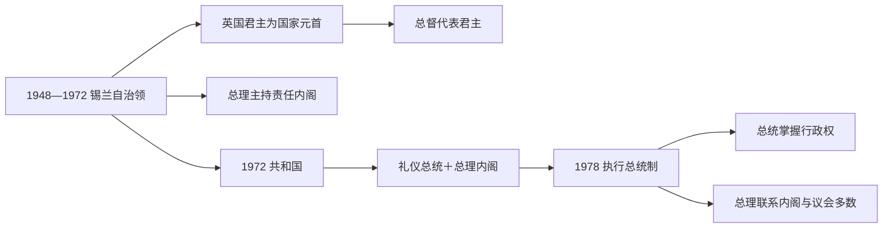

# 独立后国家元首与政府首脑表

## 制度说明

- 1948—1972 年锡兰已经是独立自治领；英国君主以“锡兰君主”身份担任名义国家元首，由锡兰总督在国内代表。日常政府由向议会负责的总理和内阁领导。
- 1972 年第一部共和宪法以礼仪总统取代君主，总理仍是政府首脑；1978 年第二部共和宪法改设执行总统，国家元首与主要行政权合一，总理不再是唯一实际最高领导人。
- 19、20、21 次宪法修正案反复调整总统、总理、内阁和宪法委员会之间的权力。表中分别列国家元首、君主代表和政府首脑，避免把不同角色混在同一序列。
- 核验截止到 2026 年 7 月：现任总统为 Anura Kumara Dissanayake，现任总理为 Harini Amarasuriya。总统就职日的官方页面有“9 月 22 日宣誓／9 月 23 日宪报登记”两种记法，本表以宣誓日为任期起点。

## 国家元首

| 顺序 | 国家元首 | 身份 | 任期 | 交接与重要说明 |
|---:|---|---|---|---|
| 1 | George VI | 锡兰君主 | 1948年2月4日—1952年2月6日 | 独立后以锡兰国王身份为名义国家元首 |
| 2 | Elizabeth II | 锡兰君主 | 1952年2月6日—1972年5月22日 | 1972年共和宪法生效后君主制终止 |
| 3 | William Gopallawa | 非执行总统 | 1972年5月22日—1978年2月4日 | 末任总督转任首任总统，主要为礼仪职 |
| 4 | J. R. Jayewardene | 执行总统 | 1978年2月4日—1989年1月2日 | 1978年宪制转型后的首任执行总统 |
| 5 | Ranasinghe Premadasa | 执行总统 | 1989年1月2日—1993年5月1日 | 遭猛虎组织自杀式爆炸刺杀身亡 |
| 6 | D. B. Wijetunga | 代理总统 | 1993年5月1日—1993年5月7日 | 时任总理依宪法代理 |
| 7 | D. B. Wijetunga | 执行总统 | 1993年5月7日—1994年11月12日 | 由议会选出补足任期 |
| 8 | Chandrika Bandaranaike Kumaratunga | 执行总统 | 1994年11月12日—2005年11月19日 | 和平谈判与战争升级并存 |
| 9 | Mahinda Rajapaksa | 执行总统 | 2005年11月19日—2015年1月9日 | 2009年军事结束内战，战后权力进一步集中 |
| 10 | Maithripala Sirisena | 执行总统 | 2015年1月9日—2019年11月16日 | 19次修宪削弱总统权；2018年发生宪政危机 |
| 11 | Gotabaya Rajapaksa | 执行总统 | 2019年11月17日—2022年7月14日 | 20次修宪强化总统权；经济危机和抗议中辞职 |
| 12 | Ranil Wickremesinghe | 代理总统 | 2022年7月14日—2022年7月20日 | 时任总理在总统辞职后代理 |
| 13 | Ranil Wickremesinghe | 执行总统 | 2022年7月20日—2024年9月22日 | 由议会依宪法选出补足任期 |
| 14 | **Anura Kumara Dissanayake** | 执行总统 | 2024年9月22日—至今 | 国家人民力量领袖；核验至2026年7月仍在任 |

## 自治领总督

总督是君主在锡兰的代表，不是另一个与君主并列的国家元首。下表用于说明国内行使礼仪和保留权力者。

| 顺序 | 总督 | 任期 | 说明 |
|---:|---|---|---|
| 1 | Henry Monck-Mason Moore | 1948年2月4日—1949年7月6日 | 殖民地末任总督转任自治领首任总督 |
| 2 | Lord Soulbury | 1949年7月6日—1954年7月17日 | 与“索尔伯里宪制”同名的前殖民改革主持者 |
| 3 | Oliver Goonetilleke | 1954年7月17日—1962年3月2日 | 首位锡兰本地总督 |
| 4 | William Gopallawa | 1962年3月2日—1972年5月22日 | 共和国成立后转任首任总统 |

## 政府首脑：总理

| 顺序 | 总理 | 任期 | 政体与交接说明 |
|---:|---|---|---|
| 1 | D. S. Senanayake | 1947年9月24日—1952年3月22日 | 1948年独立后继续任职；任内去世 |
| 2 | Dudley Senanayake | 1952年3月26日—1953年10月12日 | 首次组阁，辞职 |
| 3 | John Kotelawala | 1953年10月12日—1956年4月12日 | 议会制自治领总理 |
| 4 | S. W. R. D. Bandaranaike | 1956年4月12日—1959年9月26日 | 推行“僧伽罗语唯一”政策；遇刺身亡 |
| 5 | Wijeyananda Dahanayake | 1959年9月26日—1960年3月20日 | Bandaranaike 遇刺后接任 |
| 6 | Dudley Senanayake | 1960年3月21日—1960年7月21日 | 第二次短期组阁 |
| 7 | Sirimavo Bandaranaike | 1960年7月21日—1965年3月25日 | 首次组阁，世界首位女性总理 |
| 8 | Dudley Senanayake | 1965年3月25日—1970年5月29日 | 第三次组阁 |
| 9 | Sirimavo Bandaranaike | 1970年5月29日—1977年7月23日 | 1972年共和国成立前后连续执政 |
| 10 | J. R. Jayewardene | 1977年7月23日—1978年2月4日 | 转任执行总统 |
| 11 | Ranasinghe Premadasa | 1978年2月6日—1989年1月2日 | 执行总统制下首任总理，后任总统 |
| 12 | D. B. Wijetunga | 1989年3月6日—1993年5月7日 | 后代理并出任总统 |
| 13 | Ranil Wickremesinghe | 1993年5月7日—1994年8月19日 | 首次组阁 |
| 14 | Chandrika Bandaranaike Kumaratunga | 1994年8月19日—1994年11月12日 | 当选总统后卸任总理 |
| 15 | Sirimavo Bandaranaike | 1994年11月14日—2000年8月9日 | 第三次组阁，执行总统制下总理权力较弱 |
| 16 | Ratnasiri Wickremanayake | 2000年8月10日—2001年12月7日 | 首次组阁 |
| 17 | Ranil Wickremesinghe | 2001年12月9日—2004年4月6日 | 第二次组阁；与 Kumaratunga 总统共治 |
| 18 | Mahinda Rajapaksa | 2004年4月6日—2005年11月19日 | 后当选总统 |
| 19 | Ratnasiri Wickremanayake | 2005年11月19日—2010年4月20日 | 第二次组阁 |
| 20 | D. M. Jayaratne | 2010年4月21日—2015年1月9日 | Rajapaksa 总统时期 |
| 21 | Ranil Wickremesinghe | 2015年1月9日—2018年10月26日 | 2015年8月大选后重新宣誓；合并为连续执政阶段 |
| 22 | Mahinda Rajapaksa | 2018年10月26日—2018年12月15日 | 总统任命引发宪政危机；合法性遭议会与法院挑战 |
| 23 | Ranil Wickremesinghe | 2018年12月16日—2019年11月21日 | 宪政危机后复职 |
| 24 | Mahinda Rajapaksa | 2019年11月21日—2022年5月9日 | 2020年议会选举后再次宣誓；抗议升级时辞职 |
| 25 | Ranil Wickremesinghe | 2022年5月12日—2022年7月20日 | 危机政府总理，后任总统 |
| 26 | Dinesh Gunawardena | 2022年7月22日—2024年9月21日 | Wickremesinghe 总统时期 |
| 27 | Harini Amarasuriya | 2024年9月24日—2024年11月14日 | 解散旧议会后的三人临时内阁总理 |
| 28 | **Harini Amarasuriya** | 2024年11月18日—至今 | 新议会成立后再次受任；核验至2026年7月仍在任 |

## 读表要点

- “第几任总理”常按人物计算，而官方简介也可能按宣誓／组阁次数计算，故会出现 Harini Amarasuriya 同时被称为第16位和第17任总理的情况。本表按连续任期条目编号。
- 2018 年 Mahinda Rajapaksa 的任命是宪政争议核心：总统试图解除 Wickremesinghe，议会否决新政府，法院限制其行使总理职权，最终 Wickremesinghe 复职。因此不能把两人的重叠政治主张写成无争议交接。
- 2022 年的 Wijetunga 式宪法继承机制再次启用：总理先代理总统，再由议会从议员中选出补任总统；这与全民总统选举不同。
- 1978 年后仅列“总理”不足以判断实际最高权力者，阅读政治事件时必须同时核对总统、议会多数和安全机构控制。

## 相关笔记

- 主笔记：[独立、族群冲突与战后国家](/%E4%BA%BA%E6%96%87%E7%A7%91%E5%AD%A6/%E5%8E%86%E5%8F%B2/%E5%8D%97%E4%BA%9A/%E6%96%AF%E9%87%8C%E5%85%B0%E5%8D%A1/%E7%8B%AC%E7%AB%8B%E3%80%81%E6%97%8F%E7%BE%A4%E5%86%B2%E7%AA%81%E4%B8%8E%E6%88%98%E5%90%8E%E5%9B%BD%E5%AE%B6.md)
- 总览：[斯里兰卡历史](/%E4%BA%BA%E6%96%87%E7%A7%91%E5%AD%A6/%E5%8E%86%E5%8F%B2/%E5%8D%97%E4%BA%9A/%E6%96%AF%E9%87%8C%E5%85%B0%E5%8D%A1/README.md)
