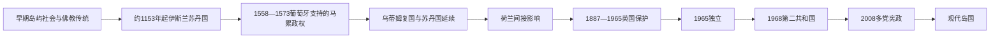

# 马尔代夫历史

## 历史主线

马尔代夫位于印度洋季风航路上，考里贝、椰绳、鱼货和补给把分散环礁接入南亚、阿拉伯海、东非与东南亚贸易。多地佛教遗址证明伊斯兰化以前存在广泛的宗教网络；传统以 1153 年多维米皈依为苏丹国起点，但铜板文书和后世编年在人物与年代上存在差异。

16 世纪葡萄牙支持的改宗王族与摄政集团一度控制马累，乌蒂姆兄弟于 1573 年夺回首都。荷兰和英国后来主要通过锡兰施加海上保护与外交影响；1887 年英国保护安排保留内部自治，却控制国防和外事。1932 年宪法、1953 年第一共和国、1959—1963 年苏瓦迪夫分离和甘岛基地谈判推动现代国家成形。马尔代夫 1965 年独立、1968 年建立第二共和国，2008 年进入竞争性多党总统制。

## 分期导航

| 顺序 | 阶段 | 时间 | 简要概括 |
| --- | --- | --- | --- |
| 1 | [早期岛屿社会与伊斯兰苏丹国](/%E4%BA%BA%E6%96%87%E7%A7%91%E5%AD%A6/%E5%8E%86%E5%8F%B2/%E5%8D%97%E4%BA%9A/%E9%A9%AC%E5%B0%94%E4%BB%A3%E5%A4%AB/%E6%97%A9%E6%9C%9F%E5%B2%9B%E5%B1%BF%E7%A4%BE%E4%BC%9A%E4%B8%8E%E4%BC%8A%E6%96%AF%E5%85%B0%E8%8B%8F%E4%B8%B9%E5%9B%BD.md) | 公元 1 千纪—16 世纪中叶 | 佛教物质遗存、皈依争议、环礁治理与海洋贸易 |
| 2 | [葡萄牙、荷兰影响与英国保护](/%E4%BA%BA%E6%96%87%E7%A7%91%E5%AD%A6/%E5%8E%86%E5%8F%B2/%E5%8D%97%E4%BA%9A/%E9%A9%AC%E5%B0%94%E4%BB%A3%E5%A4%AB/%E8%91%A1%E8%90%84%E7%89%99%E3%80%81%E8%8D%B7%E5%85%B0%E5%BD%B1%E5%93%8D%E4%B8%8E%E8%8B%B1%E5%9B%BD%E4%BF%9D%E6%8A%A4.md) | 1517—1965 | 葡萄牙占领争议、乌蒂姆反攻、间接保护、宪政与独立 |
| 3 | [独立、共和国与现代岛国](/%E4%BA%BA%E6%96%87%E7%A7%91%E5%AD%A6/%E5%8E%86%E5%8F%B2/%E5%8D%97%E4%BA%9A/%E9%A9%AC%E5%B0%94%E4%BB%A3%E5%A4%AB/%E7%8B%AC%E7%AB%8B%E3%80%81%E5%85%B1%E5%92%8C%E5%9B%BD%E4%B8%8E%E7%8E%B0%E4%BB%A3%E5%B2%9B%E5%9B%BD.md) | 1965—2026 年 7 月 | 第二共和国、旅游转型、多党政治与现代挑战 |
| 专表 | [马尔代夫苏丹世系表](/%E4%BA%BA%E6%96%87%E7%A7%91%E5%AD%A6/%E5%8E%86%E5%8F%B2/%E5%8D%97%E4%BA%9A/%E9%A9%AC%E5%B0%94%E4%BB%A3%E5%A4%AB/%E8%8B%8F%E4%B8%B9%E4%B8%96%E7%B3%BB%E8%A1%A8.md) | 约 1153—1968 | 97 个有名号在位段，以及复位、流亡王统、摄政和共和中断 |

## 重要转折与时间节点

| 时间 | 转折 |
| --- | --- |
| 约 1153 | 多维米皈依伊斯兰，传统上视为苏丹国起点 |
| 1347—1380 | 哈迪贾三度在位，展现女系继承和宫廷废立 |
| 1558—1573 | 葡萄牙支持的安德里·安德林政权控制马累 |
| 1573 | 穆罕默德·塔库鲁法努夺取马累 |
| 1887 | 英国保护安排正式化 |
| 1932 | 第一部成文宪法颁布 |
| 1953—1954 | 第一共和国及王政复辟 |
| 1959—1963 | 联合苏瓦迪夫共和国分离 |
| 1965-07-26 | 马尔代夫独立 |
| 1968-11-11 | 第二共和国成立 |
| 2008 | 新宪法和竞争性多党总统选举 |
| 2023—2026-07 | 穆罕默德·穆伊兹任总统，侯赛因·穆罕默德·拉蒂夫任副总统 |
