# 独立、共和国与现代岛国

## 时间

1965 年—2026 年 7 月

## 概括

1965 年独立结束了英国对马尔代夫国防和外交的控制，1968 年公投又终结延续八百余年的苏丹制。现代共和国先后经历纳西尔的国家建设、加尧姆长达三十年的集中统治、2008 年多党宪政转型，以及此后竞争性选举与反复政治危机。旅游业把群岛从贫困的渔业经济带入中等收入国家行列，也造成对外部客源、进口、债务和海岸基础设施的高度依赖。到 2026 年 7 月，穆罕默德·穆伊兹仍任总统，侯赛因·穆罕默德·拉蒂夫任副总统。

```mermaid
flowchart LR
    A["1965独立并加入联合国"] --> B["1968第二共和国：易卜拉欣·纳西尔"]
    B --> C["1972旅游业起步"]
    C --> D["1978—2008穆蒙·阿卜杜勒·加尧姆"]
    D --> E["2003抗议、2005多党制"]
    E --> F["2008新宪法与纳希德当选"]
    F --> G["2012纳希德辞职与瓦希德继任"]
    G --> H["2013亚明政府"]
    H --> I["2018萨利赫政府"]
    I --> J["2023穆伊兹当选"]
    J --> K["2026年7月：穆伊兹与拉蒂夫在任"]
```

## 从独立到第二共和国

1965 年 7 月 26 日，首相易卜拉欣·纳西尔代表马尔代夫签署独立协定。英国不再处理马尔代夫的国防和对外关系；同年 9 月 21 日，马尔代夫加入联合国。独立后的三年仍是君主制，法里德·迪迪由“苏丹”改称“国王”，但政府实权掌握在首相和内阁手中。

1967 年议会决定把政体问题交付公投。1968 年 11 月 11 日，第二共和国成立，纳西尔由首相转任总统。英国在甘岛的基地依据另行租约继续存在，到 1976 年才关闭并移交；因此，政治独立、王政终结和军事基地撤离是三个不同时间节点。

## 总统与代理总统完整序列

第一共和国虽早于本页主时间段，却是现代总统制度的直接前身，故一并列出。官方总统名录把阿明·迪迪任期记至 1953 年 8 月 21 日；另一些编年以 9 月 2 日作为其法律任期终点。8 月 21 日至 9 月 2 日之间是革命委员会接管与代理权形成的过渡期。

| 顺序 | 总统或代理总统 | 任期 | 副总统 | 政治阶段与关键事项 |
| --- | --- | --- | --- | --- |
| 1 | 穆罕默德·阿明·迪迪（Mohamed Amin Didi） | 1953-01-01—1953-08-21 | 易卜拉欣·穆罕默德·迪迪 | 第一共和国首任总统；推动教育、妇女权利、卫生和行政改革，在粮食与财政压力下被推翻 |
| 代理 | 易卜拉欣·穆罕默德·迪迪（Ibrahim Muhammad Didi） | 1953-09-02—1954-03-07 | 空缺 | 原副总统；主持第一共和国末期过渡，直至法里德·迪迪复辟 |
| 2 | 易卜拉欣·纳西尔（Ibrahim Nasir） | 1968-11-11—1978-11-10 | 大部分时期空缺；1975—1977 年曾设置多名副总统 | 第二共和国首任总统；国家建设、渔业机械化、机场和旅游业起步，1978 年离任 |
| 3 | 穆蒙·阿卜杜勒·加尧姆（Maumoon Abdul Gayoom） | 1978-11-11—2008-11-10 | 旧宪制下无常设民选副总统 | 六次获得任期，扩张旅游、教育和公共服务；统治高度集中，后期启动多党改革 |
| 4 | 穆罕默德·纳希德（Mohamed Nasheed） | 2008-11-11—2012-02-07 | 穆罕默德·瓦希德·哈桑 | 2008 年首场竞争性多党总统选举获胜；推动民主与气候外交，后在政治危机中辞职 |
| 5 | 穆罕默德·瓦希德·哈桑（Mohamed Waheed Hassan） | 2012-02-07—2013-11-16 | 穆罕默德·瓦希德·丁，2012-04-25—2013-11-10 | 依副总统继任条款就职；其合法性程序获宪法承认，但纳希德阵营持续指称权力移交受胁迫 |
| 6 | 阿卜杜拉·亚明·阿卜杜勒·加尧姆（Abdulla Yameen Abdul Gayoom） | 2013-11-17—2018-11-16 | 穆罕默德·贾米尔·艾哈迈德；艾哈迈德·阿迪布；阿卜杜拉·吉哈德 | 推动大型基础设施与对华融资，同时加强对反对派和司法的控制；2018 年选举败北 |
| 7 | 易卜拉欣·穆罕默德·萨利赫（Ibrahim Mohamed Solih） | 2018-11-17—2023-11-16 | 费萨尔·纳西姆 | 联盟政府，修复部分民主制度与对印关系；应对新冠疫情、旅游停摆、债务和执政联盟分裂 |
| 8 | 穆罕默德·穆伊兹（Mohamed Muizzu） | 2023-11-17—至今，核验至 2026-07 | **侯赛因·穆罕默德·拉蒂夫（Hussain Mohamed Latheef）** | 以国家主权、住房和基础设施为主要议题当选；重调对外安全安排。到 2026 年 7 月仍为现任总统 |

## 纳西尔时期：国家建设与开放

纳西尔在 1957—1968 年任首相时已主导独立和南部再统一，转任总统后把重点转向建立可运转的岛屿国家。

- **主权制度化**：共和国宪法使总统兼任国家元首和政府首脑；外交部门、广播、教育和现代行政向全国扩展。
- **交通与开放**：扩建胡鲁累机场，发展航运和无线通信，减少群岛与外界及各环礁之间的隔绝。
- **经济转型**：机械化渔船与冷藏、出口体系逐步替代完全依靠传统帆船的生产。1972 年首批度假村开业，旅游业成为新的外汇来源。
- **甘岛撤离**：英国基地 1976 年关闭，国家在独立十一年后才完全收回该设施。
- **权力集中**：中央政府强化对环礁的控制，对南部反对力量和政治异议采取强硬手段。现代化与威权治理从一开始便同时存在。
- **离任与争议**：经济压力、航运业困难和精英冲突削弱政府；纳西尔 1978 年没有寻求继续任职，随后长期居留海外。

## 加尧姆时期：增长、集中统治与改革压力

加尧姆从 1978 年执政至 2008 年，是任期最长的马尔代夫总统。其时期不能只概括为稳定或独裁，二者同时构成制度遗产。

### 发展与国家整合

- 旅游度假岛、机场、码头、电信、学校和基层卫生服务迅速扩张。
- 国家利用度假岛租金、进口税和外援向外环礁提供公共服务，但资本、就业和决策仍高度集中在马累。
- 1988 年，一支由马尔代夫反对者和外国雇佣人员组成的力量袭击马累。印度实施“仙人掌行动”恢复政府控制，此后印度成为最重要的安全伙伴之一。
- 加尧姆较早在国际场合强调海平面上升对低地岛国的威胁，气候安全成为马尔代夫外交的长期主题。

### 威权结构与开放

总统候选人长期由议会提名、再经单一候选公投确认；媒体、司法和安全机构受行政权强烈影响。2003 年囚犯埃文·纳西姆死亡引发马累抗议，暴露拘押虐待和政治封闭。2004 年印度洋海啸又造成广泛基础设施损失，重建压力加速了制度改革诉求。

2005 年政府允许政党合法活动。经过制宪会议长期争论，2008 年新宪法建立权力分立、独立委员会、最高法院、直接选举的总统与副总统以及竞争性多党选举。纳希德在第二轮击败加尧姆，实现首次通过多党总统选举的政权更替。

## 2008 年后：竞争性选举与制度冲突

### 纳希德政府与 2012 年危机

纳希德政府扩大媒体和公民空间，推动地方议会、国企改革、社会保障与气候外交。但总统面对由反对派占优势的议会、旧国家机构和司法体系，改革经常陷入对抗。2012 年 1 月政府下令拘押一名刑事法院法官，引发持续抗议和警察哗变。2 月 7 日纳希德辞职，副总统瓦希德依宪法继任。

关于权力移交的性质至今存在争议：纳希德称自己在武装压力下被迫辞职；继任政府和正式调查把它认定为宪法程序下的权力交接。较稳妥的结论是，继任条款确实被启动，但安全机构、街头动员和政治胁迫共同塑造了结果。

### 亚明政府

2013 年亚明胜选后，把机场、桥梁、住房和填海工程作为增长核心，并扩大与中国的融资和基础设施合作。大型项目改善连接，也显著增加外债与财政风险。政府以国家安全和反恐为由打击反对派，多名政治人物被监禁或流亡。2018 年最高法院命令释放政治犯后，政府宣布紧急状态并拘捕法官，形成严重宪政危机。同年选举中，反对派联盟候选人萨利赫获胜，亚明最终交权。

### 萨利赫政府

萨利赫依靠多党联盟上台，恢复与印度密切合作，推动岛屿基础设施、医疗、供水和地方治理项目。2020 年新冠疫情使国际旅游几乎停摆，国家收入骤降；边境重开后游客迅速回流，但债务、住房、马累过度集中和生活成本问题更突出。执政联盟内部围绕纳希德、政党控制和对印政策发生分裂，削弱萨利赫在 2023 年选举中的基础。

### 穆伊兹政府与 2026 年现状

穆伊兹在 2023 年竞选中强调国家主权、调整外国军事存在、住房和大型基础设施。上台后，马尔代夫与印度重新谈判航空平台和人员安排，原有印度军事人员于 2024 年撤离或由文职技术人员替代；与此同时，政府保持对印度、中国、海湾国家和其他伙伴的多向外交，说明政策并非简单从一个阵营完全转向另一个阵营。

穆伊兹阵营在 2024 年议会选举后获得强大立法基础，行政推进能力增强。政府继续填海、住房、机场、港口和旅游开发，同时面对外债偿付、财政赤字、进口依赖、生态承载力和气候适应成本。总统府 2026 年 7 月仍将穆罕默德·穆伊兹列为总统、侯赛因·穆罕默德·拉蒂夫列为副总统；本页的“至今”以此时为截止点，不向后推断。

## 2008 年宪法下的统治结构

| 机构 | 角色 | 主要权力与制衡 |
| --- | --- | --- |
| 总统 | 国家元首、政府首脑、武装力量最高指挥者 | 与副总统组成竞选搭档直接选举；任命内阁，执行法律与外交政策，受任期和议会监督约束 |
| 副总统 | 总统继任者和内阁成员 | 总统空缺时继任；具体政策权重取决于总统授权 |
| 人民议会 | 一院制立法机关 | 立法、预算、批准部分任命、监督内阁和总统 |
| 司法机关 | 最高法院及下级法院 | 解释宪法、审理选举和刑事民事案件；司法独立与任命政治化长期存在拉扯 |
| 独立委员会 | 选举、人权、审计、反腐、公务员等机构 | 试图把关键监督职能从总统府分离，但人员任命和资源仍可能受政党力量影响 |
| 地方议会 | 环礁、岛屿和城市层级 | 承担地方服务与发展规划；财政和土地权仍高度依赖中央，去中心化程度有限 |

2008 年以前，总统、内阁、司法与议会之间的边界较弱，行政权更集中；2008 年以后，正式制衡增强，但总统与议会多数、法院和安全机构之间的冲突成为政治危机的主要形式。

## 重要事件

| 时间 | 事件 | 结果与长期影响 |
| --- | --- | --- |
| 1965-07-26 | 马尔代夫独立 | 收回外交和国防主权 |
| 1965-09-21 | 加入联合国 | 小岛国家正式进入多边外交 |
| 1968-11-11 | 第二共和国成立 | 王政终结，纳西尔任总统 |
| 1972 | 首批度假村开业 | 旅游业逐渐取代单一渔业，成为经济核心 |
| 1976 | 英国关闭甘岛基地 | 殖民保护时代最后一项军事遗留结束 |
| 1978 | 加尧姆就任 | 开始三十年集中统治与旅游扩张 |
| 1988 | 雇佣兵袭击马累，印度出兵 | 政府获救，印马安全合作加深 |
| 2003 | 囚犯死亡与马累抗议 | 多党改革压力急升 |
| 2004 | 印度洋海啸 | 多岛基础设施受损，暴露低地岛国脆弱性 |
| 2005 | 政党合法化 | 从个人和派系竞争转向正式多党政治 |
| 2008 | 新宪法与多党总统选举 | 权力分立制度化，纳希德实现选举更替 |
| 2012 | 纳希德辞职、瓦希德继任 | 宪法继任与政治胁迫之争长期影响党争 |
| 2018 | 紧急状态与总统选举 | 亚明败选，萨利赫上台，制度韧性与脆弱性同时显现 |
| 2020 | 新冠疫情导致旅游停摆 | 财政、就业和进口依赖遭受严重冲击 |
| 2023 | 穆伊兹当选 | 主权、安全伙伴与基础设施政策重新调整 |
| 2024—2026-07 | 新政府巩固议会基础并重谈安全安排 | 行政能力增强，同时债务、气候和对外平衡压力持续 |

## 长期发展机制与风险

### 发展条件

- 度假岛模式把游客活动与居民岛相对分离，便于集中投资和管理，也形成高外汇收入。
- 国际机场、跨岛交通、通信和教育把分散环礁纳入统一市场与国家行政。
- 渔业、旅游和海上区位使马尔代夫能在印度、中国、海湾国家、西方国家及国际组织之间争取资源。
- 气候议题为小国外交提供全球影响力。

### 结构性风险

- 旅游收入高度受疫情、战争、经济衰退和航空市场影响；大部分粮食、燃料和建材依靠进口。
- 马累人口和机会过度集中，住房、垃圾、供水和交通压力持续上升；外环礁则面临人口外流。
- 基础设施融资能迅速改变岛屿条件，也会积累外债、维护成本和生态损失。
- 海平面上升、海岸侵蚀、珊瑚白化和淡水盐化不是单一未来事件，而是已经影响规划的长期约束。
- 多党选举已经常态化，但司法独立、安全机构中立、反对派权利和权力和平交接仍需持续巩固。
- 对印度与中国的关系常被国内党争化；真正的政策难题是同时维护主权、安全、融资和市场，而非永久选择单一阵营。

## 演变关系

- 前一阶段：[葡萄牙、荷兰影响与英国保护](/%E4%BA%BA%E6%96%87%E7%A7%91%E5%AD%A6/%E5%8E%86%E5%8F%B2/%E5%8D%97%E4%BA%9A/%E9%A9%AC%E5%B0%94%E4%BB%A3%E5%A4%AB/%E8%91%A1%E8%90%84%E7%89%99%E3%80%81%E8%8D%B7%E5%85%B0%E5%BD%B1%E5%93%8D%E4%B8%8E%E8%8B%B1%E5%9B%BD%E4%BF%9D%E6%8A%A4.md)
- 王政世系：[马尔代夫苏丹世系表](/%E4%BA%BA%E6%96%87%E7%A7%91%E5%AD%A6/%E5%8E%86%E5%8F%B2/%E5%8D%97%E4%BA%9A/%E9%A9%AC%E5%B0%94%E4%BB%A3%E5%A4%AB/%E8%8B%8F%E4%B8%B9%E4%B8%96%E7%B3%BB%E8%A1%A8.md)
- 上级：[马尔代夫历史总览](/%E4%BA%BA%E6%96%87%E7%A7%91%E5%AD%A6/%E5%8E%86%E5%8F%B2/%E5%8D%97%E4%BA%9A/%E9%A9%AC%E5%B0%94%E4%BB%A3%E5%A4%AB/README.md)
