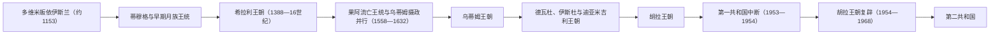

# 马尔代夫苏丹世系表

## 时间

约 1153—1968 年。多维米于 1141 年即位，1153 年皈依伊斯兰后改称苏丹，故表中保留其皈依前的在位起点。

## 读表说明

- 本表以“有名号的君主在位段”为计数单位，共列 **97 段**。同一人复位时另列一段；共治、废立、未加冕、流亡和名义统治均在备注中说明。
- 早期王表主要来自《塔里赫》、迪维希语王统表和铜板文书。18 世纪以前的公历换算常相差一年，表中以“约”或斜线并列差异。
- 《塔里赫》由哈桑·塔杰丁在 18 世纪初奉命编写，早期部分相当简略；其续编才将叙事延伸至 1827 年。它与铜板铭文、墓碑和外来旅行记录并不总是一致，不能把任何一套王表视为完全无误。
- 1558—1632 年存在两套互相竞争的编年：传统马尔代夫叙事把乌蒂姆领袖列为恢复主权的统治者；果阿王室名录则继续承认多姆·曼努埃尔、若昂和菲利普，并把乌蒂姆领袖视作摄政。下表保留流亡君主，后文另列马累的实际统治者。
- 1932 年后王位改为选举产生。阿卜杜勒·马吉德·迪迪虽获选，却长期居留海外且未完成加冕；有的王表把 1943—1953 年整体视为摄政空位，本表仍将其作为争议的当选苏丹单列。
- “Maha Radun / Maha Rehendi”分别相当于“大王 / 女王”；未举行击锣加冕礼者常称“Keerithi Maha Radun / Rehendi”。

## 蒂穆格与早期月族王统

| 序 | 君主 | 王号 | 在位 | 继承关系与重要说明 |
| --- | --- | --- | --- | --- |
| 1 | 多维米（Dhovemi；皈依后称穆罕默德·阿迪勒） | Bavanaadheettha | 1141—1165/1166 | 科伊马拉的外甥；1153 年皈依伊斯兰并采用苏丹称号。皈依日期与主持者存在编年争议。 |
| 2 | 穆泰（Muthey） | Bavana Abaarana | 1165/1166—1184/1185 | 多维米的姨表亲，月族王统。 |
| 3 | 阿里（Ali） | Dhammaru Naaja | 1184—1192/1193 | Rekehiriya Mava Kilege 之子。 |
| 4 | 迪内（Dhinei） | Fennaadheettha | 1192/1193—1198/1199 | Fathahiriya Mava Kilege 之子；其时留下早期铜板文书。 |
| 5 | 迪黑（Dhihei） | Dhagathaa Abaarana | 1198/1199—1213/1214 | 迪内之弟。 |
| 6 | 瓦迪（Wadi） | Dhagathaa Suvara | 1213/1214—1232/1233 | 迪黑之弟。 |
| 7 | 瓦拉·迪奥（Valla Dio） | Raa-Araa Desvara | 1232/1233—1257/1258 | 瓦迪之弟。 |
| 8 | 胡代（Hudhei） | Raadha Suvara | 1257/1258—1263/1264 | Hiriya Mava Kilege 之子。 |
| 9 | 艾马（Aima） | Loka Suvara | 1263/1264—1265/1266 | 来自费亨杜支系，母系属于月族贵族。 |
| 10 | 哈利一世（Hali） | Singaa Abaarana | 1265/1266—1267/1268 | Vengihi Kalo 与 Aidage Maava Kilege 之子。 |
| 11 | 凯米（Keimi） | Madheenee Suvara | 1267/1268—1268/1269 | Aidage Maava Kilege 之子。 |
| 12 | 奥达（Audha） | Areedha Suvara | 1268/1269—1277/1278 | 瓦迪之子。 |
| 13 | 哈利二世（Hali / Ali II） | Areedha Suvara | 1277/1278—1287/1288 | 奥达之子。 |
| 14 | 优素福一世（Yoosuf） | Bavanaadheettha | 1287/1288—1293/1294 | 哈利二世之弟。 |
| 15 | 萨利斯（Salis / Salah al-Din） | Meesuvara | 1293—1301/1302 | 优素福一世之子。 |
| 16 | 达伍德（Davud） | Sundhura Bavana | 1301/1302—1306/1307 | 优素福一世之子。 |
| 17 | 奥马尔·维鲁（Omar Veeru） | Loka Abaarana | 1306/1307—1341 | 与萨利斯有母系亲缘；不同王表对其父系关系记载矛盾。 |
| 18 | 艾哈迈德·希哈布丁（Ahmed Shihabuddine） | Loka Aadheettha | 1341—1347 | 奥马尔·维鲁之子，被姐姐哈迪贾废黜并放逐。 |
| 19 | 哈迪贾一世（Khadijah，第一次在位） | Raadha Abaarana | 1347—1363 | 奥马尔·维鲁之女；后被第一任丈夫兼宰相穆罕默德废黜。 |
| 20 | 穆罕默德·贾米勒（Mohamed el-Jameel） | Bavana Sooja | 1363—1364 | 哈迪贾的第一任丈夫；被复位的哈迪贾派人刺杀。 |
| 21 | 哈迪贾一世（第二次在位） | Raadha Abaarana | 1364—1374 | 复位；后被第二任丈夫阿卜杜拉废黜。 |
| 22 | 阿卜杜拉一世（Abdullah） | Dhammaru Aadheettha | 1374—1376 | 哈迪贾的第二任丈夫；后遭哈迪贾派人刺杀。 |
| 23 | 哈迪贾一世（第三次在位） | Raadha Abaarana | 1376—1379/1380 | 第三次复位；与同母异父妹妹拉达法蒂的在位末段可能重叠。 |
| 24 | 拉达法蒂（Raadhafathi） | Suvama Abaarana | 1379—1380 | 奥马尔·维鲁之女、哈迪贾的异母妹妹；被丈夫穆罕默德废黜。 |
| 25 | 马库拉图的穆罕默德（Mohamed of Maakurathu） | Sundhura Abaarana | 1380—1385 | 拉达法蒂之夫，凭宰相与婚姻关系掌权。 |
| 26 | 达因（Dhaain） | Keerithi Maha Rehendi | 1385—1388 | 前任之女，未举行正式加冕；被丈夫阿卜杜拉废黜。 |
| 27 | 阿卜杜拉二世（Abdullah） | Suvama Abaarana | 1388 | 达因之夫；部分记载只承认其为摄政。 |
| 28 | 费亨杜的奥斯曼（Osman of Fehendhu） | Sundhura | 1388 | 曾任宰相，短暂掌权；通常视为早期月族王统末位。 |

## 希拉利王朝、葡萄牙介入与果阿流亡王统

| 序 | 君主 | 王号 | 在位 | 继承关系与重要说明 |
| --- | --- | --- | --- | --- |
| 29 | 哈桑一世（Hassan I） | Bavana | 1388—1398 | 希拉利王朝奠基者，父系追溯至 Hulhule 的穆斯林贵族阿巴斯。 |
| 30 | 易卜拉欣一世（第一次在位） | Dhammaru Veeru | 1398 | 哈桑一世之子，被叔父侯赛因废黜。 |
| 31 | 侯赛因一世（Hussain I） | Loka Veeru | 1398—1409 | 哈桑一世的孪生兄弟。 |
| 32 | 纳西鲁丁（Nasiruddine） | Veeru Abaarana | 1409—1411 | 出身有争议；一说属于月族，一说来自吉大港。曾推行较严厉的伊斯兰刑法。 |
| 33 | 哈桑二世（Hassan II） | Keerithi Maha Radun | 1411 | 希拉利支系，未加冕；溺亡。 |
| 34 | 伊萨（Isa） | Bavana Sundhura | 1411 | 哈桑二世之弟，短暂在位。 |
| 35 | 易卜拉欣一世（第二次在位） | Dhammaru Veeru | 1411—1421 | 复位，结束第一次废黜。 |
| 36 | 奥斯曼二世（Osman II） | Dhammaru Loaka | 1421 | 早期奥斯曼之子，短暂即位。 |
| 37 | 丹纳·穆罕默德（Danna Mohamed） | Raadha Bavana | 1421 | 希拉利家族长辈，曾与宰相集团关系密切。 |
| 38 | 优素福二世（Yoosuf II） | Loka Aananadha | 1421—1443 | 哈桑一世之子。 |
| 39 | 阿布·伯克尔一世（Aboobakuru I） | Bavana Sooja | 1443 | 哈桑一世之子、优素福二世异母弟；短暂在位并死于战事。 |
| 40 | 哈迪·哈桑三世（第一次在位） | Raadha Veeru | 1443—1467 | 阿布·伯克尔一世之子；外出时被赛义德·穆罕默德夺位。 |
| 41 | 赛义德·穆罕默德（Sayyid Mohamed） | Keerithi Maha Radun | 1467 | 阿拉伯人，自称先知后裔；未加冕，被归国的哈桑三世废黜。 |
| 42 | 哈迪·哈桑三世（第二次在位） | Raadha Veeru | 1467—1468 | 归国复位。 |
| 43 | 穆罕默德二世（Mohamed II） | Bavana Abaarana | 1468—1480 | 哈桑三世之子。 |
| 44 | 哈桑四世（第一次在位） | Raadha Loka | 1480 | 穆罕默德二世之子，被奥马尔二世废黜。 |
| 45 | 奥马尔二世（Omar II） | Loka Sundhura | 1480—1484 | 优素福二世之子。 |
| 46 | 哈桑五世（Hassan V） | Raadha Aanandha | 1484—1485 | 奥马尔二世之子。 |
| 47 | 哈桑四世（第二次在位） | Raadha Loka | 1485—1491 | 复位。 |
| 48 | 谢赫哈桑六世（Sheikh Hassan VI） | Raadha Fanaveeru | 1491—1492 | 阿布·伯克尔一世的外孙。 |
| 49 | 易卜拉欣二世（Ibrahim II） | Bavana Furasuddha | 1492 | 奥马尔二世之子，短暂在位。 |
| 50 | 卡卢·穆罕默德（第一次在位） | Dhammaru Bavana | 1492 | 奥马尔二世之子，被兄弟优素福废黜。 |
| 51 | 优素福三世（Yoosuf III） | Veeru Aanandha | 1492—1493 | 奥马尔二世之子。 |
| 52 | 阿里（Ali，Audha Veeru） | Audha Veeru | 1493—1495 | 希拉利旁支，被卡卢·穆罕默德推翻。 |
| 53 | 卡卢·穆罕默德（第二次在位） | Dhammaru Bavana | 1495—1510 | 复位；后被侄辈哈桑废黜。 |
| 54 | 哈桑七世（Hassan VII） | Singa Veeru | 1510—1511 | 优素福三世之子。 |
| 55 | 麦加的谢里夫·艾哈迈德（Sharif Ahmed） | Suddha Bavana | 1511—1513 | 来自麦加的阿拉伯贵族，自称先知后裔。 |
| 56 | 阿里三世（Ali III） | Aanandha | 1513 | 与姐姐布雷卡争斗时被杀。 |
| 57 | 卡卢·穆罕默德（第三次在位） | Dhammaru Bavana | 1513—1529 | 在妻子布雷卡协助下第三次复位；其时葡萄牙贸易与贡赋压力加深。 |
| 58 | 设拉子的哈桑八世（Hassan VIII） | Ran Mani Loka | 1529—1549 | 卡卢·穆罕默德之子，母亲来自设拉子。 |
| 59 | 穆罕默德三世（Mohamed III） | Singa Bavana | 1549—1551 | 被兄弟哈桑刺杀。 |
| 60 | 哈桑九世（后称多姆·曼努埃尔，第一次在位） | Dhirikusa Loka | 1551—1552 | 皈依天主教后被废黜，流亡葡属印度。部分名录把起年写作 1550。 |
| — | 王位空缺与大臣会议 | — | 1552—1554 | 不是君主；由大臣会议维持马累政务。 |
| 61 | 阿布·伯克尔二世（Aboobakuru II） | Asaalees Loka | 1554—1557 | 曾任哈桑九世宰相。 |
| 62 | 阿里·拉斯格法努（Ali Rasgefaan；王表编号作阿里四世或六世） | Audha Siyaaka Katthiri | 1557—1558 | 战死；其死亡成为葡萄牙支持的政权进入马累的转折。 |
| 63 | 多姆·曼努埃尔（流亡复位阶段） | Dhirikusa Loka | 1558—1573 | 居果阿，由皈依天主教的安德里·安德林在马累代行统治；传统叙事称此为葡萄牙占领。 |
| 64 | 多姆·曼努埃尔（条约下第二次复位） | Dhirikusa Loka | 1573—1583 | 乌蒂姆军夺取马累后，穆罕默德与哈桑·塔库鲁法努被果阿王统解释为共同摄政；马尔代夫传统则把穆罕默德视为苏丹。 |
| 65 | 多姆·若昂（Dom João） | Keerithi Maha Radun | 1583—1603 | 曼努埃尔之子，始终居果阿；马累由乌蒂姆家族实际统治。 |
| 66 | 多姆·菲利普（Dom Philippe） | Keerithi Maha Radun | 1603/1609—1632 | 若昂之子，居果阿；一次葡萄牙援助的夺权远征失败后在群岛内失去承认。不同王表把其起年写作 1603 或 1609。 |

## 乌蒂姆、哈马维、德瓦杜与伊斯杜王统

| 序 | 君主 | 王号 | 在位 | 继承关系与重要说明 |
| --- | --- | --- | --- | --- |
| 67 | 穆罕默德·伊马杜丁一世（Muhammad Imaduddin I） | Kula Sundhura Katthiri Bavana | 1632—1648 | 1620 年起已在马累任摄政；1632 年果阿远征失败后正式称苏丹，开乌蒂姆王朝的无争议阶段。 |
| 68 | 易卜拉欣·伊斯坎达尔一世（Ibrahim Iskandar I） | Kula Ran Meeba Katthiri Bavana | 1648—1687 | 伊马杜丁一世之子，长期在位。 |
| 69 | 库达·穆罕默德（Kuda Muhammad） | Maniranna Loka | 1687—1691 | 伊斯坎达尔一世年幼之子，母亲玛丽亚姆摄政；母子后在海上爆炸中身亡。 |
| 70 | 穆罕默德·穆希丁（Muhammad Mohyeddine） | Naakiree Sundhura | 1691—1692 | 乌蒂姆旁支；重行严厉宗教刑法，可能遭毒杀。 |
| 71 | 穆罕默德·沙姆苏丁一世（Muhammad Shamsuddine I） | Mikaalha Madhaadheettha | 1692 | 来自叙利亚的宗教学者，前任的导师；哈马维王统一代而终，可能遭毒杀。 |
| 72 | 穆罕默德·阿里·拉斯格法努（王表编号作阿里四世或六世）（Devvadhoo Rasgefaan） | Kula Ran Mani | 1692—1701 | 曾任首席法官，由大臣推举，开德瓦杜王统；可能遭继任集团毒杀。 |
| 73 | 阿里七世（Ali VII） | Kula Ran Muiy | 1701 | 伊斯杜王统创立者，短暂在位。 |
| 74 | 哈桑十世（Hassan X） | Keerithi Maha Radun | 1701 | 阿里七世之子，未加冕；让位于堂亲易卜拉欣。 |
| 75 | 易卜拉欣·穆兹希鲁丁（Ibrahim Muzhir al-Din） | Muthey Ran Mani Loka | 1701—1704 | 哈桑十世堂亲；朝觐期间由妻子摄政，首相穆罕默德·伊马杜丁趁其离境夺位。 |

## 迪亚米吉利王朝、马拉巴尔入侵与胡拉崛起

| 序 | 君主 | 王号 | 在位 | 继承关系与重要说明 |
| --- | --- | --- | --- | --- |
| 76 | 穆罕默德·伊马杜丁二世（Muhammad Imaduddin II） | Kula Sundhura Siyaaka Saasthura | 1704—1720 | 前任首相，夺位后开迪亚米吉利王朝；委托哈桑·塔杰丁撰写《塔里赫》。 |
| 77 | 易卜拉欣·伊斯坎达尔二世（Ibrahim Iskandar II） | Rannava Loka | 1720—1750 | 伊马杜丁二世之子。 |
| 78 | 穆罕默德·伊马杜丁三世（Muhammad Imaduddin III） | Navaranna Keerithi | 1750—1757 | 伊马杜丁二世之子；1752 年被坎纳诺尔阿里拉贾俘往拉克代夫，1757 年死于囚禁。 |
| 79 | 阿米娜一世（Amina I） | 女统治者，王号记载不一 | 1753—1754 | 伊斯坎达尔二世之女；马累摆脱约 17 周的马拉巴尔占领后成为名义统治者，后退位。 |
| 80 | 阿米娜二世（Amina II） | 女统治者，王号记载不一 | 1754—1759 | 伊马杜丁三世之女；幼年时先为被俘父亲的名义摄政，父亲 1757 年去世后被部分名录视作正式女王。 |
| 81 | 哈桑·伊祖丁（Hassan Izzuddin） | Kula Ran Meeba Audha Keerithi Katthiri Bavana | 1759—1766 | 又称穆利格·多恩·哈桑·马尼库；此前已是实际摄政，因迪亚米吉利继承人未归而登位，后让位。 |
| 82 | 穆罕默德·吉亚苏丁（Muhammad Ghiyath al-Din） | Kula Ranmani Keerithi | 1766—1774 | 伊斯坎达尔二世之子；朝觐期间被夺位，返航后被杀。 |
| 83 | 穆罕默德·沙姆苏丁·伊斯坎达尔二世 | Keerithi Maha Radun | 1774 | 胡拉家族成员，趁吉亚苏丁朝觐夺位；短暂统治后让位给侄辈。 |
| 84 | 穆罕默德·穆伊祖丁（Muhammad Muizzuddin） | Keerithi Maha Radun | 1774—1779 | 哈桑·伊祖丁之子；其在位时吉亚苏丁返国并被杀，胡拉王朝由此巩固。 |

## 胡拉王朝、保护国与王政终结

| 序 | 君主 | 王号 | 在位 | 继承关系与重要说明 |
| --- | --- | --- | --- | --- |
| 85 | 哈桑·努鲁丁一世（Hassan Nooraddeen I） | Keerithi Maha Radun | 1779—1799 | 穆伊祖丁之弟。 |
| 86 | 穆罕默德·穆伊努丁一世（Muhammad Mueenuddeen I） | Keerithi Maha Radun | 1799—1835 | 努鲁丁一世之子。 |
| 87 | 穆罕默德·伊马杜丁四世（Muhammad Imaaduddeen IV） | Kula Sudha Ira Siyaaka Saasthura Audha Keerithi Katthiri Bovana | 1835—1882 | 穆伊努丁一世之子，长期在位。 |
| 88 | 易卜拉欣·努鲁丁（第一次在位） | Keerithi Maha Radun | 1882—1886 | 伊马杜丁四世之子；让位给侄子。 |
| 89 | 穆罕默德·穆伊努丁二世（Muhammad Mueenuddeen II） | Keerithi Maha Radun | 1886—1888 | 前任之侄；1887 年签署保护安排，把国防和对外关系交由英国。 |
| 90 | 易卜拉欣·努鲁丁（第二次在位） | Keerithi Maha Radun | 1888—1892 | 叔父复位。 |
| 91 | 穆罕默德·伊马杜丁五世（Muhammad Imaaduddeen V） | Keerithi Maha Radun | 1892—1893 | 努鲁丁之幼子；由堂亲哈桑·努鲁丁·曼杜格伊摄政并代为退位。王室表也有仅记 1892 年者。 |
| 92 | 穆罕默德·沙姆苏丁三世（第一次在位） | Keerithi Maha Radun | 1893 | 伊马杜丁五世异母兄；同一摄政者代其退位。部分王表把此段写作 1892 年。 |
| 93 | 穆罕默德·伊马杜丁六世（Muhammad Imaaduddeen VI） | Keerithi Maha Radun | 1893—1902/1903 | 原摄政者自行登位；出访奥斯曼帝国途中被废。 |
| 94 | 穆罕默德·沙姆苏丁三世（第二次在位） | Kula Sundhura Katthiri Bavana | 1902/1903—1934 | 复位；1932 年颁布首部成文宪法，后被废黜流放。王室名录也作 1903—1933。 |
| 95 | 哈桑·努鲁丁二世（Hassan Nooraddeen II） | Kula Sudha Ira Siyaaka Saasthura Audha Keerithi Katthiri Bavana | 1933/1935—1943 | 1933 年获承认、1935 年完成登位的写法并存；1943 年被迫退位，之后一度主持摄政委员会。 |
| 96 | 阿卜杜勒·马吉德·迪迪（Abdul Majeed Didi，当选苏丹） | Keerithi Maha Radun | 1944—1952 | 获选后留居开罗、科伦坡，未返国加冕；国家由摄政委员会和首相集团治理。严格王室名录不把他算作实际在位君主。 |
| — | 王位空缺与摄政委员会 | — | 1952—1953 | 阿卜杜勒·马吉德去世后未立新王，议会转向共和方案。 |
| — | 第一共和国 | — | 1953—1954 | 穆罕默德·阿明·迪迪任总统，1953 年 8 月被推翻；易卜拉欣·穆罕默德·迪迪其后代理至王政复辟。 |
| 97 | 穆罕默德·法里德·迪迪（Muhammad Fareed Didi） | Keerithi Maha Radun | 1954—1968 | 阿卜杜勒·马吉德之子；1954 年复辟，1965 年独立后改称国王，1968 年公投建立第二共和国，成为末代君主。 |

## 并行统治、共治与摄政专表

| 时间 | 名义君主或制度 | 实际掌权者 | 地位与争议 |
| --- | --- | --- | --- |
| 1552—1554 | 王位空缺 | 大臣会议 | 哈桑九世被废后维持政务，直至阿布·伯克尔二世即位。 |
| 1558—1573 | 居果阿的多姆·曼努埃尔 | 安德里·安德林 | 安德里在马累代行王权并依赖葡萄牙力量；“直接占领”还是“流亡王的摄政政权”是后世争议。 |
| 1573—1583 | 多姆·曼努埃尔 | 穆罕默德·塔库鲁法努，共同摄政 | 乌蒂姆军夺取马累后的首要实际统治者；传统王表把他列为苏丹。 |
| 1573—1583 | 多姆·曼努埃尔 | 哈桑·塔库鲁法努，共同摄政 | 穆罕默德的兄弟和共同统治者，负责维持反攻后的乌蒂姆政权。 |
| 1583—1585 | 多姆·若昂 | 穆罕默德·塔库鲁法努 | 穆罕默德公开使用苏丹身份；果阿王统认为其仍只是违约摄政，马尔代夫国家记忆则视其为复国君主。 |
| 1585—1607/1609 | 多姆·若昂、后多姆·菲利普 | 易卜拉欣·卡拉法努（Ibrahim Kalaafaanu） | 穆罕默德之子，马累实际统治者；传统名录视为苏丹，果阿编年视为摄政。 |
| 1607—1609 | 多姆·菲利普 | 库达·卡卢·卡马纳法努 | 哈桑·塔库鲁法努之女，在乌蒂姆权力交接期摄政。 |
| 1609—1620 | 多姆·菲利普 | 侯赛因·法穆拉代里·基莱格 | 马累实际统治者，维持本地政权。 |
| 1620—1632 | 多姆·菲利普 | 穆罕默德·伊马杜丁一世 | 先任摄政；1632 年击退果阿支持的干预后正式称苏丹。 |
| 1687—1691 | 幼主库达·穆罕默德 | 王母玛丽亚姆 | 王母摄政；母子后来同死于海上爆炸。 |
| 1701—1704 | 易卜拉欣·穆兹希鲁丁 | 王后法蒂玛·卡巴法努 | 苏丹朝觐期间摄政，首相利用离境夺位。 |
| 1752—1759 | 被俘的伊马杜丁三世、阿米娜一世与阿米娜二世 | 穆利格·多恩·哈桑·马尼库 | 马拉巴尔占领结束后，他掌握军政实权；1759 年以哈桑·伊祖丁之名登位。 |
| 1892—1893 | 伊马杜丁五世、沙姆苏丁三世第一次在位 | 哈桑·努鲁丁·曼杜格伊 | 为两名年轻君主摄政，并先后代其退位，随后即位为伊马杜丁六世。 |
| 1943—1953 | 努鲁丁二世退位、阿卜杜勒·马吉德当选但不在国内 | 摄政委员会、首相与阿明·迪迪等政府核心 | 王冠、内阁与实际行政权分离；不同名录因此对这十年是否存在“在位苏丹”判断不同。 |
| 1953-09-02—1954-03-07 | 第一共和国 | 易卜拉欣·穆罕默德·迪迪代理总统 | 阿明·迪迪被推翻后主持过渡，直至法里德·迪迪复辟。 |

## 编年冲突要点

| 问题 | 可确认的事实 | 不宜写成定论之处 |
| --- | --- | --- |
| 1153 年皈依 | 1337 年马累星期五清真寺修缮铭文与后世王统保存了伊历 548 年的记忆 | 铜板文书把关键转变放在另一位名为 Gadanaaditya 的国王时代；传教者是优素福·沙姆斯·塔布里齐还是阿布·巴拉卡特也有不同传统 |
| 早期在位年 | 王统顺序大体可重建 | 伊历换算、即位与加冕的起算点常使公历相差一年 |
| 1558—1632 年合法性 | 果阿确有改宗王族及其后裔，马累也确由乌蒂姆集团掌握 | “葡萄牙占领”“流亡王摄政”“乌蒂姆苏丹”分别反映国家记忆、契约合法性和实际控制，不能只留其中一套 |
| 1753—1759 年女统治者 | 阿米娜一世、阿米娜二世均承担过名义王权，哈桑·伊祖丁掌握实际军政 | 阿米娜二世何时从摄政转为正式女王，各名录表述不一 |
| 1943—1953 年 | 王位选举、摄政委员会和海外当选者并存 | 阿卜杜勒·马吉德应算“苏丹”还是“未即位的当选者”，取决于是否以加冕和亲政为标准 |

## 相关笔记

- [马尔代夫历史总览](/%E4%BA%BA%E6%96%87%E7%A7%91%E5%AD%A6/%E5%8E%86%E5%8F%B2/%E5%8D%97%E4%BA%9A/%E9%A9%AC%E5%B0%94%E4%BB%A3%E5%A4%AB/README.md)
- [早期岛屿社会与伊斯兰苏丹国](/%E4%BA%BA%E6%96%87%E7%A7%91%E5%AD%A6/%E5%8E%86%E5%8F%B2/%E5%8D%97%E4%BA%9A/%E9%A9%AC%E5%B0%94%E4%BB%A3%E5%A4%AB/%E6%97%A9%E6%9C%9F%E5%B2%9B%E5%B1%BF%E7%A4%BE%E4%BC%9A%E4%B8%8E%E4%BC%8A%E6%96%AF%E5%85%B0%E8%8B%8F%E4%B8%B9%E5%9B%BD.md)
- [葡萄牙、荷兰影响与英国保护](/%E4%BA%BA%E6%96%87%E7%A7%91%E5%AD%A6/%E5%8E%86%E5%8F%B2/%E5%8D%97%E4%BA%9A/%E9%A9%AC%E5%B0%94%E4%BB%A3%E5%A4%AB/%E8%91%A1%E8%90%84%E7%89%99%E3%80%81%E8%8D%B7%E5%85%B0%E5%BD%B1%E5%93%8D%E4%B8%8E%E8%8B%B1%E5%9B%BD%E4%BF%9D%E6%8A%A4.md)
- [独立、共和国与现代岛国](/%E4%BA%BA%E6%96%87%E7%A7%91%E5%AD%A6/%E5%8E%86%E5%8F%B2/%E5%8D%97%E4%BA%9A/%E9%A9%AC%E5%B0%94%E4%BB%A3%E5%A4%AB/%E7%8B%AC%E7%AB%8B%E3%80%81%E5%85%B1%E5%92%8C%E5%9B%BD%E4%B8%8E%E7%8E%B0%E4%BB%A3%E5%B2%9B%E5%9B%BD.md)
