# 葡萄牙、荷兰影响与英国保护

## 时间

1517—1965 年

## 概括

欧洲势力对马尔代夫的影响经历了三种不同形态。16 世纪葡萄牙依托果阿、科钦和改宗王族，曾以武装摄政集团实际控制马累；17—18 世纪荷兰东印度公司主要通过锡兰的贸易、赠礼和保护关系施加间接影响，没有在各环礁建立殖民官僚体系；1887 年英国保护安排则把国防和对外关系制度化地交给英国，内部仍由苏丹、首相、议会和伊斯兰司法治理。20 世纪宪政改革、第一共和国、南部苏瓦迪夫分离和甘岛基地谈判，最终把保护国转变为 1965 年的独立国家。

```mermaid
flowchart LR
    A["1517前后葡萄牙贸易据点与贡赋压力"] --> B["1558安德里·安德林控制马累"]
    B --> C["乌蒂姆兄弟跨岛反攻"]
    C --> D["1573收复马累"]
    D --> E["果阿流亡王统与乌蒂姆摄政并行"]
    E --> F["1632本地苏丹权威重新统一"]
    F --> G["1645起与荷属锡兰的间接保护、贸易关系"]
    G --> H["1796英国接替锡兰海上优势"]
    H --> I["1887英国保护协定"]
    I --> J["1932宪法与选举君主制"]
    J --> K["1953第一共和国与1954复辟"]
    K --> L["1959—1963苏瓦迪夫分离"]
    L --> M["1965独立"]
```

## 葡萄牙介入与 1558—1573 年政权

### 从贸易压力到王位干预

葡萄牙船队进入印度洋后，希望控制连接印度、锡兰和东非的航路，并取得马尔代夫的椰绳、考里贝和补给。1517 年前后，葡萄牙曾在群岛建立贸易据点并要求贡赋；压迫性交易引发冲突，早期据点很快遭到本地抵抗，但葡萄牙仍能从果阿、科钦和印度西岸持续介入。

1551 年，哈桑九世刺杀兄长后即位。他因有意改宗天主教而与大臣决裂，随后流亡葡属印度，采用多姆·曼努埃尔之名。1557—1558 年，苏丹阿里·拉斯格法努（王表编号作阿里四世或六世）战死，改宗的马尔代夫人安德里·安德林在葡萄牙支持下进入马累，代表身在果阿的曼努埃尔统治。

这一阶段在史学上有两种称呼：

- 马尔代夫国家记忆强调外来驻军、宗教强制、财产征收和安德里依赖葡萄牙武力，称之为持续十五年的“葡萄牙占领”。
- 果阿王室与契约编年强调曼努埃尔原是合法国王，称安德里为流亡王的摄政，并认为葡萄牙没有直接接管全部环礁。

两种说法对合法性的判断相反，但并不否认同一组核心事实：马累的最高权力由葡萄牙支持的改宗集团掌握，流亡王不在群岛内，外环礁对首都政权的服从并不稳定。

### 乌蒂姆兄弟的反攻过程

1. 北部乌蒂姆岛的穆罕默德、阿里和哈桑·塔库鲁法努兄弟离开受控地区，在米尼科伊和坎纳诺尔一带寻求船只、人员与补给。
2. 他们以“Kalhuoffummi”号等小型船只为机动平台，利用环礁航道、夜航和本地向导，在不同岛屿登陆，袭击安德里的官员与据点，天亮前撤离。
3. 这种长期游击战不是一次突袭：反抗者需要争取岛民供水、修帆、隐藏人员并传递情报，同时避开葡萄牙较强的海上火力。
4. 阿里在战斗中死亡后，穆罕默德与哈桑继续组织行动。随着安德里政权难以控制外围岛屿，马累逐渐孤立。
5. 1573 年伊斯兰历赖比尔·敖外鲁月初一前后，反抗者突入马累，杀死安德里·安德林并摧毁其权力核心，结束 1558 年以来的政权。
6. 穆罕默德·塔库鲁法努随后必须同时处理坎纳诺尔阿里拉贾的援助要求和果阿流亡王族的主权主张。军事胜利并没有立即消除法律与外交上的双重王权。

### 1573—1632 年的双重编年

| 时间 | 果阿王统的解释 | 马累的实际权力 |
| --- | --- | --- |
| 1573—1583 | 多姆·曼努埃尔恢复为居外君主 | 穆罕默德与哈桑·塔库鲁法努共同掌权；本地传统把穆罕默德视为苏丹 |
| 1583—1603 | 多姆·若昂继承王位 | 穆罕默德短暂继续掌权，1585 年后其子易卜拉欣·卡拉法努成为实际统治者 |
| 1603/1609—1632 | 多姆·菲利普在果阿保持主张 | 库达·卡卢·卡马纳法努、侯赛因·法穆拉代里和穆罕默德·伊马杜丁先后摄政 |
| 1632 起 | 果阿支持的夺权远征失败，流亡王统失去群岛内承认 | 穆罕默德·伊马杜丁一世正式称苏丹，王冠与实际行政权重新统一 |

因此，“1573 年葡萄牙被逐出”是军事和首都控制意义上的转折，而非所有条约、继承主张在当天同时终结。完整人名和复位段见[马尔代夫苏丹世系表](/%E4%BA%BA%E6%96%87%E7%A7%91%E5%AD%A6/%E5%8E%86%E5%8F%B2/%E5%8D%97%E4%BA%9A/%E9%A9%AC%E5%B0%94%E4%BB%A3%E5%A4%AB/%E8%8B%8F%E4%B8%B9%E4%B8%96%E7%B3%BB%E8%A1%A8.md)。

## 荷兰影响：商业霸权而非直接殖民

1645 年已有马尔代夫苏丹向荷兰驻锡兰当局派遣使团的记录。荷兰东印度公司在 1656—1658 年夺取锡兰沿海后，取代葡萄牙成为附近最强的欧洲海上力量。马尔代夫与科伦坡之间形成定期赠礼、贡物、外交保护和贸易往来，荷兰商人尤其关心考里贝供应、航道和失事船只。

这种关系不宜简单写成“荷兰直接统治马尔代夫”：

- 荷兰没有在马累设置常驻总督，也没有把各环礁纳入锡兰式殖民行政。
- 苏丹继续任命地方官、执行伊斯兰法、征收税赋并处理内部王位继承。
- 荷兰的优势主要表现在海上威慑、承认与外交保护、商业议价和锡兰港口网络。
- 群岛向科伦坡送礼既可被荷方解释为臣属贡物，也可被马尔代夫理解为换取保护的外交礼仪。

1796 年英国夺取荷属锡兰后，基本继承了这种以科伦坡为中心的关系，但直到 1887 年才把保护地位写成明确安排。

## 英国保护安排与内部自治

### 1887 年协定

1887 年 12 月，苏丹穆罕默德·穆伊努丁二世与英国驻锡兰总督体系达成保护安排。其核心不是把马尔代夫并入英属印度或锡兰，而是分割主权职能：

| 权力领域 | 主要掌握者 |
| --- | --- |
| 国防与重大对外关系 | 英国，经锡兰殖民当局处理 |
| 苏丹继承的对外承认 | 受英国影响，但仍由马尔代夫内部政治产生人选 |
| 国内行政、税收与伊斯兰司法 | 苏丹、首相、宫廷大臣和地方官 |
| 环礁与岛屿治理 | 本地 atoluverin、kateeb 等官员 |
| 年度关系 | 马尔代夫向锡兰总督呈送贡礼，英国承诺保护并原则上不干涉内部行政 |

1948 年的新安排调整并强化了保护关系，也取消了旧式年度贡礼的部分义务。即便如此，英国在马尔代夫的介入程度仍远低于直接殖民地；真正改变内部政治的往往是英国对王位、首相和海外贸易的承认，以及后来在甘岛建立军事基地。

## 1932 年宪法与王权重组

20 世纪初，受教育的宫廷和官僚精英希望把个人化王权改造成成文制度。1932 年，穆罕默德·沙姆苏丁三世颁布马尔代夫第一部成文宪法：

- 设立公民议会和部长会议，把行政职责划分给现代部门。
- 将苏丹职位逐步改造成选举与宪法约束下的君主，而非单纯世袭王位。
- 设立首相、总检察长和外交部门，使实际行政权更多落入部长与强势家族。
- 宪法很快在宫廷冲突中被废，1934 年又制定修订文本；沙姆苏丁被废后，哈桑·努鲁丁二世登位。
- 1943 年努鲁丁退位，阿卜杜勒·马吉德·迪迪获选但长期留居海外，国家由摄政委员会、首相集团和穆罕默德·阿明·迪迪等人实际治理。

宪政没有立即带来稳定民主，却永久改变了王冠与政府的关系：苏丹越来越像合法性象征，首相、议会和行政部门才掌握日常政策。

## 第一共和国与王政复辟

阿卜杜勒·马吉德 1952 年去世后，议会曾考虑让阿明·迪迪继承王位。阿明拒绝王冠，并推动公投和共和宪法。1953 年 1 月 1 日，马尔代夫第一共和国成立。

### 阿明·迪迪政府

- 建立政党和总统制，扩大现代学校、公共卫生和妇女教育。
- 共和宪法确认妇女投票权，改革税收、行政和社会习惯。
- 第二次世界大战后的粮食短缺、进口困难、财政压力与快速改革引起强烈反弹。
- 1953 年 8 月，阿明在锡兰治病期间，马累发生反政府行动；副总统易卜拉欣·穆罕默德·迪迪和革命委员会接管。
- 阿明返国后被拘禁，1954 年 1 月去世。易卜拉欣·穆罕默德·迪迪从 1953 年 9 月 2 日代理总统至 1954 年 3 月 7 日。

1954 年 3 月，穆罕默德·法里德·迪迪登位，王政恢复。首相承担实际政府首脑职能，尤其 1957 年易卜拉欣·纳西尔出任首相后，独立谈判、基地问题和南部危机都由政府而非苏丹主导。

## 甘岛基地、苏瓦迪夫分离与再统一

### 基地与南部社会

英国海军在第二次世界大战期间于阿杜环礁建设“Port T”，利用天然深水锚地；1957 年基地转为英国皇家空军甘岛站。基地雇佣南部居民，带来工资、商品和与锡兰直接往来的机会。马累政府试图加强税收、行政和用工控制，而首相纳西尔又要求重谈 1956 年基地租赁条件，南部地方利益、中央集权和英军需求由此冲突。

### 分离过程

1. 1959 年 1 月，阿杜发生反马累骚乱，地方代表宣布脱离中央。
2. 同年 3 月，胡瓦杜和富瓦穆拉加入，组成“联合苏瓦迪夫共和国”，阿卜杜拉·阿菲夫任总统。
3. 新政权依赖甘岛基地经济并希望获得英国承认；英国为保护基地与其接触，却始终没有正式承认其独立。
4. 马累实施政治、航运和经济压力，并派遣力量恢复部分南部岛屿控制。胡瓦杜等地的镇压和人口迁移在南部记忆中尤其痛苦。
5. 1960 年英国与马累重订甘岛租约，基地问题与马尔代夫主权谈判逐渐分开处理。
6. 1963 年 9 月，英国撤回对分离政权的实际容忍，苏瓦迪夫共和国解散；阿菲夫被送往塞舌尔，三个环礁重新纳入马尔代夫。

苏瓦迪夫危机不能只解释为英国阴谋或地方叛乱。基地就业、南部与马累的距离、税收和贸易控制、地方自治诉求以及英国战略利益共同促成了分离；其结束则为统一国家对外争取独立清除了最大障碍。

## 1965 年独立

1965 年 7 月 26 日，首相易卜拉欣·纳西尔代表马尔代夫与英国代表签署独立协定。英国不再负责马尔代夫的国防和对外关系，保护国地位终止。马尔代夫同年 9 月加入联合国，首次以完整主权国家身份开展外交。

独立并不意味着英国立即离开甘岛。基地依据另行租约继续使用，直至 1976 年关闭并移交。法里德·迪迪在独立后把“苏丹”改称“国王”，但实际政府仍由首相纳西尔主持；1968 年公投最终终结王政并建立第二共和国。

## 实际权力结构

| 时段 | 国家元首或名义权威 | 政府与实际权力 | 外部权力 |
| --- | --- | --- | --- |
| 1558—1573 | 居果阿的多姆·曼努埃尔 | 马累的安德里·安德林及其武装集团 | 葡萄牙果阿提供支持 |
| 1573—1632 | 果阿流亡王统与本地王统并存 | 乌蒂姆家族摄政、地方官和马累宫廷 | 葡萄牙仍支持流亡王族，坎纳诺尔也提出主权要求 |
| 1645—1796 | 本地苏丹 | 苏丹、宰相、法官与环礁官员 | 荷属锡兰以贸易、赠礼和海上保护施加间接影响 |
| 1796—1887 | 本地苏丹 | 内部治理基本自主 | 英属锡兰继承区域海上优势，保护关系尚未正式化 |
| 1887—1932 | 苏丹 | 宫廷大臣、地方官；王权仍较强 | 英国掌握国防和外事 |
| 1932—1953 | 宪法下的选举苏丹或摄政 | 首相、部长会议、议会与强势家族 | 英国保护权不变 |
| 1953—1954 | 总统阿明·迪迪，后代理总统易卜拉欣·穆罕默德·迪迪 | 共和政府和革命委员会 | 英国仍负责保护与外事 |
| 1954—1965 | 苏丹法里德·迪迪 | 首相及内阁；1957 年后纳西尔居核心 | 英国掌握外事、国防并经营甘岛基地；1959—1963 南部另有苏瓦迪夫政权 |

## 重要事件

| 时间 | 事件 | 结果与长期影响 |
| --- | --- | --- |
| 1517 前后 | 葡萄牙设贸易据点并索取贡赋 | 商业摩擦开始转为政治干预 |
| 1558 | 阿里·拉斯格法努（王表编号作阿里四世或六世）战死，安德里·安德林控制马累 | 葡萄牙支持的摄政政权建立 |
| 1558—1573 | 乌蒂姆兄弟跨岛游击反攻 | 外环礁成为抵抗网络，马累政权逐步孤立 |
| 1573 | 穆罕默德·塔库鲁法努夺取马累 | 结束安德里统治，但流亡王统主张延续至 1632 年 |
| 1632 | 果阿支持的干预失败 | 本地苏丹与实际行政权重新统一 |
| 1645—1658 | 与荷属锡兰关系形成并加深 | 进入荷兰商业与保护影响范围，但没有直接殖民行政 |
| 1796 | 英国夺取锡兰 | 英国继承科伦坡对马尔代夫的区域影响 |
| 1887 | 英国保护安排正式化 | 外交和国防交英国，内部自治保留 |
| 1932 | 第一部成文宪法 | 苏丹制转向选举和宪法约束，议会与内阁制度化 |
| 1953 | 第一共和国成立并在同年发生政变 | 快速现代化与社会、粮食、财政压力发生冲突 |
| 1954 | 法里德·迪迪复辟 | 王冠恢复，但首相与内阁掌握更多实权 |
| 1959—1963 | 联合苏瓦迪夫共和国 | 暴露南北差异、基地政治与中央集权矛盾 |
| 1965 | 保护国终结、国家独立 | 取得完整外交和国防主权，为 1968 年共和转型铺路 |

## 演变关系

- 前一阶段：[早期岛屿社会与伊斯兰苏丹国](/%E4%BA%BA%E6%96%87%E7%A7%91%E5%AD%A6/%E5%8E%86%E5%8F%B2/%E5%8D%97%E4%BA%9A/%E9%A9%AC%E5%B0%94%E4%BB%A3%E5%A4%AB/%E6%97%A9%E6%9C%9F%E5%B2%9B%E5%B1%BF%E7%A4%BE%E4%BC%9A%E4%B8%8E%E4%BC%8A%E6%96%AF%E5%85%B0%E8%8B%8F%E4%B8%B9%E5%9B%BD.md)
- 世系：[马尔代夫苏丹世系表](/%E4%BA%BA%E6%96%87%E7%A7%91%E5%AD%A6/%E5%8E%86%E5%8F%B2/%E5%8D%97%E4%BA%9A/%E9%A9%AC%E5%B0%94%E4%BB%A3%E5%A4%AB/%E8%8B%8F%E4%B8%B9%E4%B8%96%E7%B3%BB%E8%A1%A8.md)
- 后一阶段：[独立、共和国与现代岛国](/%E4%BA%BA%E6%96%87%E7%A7%91%E5%AD%A6/%E5%8E%86%E5%8F%B2/%E5%8D%97%E4%BA%9A/%E9%A9%AC%E5%B0%94%E4%BB%A3%E5%A4%AB/%E7%8B%AC%E7%AB%8B%E3%80%81%E5%85%B1%E5%92%8C%E5%9B%BD%E4%B8%8E%E7%8E%B0%E4%BB%A3%E5%B2%9B%E5%9B%BD.md)
- 上级：[马尔代夫历史总览](/%E4%BA%BA%E6%96%87%E7%A7%91%E5%AD%A6/%E5%8E%86%E5%8F%B2/%E5%8D%97%E4%BA%9A/%E9%A9%AC%E5%B0%94%E4%BB%A3%E5%A4%AB/README.md)
