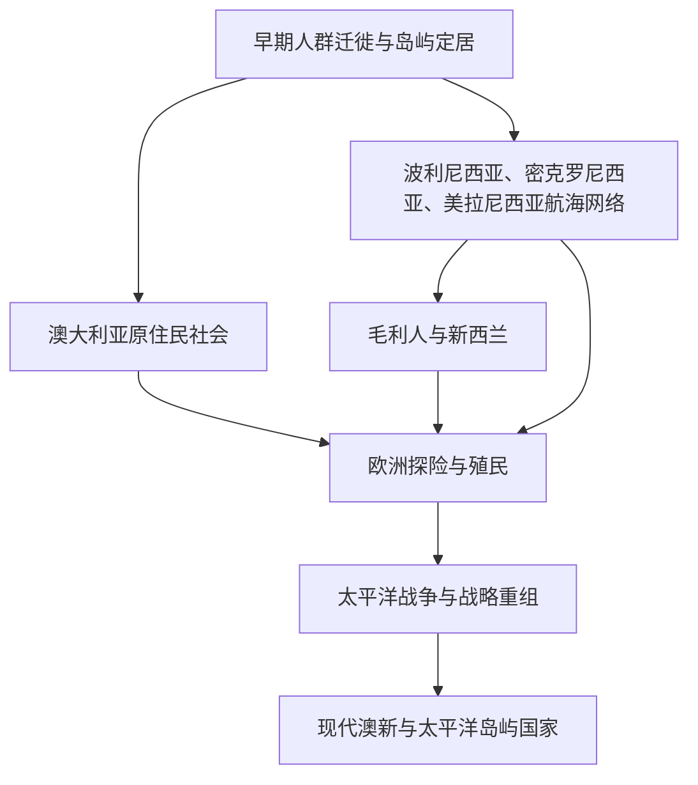

# 大洋洲历史

## 概括

大洋洲历史包括澳大利亚、新西兰和太平洋岛屿世界。其主线既有澳大利亚原住民、毛利人和波利尼西亚航海传统，也有英国、法国、德国、美国、日本等外来殖民和太平洋战争、现代岛屿国家独立等近现代变化。

## 演变图

## 区域入口

| 区域 | 入口 | 主线提示 |
|---|---|---|
| 澳大利亚 | [澳大利亚](/%E4%BA%BA%E6%96%87%E7%A7%91%E5%AD%A6/%E5%8E%86%E5%8F%B2/%E5%A4%A7%E6%B4%8B%E6%B4%B2/%E6%BE%B3%E5%A4%A7%E5%88%A9%E4%BA%9A/README.md) | 原住民社会、英国殖民、自治领、联邦和现代澳大利亚。 |
| 新西兰 | [新西兰](/%E4%BA%BA%E6%96%87%E7%A7%91%E5%AD%A6/%E5%8E%86%E5%8F%B2/%E5%A4%A7%E6%B4%8B%E6%B4%B2/%E6%96%B0%E8%A5%BF%E5%85%B0/README.md) | 毛利社会、怀唐伊条约、英国殖民和现代新西兰。 |
| 太平洋岛屿 | [太平洋岛屿](/%E4%BA%BA%E6%96%87%E7%A7%91%E5%AD%A6/%E5%8E%86%E5%8F%B2/%E5%A4%A7%E6%B4%8B%E6%B4%B2/%E5%A4%AA%E5%B9%B3%E6%B4%8B%E5%B2%9B%E5%B1%BF/README.md) | 波利尼西亚、密克罗尼西亚、美拉尼西亚和近现代殖民、独立。 |

## 相关区域

- 欧洲殖民扩张参见[欧洲历史](/%E4%BA%BA%E6%96%87%E7%A7%91%E5%AD%A6/%E5%8E%86%E5%8F%B2/%E6%AC%A7%E6%B4%B2/README.md)。
- 太平洋战争与日本、美国相关，可与[日本](/%E4%BA%BA%E6%96%87%E7%A7%91%E5%AD%A6/%E5%8E%86%E5%8F%B2/%E4%B8%9C%E4%BA%9A/%E6%97%A5%E6%9C%AC/README.md)和[北美](/%E4%BA%BA%E6%96%87%E7%A7%91%E5%AD%A6/%E5%8E%86%E5%8F%B2/%E7%BE%8E%E6%B4%B2/%E5%8C%97%E7%BE%8E/README.md)对读。
- 印度洋与东南亚航路参见[东南亚历史](/%E4%BA%BA%E6%96%87%E7%A7%91%E5%AD%A6/%E5%8E%86%E5%8F%B2/%E4%B8%9C%E5%8D%97%E4%BA%9A/README.md)。
