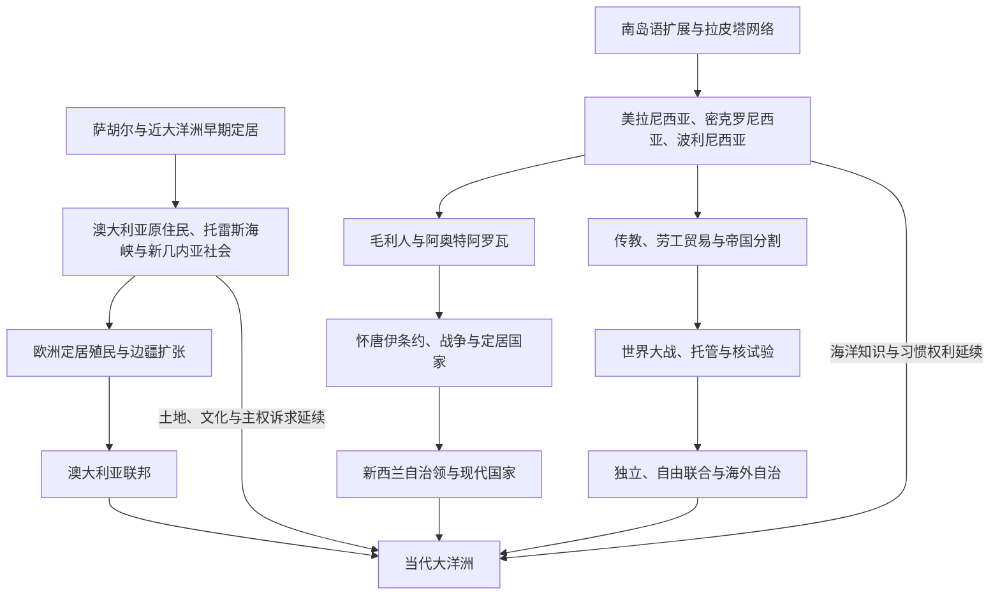

# 大洋洲历史

## 范围与主线

大洋洲史由澳大利亚大陆、阿奥特阿罗瓦／新西兰和太平洋岛屿世界共同构成。它不是欧洲“发现”以后才出现的边缘史：萨胡尔与近大洋洲至少数万年的定居、南岛语和拉皮塔扩展、波利尼西亚远洋航海、原住民土地与海洋法，构成区域的长时段基础。18—20世纪，英国、法国、德国、美国、日本、新西兰和澳大利亚以殖民、保护、委任、托管、劳工与军事基地重组区域；独立、自由联合、自治邦和持续属地则形成当代多层主权格局。

理解大洋洲需同时沿三条主线阅读：

1. **原住民族与文明连续性**：澳大利亚各民族、托雷斯海峡岛民、毛利、卡纳克、查莫罗及各岛亲属政治并未因殖民而终止。
2. **国家与政权演变**：殖民地、自治领、王国、共和国、自由联合和海外领地有不同的国家元首与政府结构。
3. **跨区域共同史**：航海、劳工贸易、世界大战、托管、核试验、渔业和气候不能分割在单一国家史内。

## 历史演进图

## 国家与地区入口

| 历史空间 | 入口 | 内容范围 |
|---|---|---|
| 澳大利亚 | [澳大利亚历史](/%E4%BA%BA%E6%96%87%E7%A7%91%E5%AD%A6/%E5%8E%86%E5%8F%B2/%E5%A4%A7%E6%B4%8B%E6%B4%B2/%E6%BE%B3%E5%A4%A7%E5%88%A9%E4%BA%9A/README.md) | 原住民社会、六殖民地、1901年联邦、世界大战、移民与现代宪政。 |
| 新西兰 | [新西兰历史](/%E4%BA%BA%E6%96%87%E7%A7%91%E5%AD%A6/%E5%8E%86%E5%8F%B2/%E5%A4%A7%E6%B4%8B%E6%B4%B2/%E6%96%B0%E8%A5%BF%E5%85%B0/README.md) | 毛利定居、条约双文本、殖民战争、自治领、福利国家和条约和解。 |
| 太平洋岛屿 | [太平洋岛屿](/%E4%BA%BA%E6%96%87%E7%A7%91%E5%AD%A6/%E5%8E%86%E5%8F%B2/%E5%A4%A7%E6%B4%8B%E6%B4%B2/%E5%A4%AA%E5%B9%B3%E6%B4%8B%E5%B2%9B%E5%B1%BF/README.md) | 航海与定居、三大历史地理分区、殖民、战争、去殖民化和区域合作。 |

## 文明与原住民主线

| 主线 | 入口 | 关键问题 |
|---|---|---|
| 澳大利亚原住民与托雷斯海峡岛民 | [原住民与托雷斯海峡岛民社会](/%E4%BA%BA%E6%96%87%E7%A7%91%E5%AD%A6/%E5%8E%86%E5%8F%B2/%E5%A4%A7%E6%B4%8B%E6%B4%B2/%E6%BE%B3%E5%A4%A7%E5%88%A9%E4%BA%9A/%E5%8E%9F%E4%BD%8F%E6%B0%91%E4%B8%8E%E6%89%98%E9%9B%B7%E6%96%AF%E6%B5%B7%E5%B3%A1%E5%B2%9B%E6%B0%91%E7%A4%BE%E4%BC%9A.md) | Country、亲属法律、海洋网络、边疆战争、被偷走的一代、土地权与当代承认。 |
| 毛利人与Kīngitanga | [毛利人定居与社会](/%E4%BA%BA%E6%96%87%E7%A7%91%E5%AD%A6/%E5%8E%86%E5%8F%B2/%E5%A4%A7%E6%B4%8B%E6%B4%B2/%E6%96%B0%E8%A5%BF%E5%85%B0/%E6%AF%9B%E5%88%A9%E4%BA%BA%E5%AE%9A%E5%B1%85%E4%B8%8E%E7%A4%BE%E4%BC%9A.md) | 波利尼西亚定居、hapū／iwi政治、pā、火器时代、毛利君主运动与文化复兴。 |
| 太平洋航海文明 | [航海、定居与太平洋世界](/%E4%BA%BA%E6%96%87%E7%A7%91%E5%AD%A6/%E5%8E%86%E5%8F%B2/%E5%A4%A7%E6%B4%8B%E6%B4%B2/%E5%A4%AA%E5%B9%B3%E6%B4%8B%E5%B2%9B%E5%B1%BF/%E8%88%AA%E6%B5%B7%E3%80%81%E5%AE%9A%E5%B1%85%E4%B8%8E%E5%A4%AA%E5%B9%B3%E6%B4%8B%E4%B8%96%E7%95%8C.md) | 近／远大洋洲、南岛语、拉皮塔、星象与涌浪导航、岛屿生态和政治形成。 |
| 美拉尼西亚 | [美拉尼西亚](/%E4%BA%BA%E6%96%87%E7%A7%91%E5%AD%A6/%E5%8E%86%E5%8F%B2/%E5%A4%A7%E6%B4%8B%E6%B4%B2/%E5%A4%AA%E5%B9%B3%E6%B4%8B%E5%B2%9B%E5%B1%BF/%E7%BE%8E%E6%8B%89%E5%B0%BC%E8%A5%BF%E4%BA%9A.md) | PNG、所罗门、瓦努阿图、斐济、新喀里多尼亚的习惯土地、资源与国家建构。 |
| 密克罗尼西亚 | [密克罗尼西亚](/%E4%BA%BA%E6%96%87%E7%A7%91%E5%AD%A6/%E5%8E%86%E5%8F%B2/%E5%A4%A7%E6%B4%8B%E6%B4%B2/%E5%A4%AA%E5%B9%B3%E6%B4%8B%E5%B2%9B%E5%B1%BF/%E5%AF%86%E5%85%8B%E7%BD%97%E5%B0%BC%E8%A5%BF%E4%BA%9A.md) | Nan Madol、环礁导航、日治、战略托管、自由联合、核遗产与美国属地。 |
| 波利尼西亚 | [波利尼西亚](/%E4%BA%BA%E6%96%87%E7%A7%91%E5%AD%A6/%E5%8E%86%E5%8F%B2/%E5%A4%A7%E6%B4%8B%E6%B4%B2/%E5%A4%AA%E5%B9%B3%E6%B4%8B%E5%B2%9B%E5%B1%BF/%E6%B3%A2%E5%88%A9%E5%B0%BC%E8%A5%BF%E4%BA%9A.md) | 汤加、萨摩亚、夏威夷、塔希提、库克、纽埃、图瓦卢和拉帕努伊的不同王权与殖民路径。 |

## 跨区域共同史

| 主题 | 入口 | 避免重复的职责 |
|---|---|---|
| 殖民、传教与劳工 | [殖民分割、传教与劳工贸易](/%E4%BA%BA%E6%96%87%E7%A7%91%E5%AD%A6/%E5%8E%86%E5%8F%B2/%E5%A4%A7%E6%B4%8B%E6%B4%B2/%E5%A4%AA%E5%B9%B3%E6%B4%8B%E5%B2%9B%E5%B1%BF/%E6%AE%96%E6%B0%91%E5%88%86%E5%89%B2%E3%80%81%E4%BC%A0%E6%95%99%E4%B8%8E%E5%8A%B3%E5%B7%A5%E8%B4%B8%E6%98%93.md) | 维护黑鸟掠工、印度契约劳工、保护国、吞并、公司和共管机制。 |
| 战争、托管与核试验 | [太平洋战争、托管与核试验](/%E4%BA%BA%E6%96%87%E7%A7%91%E5%AD%A6/%E5%8E%86%E5%8F%B2/%E5%A4%A7%E6%B4%8B%E6%B4%B2/%E5%A4%AA%E5%B9%B3%E6%B4%8B%E5%B2%9B%E5%B1%BF/%E5%A4%AA%E5%B9%B3%E6%B4%8B%E6%88%98%E4%BA%89%E3%80%81%E6%89%98%E7%AE%A1%E4%B8%8E%E6%A0%B8%E8%AF%95%E9%AA%8C.md) | 维护两次大战、岛民经历、联合国托管、美英法核试验和核正义。 |
| 去殖民化与区域合作 | [独立国家、自治与区域合作](/%E4%BA%BA%E6%96%87%E7%A7%91%E5%AD%A6/%E5%8E%86%E5%8F%B2/%E5%A4%A7%E6%B4%8B%E6%B4%B2/%E5%A4%AA%E5%B9%B3%E6%B4%8B%E5%B2%9B%E5%B1%BF/%E7%8B%AC%E7%AB%8B%E5%9B%BD%E5%AE%B6%E3%80%81%E8%87%AA%E6%B2%BB%E4%B8%8E%E5%8C%BA%E5%9F%9F%E5%90%88%E4%BD%9C.md) | 比较独立、自由联合、领地地位、论坛、海洋法、气候和大国竞争。 |

## 王朝、领导人与行政专表

| 专表 | 入口 | 覆盖 |
|---|---|---|
| 澳大利亚联邦领导 | [澳大利亚总督与总理表](/%E4%BA%BA%E6%96%87%E7%A7%91%E5%AD%A6/%E5%8E%86%E5%8F%B2/%E5%A4%A7%E6%B4%8B%E6%B4%B2/%E6%BE%B3%E5%A4%A7%E5%88%A9%E4%BA%9A/%E6%BE%B3%E5%A4%A7%E5%88%A9%E4%BA%9A%E6%80%BB%E7%9D%A3%E4%B8%8E%E6%80%BB%E7%90%86%E8%A1%A8.md) | 1901年以来君主、28位总督和各段总理任期。 |
| 新西兰副王、政府首脑与毛利君主 | [新西兰总督、总理与毛利君主表](/%E4%BA%BA%E6%96%87%E7%A7%91%E5%AD%A6/%E5%8E%86%E5%8F%B2/%E5%A4%A7%E6%B4%8B%E6%B4%B2/%E6%96%B0%E8%A5%BF%E5%85%B0/%E6%96%B0%E8%A5%BF%E5%85%B0%E6%80%BB%E7%9D%A3%E3%80%81%E6%80%BB%E7%90%86%E4%B8%8E%E6%AF%9B%E5%88%A9%E5%90%9B%E4%B8%BB%E8%A1%A8.md) | 1840年以来副王、1856年以来全部政府首脑任期、Kīngitanga八君主。 |
| 太平洋王权 | [太平洋王权与君主世系表](/%E4%BA%BA%E6%96%87%E7%A7%91%E5%AD%A6/%E5%8E%86%E5%8F%B2/%E5%A4%A7%E6%B4%8B%E6%B4%B2/%E5%A4%AA%E5%B9%B3%E6%B4%8B%E5%B2%9B%E5%B1%BF/%E5%A4%AA%E5%B9%B3%E6%B4%8B%E7%8E%8B%E6%9D%83%E4%B8%8E%E5%90%9B%E4%B8%BB%E4%B8%96%E7%B3%BB%E8%A1%A8.md) | 夏威夷、Pōmare、统一汤加、斐济短暂王国和萨摩亚元首；争议谱系明确标注。 |
| 当代国家与领地 | [太平洋国家与领地领导结构表](/%E4%BA%BA%E6%96%87%E7%A7%91%E5%AD%A6/%E5%8E%86%E5%8F%B2/%E5%A4%A7%E6%B4%8B%E6%B4%B2/%E5%A4%AA%E5%B9%B3%E6%B4%8B%E5%B2%9B%E5%B1%BF/%E5%A4%AA%E5%B9%B3%E6%B4%8B%E5%9B%BD%E5%AE%B6%E4%B8%8E%E9%A2%86%E5%9C%B0%E9%A2%86%E5%AF%BC%E7%BB%93%E6%9E%84%E8%A1%A8.md) | 截至2026年7月14日，分列国家元首、政府首脑、宗主国代表和实际权力。 |
| 殖民／托管行政 | [太平洋殖民与托管行政体系表](/%E4%BA%BA%E6%96%87%E7%A7%91%E5%AD%A6/%E5%8E%86%E5%8F%B2/%E5%A4%A7%E6%B4%8B%E6%B4%B2/%E5%A4%AA%E5%B9%B3%E6%B4%8B%E5%B2%9B%E5%B1%BF/%E5%A4%AA%E5%B9%B3%E6%B4%8B%E6%AE%96%E6%B0%91%E4%B8%8E%E6%89%98%E7%AE%A1%E8%A1%8C%E6%94%BF%E4%BD%93%E7%B3%BB%E8%A1%A8.md) | 各管辖阶段的总督、高级专员、驻地专员、军事行政与后继政体。 |

## 关键转折年表

| 时间 | 事件 | 区域意义 |
|---|---|---|
| 至少约6.5万年前 | 人类在澳大利亚活动 | 建立大陆原住民史的深时尺度。 |
| 至少约5万年前 | 近大洋洲已有广泛定居 | 新几内亚和邻岛不是南岛语扩展后的“空地”。 |
| 约前1600—前500年 | 拉皮塔文化扩展 | 把俾斯麦、瓦努阿图、斐济、汤加和萨摩亚连接为远洋网络。 |
| 约公元800—1300年 | 东波利尼西亚远洋定居 | 夏威夷、拉帕努伊、阿奥特阿罗瓦等被纳入人类航海世界。 |
| 1788年 | 英国建立新南威尔士殖民地 | 澳大利亚定居殖民、流放和边疆扩张的制度起点。 |
| 1840年 | 《怀唐伊条约》 | 新西兰王室治理的基础与持续双文本争议。 |
| 1874年 | 斐济割让英国 | 本地统一王国因债务、定居者与列强压力转为殖民地。 |
| 1899—1900年 | 萨摩亚分治、汤加受保护 | 列强竞争以协议和保护关系重画波利尼西亚政治。 |
| 1901年 | 澳大利亚联邦成立 | 六殖民地把关税、移民与防务移交联邦，州权继续存在。 |
| 1914年 | 德属太平洋殖民地被夺取 | 一战把岛屿转为澳、新、日委任统治。 |
| 1941—1945年 | 太平洋战争 | 新几内亚、所罗门、密克罗尼西亚与澳新进入全球主战场。 |
| 1946—1996年 | 主要核试验时期 | 马绍尔、澳大利亚、基里巴斯和法属波利尼西亚承担核时代成本。 |
| 1962—1994年 | 太平洋主要去殖民化阶段 | 独立、自由联合和自治邦的多条主权路径形成。 |
| 1971年 | 太平洋岛屿论坛前身成立 | 岛国、澳新与后来领地成员建立政治协调平台。 |
| 1985年 | 南太平洋无核区条约 | 反核、自决和区域外交制度化。 |
| 21世纪 | “蓝色太平洋”、气候与海洋主权 | 专属经济区、海平面、渔业和安全伙伴成为国家连续性问题。 |

## 因果比较

| 议题 | 结构因素 | 外部压力 | 直接触发 |
|---|---|---|---|
| 殖民政权扩张 | 海军、资本、土地登记和传教信息网 | 列强竞争、商品市场 | 割让、吞并声明、战争占领或公司破产后接管。 |
| 岛屿王国衰落 | 人口疾病、债务、土地与商人权力变化 | 外国军舰、领事和传教竞争 | 夏威夷1893政变、塔希提1880让渡等。 |
| 去殖民化 | 教育、地方议会、民族主义和习惯政治 | 联合国自决规范、宗主国财政压力 | 公投、宪制会议、独立法或自由联合协定。 |
| 当代政治危机 | 小议会联盟、地区资源和殖民边界 | 商品、气候、援助和安全竞争 | 不信任案、政变、骚乱或灾害；不能以单因解释。 |

## 关键辨析

- “大洋洲”“太平洋岛屿”和“太平洋岛国”范围不同：前者包括澳大利亚和新西兰，后者在外交语境中通常指岛屿国家与政治体。
- 美拉尼西亚、密克罗尼西亚、波利尼西亚不是单一民族或文明等级。
- 总督在独立王国中代表本国王冠；殖民总督则代表宗主国，二者权力来源不同。
- 自由联合政治体具有本地自治和国际行动能力，但国防、公民身份安排因美国或新西兰体系而异。
- 现代“至今”人物统一以2026年7月14日为核验截止，后续更替应优先更新领导结构专表。

## 上级与相邻区域

- 上级：[历史](/%E4%BA%BA%E6%96%87%E7%A7%91%E5%AD%A6/%E5%8E%86%E5%8F%B2/README.md)。
- 航海与人口联系：[东南亚历史](/%E4%BA%BA%E6%96%87%E7%A7%91%E5%AD%A6/%E5%8E%86%E5%8F%B2/%E4%B8%9C%E5%8D%97%E4%BA%9A/README.md)。
- 日本扩张背景：[日本历史](/%E4%BA%BA%E6%96%87%E7%A7%91%E5%AD%A6/%E5%8E%86%E5%8F%B2/%E4%B8%9C%E4%BA%9A/%E6%97%A5%E6%9C%AC/README.md)。
- 美国太平洋体系：[北美历史](/%E4%BA%BA%E6%96%87%E7%A7%91%E5%AD%A6/%E5%8E%86%E5%8F%B2/%E7%BE%8E%E6%B4%B2/%E5%8C%97%E7%BE%8E/README.md)。
